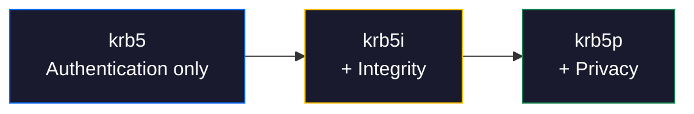

# Kerberos authentication for NFS

NFS defaults to AUTH_SYS, where the client declares its own UID/GID and the server trusts it unconditionally ([F-1.1](../../findings/identity/F-1.1-uid-gid-spoofing.md)). RPCSEC_GSS with Kerberos replaces this self-asserted identity with cryptographically verified tickets issued by a trusted third party. It is the only authentication mechanism in the NFS ecosystem that actually authenticates users.

This page covers the three Kerberos service levels, how to deploy them on both server and client, and what Kerberos does and does not protect.

## Why Kerberos matters

AUTH_SYS fails three fundamental requirements for NFS security:

| Requirement | AUTH_SYS | Kerberos (RPCSEC_GSS) |
|-------------|----------|----------------------|
| User identity verification | Client-asserted, no proof | KDC-issued ticket, cryptographically verified |
| Mutual authentication | None -- client trusts the IP | Server proves its identity via service principal |
| Per-RPC integrity | None -- any intermediary can modify calls | HMAC on every RPC message (krb5i, krb5p) |
| Wire encryption | None -- credentials, handles, file data in cleartext | Full payload encryption (krb5p) |
| UID spoofing resistance | Zero -- attacker claims any UID | Server maps Kerberos principal to local UID via idmapd |

!!! danger "AUTH_SYS cannot be fixed"
    No amount of firewall rules, export options, or network segmentation eliminates AUTH_SYS spoofing. Any machine that can reach the NFS port can claim any identity. The only real fix is replacing AUTH_SYS with Kerberos. See [Why NFS Is Insecure](../../nfs/insecurity.md) for the full structural analysis.

## The three service levels

RPCSEC_GSS with Kerberos offers three protection levels, configured per-export via the `sec=` option in `/etc/exports`. Each level builds on the previous one.



| Level | Authentication | Integrity | Encryption | Performance | When to use |
|-------|---------------|-----------|------------|-------------|-------------|
| `krb5` | Kerberos ticket verifies user identity | None -- RPC payloads can be modified in transit | None -- file data, handles, metadata in cleartext | Lowest overhead | Trusted network, identity spoofing is the only concern |
| `krb5i` | Kerberos ticket | HMAC on every RPC message detects tampering | None -- data readable by passive observer | Moderate overhead | Untrusted network segment, but data confidentiality not required |
| `krb5p` | Kerberos ticket | HMAC integrity | Full encryption of RPC payloads (AES) | Highest overhead (10-30% throughput reduction) | Any network where file contents are sensitive |

!!! warning "krb5 alone does not protect the wire"
    With `sec=krb5` (authentication only), an attacker who can sniff the network still sees file data, directory listings, and file handles in plaintext. The handle is a bearer token ([F-2.1](../../findings/access-control/F-2.1-export-escape.md)). Capturing one from the wire gives the attacker direct access. Use `krb5p` unless you have a strong reason not to.

!!! tip "Recommendation"
    Use `sec=krb5p` everywhere. The performance overhead is measurable but acceptable for most workloads. If throughput is critical (large sequential I/O on a trusted network), `krb5i` is a reasonable compromise. Never deploy `krb5` alone on an untrusted network.

## Prerequisites

Before configuring NFS Kerberos, you need:

1. **A working Kerberos realm** -- either MIT Kerberos or Heimdal KDC, with DNS forward and reverse records for all NFS servers and clients
2. **Time synchronization** -- Kerberos tickets have a 5-minute clock skew tolerance by default; all machines must run NTP/chrony
3. **DNS** -- Kerberos relies on DNS for principal name canonicalization; PTR records must resolve correctly for server hostnames
4. **Keytab on the NFS server** -- the `nfs/` service principal's key, exported from the KDC
5. **krb5.conf on all machines** -- realm configuration, KDC addresses, domain-to-realm mapping

## Server setup

### 1. Create the NFS service principal

The NFS server needs a service principal in the form `nfs/server.example.com@REALM`. The hostname must match the server's fully-qualified DNS name exactly, including what reverse DNS returns.

=== "MIT Kerberos"

    ```bash
    # On the KDC
    kadmin.local -q "addprinc -randkey nfs/nfs-server.example.com@EXAMPLE.COM"
    kadmin.local -q "ktadd -k /tmp/nfs-server.keytab nfs/nfs-server.example.com@EXAMPLE.COM"
    ```

=== "Heimdal"

    ```bash
    # On the KDC
    kadmin -l add --random-key nfs/nfs-server.example.com@EXAMPLE.COM
    kadmin -l ext_keytab --keytab=/tmp/nfs-server.keytab nfs/nfs-server.example.com@EXAMPLE.COM
    ```

=== "FreeIPA / IdM"

    ```bash
    # FreeIPA manages principals and keytabs automatically when the host is enrolled
    ipa host-add nfs-server.example.com
    ipa service-add nfs/nfs-server.example.com@EXAMPLE.COM
    ipa-getkeytab -s ipa.example.com -p nfs/nfs-server.example.com@EXAMPLE.COM -k /tmp/nfs-server.keytab
    ```

### 2. Install the keytab on the NFS server

Transfer the keytab securely (scp, not NFS) and merge it into the system keytab:

```bash
# On the NFS server
scp kdc:/tmp/nfs-server.keytab /tmp/nfs-server.keytab
ktutil
# ktutil: read_kt /etc/krb5.keytab
# ktutil: read_kt /tmp/nfs-server.keytab
# ktutil: write_kt /etc/krb5.keytab
# ktutil: quit
rm /tmp/nfs-server.keytab
chmod 600 /etc/krb5.keytab
```

Verify the keytab contains the NFS principal:

```bash
klist -ke /etc/krb5.keytab | grep nfs/
# Should show: nfs/nfs-server.example.com@EXAMPLE.COM (aes256-cts-hmac-sha1-96)
```

### 3. Configure /etc/exports

Replace `sec=sys` with `sec=krb5p` on every export. Do not include AUTH_SYS as a fallback; mixed flavors enable downgrade attacks ([F-1.7](../../findings/identity/F-1.7-rpcsec-gss-flavor-downgrade.md)).

```text
# /etc/exports
/srv/nfs/data    10.0.0.0/24(rw,sync,sec=krb5p,root_squash,no_subtree_check)
/srv/nfs/home    10.0.0.0/24(rw,sync,sec=krb5p,root_squash,no_subtree_check)
```

!!! danger "Never mix sec=sys and sec=krb5"
    An export configured as `sec=krb5p:sys` accepts AUTH_SYS connections. An attacker simply selects AUTH_SYS and bypasses Kerberos entirely. There is no negotiation that forces the stronger mechanism. See [F-1.7](../../findings/identity/F-1.7-rpcsec-gss-flavor-downgrade.md).

Apply the changes:

```bash
exportfs -ra
```

### 4. Enable and start the GSS daemon

The NFS server needs a GSS-API helper daemon to handle Kerberos ticket validation. Modern Linux distributions use gssproxy; older systems use rpc.gssd on the server side via rpc.svcgssd.

=== "gssproxy (RHEL 8+, Fedora, SLES 15+)"

    ```bash
    # gssproxy is typically configured automatically when nfs-utils is installed
    # Verify the NFS server section exists:
    cat /etc/gssproxy/24-nfs-server.conf
    # Should contain:
    #   [service/nfs-server]
    #     mechs = krb5
    #     cred_store = keytab:/etc/krb5.keytab
    #     trusted = yes
    #     kernel_nfsd = yes
    #     euid = 0

    systemctl enable --now gssproxy
    systemctl restart nfs-server
    ```

=== "rpc.svcgssd (Debian/Ubuntu, older systems)"

    ```bash
    # Enable the server-side GSS daemon
    # In /etc/default/nfs-kernel-server (Debian) or /etc/sysconfig/nfs (RHEL):
    #   NEED_SVCGSSD=yes

    systemctl enable --now rpc-svcgssd
    systemctl restart nfs-kernel-server
    ```

Verify the server is advertising Kerberos:

```bash
rpcinfo -p localhost | grep nfs
# Should show program 100003 on expected ports

# From a client, check MOUNT reports krb5 flavors:
showmount -e nfs-server.example.com
```

### 5. Configure idmapd

NFSv4 with Kerberos uses `rpc.idmapd` to map between Kerberos principals and local UIDs. Without it, files owned by Kerberos-authenticated users show up as `nobody:nogroup`.

```ini
# /etc/idmapd.conf
[General]
Verbosity = 0
Domain = example.com

[Mapping]
Nobody-User = nobody
Nobody-Group = nogroup

[Translation]
Method = nsswitch
```

The `Domain` must match on all clients and the server. Restart idmapd after changes:

```bash
systemctl restart nfs-idmapd
```

## Client setup

### 1. Install Kerberos client packages

=== "Debian / Ubuntu"

    ```bash
    apt install krb5-user nfs-common
    ```

=== "RHEL / Fedora"

    ```bash
    dnf install krb5-workstation nfs-utils
    ```

=== "SLES / openSUSE"

    ```bash
    zypper install krb5-client nfs-client
    ```

### 2. Configure krb5.conf

```ini
# /etc/krb5.conf
[libdefaults]
    default_realm = EXAMPLE.COM
    dns_lookup_realm = false
    dns_lookup_kdc = true
    forwardable = true
    rdns = true

[realms]
    EXAMPLE.COM = {
        kdc = kdc.example.com
        admin_server = kdc.example.com
    }

[domain_realm]
    .example.com = EXAMPLE.COM
    example.com = EXAMPLE.COM
```

!!! note "rdns = true"
    Kerberos canonicalizes the NFS server hostname via reverse DNS. If `rdns = false` or PTR records are wrong, the client requests a ticket for the wrong principal and authentication fails with `Server not found in Kerberos database`. This is the single most common Kerberos NFS failure.

### 3. Obtain a ticket

For interactive users, `kinit` obtains a ticket-granting ticket (TGT) from the KDC:

```bash
kinit user@EXAMPLE.COM
klist
# Should show: krbtgt/EXAMPLE.COM@EXAMPLE.COM with a valid expiry
```

For unattended mounts (servers, CI), use a host keytab:

```bash
# Create a host principal on the KDC and export a keytab to the client
# Then configure gssproxy or rpc.gssd to use it
kinit -k -t /etc/krb5.keytab host/client.example.com@EXAMPLE.COM
```

### 4. Enable rpc.gssd on the client

The client needs rpc.gssd (or gssproxy) to present Kerberos tickets to the NFS server:

=== "gssproxy (RHEL 8+, Fedora)"

    ```bash
    systemctl enable --now gssproxy
    ```

=== "rpc.gssd (Debian/Ubuntu)"

    ```bash
    systemctl enable --now rpc-gssd
    ```

### 5. Mount with Kerberos

```bash
mount -t nfs4 -o sec=krb5p nfs-server.example.com:/srv/nfs/data /mnt/data
```

Or in `/etc/fstab`:

```text
nfs-server.example.com:/srv/nfs/data  /mnt/data  nfs4  sec=krb5p,_netdev  0  0
```

Verify the mount is using Kerberos:

```bash
mount | grep /mnt/data
# Should show: sec=krb5p
```

## What Kerberos protects

Kerberos (especially `krb5p`) eliminates the most common NFS attack vectors:

| Attack | Without Kerberos | With krb5p |
|--------|-----------------|------------|
| [F-1.1: UID/GID spoofing](../../findings/identity/F-1.1-uid-gid-spoofing.md) | Any client claims any UID | Server verifies Kerberos principal, ignores AUTH_SYS fields |
| [F-1.2: root_squash bypass](../../findings/identity/F-1.2-root-squash-bypass.md) | Claim UID=1 instead of UID=0 | Principal-to-UID mapping is server-controlled |
| [F-1.3: Auxiliary group injection](../../findings/identity/F-1.3-auxiliary-group-injection.md) | Client injects arbitrary GIDs | Server resolves groups from principal via nsswitch |
| [F-1.5: Credential replay](../../findings/identity/F-1.5-credential-replay.md) | Sniffed AUTH_SYS replayable forever | Kerberos tickets have timestamps and sequence numbers |
| [F-3.1: Plaintext wire protocol](../../findings/network/F-3.1-plaintext-wire-protocol.md) | File data readable on wire | krb5p encrypts entire RPC payload |
| [F-1.7: Flavor downgrade](../../findings/identity/F-1.7-rpcsec-gss-flavor-downgrade.md) | N/A | Prevented only if AUTH_SYS is removed from `sec=` |

## What Kerberos does NOT protect

!!! warning "Kerberos is not a complete NFS security solution"
    Kerberos solves authentication and wire protection. It does not solve the structural protocol flaws that exist independently of how the user is authenticated.

| Attack | Status with Kerberos | Why |
|--------|---------------------|-----|
| [F-2.1: Export escape](../../findings/access-control/F-2.1-export-escape.md) | **Still possible** | File handles are bearer tokens. A Kerberos-authenticated user who obtains an escape handle can use it. The server validates the handle against the filesystem, not against what the user was supposed to access. |
| [F-2.2: Handle guessing](../../findings/access-control/F-2.2-file-handle-guessing.md) | **Still possible** | Handle validation checks inode existence, not who constructed the handle. Kerberos does not add handle signing. |
| [F-2.12: LOOKUPP cross-export](../../findings/access-control/F-2.12-nfsv4-lookupp-cross-export-lateral.md) | **Still possible** | NFSv4 LOOKUPP traversal is an authorized operation -- Kerberos authenticates the user but does not restrict directory traversal. |
| [F-4.1: no_root_squash](../../findings/privesc/F-4.1-no-root-squash.md) | **Depends on mapping** | If the Kerberos principal maps to local UID 0, the user gets root. `root_squash` still matters. |
| [F-5.1: Export enumeration](../../findings/info-disclosure/F-5.1-export-list-enumeration.md) | **Still possible** | MOUNT EXPORT is a separate protocol with no Kerberos enforcement. |
| [F-1.8: AUTH_TOOWEAK oracle](../../findings/identity/F-1.8-auth-tooweak-kerberos-enforced.md) | **Inherent** | The AUTH_TOOWEAK error confirms the export exists and requires Kerberos -- an information leak by design. |

??? note "MOUNT protocol and the Kerberos gap"
    The MOUNT protocol (RFC 1813 Appendix I) does not participate in RPCSEC_GSS negotiation. Per RFC 2623 S2.3.2, MOUNT MNT succeeds with AUTH_SYS even on `sec=krb5` exports, leaking the root file handle. This is by design -- the handle is needed to bootstrap the NFS session. Use NFSv4 (which has no MOUNT protocol) to close this gap. See [F-1.8](../../findings/identity/F-1.8-auth-tooweak-kerberos-enforced.md) for the full analysis.

## Limitations and operational considerations

### Performance overhead

`krb5p` encrypts and integrity-checks every RPC message. Expect 10-30% throughput reduction on large sequential I/O compared to AUTH_SYS. The overhead comes from AES encryption of the RPC payload, not from ticket validation (which is cached). Random I/O workloads see less impact because the per-operation latency is dominated by disk, not crypto.

### KDC availability

The KDC is a single point of failure. If the KDC is unreachable, no new Kerberos tickets can be issued. Existing mounts continue to work until their tickets expire (typically 10 hours). Mitigations:

- Deploy at least two KDC replicas with DNS SRV records
- Use `forwardable = true` in krb5.conf for ticket renewal without KDC contact
- Configure `krenew` or `k5start` for long-running processes

### Keytab management

Keytabs contain long-term keys and must be protected like passwords. If a keytab is compromised, the attacker can impersonate the NFS server until the principal's key is changed. Rotate keytab keys periodically and restrict file permissions to `root:root 0600`.

### NFSv2 and Kerberos

NFSv2 does not support RPCSEC_GSS at the protocol level. Linux knfsd enforces `sec=krb5` on v2 operations at the server side (rejecting AUTH_SYS calls), but the MOUNT v1 protocol leaks the handle without Kerberos authentication. See [F-1.6](../../findings/identity/F-1.6-nfsv2-downgrade.md). Disable NFSv2 entirely when deploying Kerberos.

### NFSv4 delegations

NFSv4.0 delegation metadata (OPEN/CLOSE state, lock state, callback notifications) uses the same RPCSEC_GSS protection level as the export. With `krb5p`, delegation traffic is encrypted. However, the CB_COMPOUND callback channel from server to client may use a different security flavor depending on the implementation. Verify with packet captures if delegation security is critical.

## Troubleshooting

### Common errors and fixes

| Error | Cause | Fix |
|-------|-------|-----|
| `Server not found in Kerberos database` | Hostname mismatch between DNS PTR and service principal | Verify `host -t PTR <server-ip>` matches the principal name exactly |
| `Clock skew too great` | Time difference > 5 minutes between client, server, and KDC | Sync all machines with NTP; check with `date` on each |
| `mount.nfs: access denied by server` | Missing or expired ticket, or `sec=sys` in export | Run `klist` to check ticket validity; verify export uses `sec=krb5p` |
| `GSS-API error: No credentials were supplied` | rpc.gssd not running on client | `systemctl start rpc-gssd` or `systemctl start gssproxy` |
| `Key version number for principal not found` | Keytab has old key version after password change | Re-export keytab from KDC with `kadmin ktadd` |
| `mount.nfs: Operation not permitted` | Client not using privileged port with sec=sys fallback | Ensure mount uses `-o sec=krb5p`, not falling back to AUTH_SYS |

### Diagnostic commands

```bash
# Check ticket status
klist -e

# Verify keytab contents
klist -ke /etc/krb5.keytab

# Test ticket acquisition for the NFS service
kvno nfs/nfs-server.example.com@EXAMPLE.COM

# Enable RPC debug logging (kernel)
rpcdebug -m rpc -s auth
rpcdebug -m nfsd -s proc

# Check gssproxy status
systemctl status gssproxy
journalctl -u gssproxy -n 50

# Verify NFS server is advertising Kerberos flavors
# (use nfswolf to probe)
nfswolf scan nfs-server.example.com
```

### Verifying with nfswolf

nfswolf detects Kerberos configuration (and misconfiguration) automatically:

```bash
# Scan reports auth flavors per export
nfswolf scan nfs-server.example.com
# Look for: auth_flavors: [krb5p] -- means Kerberos-only (good)
# Look for: auth_flavors: [sys, krb5p] -- means mixed flavors (F-1.7, bad)

# Analyze flags mixed-flavor exports as F-1.7
nfswolf analyze nfs-server.example.com
# F-1.7 fires if AUTH_SYS coexists with any krb5 variant

# AUTH_TOOWEAK oracle confirms Kerberos enforcement
# F-1.8 fires when AUTH_SYS operations are rejected with AUTH_TOOWEAK
```

## Related pages

- [Why NFS is insecure](../../nfs/insecurity.md) -- the structural flaws Kerberos addresses
- [NFS over TLS](tls.md) -- transport encryption (complements Kerberos, does not replace it)
- [F-1.7: Flavor downgrade](../../findings/identity/F-1.7-rpcsec-gss-flavor-downgrade.md) -- why mixed `sec=sys:krb5` is dangerous
- [F-1.8: AUTH_TOOWEAK oracle](../../findings/identity/F-1.8-auth-tooweak-kerberos-enforced.md) -- information leak from Kerberos enforcement
- [Export options reference](../configure/export-options.md) -- `sec=` option syntax and behavior
- [Hardening checklist](checklist.md) -- Kerberos in context of the full hardening path
