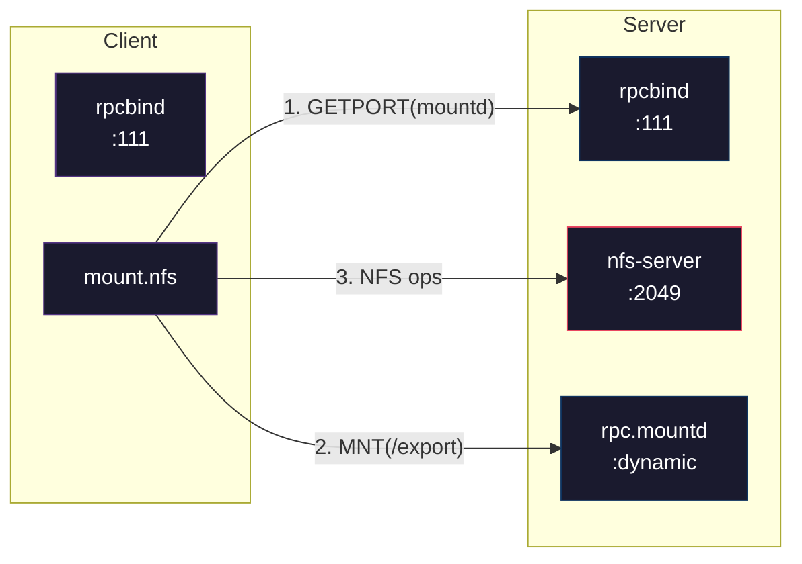

# Installing NFS

NFS requires software on both ends of the connection. The **server** exports directories from its local filesystem, and the **client** mounts those exports into its own directory tree. On Linux, both roles are provided by the same upstream package (`nfs-utils`), but distributions split them into separate packages with different service units.

A minimal NFS deployment involves two machines and three services:

The server side is more involved: you install the NFS server packages, define exports in `/etc/exports`, enable the kernel NFS daemon, and open firewall ports. The client side is simpler: install the client utilities and run `mount -t nfs`.

!!! warning "Security context"
    These pages cover installation mechanics only. A working NFS server with default settings is an insecure NFS server. AUTH_SYS credentials are trivially forged, file handles are bearer tokens, and export boundaries can be escaped. After installation, proceed to [Configuring NFS](../configure/index.md) and [Hardening](../hardening/index.md) before exposing the server to any network you do not fully control.

## Sub-pages

- **[Server setup](server.md)**: Install and start the NFS server daemon, define exports, verify with `showmount`, and configure firewall rules.
- **[Client setup](client.md)**: Install client utilities, mount exports manually and via `/etc/fstab`, set up `autofs` for auto-mounting, and configure NFSv4 ID mapping.
