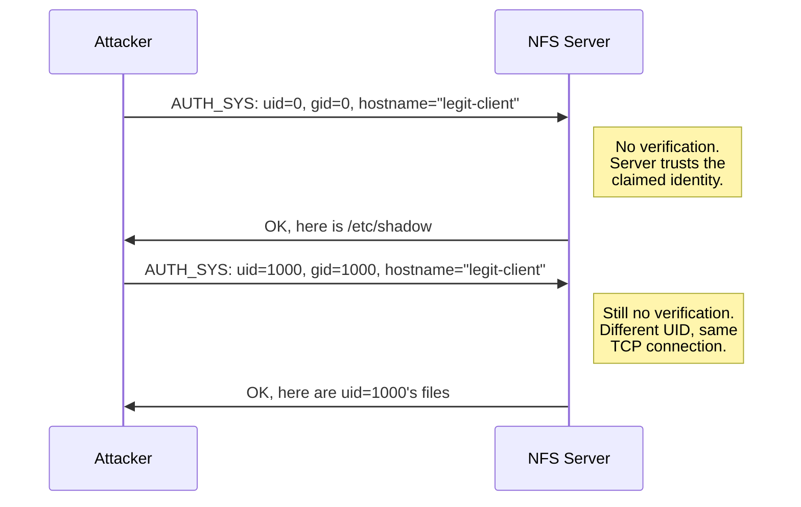
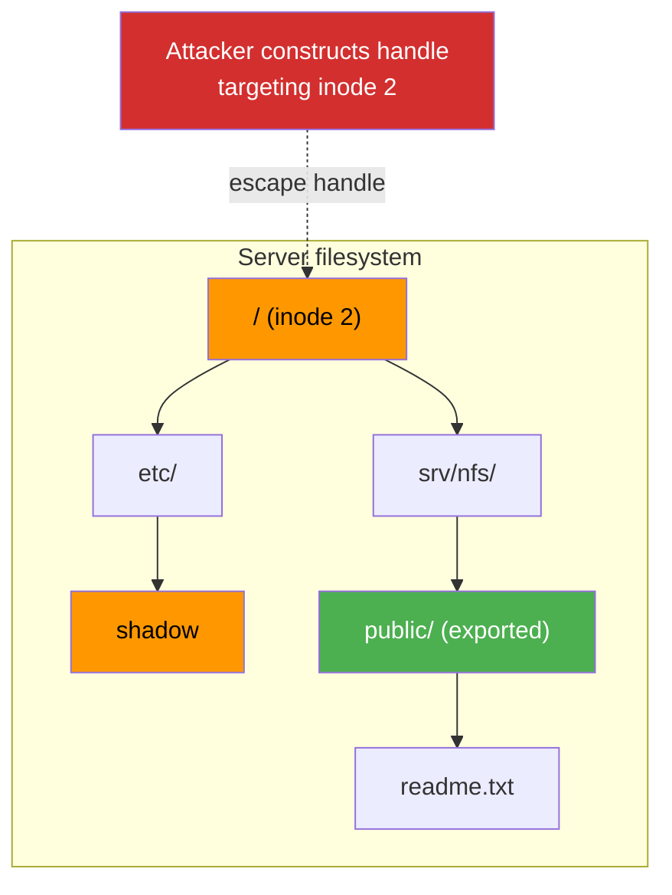
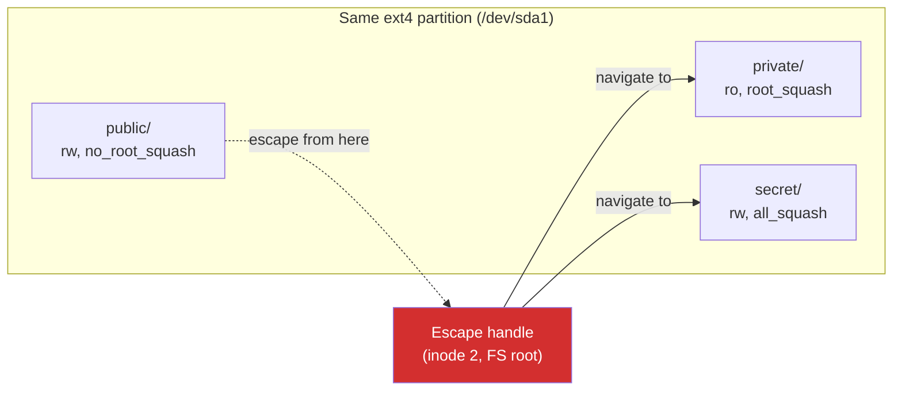
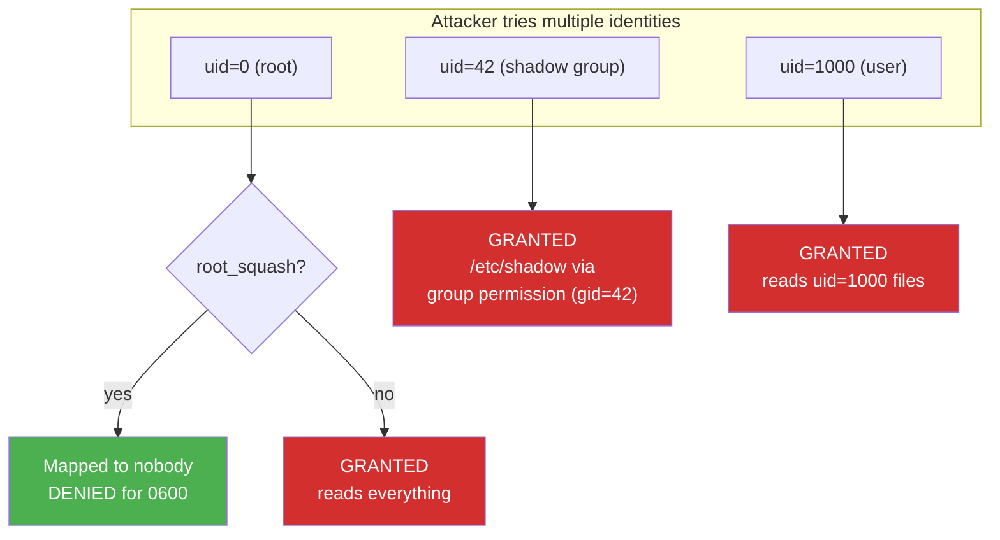

# NFS Security Guide

How to defend NFS exports against the attacks nfswolf demonstrates. Every claim here was verified live against servers running kernels 2.6.32 through 6.12, across NFSv2, v3, and v4. For implementation details, see the [hardening checklist](hardening/checklist.md) and [example configurations](hardening/examples.md).

## How NFS authentication actually works

NFS defaults to AUTH_SYS, where the client asserts its own UID/GID and the server trusts it without cryptographic verification. Every attack in this guide exploits this root cause; see [Authentication Model](../nfs/authentication.md) for the full breakdown of all flavors and their security properties.



## The three core attacks

NFS security breaks down along three attack vectors. Each exploits a different part of the protocol, and each requires different defenses to block.

### 1. Export escape (handle construction)

NFS file handles are bearer tokens with predictable internals. An attacker copies the filesystem identifier from a seed handle and replaces the file identifier with a well-known root inode (e.g., inode 2 for ext4). With `no_subtree_check` (the kernel default), the server serves any valid inode on the filesystem regardless of export boundaries. See [F-2.1: Export Escape](../findings/access-control/F-2.1-export-escape.md) for the full construction rules and filesystem coverage.



!!! info "Works across all versions"
    Export escape works on NFSv2, v3, and v4. Handles are cross-protocol: a handle obtained via MOUNT v3 works when sent via NFSv4 COMPOUND, and vice versa. Tested on kernels 2.6.32 through 6.12 with ext4, XFS, BTRFS, ZFS, f2fs, JFS, and 12 more filesystem types.

### 2. Cross-export lateral movement

When multiple exports share the same filesystem, escaping from any one gives access to all of them. The server checks handles against the originating export's policy, not the target directory's. Separate filesystems per export is the only architectural defense; see [F-2.1](../findings/access-control/F-2.1-export-escape.md) for details.



??? note "NFSv4 pseudo-filesystem: cross-export without escaping"
    On NFSv4, access to any single AUTH_SYS export grants access to every other AUTH_SYS export on the same server. The NFSv4 pseudo-filesystem connects all exports under a shared namespace. A client that can reach one export can LOOKUPP to the pseudo-root and LOOKUP into any sibling, regardless of export path, filesystem type, or squash settings. Tested with 15 exports across 3 filesystem types, 4 separate block devices, and every squash/permission combination, with 13 of 15 reachable from a single entry point. Only IP-restricted ACLs and `sec=krb5` (without `sys` in the list) prevent this.

### 3. UID/GID spoofing

The attacker claims any UID in the AUTH_SYS credential. The server applies that UID to POSIX permission checks without verification.



`root_squash` only blocks uid=0. The attacker claims uid=42 (shadow group on Debian) or uid=1000 (first user) and reads files owned by those identities. `all_squash` blocks targeted spoofing for restricted files (0600, 0640) but world-readable files (0644) remain accessible.

## Defense matrix

The following table was tested live on 7 servers (kernels 2.6.32, 3.13, 4.4, 4.15, 6.8, 6.12) across every NFS version the server supports, plus an NFSv4-only server (Debian 13, kernel 6.12, no rpcbind/mountd).

| Defense | Export escape | Cross-export lateral | UID/GID spoofing | Writes |
|---------|:---:|:---:|:---:|:---:|
| **sec=krb5** (without `sys`) | **BLOCKS** | **BLOCKS** | **BLOCKS** | **BLOCKS** |
| **subtree_check** | **BLOCKS** | no | no | no |
| **Separate FS per export** | **BLOCKS** | **BLOCKS** | no | no |
| **all_squash** (anonuid=65534) | no | no | PARTIAL | **BLOCKS** writes |
| **root_squash** | no | no | uid=0 only | uid=0 only |
| **readonly (ro)** | no | no | no | **BLOCKS** |
| **secure port** (no `insecure`) | no | no | no | no |

!!! warning "subtree_check and cross-export"
    `subtree_check` on export B is defeated by escaping from export A on the same filesystem. The handle is evaluated against A's policy, not B's. Separate filesystems are required to isolate exports from each other.

??? example "NFSv4-only defense matrix (expanded)"
    Tested on Debian 13 (kernel 6.12), NFSv4-only server (no rpcbind, no mountd). Each configuration tested with `escape --all` then verified with `shell --handle`.

    | Defense | Export escape | Read /etc/shadow | Read /etc/hostname |
    |---------|:---:|:---:|:---:|
    | `*(rw,sync)` (default) | YES | YES | YES |
    | `root_squash` | YES | YES (via gid spoof) | YES |
    | `all_squash` (anonuid=65534) | YES | NO (gid=42 also blocked) | YES (0644) |
    | `subtree_check` | pseudo only | NO (NFS4ERR_STALE) | NO |
    | `readonly (ro)` | YES | YES | YES |
    | `sec=krb5` (without `sys`) | NO (0 seeds) | NO (WRONGSEC) | NO |
    | `sec=krb5:sys` | YES | YES | YES |
    | `all_squash` + `subtree_check` | pseudo only | NO | NO |

    On NFSv4-only with `sec=krb5` (no `sys`), there is no MOUNT protocol to leak handles, so zero seeds are acquired. This is the cleanest krb5 enforcement.

## Defense details

### sec=krb5 (Kerberos)

The only defense that blocks all three attacks. Without `sec=sys` in the flavor list, the server rejects all AUTH_SYS operations. See [Kerberos Authentication](hardening/kerberos.md) for deployment instructions and a full analysis of what Kerberos does and does not protect.

```bash title="/etc/exports"
/srv/nfs/data  *(rw,sync,sec=krb5p)
```

=== "What it blocks"

    - UID/GID spoofing: AUTH_SYS is not accepted
    - Handle escape probing: GETATTR on escape handle returns WRONGSEC
    - Cross-export lateral access: all operations blocked
    - Write operations: all operations blocked

=== "What it does not block"

    - MOUNT v3 still leaks the export handle via AUTH_SYS before krb5 kicks in. The handle is useless without krb5 credentials, but its structure reveals the filesystem type and fsid.
    - NFSv2 downgrade: if the server still accepts v2, an attacker can bypass krb5 entirely because NFSv2 has no security negotiation. Always [disable v2](hardening/checklist.md) alongside krb5.

!!! danger "sec=krb5:sys defeats the purpose"
    Listing both `sec=krb5:sys` allows the attacker to choose AUTH_SYS and bypass Kerberos entirely. The `sec=` list must contain **only** `krb5`, `krb5i`, or `krb5p`.

### subtree_check

The only export option that blocks handle escape. The kernel walks from each file's inode up through parent directories to verify it lives inside the exported subtree, returning `NFS3ERR_STALE` for files outside the boundary. Disabled by default since kernel 2.6.25 because it causes `ESTALE` errors on file renames. See [Export Options Reference](configure/export-options.md#subtree_check-no_subtree_check) for full details and caveats.

### Separate filesystem per export

Not an export option, but an architectural decision. When each export is on its own filesystem (separate partition, LVM volume, or loop device), escape handles from one export cannot reach files on another export because the fsid differs.

```text
/dev/sda1 -> /srv/nfs/public   (ext4, fsid=0x0001)
/dev/sda2 -> /srv/nfs/private  (ext4, fsid=0x0002)

Escape from /public targets inode 2 on fsid 0x0001.
That handle reaches the root of /dev/sda1 -- which IS /srv/nfs/public.
It cannot reach /dev/sda2 because the fsid doesn't match.
```

!!! tip "The escape still reaches the filesystem root"
    The attacker still reaches the root of the export's own filesystem. If the export is a subdirectory of a larger filesystem, escape reaches the filesystem root (which may contain other data outside the export). The defense only works when the export IS the entire filesystem, meaning each export gets its own partition, LVM volume, or loop device.

### root_squash

Maps uid=0 to nobody (65534) but does not affect any other UID. An attacker who knows the file owner's UID claims it directly and reads the file. See [Export Options Reference](configure/export-options.md#root_squash-no_root_squash) for configuration details.

| Claimed UID | Server maps to | Can read 0600 root files | Can read 0600 uid=1000 files |
|-------------|---------------|:---:|:---:|
| uid=0 | 65534 (nobody) | NO | NO |
| uid=1000 | 1000 (unchanged) | NO | YES |
| uid=42 | 42 (unchanged) | NO | via gid match |

### all_squash

Maps all UIDs to a single anonymous identity (default: nobody/65534), blocking targeted UID spoofing for restrictive permissions (0600, 0640). World-readable files (0644) remain accessible, and handle escape is unaffected. See [Export Options Reference](configure/export-options.md#all_squash-no_all_squash) for configuration details.

!!! danger "all_squash,anonuid=0 maps everyone to root"
    This is worse than `no_root_squash`. Every client, regardless of claimed UID, operates as root on the export. Never set `anonuid=0`.

### readonly (ro)

Prevents all write operations (CREATE, WRITE, MKDIR, REMOVE, SYMLINK, LINK, RENAME, etc.). Blocks SUID binary creation, device node creation, symlink attacks, and data modification.

Does not block any read-based attack: escape, UID spoofing for reads, file reads, or metadata enumeration.

### secure port (no insecure flag)

Requires the client to use a source port below 1024, which typically requires root on the client. This does not help: any attacker running nfswolf already has root on their machine (or `CAP_NET_BIND_SERVICE`). nfswolf binds privileged ports by default. See [What Does Not Work](what-does-not-work.md) for more non-defenses.

## UID/GID spoofing in depth

Tested with 4 UIDs against 3 file permission sets across all lab servers:

| | no_root_squash | root_squash | all_squash |
|---|---|---|---|
| **uid=0** (root spoof) | reads ALL | DENIED (mapped to 65534) | DENIED (mapped to 65534) |
| **uid=1000** (owner spoof) | reads ALL | reads 0600 user file | DENIED (mapped to 65534) |
| **uid=65534** (nobody) | reads 0644 only | reads 0644 only | reads 0644 only (IS nobody) |
| **mid-session uid change** | works | works (0 -> 1000 reads) | no effect (still 65534) |

Files tested: `secret.txt` (0600 root:root), `user_file.txt` (0600 1000:1000), `testfile.txt` (0644 root:root).

### Mid-session UID change

nfswolf changes UID/GID mid-session without reconnecting (v3/v4) or with a quick reconnect (v2). An attacker can read files as uid=1000, switch to uid=42 (shadow group on Debian), read `/etc/shadow` via group permission, then switch to uid=0 if `no_root_squash` is set. `root_squash` only blocks the last step.

### NFS version differences for UID spoofing

UID spoofing works identically on v2, v3, and v4 when using AUTH_SYS. The protocol version makes no difference to the credential trust model. The only version-specific defense is `sec=krb5`, available on v3 and v4 but not v2.

=== "NFSv2"

    No `sec=` option. AUTH_SYS always accepted. Disable v2 entirely if deploying Kerberos.

=== "NFSv3"

    `sec=krb5` enforced at the NFS operation level. MOUNT still leaks the handle via AUTH_SYS (the handle's structure reveals filesystem type and fsid, but is useless for data access without krb5 credentials).

=== "NFSv4"

    `sec=krb5` enforced with no MOUNT protocol to leak handles. Cleanest krb5 enforcement when running v4-only.

## Cross-protocol handle reuse

File handles are interpreted by the kernel's `exportfs` layer, not by the NFS protocol version. A handle obtained via MOUNT v3 can be sent to the server via NFSv4 COMPOUND (PUTFH + GETATTR/READ), and vice versa. On servers that run both v3 and v4, escape handles from one protocol version work on the other. This means disabling MOUNT does not protect against escape if the handle was obtained through any other channel (NFSv4 LOOKUP, prior capture, brute force).

## Recommended configurations

### Maximum security (Kerberos available)

```bash title="/etc/exports"
/srv/nfs/data  gss/krb5p(rw,sync,no_subtree_check)
```

Plus:

- Disable NFSv2: `echo "-2" > /proc/fs/nfsd/versions` (or `vers2=n` in `nfs.conf`)
- Use a separate filesystem per export (LVM volume or dedicated partition)
- Enforce NFS over TLS: `xprtsec=tls` (kernel 6.5+), explicitly excluding `none`
- Restrict client IPs in `/etc/exports` (defense in depth, not sufficient alone)

This configuration blocks every attack nfswolf can perform.

!!! tip "krb5p vs krb5i vs krb5"
    `krb5p` encrypts and signs all data. `krb5i` signs but does not encrypt (data readable on the wire). `krb5` authenticates only. Use `krb5p` unless the performance cost is unacceptable, in which case use `krb5i` at minimum.

### Practical security (no Kerberos)

```bash title="/etc/exports"
/srv/nfs/data  10.0.0.0/24(ro,sync,all_squash,anonuid=65534,anongid=65534,subtree_check)
```

This blocks: handle escape (`subtree_check`), UID spoofing for restricted files (`all_squash`), writes (`ro`), and connections from outside the subnet (IP ACL).

Does NOT block: reading world-readable files (0644), metadata enumeration, or attacks from a compromised host on the allowed subnet.

!!! warning "subtree_check causes ESTALE on renames"
    If applications on the export rename files while clients have them open, `subtree_check` will cause `ESTALE` errors. Test with your workload before deploying to production. If `subtree_check` is not viable, use a separate filesystem per export as an alternative escape defense.

### Minimum viable hardening

```bash title="/etc/exports"
/srv/nfs/data  *(rw,sync,root_squash,no_subtree_check)
```

This is the kernel default. It only blocks uid=0 spoofing. An attacker with nfswolf can still escape the export, read files as any non-root UID, and navigate to other exports on the same filesystem. This is not a recommended configuration; it is the baseline you are almost certainly already running, and it is not secure.

## Quick reference

| Need to block... | Defense |
|---|---|
| Export escape | `subtree_check` or separate FS per export |
| UID/GID spoofing | `sec=krb5` (the only complete defense) |
| Cross-export lateral movement | Separate FS per export (or `sec=krb5`) |
| Write operations | `ro` |
| Everything | `sec=krb5p` + separate FS + disable v2 |

For defenses that appear to work but do not, see [What Does Not Work](what-does-not-work.md).
