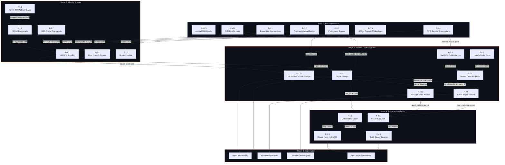
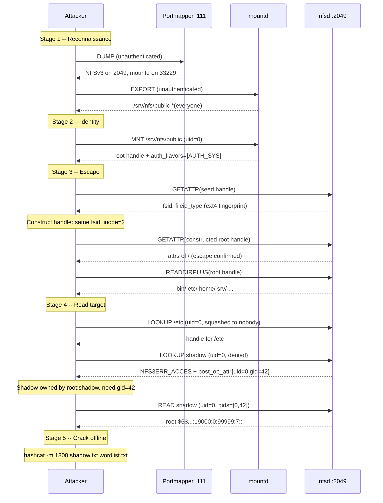

# Attack chain

No single NFS finding is catastrophic in isolation. UID spoofing is useless without a reachable export. Export escape is useless without a credential that can read the target file. Handle construction is useless without a seed handle to extract the fsid from. What makes NFS dangerous is the chain: information leaked by one protocol stage feeds the next, and each stage widens the attacker's access until the entire server filesystem is compromised.

This page maps how the [62 findings](index.md) connect across the attack path, from initial network access to full filesystem control.

## Full attack chain

The following diagram shows how findings flow between attack stages. Each node is a finding or group of findings; each edge represents information or access that one stage provides to the next.

## Stage-by-stage walkthrough

### Stage 1: Reconnaissance

The attacker starts with nothing but network access to the target. Every piece of information comes from unauthenticated RPC services that were never designed to be access-controlled.

**What the attacker does:**

1. **Portmapper DUMP** ([F-5.4](info-disclosure/F-5.4-rpc-service-enumeration.md)): A single unauthenticated call to port 111 returns every registered RPC program, version, protocol, and port. This reveals whether NFS is running, which versions (v2/v3/v4), where mountd listens, and whether sideband services like rquotad or NIS are present.

2. **MOUNT EXPORT** ([F-5.1](info-disclosure/F-5.1-export-list-enumeration.md)): Returns every export path with its access control list. The attacker learns the server's directory structure, which hosts are trusted, and which exports use wildcards.

3. **Sideband probing**: rquotad (F-5.15) confirms which UIDs are active on the server by querying per-UID disk usage. NFS_ACL (F-5.14) reveals POSIX ACL entries that expose access paths invisible in mode bits. NFSv4 pseudo-FS browsing ([F-5.5](info-disclosure/F-5.5-nfsv4-pseudo-fs-leakage.md)) enumerates export names including IP-restricted ones.

**What feeds into the next stage:** Export paths, trusted host IPs, active UIDs, service ports, filesystem block sizes, and the NFS versions the server supports.

**What blocks this stage:** Firewall rules that restrict port 111 and mountd to authorized clients only. But even with port 111 filtered, the attacker can probe port 2049 directly ([F-3.5](network/F-3.5-portmapper-tunnel-bypass.md)).

### Stage 2: Identity attacks

With the export list and service topology in hand, the attacker forges credentials to access the target export.

**What the attacker does:**

1. **UID/GID spoofing** ([F-1.1](identity/F-1.1-uid-gid-spoofing.md)): The attacker crafts AUTH_SYS credentials with the UID of the file owner (learned from READDIRPLUS metadata or rquotad), the GID of a privileged group (learned from ACL entries), or both. The server accepts these without verification.

2. **Root squash bypass** ([F-1.2](identity/F-1.2-root-squash-bypass.md)): If `root_squash` is enabled, the attacker avoids uid=0 and claims any other UID. Root squash only blocks uid=0; every other identity is accepted.

3. **Protocol downgrade** ([F-1.6](identity/F-1.6-nfsv2-downgrade.md), [F-1.7](identity/F-1.7-rpcsec-gss-flavor-downgrade.md)): If the export requires Kerberos, the attacker downgrades to NFSv2 (which has no security negotiation) or selects AUTH_SYS from a mixed `sec=krb5:sys` flavor list.

**What feeds into the next stage:** A forged credential that the NFS server accepts as legitimate. Combined with the MOUNT-obtained seed handle, the attacker has authenticated access to the export.

**What blocks this stage:** `sec=krb5` (without `sys` in the list) blocks all AUTH_SYS spoofing. `all_squash` maps every UID to nobody, blocking targeted identity claims but still allowing world-readable file access.

### Stage 3: Access control bypass

The attacker has a credential and a seed handle for one export. Now they break out of the export boundary to access the full filesystem.

**What the attacker does:**

1. **Export escape** ([F-2.1](access-control/F-2.1-export-escape.md)): On NFSv3, the attacker extracts the fsid from the seed handle and constructs a new handle pointing to inode 2 (the filesystem root). On NFSv4, LOOKUPP ([F-2.11](access-control/F-2.11-nfsv4-lookupp-export-escape.md)) walks up to the filesystem root with a single `cd ..`. Both bypass the export boundary when `subtree_check` is disabled (the default).

2. **Cross-export lateral movement** ([F-2.8](access-control/F-2.8-sibling-export-lateral-access.md), [F-2.12](access-control/F-2.12-nfsv4-lookupp-cross-export-lateral.md)): From the filesystem root, LOOKUP reaches any directory on the filesystem, including exports restricted to other IP ranges. On NFSv4, the pseudo-filesystem namespace connects all exports, so LOOKUPP to the pseudo-root followed by LOOKUP into a sibling export achieves lateral movement without MOUNT.

3. **Handle reuse** ([F-2.7](access-control/F-2.7-nfsd-acl-blindness.md)): Any handle obtained works from any IP with any credential. The NFS daemon never checks whether the presenting client was authorized to hold the handle. Handles obtained by any means (MOUNT, brute force, network sniffing, WebNFS public handle) are permanent bearer tokens.

**What feeds into the next stage:** The attacker now has handles for any file on the server filesystem. They can read `/etc/shadow`, traverse to other exports, and identify writable directories for privilege escalation.

**What blocks this stage:** `subtree_check` blocks escape by validating every handle against the export subtree (with performance and reliability penalties). Separate filesystems per export prevent cross-export lateral movement. Handle signing (`sign_fh`) blocks handle construction for non-root inodes, but root handles are exempt ([F-2.10](access-control/F-2.10-sign-fh-root-exemption.md)).

### Stage 4: Privilege escalation

If the attacker has reached a writable export with `no_root_squash`, they escalate from file access to arbitrary code execution on the server.

**What the attacker does:**

1. **SUID binary creation** ([F-4.2](privesc/F-4.2-suid-sgid-escalation.md)): Write a setuid-root binary (e.g., a shell wrapper with mode `04755`) to the export. When executed by any user on the server, it runs as root.

2. **Device node injection** ([F-4.3](privesc/F-4.3-device-node-creation.md)): MKNOD creates character or block device nodes with arbitrary major/minor numbers. A `/dev/sda` equivalent gives raw disk access from the client.

3. **Ownership hijack** ([F-4.6](privesc/F-4.6-unrestricted-chown.md)): If PATHCONF reports `chown_restricted=false`, any user can change file ownership. Write a binary, chown it to root, set the SUID bit.

**What feeds into the next stage:** Persistent root-level access on the server, backdoor binaries that survive export removal, and raw disk access that bypasses filesystem permissions entirely.

**What blocks this stage:** `root_squash` (the default) prevents uid=0 writes and blocks SUID binary creation. `ro` exports prevent all writes. Client-side `nosuid` and `nodev` mount options prevent execution of planted binaries and device nodes, but these are client configurations the attacker controls on their own machine.

### Stage 5: Exploitation

With filesystem root access and (optionally) uid=0 write capability, the attacker achieves their objective.

**Typical end states:**

- Read `/etc/shadow` and crack password hashes offline
- Harvest SSH keys from `/home/*/.ssh/`
- Read application credentials from config files outside the export
- Plant a SUID backdoor for persistent server access
- Access data in IP-restricted sibling exports
- Exfiltrate database files, logs, or backups from the full filesystem

## Example attack narrative

A concrete walkthrough of how a penetration tester would chain these findings against a default Linux NFS server.

Step by step:

1. **Scan** (`nfswolf scan 10.0.0.5`): Portmapper DUMP reveals NFSv3 on port 2049 and mountd on a high port. EXPORT shows `/srv/nfs/public` exported to everyone with AUTH_SYS.

2. **Mount** (`nfswolf shell 10.0.0.5:/srv/nfs/public`): MOUNT MNT returns the seed handle. The server reports `auth_flavors=[1]` (AUTH_SYS only). Root squash is in effect (the default), so uid=0 is mapped to nobody.

3. **Escape** (`escape-root` in the shell): nfswolf fingerprints the handle as ext4 (fileid_type 0x01), extracts the fsid, and constructs a handle with inode 2 (ext4 root). GETATTR confirms the handle resolves. READDIRPLUS on the root handle lists the real `/` directory.

4. **Escalate** (`cat /etc/shadow`): LOOKUP `/etc/shadow` fails with `NFS3ERR_ACCES`, but the failure response leaks `post_op_attr` showing the file is owned by `uid=0, gid=42` ([F-5.6](info-disclosure/F-5.6-metadata-on-access-denial.md)). The attacker retries with `gid=42` in the auxiliary group list ([F-1.3](identity/F-1.3-auxiliary-group-injection.md)). The READ succeeds and returns the shadow file contents.

5. **Crack**: The attacker takes the password hashes offline for cracking. Total RPC calls: approximately 8. Total time: under 2 seconds.

!!! danger "This works against default configurations"
    The target server in this example uses entirely default settings: `root_squash` enabled, `no_subtree_check` (the default since kernel 2.6), AUTH_SYS (the default), no TLS, no Kerberos. No misconfiguration is required. The attack exploits the NFS protocol's structural properties as documented in the RFCs.

## Defense mapping

Each defense blocks specific stages of the attack chain. No single defense except `sec=krb5` (without AUTH_SYS fallback) covers the full path.

| Defense | Recon | Identity | Escape | Lateral | Privesc | Shadow read |
|---------|-------|----------|--------|---------|---------|-------------|
| `sec=krb5` (exclusive) | -- | Blocks | Blocks | Blocks | Blocks | Blocks |
| `subtree_check` | -- | -- | Blocks | -- | -- | -- |
| Separate FS per export | -- | -- | -- | Blocks | -- | -- |
| `all_squash` | -- | Partial | -- | -- | Blocks | World-readable only |
| `root_squash` | -- | uid=0 only | -- | -- | Blocks SUID | -- |
| `ro` (read-only) | -- | -- | -- | -- | Blocks writes | -- |
| TLS (`xprtsec=tls` only) | -- | -- | -- | -- | -- | -- |
| IP-based ACLs | -- | -- | -- | -- | -- | -- |
| Firewall on port 111 | Partial | -- | -- | -- | -- | -- |

!!! warning "TLS does not block identity attacks"
    RPC-with-TLS ([F-3.8](network/F-3.8-rpc-with-tls.md)) encrypts the wire but AUTH_SYS inside TLS still allows full UID/GID credential forging (RFC 9289 Section 6.3). Encryption protects against passive observers but not against active attackers who control the client.

!!! warning "IP-based ACLs are MOUNT-level only"
    Export ACLs restrict which hosts can call MOUNT MNT. But handles obtained by any means (brute force, network capture, WebNFS, prior legitimate access) work from any IP via port 2049 directly ([F-2.7](access-control/F-2.7-nfsd-acl-blindness.md)). On NFSv4, MOUNT is not used at all -- all access goes through port 2049 with the pseudo-filesystem.

### What each defense actually stops

**`sec=krb5` (without `sys`)** -- The only complete defense. Blocks all AUTH_SYS credential forgery. The server rejects every RPC call that does not carry a valid Kerberos ticket. Handle construction and LOOKUPP still work at the protocol level, but every operation against the constructed handle requires a valid ticket for the target UID. Requires KDC infrastructure.

**`subtree_check`** -- Blocks export escape (F-2.1) by validating that every file handle's inode is an ancestor-or-descendant of the export root. Does not block identity attacks, lateral movement to sibling exports on the same filesystem (the check is per-export, and a handle valid for export A may reference a file also under export B), or any other stage. Causes `ESTALE` errors on file renames and has measurable performance cost.

**Separate filesystem per export** -- Blocks cross-export lateral movement (F-2.8) because handles contain a filesystem-specific fsid, and a handle from filesystem A is rejected by the server when presented against filesystem B. Does not block escape within a single filesystem. The attacker still reaches the filesystem root of the export they can access.

**`all_squash`** -- Maps every UID to the anonymous user (typically `nobody`). Blocks targeted UID spoofing for files with restrictive permissions (e.g., `0600`), but world-readable files (`0644`, `0755`) remain accessible. Does not block escape, lateral movement, or reads of world-readable sensitive files.

**`root_squash`** -- Maps only uid=0 to `nobody`. Every other UID is accepted as-is. Blocks SUID binary creation (requires uid=0 to set ownership) but does not block any other stage. An attacker claiming uid=1000 reads files owned by user 1000.

## Findings not in the chain

Several findings operate independently of the main attack chain:

- **F-1.4** (Machine Name Spoofing) -- Poisons logs and attribution but does not enable access. The server matches source IP, not `machinename`.
- **F-1.5** (Credential Replay) -- Requires passive network access. Captured RPCs replay indefinitely but depend on the attacker having network positioning (F-3.1).
- **F-3.2** (Portmapper Amplification) -- A DDoS vector, not an access path. UDP DUMP amplifies small requests into large responses.
- **F-5.16** (Silly-Rename Files) -- Indicates active NFS usage but does not directly enable access.
- **F-5.17** (Write Verifier Change) -- Detects server reboots. Operationally useful for timing attacks but not part of the access chain.
- **F-6.x** (Denial of Service) -- Out of scope. Lock attacks, grace-period blocking, and SETCLIENTID destruction are documented but not implemented.
- **F-7.6** (No Audit Logging) -- Means the entire chain operates without generating file access logs. Not a vulnerability itself, but it eliminates the primary detection mechanism for every other finding.
