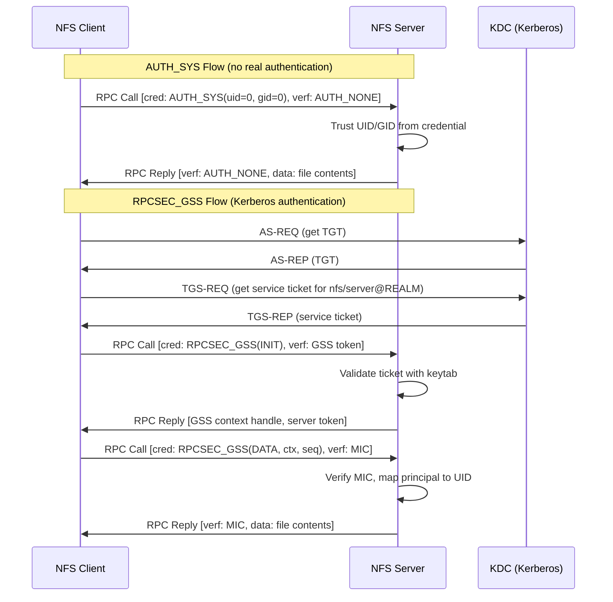
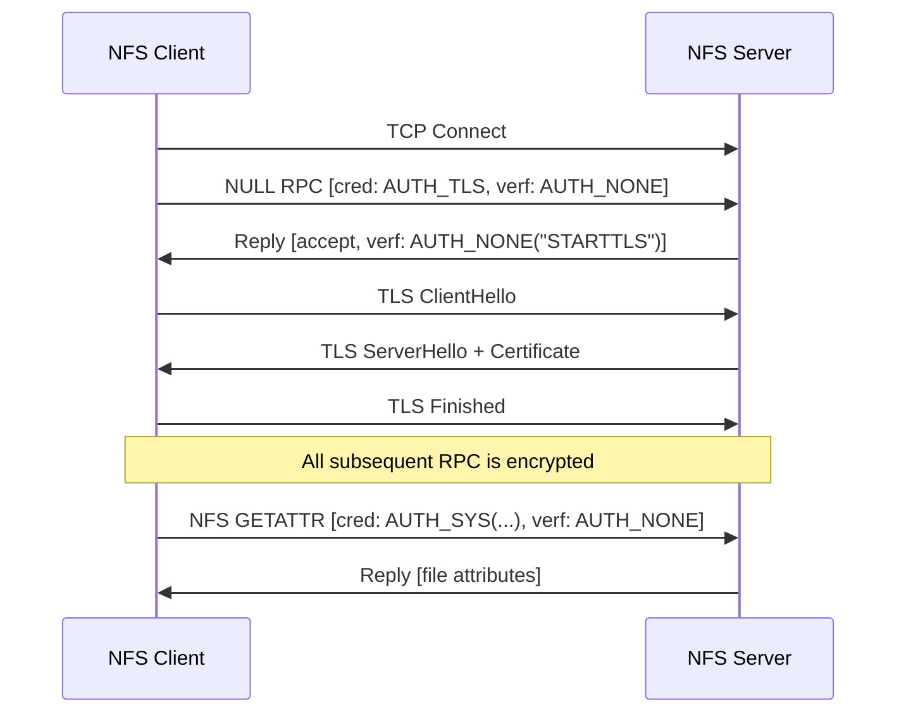

# Authentication Model

NFS authentication is handled at the ONC RPC layer, not by the NFS protocol itself. Every RPC call carries two opaque fields, a **credential** and a **verifier**, whose contents are determined by an integer **authentication flavor**. The server interprets these fields to decide who the caller is and whether the call should be accepted. This separation means NFS inherits both the flexibility and the weaknesses of whatever flavor the client and server negotiate.

RFC 5531 Section 8.2 defines the `opaque_auth` structure that carries all authentication data:

```text
enum auth_flavor {
    AUTH_NONE       = 0,
    AUTH_SYS        = 1,
    AUTH_SHORT      = 2,
    AUTH_DH         = 3,
    RPCSEC_GSS      = 6
    /* and more to be defined */
};

struct opaque_auth {
    auth_flavor flavor;
    opaque body<400>;
};
```

The credential body is limited to 400 bytes. Every RPC call includes one credential and one verifier; every reply includes one verifier. The interpretation of the body depends entirely on the flavor.

## Flavor comparison

| Flavor | Value | RFC | Authenticates | Protects | Security Level |
|--------|-------|-----|---------------|----------|----------------|
| AUTH_NONE | 0 | RFC 5531 Section 10.1 | Nothing | Nothing | None |
| AUTH_SYS | 1 | RFC 5531 Appendix A | Client-asserted UID/GID | Nothing | None (spoofable) |
| AUTH_SHORT | 2 | RFC 5531 Appendix A | Server-assigned session token | Nothing | None (replayable) |
| AUTH_DH | 3 | RFC 2695 | Network-wide name (DES + DH) | Timestamp verifier | Weak (deprecated) |
| RPCSEC_GSS | 6 | RFC 2203 | Kerberos principal (or other GSS mechanism) | Optionally integrity and/or encryption | Strong |
| AUTH_TLS | 7 | RFC 9289 | TLS certificates (host-level) | Full transport encryption | Strong (transport only) |

!!! danger "The default is no security"
    The vast majority of NFS deployments use AUTH_SYS, which provides zero cryptographic authentication. Any client on the network can assert any UID/GID. This is the single most exploited property of NFS.

---

## AUTH_NONE (Flavor 0)

AUTH_NONE carries no identity information. The credential body is zero-length. The verifier is also AUTH_NONE with a zero-length body.

```text
Credential: flavor=AUTH_NONE, body=<empty>
Verifier:   flavor=AUTH_NONE, body=<empty>
```

AUTH_NONE is used for two purposes:

1. **NULL procedure probing** -- ping an RPC service to check if it is alive. RFC 2623 Section 2.3.1 recommends servers accept NULL over AUTH_NONE regardless of export security settings.
2. **RPCSEC_GSS control messages** -- the GSS context establishment and destruction calls use AUTH_NONE as the credential flavor, with the GSS token in the credential body interpreted by the RPCSEC_GSS layer.

!!! warning "AUTH_NONE still leaks data"
    Some servers respond to GETATTR with AUTH_NONE credentials on valid file handles, leaking ownership, permissions, size, and timestamps to completely unauthenticated callers. See [F-5.8](../findings/info-disclosure/F-5.8-auth-none-metadata-leak.md) for details.

---

## AUTH_SYS / AUTH_UNIX (Flavor 1)

AUTH_SYS is the dominant NFS authentication flavor. The client packs its identity into the credential body as an XDR-encoded `authsys_parms` structure. The server trusts whatever the client sends. There is no cryptographic verification.

### XDR structure

Per RFC 5531 Appendix A:

```text
struct authsys_parms {
    unsigned int stamp;         /* arbitrary caller-generated ID */
    string machinename<255>;    /* client hostname, e.g. "workstation1" */
    unsigned int uid;           /* effective user ID */
    unsigned int gid;           /* effective group ID */
    unsigned int gids<16>;      /* supplemental group list (max 16) */
};
```

The verifier on the call is AUTH_NONE (zero-length). The server reply verifier may be AUTH_NONE or AUTH_SHORT.

### Field-by-field breakdown

`stamp`
:   An arbitrary 32-bit integer generated by the caller. It has no authentication purpose; the server does not validate it. Its original intent was to help the server's **Duplicate Request Cache (DRC)** distinguish retransmissions from new requests. If a client reuses the same stamp on two different calls with different arguments, the DRC may incorrectly return a cached result from the first call. NFSWolf uses a monotonically incrementing `AtomicU32` counter to guarantee unique stamps across all RPC calls, preventing false DRC hits during UID spraying operations where the same procedure is called rapidly with different credentials.

`machinename`
:   A client-supplied hostname string, limited to 255 bytes. The server does not use this for access control decisions. Linux knfsd ignores it entirely; export ACLs are enforced against the TCP source IP address, not the `machinename` field. An attacker can set this to any value.

`uid` / `gid`
:   The claimed effective user and group IDs. The server maps these directly to local permission checks. Since there is no verification, any client can claim any UID/GID. This is the basis of [F-1.1](../findings/identity/index.md) (UID/GID spoofing).

`gids<16>`
:   An array of up to 16 supplemental group IDs. The 16-group limit is a hard constraint in the XDR encoding. Linux systems commonly have users in more than 16 groups; when accessed over NFS with AUTH_SYS, only the first 16 are transmitted. The server may silently deny access to files whose permissions depend on group 17+.

!!! tip "The 16-group limit creates real access failures"
    Users in many groups will find that files accessible locally become inaccessible over NFS. The `MANAGE_GIDS` export option (`manage_gids` in `/etc/exports`) is the server-side workaround: the server looks up the caller's UID in its own `/etc/passwd`/LDAP and uses the full group list instead of the client-supplied one. This only works when the server has the same user database as the client.

### Why AUTH_SYS is fundamentally broken

RFC 5531 Section 14 states it plainly:

> AUTH_SYS as described in Appendix A is known to be insecure due to the lack of a verifier to permit the credential to be validated.

RFC 2623 Section 2.2.1 adds:

> Using the AUTH_SYS flavor of authentication, the server gets the client's effective user identifier, effective group identifier and supplemental group identifiers on each call, and uses them to check access.

There is no verification step. The credential is a plain-text assertion. Any process that can send a TCP or UDP packet to port 2049 can claim to be root (UID 0) or any other user.

---

## AUTH_SHORT (Flavor 2)

AUTH_SHORT is a session optimization defined in RFC 5531 Appendix A. When a server replies to an AUTH_SYS call, it may include an AUTH_SHORT verifier containing an opaque token. The client can then use this token as a shorthand credential in subsequent calls, saving bandwidth by not retransmitting the full `authsys_parms` structure on every call.

```text
/* Server reply to AUTH_SYS call: */
Reply verifier: flavor=AUTH_SHORT, body=<opaque session token>

/* Subsequent client call using the shorthand: */
Credential: flavor=AUTH_SHORT, body=<same opaque session token>
Verifier:   flavor=AUTH_NONE, body=<empty>
```

The server maintains a cache mapping the opaque token back to the original `authsys_parms`. If the server evicts the token, it rejects the call with `AUTH_REJECTEDCRED`, and the client falls back to full AUTH_SYS.

!!! danger "AUTH_SHORT enables credential replay"
    If an attacker captures the opaque token (by sniffing the network or reading process memory), they can replay it to impersonate the original caller without knowing the UID/GID. The token is not bound to a source IP or timestamp. Linux knfsd does not implement AUTH_SHORT (the `authtab[2]` slot is NULL), but other NFS server implementations (Solaris, legacy commercial servers) may issue and accept AUTH_SHORT tokens. See [F-3.9](../findings/network/F-3.9-auth-short-session-credentials.md).

---

## AUTH_DH (Flavor 3)

AUTH_DH (also called AUTH_DES) provides cryptographic authentication using Diffie-Hellman key exchange and DES encryption, as specified in RFC 2695. It authenticates callers by a network-wide string name (a "netname") rather than numeric UIDs.

The client and server each have a public/private DH key pair registered with a keyserver (historically `keyserv`, backed by NIS). The client generates a random DES session key, encrypts it with the shared DH secret, and includes it in the credential. Each call carries a DES-encrypted timestamp as the verifier. The netname format is `unix.UID@domain` (e.g., `unix.1000@example.com`); the server maps the authenticated netname to a local UID for access control.

RFC 5531 Section 14 is explicit:

> AUTH_DH [...] is considered obsolete and insecure; see [RFC2695]. AUTH_DH SHOULD NOT be used for services that permit clients to modify data.

The problems are fundamental:

- **192-bit DH** -- factorable with modern hardware in minutes
- **56-bit DES** -- brute-forceable; broken since the late 1990s
- **NIS dependency**: the keyserver infrastructure relies on NIS, which transmits data in cleartext
- **No integrity protection**: the call body is not authenticated, only the timestamp

!!! warning "AUTH_DH advertised = finding"
    If MOUNT auth_flavors or NFSv4 SECINFO includes flavor 3, nfswolf reports [F-3.7](../findings/network/F-3.7-auth-dh-obsolete.md). Any server still advertising AUTH_DH is running cryptography that was obsolete before it was formally deprecated.

---

## RPCSEC_GSS (Flavor 6)

RPCSEC_GSS, defined in RFC 2203, is the only RPC authentication mechanism that provides real security. It wraps the GSS-API framework (RFC 2743), which in practice means Kerberos V5 for NFS deployments.

### Three service levels

RPCSEC_GSS defines three levels of protection, exposed in Linux as `sec=` export options:

| Service | `sec=` value | What it does | Performance impact |
|---------|-------------|--------------|-------------------|
| Authentication | `krb5` | Verifies caller identity via Kerberos ticket. Call body transmitted in cleartext. | Low |
| Integrity | `krb5i` | Authentication + MIC (Message Integrity Code) over the call body. Detects tampering. | Moderate |
| Privacy | `krb5p` | Authentication + integrity + encryption of the call body. Full confidentiality. | High |

!!! info "krb5 alone does not encrypt data"
    `sec=krb5` authenticates the caller but transmits file contents in cleartext. An attacker with network access can read all data. Only `krb5p` provides confidentiality, and even then the RPC header remains in cleartext (RFC 9289 Section 1 notes this limitation).

### SECINFO negotiation

NFSv4 introduces the SECINFO operation (RFC 7530 Section 16.31) for per-directory security flavor negotiation. When a client accesses a directory with the wrong security flavor, the server returns `NFS4ERR_WRONGSEC`. The client then issues SECINFO to discover what flavors the directory accepts.

The response includes a list of `secinfo4` entries. Each entry is either a raw `auth_flavor` value (AUTH_NONE, AUTH_SYS) or a GSS mechanism descriptor containing the OID, quality of protection, and service level. NFSWolf's scanner probes SECINFO on every export to enumerate the complete set of accepted flavors.

### RPC call flow comparison

The following diagram shows the difference between AUTH_SYS and RPCSEC_GSS at the RPC layer:



With AUTH_SYS, the server blindly trusts whatever UID the client sends. With RPCSEC_GSS, the server verifies a Kerberos ticket before mapping the authenticated principal to a local UID. The principal-to-UID mapping is typically handled by `idmapd` (NFSv4) or LDAP/sssd.

---

## AUTH_TLS (Flavor 7)

AUTH_TLS, defined in RFC 9289, provides opportunistic TLS encryption for RPC connections. It encrypts the transport layer rather than individual call bodies, protecting all traffic including RPC headers.

### The STARTTLS handshake

AUTH_TLS uses a probe-and-upgrade mechanism:

1. The client sends a NULL RPC call with `auth_flavor=AUTH_TLS` and an AUTH_NONE verifier.
2. If the server supports TLS, it replies with `MSG_ACCEPTED` and an AUTH_NONE verifier whose 8-byte body contains the ASCII string `STARTTLS`.
3. The client then initiates a TLS handshake on the same TCP connection.
4. All subsequent RPC calls on that connection are TLS-protected.



### Limitations

!!! warning "AUTH_TLS is opportunistic and optional"
    RFC 9289 Section 6.1.1 acknowledges the STRIPTLS attack: "The initial AUTH_TLS probe occurs in cleartext. An on-path attacker can alter a cleartext handshake to make it appear as though TLS support is not available." If the probe fails, the client falls back to unencrypted RPC. There is no mechanism to require TLS; it is always opt-in. See [F-3.4](../findings/network/F-3.4-striptls-downgrade.md).

AUTH_TLS provides **host authentication** (via certificates) and **transport encryption**, but it does not replace user authentication. After the TLS session is established, the client still sends AUTH_SYS or RPCSEC_GSS credentials inside the encrypted tunnel. AUTH_TLS with AUTH_SYS is better than AUTH_SYS alone (it prevents network sniffing and spoofing), but the server still trusts client-asserted UIDs.

---

## The `sec=` export option

Linux NFS servers bind authentication flavors to exports via the `sec=` option in `/etc/exports`. The value is a colon-separated list of flavor names:

```text
/export    *(sec=krb5p,rw)              # Kerberos privacy only
/data      *(sec=krb5:sys,rw)           # Kerberos preferred, AUTH_SYS accepted
/public    *(sec=sys,ro)                # AUTH_SYS, read-only
```

The mapping from `sec=` names to flavor values:

| `sec=` value | Flavor | Pseudo-flavor | Description |
|-------------|--------|---------------|-------------|
| `none` | AUTH_NONE (0) | -- | No authentication |
| `sys` | AUTH_SYS (1) | -- | UID/GID credentials |
| `dh` | AUTH_DH (3) | -- | Diffie-Hellman (deprecated) |
| `krb5` | RPCSEC_GSS (6) | 390003 | Kerberos authentication |
| `krb5i` | RPCSEC_GSS (6) | 390004 | Kerberos + integrity |
| `krb5p` | RPCSEC_GSS (6) | 390005 | Kerberos + privacy |

The pseudo-flavor numbers (390003-390005) appear in the MOUNT v3 MNT response `auth_flavors` list and in NFSv4 SECINFO responses. They distinguish the three Kerberos service levels within the single RPCSEC_GSS flavor.

!!! danger "Mixed sec= lists are a downgrade vulnerability"
    An export with `sec=krb5:sys` accepts both Kerberos and AUTH_SYS. An attacker who cannot obtain Kerberos credentials simply uses AUTH_SYS and forges any UID. The first flavor in the list is the preferred one, but the server does not enforce it; any listed flavor is accepted. This is [F-1.7](../findings/identity/index.md).

### What happens with the wrong flavor: AUTH_TOOWEAK

When a client sends a request with a flavor that the export does not accept, the server rejects it. The rejection mechanism differs by NFS version:

=== "NFSv3"

    The server returns `NFS3ERR_ACCES` or an RPC-level `AUTH_TOOWEAK` error (auth_stat value 5 from RFC 5531 Section 9). The specific error depends on the operation and the server implementation.

=== "NFSv4"

    The server returns `NFS4ERR_WRONGSEC` (status 10016). The client should then issue a SECINFO operation to discover the accepted flavors.

!!! tip "AUTH_TOOWEAK as an oracle"
    An AUTH_TOOWEAK rejection is an information leak: it tells the attacker that the export exists and requires stronger authentication than what was offered. Combined with the MOUNT bypass (MOUNT succeeds with AUTH_SYS even on `sec=krb5` exports, leaking the root handle), AUTH_TOOWEAK lets an attacker enumerate Kerberos-protected exports without Kerberos credentials. This is [F-1.8](../findings/identity/index.md).

---

## Security implications for attackers

??? example "Attack surface summary by flavor"

    **AUTH_NONE** -- Useful for reconnaissance. NULL probes reveal service availability. Some servers leak file attributes via GETATTR with AUTH_NONE.

    **AUTH_SYS** -- The primary attack surface. UID/GID spoofing ([F-1.1](../findings/identity/index.md)), credential ladder escalation, and root_squash bypass are all AUTH_SYS attacks. The credential is trivially forged.

    **AUTH_SHORT** -- If the server issues AUTH_SHORT tokens, capturing one via network sniffing gives the attacker a replayable session credential that does not expire until the server flushes its cache.

    **AUTH_DH** -- Broken cryptography. If a server advertises AUTH_DH, the DH key exchange and DES encryption are both within reach of commodity hardware.

    **RPCSEC_GSS** -- Requires valid Kerberos credentials. Attacks shift to Kerberos infrastructure (keytab theft, ticket forgery, cross-realm trust abuse) rather than NFS protocol weaknesses. Downgrade attacks (offering AUTH_SYS to a `sec=krb5:sys` export) bypass GSS entirely.

    **AUTH_TLS** -- Prevents network-level attacks (sniffing, man-in-the-middle) but does not address authentication. An attacker on the same TLS-protected network segment still spoofs UIDs with AUTH_SYS inside the tunnel.

NFS was designed when the network was trusted and all machines on the LAN were under one administrative domain. AUTH_SYS reflects that assumption. Every NFS security finding in the identity category traces back to this design decision. RPCSEC_GSS is the fix, but AUTH_SYS remains the default on most deployments.
