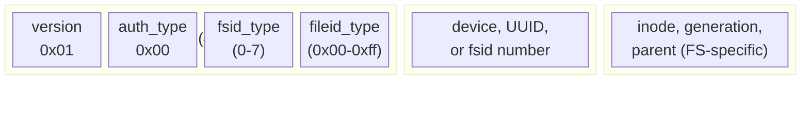

# File Handles

NFS file handles are opaque byte sequences that identify files and directories on an NFS server. They function as bearer tokens: any client that possesses a valid handle can use it with any credential, from any IP address, without the server checking who originally obtained it. This property is the foundation of NFS export escape attacks, handle brute-forcing, and cross-credential file access.

This page documents the wire format, internal structure, per-filesystem encodings, and security implications of NFS file handles as implemented by Linux knfsd. Every field and value was verified against kernel source (`fs/nfsd/nfsfh.h`, `include/linux/exportfs.h`) and live-tested against lab servers.

## How handles work

When a client mounts an NFS export, the server returns a file handle for the export's root directory. The client sends this handle back in every subsequent operation (GETATTR, READ, WRITE, LOOKUP, etc.) to identify the target file. LOOKUP operations return new handles for child entries, building a tree of handles the client navigates.

The server never validates that the client obtained a handle through normal directory traversal. It only checks that the bytes resolve to a valid inode on an exported filesystem. There is no session binding, no IP binding, no credential binding. A handle obtained by one client works identically when presented by a different client with different credentials over a different TCP connection. RFC 2623 Section 2.6 documents this explicitly: file handles are capability tokens.

## Wire format by NFS version

=== "NFSv2"

    Handles are **fixed 32 bytes**, zero-padded, with no length prefix on the wire. MOUNT v1 returns handles in this format. Only shorter fsid types (0, 3, 4) are common because the 32-byte limit constrains how much data fits alongside the fileid.

=== "NFSv3"

    Handles are **variable-length up to 64 bytes**, XDR length-prefixed on the wire. MOUNT v3 returns handles in this format. All fsid types are supported. The extra space allows fileid types with parent inode data, used for `subtree_check` enforcement.

=== "NFSv4"

    Handles are **variable-length up to 128 bytes**, encoded as XDR opaque. There is no MOUNT protocol; handles are obtained via PUTROOTFH + LOOKUP + GETFH. The pseudo-root handle (fsid_type=1, 8 bytes total) is unique to NFSv4. All real filesystem handles use the same internal byte format as v2/v3.

!!! info "Cross-protocol handle reuse"
    Handles are cross-protocol. A handle from MOUNT v3 works with NFSv4 COMPOUND (PUTFH), and a handle from NFSv4 GETFH works with NFSv3 procedures, on servers that support both versions. The internal byte layout is identical.

## Linux knfsd handle structure

Linux knfsd file handles are a sequence of 32-bit words. The first four bytes form a fixed header, followed by variable-length fsid and fileid sections.

```
Byte  Field           Description
----  --------------  --------------------------------------------------
 0    fh_version      Always 0x01 on Linux knfsd
 1    fh_auth_type    Deprecated, always 0x00
 2    fh_fsid_type    How the filesystem/export is identified (0-7)
 3    fh_fileid_type  How the file within the filesystem is identified
 4+   fh_fsid[]       Variable-length filesystem identifier
 4+N  fh_fileid[]     Variable-length file identifier (inode, generation)
```



!!! warning "Byte order"
    All multi-byte values inside the handle are in **host byte order** (little-endian on x86). This differs from the XDR encoding of RPC messages (big-endian). The handle contents are opaque to the RPC layer and passed through without byte-swapping.

The first four bytes are entirely predictable: version is always 1, auth_type is always 0, and the fsid_type and fileid_type can be inferred from the filesystem type. The variable fields (fsid, fileid) are the only entropy in an unsigned handle.

## fsid_type values (byte 2)

The `fsid_type` determines how the server identifies which filesystem the handle belongs to. This is the key field for escape handle construction: the escape handle must preserve the fsid from the seed so the server maps it to the same filesystem.

| Value | Name | Size | Layout | Notes |
|-------|------|------|--------|-------|
| 0 | `FSID_DEV` | 8 bytes | `dev_major(2) dev_minor(2) ino(4)` | Older format. Device encodes the block device. |
| 1 | `FSID_NUM` | 4 bytes | `fsidnum(4)` | User-specified `fsid=` value from `/etc/exports`. Pseudo-FS root uses this. |
| 2 | `FSID_MAJOR_MINOR` | 12 bytes | `major(4) minor(4) ino(4)` | Deprecated. Converted to type 3 on the fly by the kernel. |
| 3 | `FSID_ENCODE_DEV` | 8 bytes | `encoded_dev(4) ino(4)` | `new_encode_dev()` format, userspace-compatible. |
| 4 | `FSID_UUID4_INUM` | 8 bytes | `ino(4) uuid_xor(4)` | First 4 bytes of UUID XOR-folded. Used when handle max size < 64 bytes. |
| 5 | `FSID_UUID8` | 8 bytes | `uuid_xor[0..7](8)` | UUID XOR-folded to 8 bytes. Root exports only. |
| 6 | `FSID_UUID16` | 16 bytes | `uuid[0..15](16)` | Full 16-byte filesystem UUID. Root exports with max size >= 64. |
| 7 | `FSID_UUID16_INUM` | 24 bytes | `ino(8) uuid[0..15](16)` | Full UUID + export directory inode (u64). Most common on NFSv3. |

### Security implications of fsid_type

**fsid_type=7 (compound UUID)** is the most important for escape. The `ino` field identifies which export directory on the filesystem the handle belongs to. The server applies that export's `root_squash`/`all_squash`/`ro` settings based on this field. Different exports on the same filesystem have different `ino` values but share the same UUID. An escape handle constructed from one export's seed inherits that export's security settings.

**fsid_type=6 (UUID-only)** lacks export context. With no `ino` field, the server cannot determine which export the handle belongs to. On NFSv3, it typically resolves to the export with the matching UUID. On NFSv4, it may resolve to the pseudo-filesystem root instead.

**fsid_type=1 (pseudo-FS)** is synthetic. Only 4 bytes (a user-specified number), used for the NFSv4 pseudo-root (`fsid=0`). Not a real filesystem and cannot be used for escape.

**fsid_type=0 and 3 (device-based)** embed the block device number, which is discoverable via NFS GETATTR. Combined with a known root inode, this makes handle construction straightforward.

## fileid_type values (byte 3)

The `fileid_type` tells the server how to decode the file-identification bytes. Each filesystem uses specific types matching its inode structure. Values come from `enum fid_type` in `include/linux/exportfs.h`.

| Value | Name | Size | Layout | Filesystems |
|-------|------|------|--------|-------------|
| 0x00 | `FILEID_ROOT` | 0 bytes | (none) | Export root on any FS. No inode data needed. |
| 0x01 | `FILEID_INO32_GEN` | 8 bytes | `inode(4) generation(4)` | ext2/3/4, JFS, f2fs, ReiserFS, VFAT, NTFS3, SquashFS |
| 0x02 | `FILEID_INO32_GEN_PARENT` | 16 bytes | `ino(4) gen(4) parent_ino(4) parent_gen(4)` | ext2/3/4 with subtree_check |
| 0x4d | `BTRFS_WITHOUT_PARENT` | 20 bytes | `objectid(8) root_objectid(8) generation(4)` | BTRFS |
| 0x4e | `BTRFS_WITH_PARENT` | 32 bytes | above + `parent_objectid(8) parent_gen(4)` | BTRFS with parent |
| 0x4f | `BTRFS_WITH_PARENT_ROOT` | 40 bytes | above + `parent_root_objectid(8)` | BTRFS cross-subvolume |
| 0x51 | `UDF_WITHOUT_PARENT` | 12 bytes | `block(4) partref(2) unused(2) generation(4)` | UDF |
| 0x61 | `NILFS_WITHOUT_PARENT` | 20 bytes | `cno(8) ino(8) gen(4)` | NILFS2 |
| 0x71 | `FAT_WITHOUT_PARENT` | 12 bytes | `gen(4) i_pos_hi(1) i_pos_lo(4)` | VFAT/exFAT |
| 0x81 | `FILEID_INO64_GEN` | 12 bytes | `inode(8) generation(4)` | XFS, EROFS |
| 0x82 | `FILEID_INO64_GEN_PARENT` | 24 bytes | `ino(8) gen(4) parent_ino(8) parent_gen(4)` | XFS with subtree_check |
| 0xb1 | `BCACHEFS_WITHOUT_PARENT` | 16 bytes | `inode(8) subvol(4) gen(4)` | bcachefs |
| 0xff | `FILEID_INVALID` | -- | -- | Error sentinel, never used in valid handles |

### Root inode values by filesystem

When constructing an escape handle targeting the filesystem root directory, the fileid must contain the correct root inode number. Each filesystem has a specific value:

| Filesystem | Root Inode | Generation | Notes |
|------------|-----------|------------|-------|
| ext2/3/4 | 2 | 0 | Always inode 2; generation ignored on root |
| XFS v5 | 128 | 0 | `FILEID_INO64_GEN`. XFS v4: 64 or 32 |
| BTRFS | 256 | 0 | objectid=256 (default subvol), root_objectid=5 (fs-tree) |
| JFS | 2 | 0 | Same as ext4 |
| f2fs | 3 | 0 | Root inode is 3, not 2 |
| ReiserFS | 2 | 1 | Generation is 1, not 0 |
| NTFS3 | 5 | 5 | MFT root record; generation = MFT sequence number |
| VFAT | 1 | 0 | Root cluster |
| SquashFS | 7 | 0 | Offset-based, not a true inode |
| ZFS | 3 | 0 | `zfid_short_t`, gen ignored |
| EROFS | 36 | 0 | `FILEID_INO64_GEN`, nid=36 is typical root |
| NILFS2 | 2 | 0 | cno=0 (current checkpoint) |
| bcachefs | 4096 | 0 | inum=4096, subvol=1 |
| UDF | 2-512 | 0 | Block-based, varies by disc layout |
| ISO9660 | 18-30 | 0 | Block-based, varies by disc layout |
| tmpfs | random | random | 32-bit random per mount; not escapable |

## Handle examples

### Example 1: MOUNT v3 root handle (ext4, fsid_type=7)

```text
Hex: 01 00 07 00 60000200 00000000 1d96c9d9009c49daa193f721ec3fe9b6

Byte  Value       Field
----  ----------  --------------------------------
 0    01          fh_version = 1
 1    00          fh_auth_type = 0 (unused)
 2    07          fh_fsid_type = 7 (compound UUID)
 3    00          fh_fileid_type = 0 (FILEID_ROOT)
 4-11 60000200 00000000  ino = 0x0000000000020060 (LE) = inode 131168
12-27 1d96c9d9...        uuid = filesystem UUID (16 bytes)

Total: 28 bytes. fileid_type=0 means "the root of this export".
No inode data in the fileid section.
```

### Example 2: Escape handle constructed from Example 1

```text
Hex: 01 00 07 02 60000200 00000000 1d96c9d9009c49daa193f721ec3fe9b6
     02000000 00000000 02000000 00000000

Byte  Value       Field
----  ----------  --------------------------------
 0    01          fh_version = 1
 1    00          fh_auth_type = 0
 2    07          fh_fsid_type = 7 (compound UUID, preserved from seed)
 3    02          fh_fileid_type = 2 (INO32_GEN_PARENT)
 4-27 (same)      fsid preserved from seed (same export context)
28-31 02000000    inode = 2 (ext4 root, LE)
32-35 00000000    generation = 0
36-39 02000000    parent_inode = 2 (root is its own parent)
40-43 00000000    parent_generation = 0

Total: 44 bytes. The server resolves inode 2 = ext4 root directory,
applying the original export's squash/ro settings.
```

!!! danger "This handle provides filesystem root access"
    If the export was `/srv/nfs/share` on an ext4 partition, this constructed handle resolves to `/` of that partition, bypassing the export boundary. With `no_subtree_check` (the default), the server accepts it without complaint.

### Example 3: MOUNT v1 handle (NFSv2, fsid_type=4)

```text
Hex: 01 00 04 00 60000200 50a69e94 00000000...00000000

Byte  Value       Field
----  ----------  --------------------------------
 0    01          fh_version = 1
 1    00          fh_auth_type = 0
 2    04          fh_fsid_type = 4 (UUID4_INUM)
 3    00          fh_fileid_type = 0 (FILEID_ROOT)
 4-7  60000200    ino = inode of export dir
 8-11 50a69e94    uuid_xor = first 4 bytes of UUID XOR-folded
12-31 00000000... zero padding to 32 bytes (NFSv2 fixed size)

Total: 32 bytes. Only 12 bytes of data; rest is zero padding.
```

### Example 4: BTRFS handle (fileid_type=0x4d)

```text
Hex: 01 00 06 4d 4894757213b8af42 0000000000000000
     00010000 00000000 05000000 00000000 00000000

Byte  Value             Field
----  ----------------  --------------------------------
 0    01                fh_version = 1
 1    00                fh_auth_type = 0
 2    06                fh_fsid_type = 6 (UUID16, 16 bytes)
 3    4d                fh_fileid_type = 0x4d (BTRFS_WITHOUT_PARENT)
 4-19 4894757213b8...   uuid (16 bytes)
20-27 0001000000000000  objectid = 256 (default subvolume)
28-35 0500000000000000  root_objectid = 5 (fs-tree root)
36-39 00000000          generation = 0

Total: 40 bytes. BTRFS uses 64-bit object IDs, not inodes.
objectid=256 is the default subvolume root.
```

### Example 5: NFSv4 pseudo-root

```text
Hex: 01 00 01 00 00000000

Byte  Value       Field
----  ----------  --------------------------------
 0    01          fh_version = 1
 1    00          fh_auth_type = 0
 2    01          fh_fsid_type = 1 (user-specified fsid number)
 3    00          fh_fileid_type = 0 (FILEID_ROOT)
 4-7  00000000    fsid number = 0

Total: 8 bytes. This is the NFSv4 pseudo-root, a synthetic
directory connecting all exports. Not a real filesystem.
Cannot be used for escape.
```

## Security implications

### Handles are bearer tokens

RFC 2623 Section 2.6 states it explicitly: NFS file handles are bearer tokens. The kernel's handle verification (`fh_verify()` in `fs/nfsd/nfsfh.c`) checks that the handle resolves to a valid inode on an exported filesystem. It does **not** check:

- Whether the handle was issued to this client IP address
- Whether the handle was issued to this AUTH_SYS uid/gid
- Whether the handle was issued during this session or connection
- Whether the handle correlates to a prior MOUNT operation

A handle obtained by uid 0 via LOOKUP works identically when presented by uid 1000 from a different machine. This is not a bug -- it is the protocol's design.

### Export escape via handle construction

With `no_subtree_check` (the kernel default since 2.6.25), exporting a subdirectory like `/srv/nfs/share` on an ext4 partition means any handle that resolves to a valid inode on that partition is accepted, even if the inode is outside `/srv/nfs/share`. An attacker who obtains a seed handle from the export can construct a new handle targeting inode 2 (the ext4 root), gaining access to the entire filesystem.

The construction rules are straightforward:

1. **Preserve the fsid** -- copy all fsid bytes from the seed handle unchanged
2. **Change the fileid_type** -- set byte 3 to the correct type for the target filesystem (0x01 for ext4, 0x4d for BTRFS, 0x81 for XFS)
3. **Set the root inode** -- write the filesystem's root inode number and generation=0 into the fileid section
4. **For compound UUID seeds (fsid_type=7)** -- also try a fsid_type=6 variant by stripping the `ino` field and keeping only the UUID

### The STALE/BADHANDLE oracle

The server's error responses to invalid handles leak structural information:

- **`NFS3ERR_STALE` (70)** -- the handle format is correct but the inode or generation is wrong. This confirms the fsid_type, fileid_type, and fsid bytes are valid. The attacker only needs to fix the inode/generation fields.
- **`NFS3ERR_BADHANDLE` (10001)** -- the handle format is structurally wrong. The fsid_type or fileid_type is incorrect, or the fsid bytes do not match any exported filesystem.

This distinction turns handle construction into a guided search. Start with BADHANDLE, adjust the structure until STALE appears, then sweep inode numbers until a valid response arrives.

### Handle signing (NFSEXP_SIGN_FH)

Linux kernels with `NFSEXP_SIGN_FH` support can append an 8-byte SipHash-2-4 MAC to file handles, making construction and brute-forcing infeasible without the server's secret key. However:

- Root handles (`fileid_type=0`) are **never signed** -- the export root is always accessible if the fsid is known
- Signing does not bind handles to credentials or IP addresses
- The signing key must be explicitly configured; if unset, handles are silently emitted unsigned
- Not enabled by default on any major distribution

??? note "Kernel source references"
    | File | What it defines |
    |------|----------------|
    | `fs/nfsd/nfsfh.h` | `struct knfsd_fh`, header field offsets, `enum nfsd_fsid` (types 0-7), `mk_fsid()` |
    | `include/linux/exportfs.h` | `enum fid_type` (all fileid_type values), `struct fid` union layouts |
    | `fs/nfsd/nfsfh.c` | `fh_verify()` -- validation, `fh_compose()` -- construction, `fh_append_mac()` / `fh_verify_mac()` -- signing |
    | `fs/nfsd/export.c` | Export lookup by fsid, `subtree_check` enforcement |
    | `fs/exportfs/expfs.c` | `exportfs_decode_fh()` -- dispatch to per-FS `fh_to_dentry()` |

## Handle sources

Where nfswolf obtains seed handles for analysis and escape:

| Source | Protocol | fsid_type | fileid_type | When available |
|--------|----------|-----------|-------------|----------------|
| MOUNT v3 MNT | MOUNT v3 | 6 or 7 | 0 (root) | Server with mountd accessible |
| MOUNT v1 MNT | MOUNT v1 | 0, 3, or 4 | 0 (root) | NFSv2 server with mountd |
| NFSv4 LOOKUP | PUTROOTFH + LOOKUP + GETFH | 6 or 7 | 0 (root) | NFSv4 server (no mountd needed) |
| NFSv4 LOOKUPP | Upward traversal from export | 1 | 0 | NFSv4 pseudo-root discovery |
| `--handle` flag | User-provided hex | any | any | Always (manual input) |

## How nfswolf uses handles

### decode subcommand

The [`decode`](../usage/decode.md) subcommand is a fully offline handle decoder. Given a hex-encoded handle, it parses every field (version, auth_type, fsid_type, fileid_type, fsid bytes, fileid bytes), identifies the OS and filesystem via `FileHandleAnalyzer`, and prints a security assessment. No network access required.

```bash
nfswolf decode 01000702600002000000000001d96c9d9009c49daa193f721ec3fe9b6
```

### escape subcommand

The [`escape`](../usage/escape.md) subcommand implements a seven-phase pipeline that gathers seed handles from all available sources (MOUNT v3, MOUNT v1, NFSv4 LOOKUP, upward traversal), constructs escape candidates for 18 filesystem types, probes them against the server using the STALE/BADHANDLE oracle, and reports which escapes succeed. The `--fast` flag runs a quick single-export probe (~10-80 RPCs).

### brute-handle subcommand

The [`brute-handle`](../usage/brute-handle.md) subcommand uses the STALE/BADHANDLE oracle to sweep inode numbers and generation counters, searching for valid handles when the filesystem type is known but the root inode value is not standard.

### Shell commands

The `escape-root` shell command runs the same escape algorithm interactively. The `mount-handle` command injects a raw hex handle into the shell's working directory, enabling navigation from any valid handle without going through MOUNT or LOOKUP.
