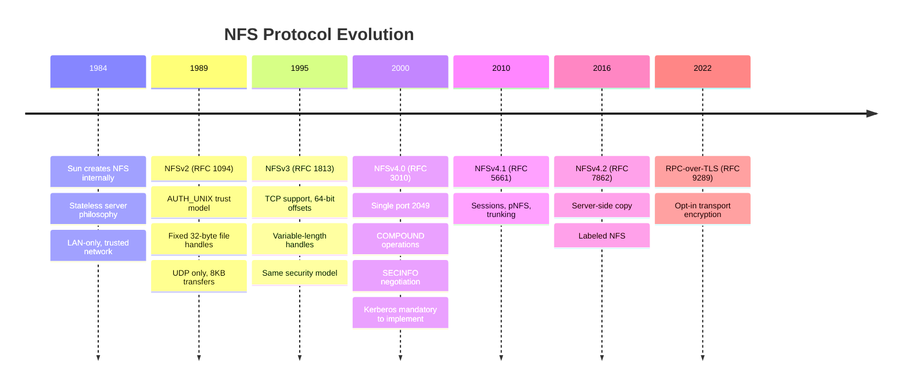
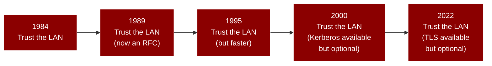

# History of NFS

NFS predates HTTP and the Web. Sun Microsystems built it in 1984 for a specific environment: engineering workstations sharing files over a trusted LAN. The core security assumptions have never been corrected. Every version since has added features while leaving the trust model untouched.

## Timeline

| Year | Version | RFC | Key changes | Security impact |
|------|---------|-----|-------------|-----------------|
| 1984 | Internal | -- | Sun creates NFS for LAN file sharing | Designed for trusted networks; no authentication |
| 1989 | NFSv2 | [RFC 1094](https://www.rfc-editor.org/rfc/rfc1094) | First public standard. 18 procedures, fixed 32-byte handles, UDP transport, synchronous writes, 8KB transfer limit | AUTH_UNIX trust model published as a "feature". No encryption, no integrity. File handles are bearer tokens. |
| 1995 | NFSv3 | [RFC 1813](https://www.rfc-editor.org/rfc/rfc1813) | Variable-length handles (up to 64 bytes), TCP support, 64-bit offsets, READDIRPLUS, async writes, ACCESS procedure, COMMIT | Security model unchanged. ACCESS is advisory only (RFC 1813 Section 3.3.4). MOUNT v3 adds auth flavor list but enforcement is optional. |
| 2000 | NFSv4.0 | [RFC 3010](https://www.rfc-editor.org/rfc/rfc3010) | Major redesign: single port 2049, COMPOUND operations, SECINFO negotiation, pseudo-filesystem, integrated locking, stateful protocol, ACLs | RPCSEC_GSS with Kerberos V5 is mandatory to implement, but AUTH_SYS is still allowed (RFC 7530 Section 3.2). Most deployments use AUTH_SYS. |
| 2003 | NFSv4.0 | [RFC 3530](https://www.rfc-editor.org/rfc/rfc3530) | Revised NFSv4.0 specification | No security changes from RFC 3010 |
| 2010 | NFSv4.1 | [RFC 5661](https://www.rfc-editor.org/rfc/rfc5661) | Sessions, pNFS, trunking, directory delegations, SECINFO_NO_NAME | Sessions add replay protection; pNFS introduces new attack surface via data servers |
| 2015 | NFSv4.0 | [RFC 7530](https://www.rfc-editor.org/rfc/rfc7530) | Current NFSv4.0 specification (obsoletes RFC 3530) | Clarifies that AUTH_SYS and AUTH_NONE MAY be implemented; Kerberos V5 MUST be implemented |
| 2016 | NFSv4.2 | [RFC 7862](https://www.rfc-editor.org/rfc/rfc7862) | Server-side copy, sparse files, application I/O hints, labeled NFS (SELinux), space reservation | Labeled NFS adds MAC enforcement; server-side copy introduces cross-server trust issues |
| 2022 | RPC-with-TLS | [RFC 9289](https://www.rfc-editor.org/rfc/rfc9289) | Transport-layer encryption for all RPC traffic, AUTH_TLS flavor for TLS negotiation | Opt-in, not enforced. Explicitly designed to interoperate with non-TLS peers. Does not fix AUTH_SYS. |

## 1984: Sun Microsystems and the birth of NFS

In 1984, Sun Microsystems built NFS so their workstations could share files over the local network. Three design choices made it fast and simple to deploy, and impossible to secure after the fact.

**Stateless servers.** The server keeps no state about clients. If it crashes, clients retry until it comes back. Simple and resilient, but it means the server cannot track sessions, revoke access, or detect replayed requests. RFC 1094 Section 1.3:

> "A server should not need to maintain any protocol state information about any of its clients in order to function correctly."

**Opaque file handles.** NFS identifies files by blocks of data meaningful only to the server, instead of pathnames. The handle encodes a device, inode, and generation number, enough for the server to find the file on disk. The client treats it as a black box. Whoever holds the bytes has access. There is no binding to a client, no expiration, and no revocation. RFC 1094 Section 2.3.3 defines the handle without any security discussion:

> "The file handle can contain whatever information the server needs to distinguish an individual file."

See [File Handles](file-handles.md) for the full analysis of handle security.

**Trust the client.** The authentication model, AUTH_UNIX (later renamed AUTH_SYS in RFC 5531), has the client include its UNIX UID and GID in every RPC call. The server takes these at face value. No password, no challenge-response, no cryptographic proof. The client says "I am UID 0" and the server believes it.

!!! danger "The original sin"
    NFS assumed every machine on the network was administered by the same organization, every user had the same UID everywhere, and nobody was hostile. These assumptions were already wrong in 1984 (Sun's own campus network had untrusted machines) and they are obviously wrong on any modern network.

## 1989: NFSv2 -- the first public standard

RFC 1094, published in March 1989, formalized the NFS protocol that Sun had been shipping since 1985. The specification was authored by Sun Microsystems and described a protocol already in wide production use.

NFSv2 defined 18 procedures built on ONC RPC (RFC 1057) and XDR (RFC 1014):

??? info "NFSv2 procedure table (RFC 1094 Section 2.2)"
    | # | Procedure | Description |
    |---|-----------|-------------|
    | 0 | NULL | Do nothing (ping) |
    | 1 | GETATTR | Get file attributes |
    | 2 | SETATTR | Set file attributes |
    | 3 | ROOT | Get filesystem root (obsolete -- replaced by MOUNT) |
    | 4 | LOOKUP | Look up filename |
    | 5 | READLINK | Read symbolic link |
    | 6 | READ | Read from file |
    | 7 | WRITECACHE | Write to cache (unused, reserved for v3) |
    | 8 | WRITE | Write to file |
    | 9 | CREATE | Create a file |
    | 10 | REMOVE | Remove a file |
    | 11 | RENAME | Rename a file |
    | 12 | LINK | Create hard link |
    | 13 | SYMLINK | Create symbolic link |
    | 14 | MKDIR | Create directory |
    | 15 | RMDIR | Remove directory |
    | 16 | READDIR | Read directory entries |
    | 17 | STATFS | Get filesystem attributes |

### Key limitations

- **Fixed 32-byte file handles** (`typedef opaque fhandle[FHSIZE]` -- meaning "a handle is exactly 32 bytes of raw data"), constraining server-side encoding space.
- **UDP only.** The protocol was designed for UDP transport. TCP support was not specified.
- **32-bit file sizes and offsets.** The `unsigned int` fields in `readargs` limited files to 4 GB and individual reads to the transfer size, typically 8192 bytes.
- **Synchronous writes.** Every WRITE had to be committed to stable storage before the server could respond, creating a severe performance bottleneck.
- **No real security.** AUTH_UNIX was the only widely implemented authentication, with no security negotiation mechanism (see [Why NFS Is Insecure](insecurity.md)).

### The MOUNT protocol

The MOUNT protocol (RFC 1094 Appendix A) was a separate RPC service that provided the initial file handle. A client would call MOUNT's MNT procedure with a pathname like `/export/home`, and the server would return the root file handle for that export. Once a client obtained a handle, the NFS protocol had no concept of export boundaries, creating a structural security gap that RFC 2623 Section 2.6 documents explicitly. See [MOUNT Protocol](../protocols/mount.md) for the full analysis.

## 1995: NFSv3 -- performance without security

RFC 1813, published in June 1995, was a major performance upgrade that fixed NFSv2's most painful operational limitations while leaving the security model completely unchanged.

### What NFSv3 fixed

- **Variable-length handles** up to 64 bytes (`opaque fh3<NFS3_FHSIZE>` -- meaning "a handle is up to 64 bytes of raw data"), giving servers more room for encoding filesystem metadata.
- **TCP support** in addition to UDP, enabling reliable delivery and larger transfer sizes.
- **64-bit file sizes and offsets** via the XDR `hyper` type, removing the 4 GB barrier.
- **Asynchronous writes** with a COMMIT procedure, allowing the server to acknowledge writes before flushing to stable storage and dramatically improving write throughput.
- **READDIRPLUS** returned file handles and attributes alongside directory entries, reducing round trips for directory traversals from 3N to N.
- **ACCESS procedure** (RFC 1813 Section 3.3.4) let clients check permissions before attempting operations.
- **22 procedures** total, adding MKNOD, FSSTAT, FSINFO, PATHCONF, and COMMIT.

### What NFSv3 did not fix

The security model was identical to NFSv2. RFC 1813 Section 1.5 describes the same AUTH_UNIX mechanism with the same assumption that client and server share a consistent UID space:

> "The NFS server checks permissions by taking the credentials from the RPC authentication information in each remote request."

ACCESS checks are advisory only (see [NFSv3 protocol](../protocols/nfsv3.md)).

The MOUNT v3 protocol added one genuine improvement: the MNT response now included a list of supported authentication flavors (RFC 1813 Appendix I, Section 5.2.1). This was the first form of security negotiation in the NFS ecosystem, but it was informational. The client received the list and could choose to ignore it.

## 2000: NFSv4 -- the great redesign

NFSv4.0, first specified in RFC 3010 (December 2000) and revised as RFC 3530 (April 2003) and RFC 7530 (March 2015), was a ground-up redesign that addressed many of NFS's architectural weaknesses. It was also the first version developed under the IETF rather than solely by Sun Microsystems.

### Architectural changes

**Single port.** NFSv4 operates on TCP port 2049 exclusively. The portmapper, MOUNT protocol, NLM, and NSM were all eliminated as separate services. This reduced the attack surface from five or six network-accessible services to one.

**COMPOUND operations.** Instead of one RPC call per operation, NFSv4 batches multiple operations into a single COMPOUND procedure call. A LOOKUP + OPEN + READ sequence that required three round trips on NFSv3 becomes a single RPC on NFSv4. The server evaluates operations in order; if one fails, the rest are skipped (RFC 7530 Section 1.4.2).

**Pseudo-filesystem.** The server presents all its exports through a single namespace using a pseudo-filesystem. Clients start at a root filehandle obtained via the PUTROOTFH operation and navigate down through the pseudo-filesystem to reach real exports. This replaces the MOUNT protocol's per-export entry point.

**Stateful protocol.** NFSv4 abandoned the stateless philosophy. Clients establish sessions with SETCLIENTID, and the server tracks open files, locks, and delegations. This enabled proper file locking (replacing the flawed NLM protocol) and client caching via delegations.

**SECINFO operation.** The SECINFO operation lets clients query the server for the authentication flavors required on a per-file-system basis. This is in-band security negotiation -- unlike NFSv3's reliance on the out-of-band MOUNT protocol for flavor discovery.

### The security paradox

NFSv4 was explicitly designed with security as a goal. RFC 7530 Section 1.2 lists "strong security with negotiation built into the protocol" as the second of four design goals. The specification mandates that both clients and servers MUST implement RPCSEC_GSS with Kerberos V5 (RFC 7530 Section 3.2.1):

> "RPCSEC_GSS, via GSS-API, supports multiple mechanisms that provide security services. For interoperability, NFSv4 clients and servers MUST support the Kerberos V5 security mechanism."

And yet, the same section also says (RFC 7530 Section 3.2):

> "Other flavors, such as AUTH_NONE, AUTH_SYS, and AUTH_DH, MAY be implemented as well."

In practice, AUTH_SYS remains the default on virtually every NFSv4 deployment. Kerberos requires a KDC, keytabs on every client, synchronized time, and DNS infrastructure. Most organizations find this overhead prohibitive for NFS, so they configure `sec=sys` and get exactly the same non-authentication they had in 1984. The SECINFO machinery exists to negotiate security, but when both sides agree on AUTH_SYS, the negotiation produces a result no more secure than NFSv2.

"Mandatory to implement" is not "mandatory to use"; nothing requires Kerberos to be configured for any given export (see [Authentication Model](authentication.md)).

### File handles in NFSv4

NFSv4 handles can be up to 128 bytes and come in two types: persistent (survive server reboot) and volatile (may expire). The server signals handle volatility through the `fh_expire_type` attribute (RFC 7530 Section 4.2). Volatile handles add a minor obstacle to handle replay attacks, but they do not change the fundamental bearer-token problem: whoever holds a valid handle has access, regardless of how they obtained it.

## 2010: NFSv4.1 -- sessions and parallel NFS

RFC 5661 introduced NFSv4.1, which added:

- **Sessions** with per-session state, preventing duplicate execution of requests. Each session has numbered slots; the server tracks which slot numbers it has already processed and rejects replays. This addressed the duplicate request cache problems that plagued earlier versions.
- **pNFS** separated metadata operations from data operations, allowing data to flow directly between client and storage devices. While this enabled massive scalability, it also introduced new security considerations around data server authentication.
- **Trunking** allowed a single client-server session to span multiple network paths.
- **Directory delegations** extended the NFSv4.0 delegation model to directories.
- **SECINFO_NO_NAME** provided security negotiation at file system boundaries without requiring a filename argument.

Sessions were a genuine security improvement: the slot-based mechanism prevents replayed requests from being processed more than once, and session binding ties the session to specific network endpoints. However, the session infrastructure only protects against replay and impersonation of the session itself. It does nothing about the UID/GID values inside AUTH_SYS credentials.

## 2016: NFSv4.2 -- features for the modern world

RFC 7862 added features aimed at modern storage workloads:

- **Server-side copy** (COPY operation) enables the server to copy data without it transiting the network. This introduces cross-server trust issues when copies span servers.
- **Sparse files** (ALLOCATE, DEALLOCATE, SEEK operations) for efficient storage of files with holes.
- **Application I/O hints** (IO_ADVISE) let applications inform the server about access patterns.
- **Labeled NFS** associates MAC labels with files, enabling SELinux enforcement across NFS. This is the first NFS mechanism that goes beyond DAC.
- **Space reservation** (ALLOCATE) pre-allocates storage space.

Labeled NFS (RFC 7862 Section 9) is architecturally significant because it is the first time the NFS protocol has included a mechanism that does not trust the client's identity assertions. MAC labels are server-enforced policy, not client-asserted attributes. However, Labeled NFS requires both client and server to run SELinux with consistent policy, which limits its practical deployment.

## 2022: RPC-over-TLS -- encryption, 38 years late

RFC 9289, published in September 2022, finally addresses the most obvious gap in the NFS security story: everything on the wire is plaintext. File contents, UID/GID credentials, and file handles are all visible to any network observer, enabling trivial sniffing and credential theft.

RPC-over-TLS works by using a new AUTH_TLS authentication flavor as a STARTTLS-like handshake. The client sends a NULL RPC with AUTH_TLS credentials; if the server supports TLS, it responds with a verifier containing the ASCII string "STARTTLS", and both sides upgrade the connection to TLS (RFC 9289 Section 4.1).

The design is explicitly opportunistic (RFC 9289 Section 6.1). If the server does not support TLS, the client can proceed in cleartext. The specification states:

> "The mechanism described in the current document interoperates fully with RPC implementations that do not support RPC-with-TLS."

TLS encrypts the transport but does not fix AUTH_SYS; an attacker with a TLS certificate can still assert any UID (see [RPC-over-TLS hardening](../defense/hardening/tls.md)).

## The thread through 40 years

The pattern is obvious in hindsight. Each version solves real operational problems while treating security as something you can turn on later.

The problem is not technical: the IETF knows how to build authenticated, encrypted protocols. The problem is backwards compatibility. Every NFS version must interoperate with older ones. Every security mechanism is optional because mandating it would break existing deployments. And because nobody deploys the optional mechanisms, the next version cannot mandate them either. It is a ratchet that only turns one way.

nfswolf exists because the protocol's security model has been broken since 1984 and four decades of RFCs have not fixed it. The only real protection is knowing what your NFS servers expose, then either hardening the configuration or replacing the protocol.

For the technical details of how each version's security model fails in practice, see [Why NFS Is Insecure](insecurity.md). For the specific vulnerabilities that nfswolf detects across all NFS versions, see the [Findings](../findings/index.md) tab.

## Further reading

- [Why NFS Is Insecure](insecurity.md) -- the fundamental design decisions that make NFS insecure by default
- [Authentication Model](authentication.md) -- AUTH_SYS, AUTH_NONE, RPCSEC_GSS, and AUTH_DH in detail
- [File Handles](file-handles.md) -- bearer-token semantics, format analysis, and escape construction
- [The NFS Protocol Stack](protocol-stack.md) -- how XDR, ONC RPC, portmapper, MOUNT, and NFS layer together
- RFC 1094 -- NFSv2 specification
- RFC 1813 -- NFSv3 specification
- RFC 7530 -- NFSv4.0 specification (current)
- RFC 5661 -- NFSv4.1 specification
- RFC 7862 -- NFSv4.2 specification
- RFC 9289 -- RPC-over-TLS specification
- RFC 2623 -- NFS security issues and RPCSEC_GSS
