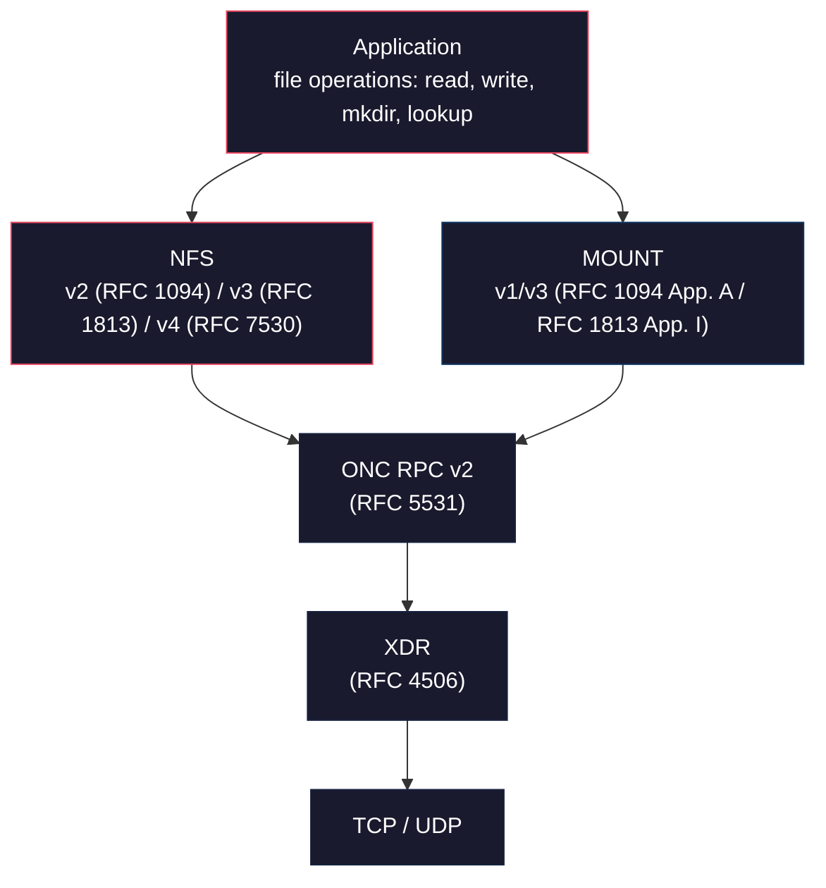

# NFS

**The Network File System is one of the oldest and most widely deployed remote file access protocols in existence, and one of the most fundamentally insecure.**

NFS was designed at Sun Microsystems in 1984 for a world where every machine on the network was trusted. Three decades and four major protocol versions later, the core security model has not changed: the client tells the server who it is, and the server believes it. There is no password, no challenge, no verification. The 32-bit UID (user ID) in every RPC call is the entire authentication story for the vast majority of NFS deployments.

An NFS export is a directory the server shares over the network. This section covers the protocol itself: what NFS is, how it works at the wire level, where the security model breaks down, and what research has been done on NFS security over the years. For protocol-by-protocol technical details, see the [Protocols](../protocols/index.md) tab. For the specific vulnerabilities nfswolf detects, see the [Findings](../findings/index.md) tab.

## The NFS protocol stack

NFS is not a single protocol. It is a stack of five or more protocols layered together, each with its own RPC program number, port, and security properties. Understanding the stack is essential to understanding the attack surface.

On NFSv2 and NFSv3, an attacker must interact with three separate services (portmapper, MOUNT, NFS) across two or three ports to access files. NFSv4 collapses everything into a single port and a single RPC procedure, but the underlying XDR and ONC RPC layers remain identical.

For a detailed walkthrough of each layer, see [The NFS Protocol Stack](protocol-stack.md).

## Why NFS matters for security

NFS exports are one of the highest-value targets on a network. A misconfigured NFS server can expose the entire root filesystem to any host that can reach port 2049: no credentials required, no brute-force needed, no exploit necessary. The protocol itself is the vulnerability.

!!! danger "The core problem"
    AUTH_SYS transmits the client's UID and GID as plaintext integers with no cryptographic verification. The server uses these values directly for access control decisions. An attacker who can reach the NFS port can claim to be any user on the system, including root (unless `root_squash` is enabled, which only protects UID 0).

NFS security problems fall into several categories:

**Identity attacks**
:   The client asserts its own identity via AUTH_SYS credentials. There is no verification. Any UID/GID combination can be forged in a single RPC call. See [F-1.1](../findings/identity/index.md).

**File handle leakage**
:   File handles are bearer tokens. Whoever holds the bytes has access, regardless of how they were obtained. Handles can be brute-forced, captured from the network, or constructed from filesystem metadata. See [File Handles](file-handles.md).

**Export escape**
:   The MOUNT protocol binds a client to an export directory, but the NFS protocol itself has no concept of export boundaries. By manipulating file handle bytes, an attacker can escape the export directory and access the entire filesystem. See [Findings](../findings/index.md).

**No encryption by default**
:   NFS traffic is plaintext. File contents, credentials, and file handles are all visible to any network observer. NFS-over-TLS (RFC 9289) exists but is opt-in and rarely deployed.

**Downgrade attacks**
:   Servers that support multiple NFS versions can be attacked via the weakest version. NFSv2 has no security negotiation at all (RFC 2623 Section 2.7), so a server that enforces Kerberos on v3/v4 may accept spoofed credentials on v2.

## What this section covers

| Page | Contents |
|------|----------|
| [History of NFS](history.md) | From Sun's 1984 whitepaper through NFSv4.2: how the protocol evolved and why security was never the priority |
| [Why NFS Is Insecure](insecurity.md) | The fundamental design decisions that make NFS insecure by default, with RFC citations |
| [The NFS Protocol Stack](protocol-stack.md) | How XDR, ONC RPC, portmapper, MOUNT, and NFS layer together, and where each layer fails |
| [Authentication Model](authentication.md) | AUTH_SYS, AUTH_NONE, RPCSEC_GSS, AUTH_DH: what each provides and what each lacks |
| [File Handles](file-handles.md) | Wire format, bearer-token semantics, brute-force feasibility, and escape construction |
| [Previous Research](research.md) | Academic papers, conference talks, and prior security analyses of NFS |
| [Related Tools](tools.md) | Other NFS security tools and how nfswolf compares |

## Further reading

For protocol-level technical details (wire formats, procedure tables, XDR types), see the [Protocols](../protocols/index.md) tab.

For the 62 specific security findings that nfswolf detects, see the [Findings](../findings/index.md) tab.

For defensive guidance on configuring and hardening NFS, see the [Defense](../defense/index.md) tab.
