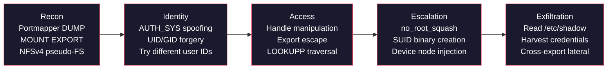
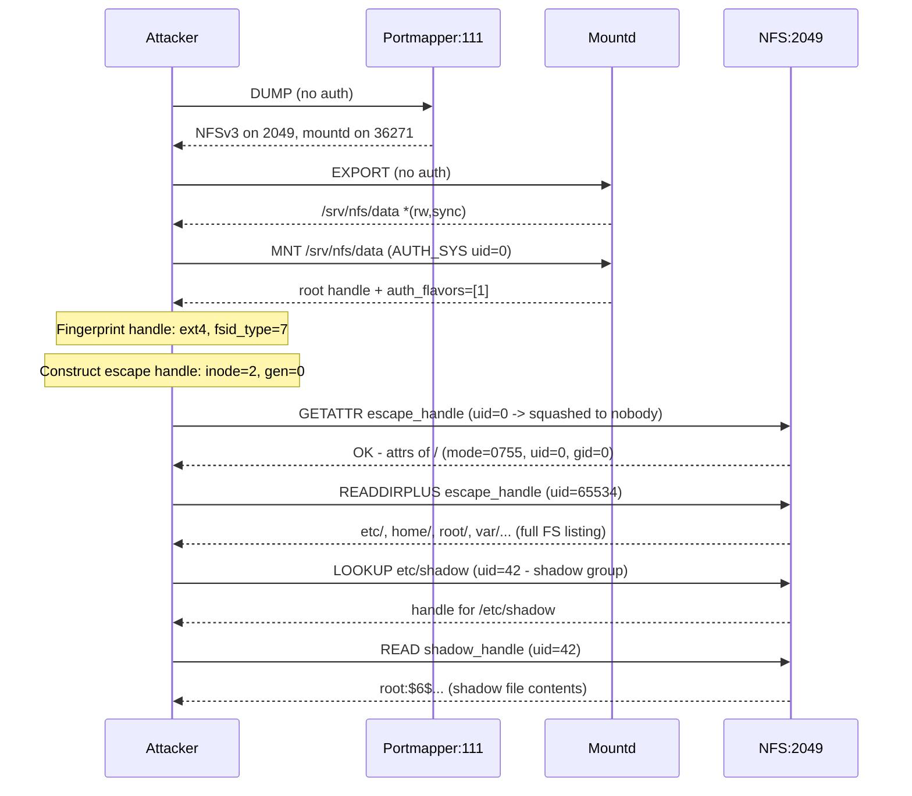

# Why NFS Is Insecure

NFS was designed in 1984 for trusted LANs. The client is trusted to report its own identity. File handles are permanent bearer tokens with no binding or expiry. Everything travels in plaintext. These are not implementation bugs; they are structural properties of the protocol, documented in the RFCs, and they cannot be fixed without breaking backward compatibility.

## The Attack Chain

Every NFS attack follows this progression. nfswolf implements every step and the [findings catalog](../findings/index.md) documents 62 distinct vulnerabilities across the path.



## 1. AUTH_SYS Trusts the Client

The default NFS authentication mechanism, AUTH_SYS, sends the client's UID, GID, and supplemental groups in every RPC call. The server accepts these values without verification. There is no password, no ticket, no signature, no challenge-response exchange. The client simply declares its identity and the server believes it.

!!! danger "RFC 2623 Section 2.2.1"
    "Using the AUTH_SYS flavor of authentication, the server gets the client's effective user identifier, effective group identifier and supplemental group identifiers on each call, and uses them to check access."

    There is no verifier. The server applies POSIX permission checks using whatever UID the client claims.

The AUTH_SYS credential structure (RFC 5531 Section 14) contains exactly four security-relevant fields:

| Field | Size | What it does | Verified? |
|-------|------|-------------|-----------|
| `stamp` | 4 bytes | Arbitrary ID chosen by client | No |
| `machinename` | up to 255 bytes | Client hostname (advisory) | No |
| `uid` | 4 bytes | Effective user ID | No |
| `gid` | 4 bytes | Effective group ID | No |
| `gids` | up to 16 entries | Supplemental group list | No |

Every field is client-asserted. The server has no way to verify any of them. Any machine on the network can claim any UID/GID ([F-1.1](../findings/identity/F-1.1-uid-gid-spoofing.md)), `root_squash` only blocks `uid=0` ([F-1.2](../findings/identity/F-1.2-root-squash-bypass.md)), credentials can be replayed indefinitely ([F-1.5](../findings/identity/F-1.5-credential-replay.md)), and the machine name is unverified ([F-1.4](../findings/identity/F-1.4-machine-name-spoofing.md)). See [Authentication Model](authentication.md) for the full field-by-field breakdown and protocol-level analysis.

AUTH_SYS credentials are per-call, not per-session, enabling mid-session identity switching -- an attacker can try different user IDs in sequence until one works. NFSv2 has no security negotiation, so requesting v2 bypasses `sec=krb5` ([F-1.6](../findings/identity/F-1.6-nfsv2-downgrade.md)). RPCSEC_GSS is the fix, but most deployments use AUTH_SYS; mixed `sec=krb5:sys` exports allow the attacker to simply choose AUTH_SYS ([F-1.7](../findings/identity/F-1.7-rpcsec-gss-flavor-downgrade.md), [F-1.8](../findings/identity/F-1.8-auth-tooweak-kerberos-enforced.md)). See the [Kerberos Hardening Guide](../defense/hardening/kerberos.md) for deployment details.

## 2. File Handles Are Bearer Tokens

NFS file handles are chunks of server-internal data that identify files on the server. Once a client obtains a handle, it works from any IP address, with any credentials, forever. See [File Handles](file-handles.md) for the complete wire format, per-filesystem encodings, and construction rules.

!!! danger "RFC 2623 Section 2.6"
    "An attacker can circumvent the MOUNT server's access control to gain access to a file system that the attacker is not authorized for. The circumvention is accomplished by either stealing a file handle (usually by snooping the network traffic between an legitimate client and server) or guessing a file handle."

Four consequences of the bearer-token property:

- **Handles have no binding.** No IP, credential, or session binding. nfswolf's `shell --handle <hex>` connects to port 2049 without contacting MOUNT, and the handle works. ([F-2.7](../findings/access-control/F-2.7-nfsd-acl-blindness.md))
- **Handles never expire.** UMNT does not invalidate handles. No revocation mechanism exists. ([F-2.5](../findings/access-control/F-2.5-stale-handle-persistence.md))
- **Handles are not cryptographically protected.** Predictable fsid + inode + generation, no HMAC or signature. ([F-2.3](../findings/access-control/F-2.3-windows-handle-signing.md), [F-2.10](../findings/access-control/F-2.10-sign-fh-root-exemption.md))
- **Handles leak through multiple channels.** MOUNT MNT, READDIRPLUS, network sniffing, WebNFS public handle. ([F-5.2](../findings/info-disclosure/F-5.2-readdirplus-handle-harvesting.md), [F-2.9](../findings/access-control/F-2.9-webnfs-public-handle.md))

## 3. Export Escape via Handle Construction

File handles on Linux contain a predictable structure: a 4-byte header followed by an fsid and a file identifier (fileid). The fileid typically contains an inode number and a generation counter. By constructing a handle that points to the filesystem's root inode (inode 2 on ext2/3/4 and several other Linux filesystems, 128 on XFS, 256 on BTRFS), an attacker escapes the exported subdirectory and accesses the entire server filesystem.

!!! danger "The core escape"
    An NFS export of `/srv/nfs/data` is supposed to confine access to that directory. But a constructed handle pointing to inode 2 resolves to `/` (the filesystem root), giving the attacker access to `/etc/shadow`, `/home`, and every other file on the same partition. The server has no way to prevent this when `subtree_check` is disabled, which it is by default on every modern Linux kernel.

The escape works because handle structure is predictable (see [File Handles](file-handles.md)) and `no_subtree_check` (the default since kernel 2.6.25) means the server validates only the fsid, not whether the inode is within the exported subtree ([F-2.1](../findings/access-control/F-2.1-export-escape.md)).

??? info "Anatomy of a handle escape"
    ```text
    Seed handle:
    ┌────────┬────────────────────────────┬───────────────────────┐
    │ Header │ fsid (filesystem identity) │ fileid (inode + gen)  │
    │ 01 00  │ 07 <uuid> <export_ino>     │ 01 <inode=131074>     │
    │ 07 01  │                            │    <gen=3892401922>   │
    └────────┴────────────────────────────┴───────────────────────┘

    Escape handle (constructed by attacker):
    ┌────────┬────────────────────────────┬───────────────────────┐
    │ Header │ fsid (SAME as seed)        │ fileid (ROOT inode)   │
    │ 01 00  │ 07 <uuid> <export_ino>     │ 01 <inode=2>          │
    │ 07 01  │                            │    <gen=0>            │
    └────────┴────────────────────────────┴───────────────────────┘

    The server resolves the fsid to the same filesystem, looks up inode 2
    (the filesystem root), and returns /etc, /home, /var, /root...
    ```

nfswolf implements escape construction for 18 of 19 Linux filesystem types (only tmpfs resists). See [File Handles -- Root inode values](file-handles.md#root-inode-values-by-filesystem) for the per-filesystem root inode table, and [F-2.1](../findings/access-control/F-2.1-export-escape.md) for the full escape finding. Three escape variants exist: **NFSv3/v2 handle construction** targets the seed handle's fsid + filesystem root inode ([F-2.1](../findings/access-control/F-2.1-export-escape.md)). **NFSv4 LOOKUPP** walks up from the export root to the filesystem root without any handle construction ([F-2.11](../findings/access-control/F-2.11-nfsv4-lookupp-export-escape.md)). **Handle brute force** uses the STALE/BADHANDLE oracle to sweep inode numbers when the structure is unknown ([F-2.2](../findings/access-control/F-2.2-file-handle-guessing.md)).

Once escaped, LOOKUP reaches any directory on the filesystem, including exports with stricter security settings. The policy is evaluated against the escape handle's source export, not the target directory ([F-2.8](../findings/access-control/F-2.8-sibling-export-lateral-access.md)). On NFSv4, LOOKUPP from any export reaches the pseudo-root (the virtual top-level namespace), and LOOKUP from there enters any sibling export without MOUNT ([F-2.12](../findings/access-control/F-2.12-nfsv4-lookupp-cross-export-lateral.md)).

## 4. ACCESS Checks Are Advisory

NFSv3's ACCESS procedure (RFC 1813 Section 3.3.4) returns a bitmask of what the server thinks the client can do, but the result is explicitly advisory:

!!! warning "RFC 1813 Section 3.3.4"
    "The results of this procedure are necessarily advisory in nature. That is, a return status of NFS3_OK and the appropriate bit set in the bit mask does not imply that such access will be allowed to the file system object in the future, as access rights can be revoked by the server at any time."

Any security tool that relies on ACCESS will produce false results. nfswolf always confirms by attempting the actual operation. ([F-1.1](../findings/identity/F-1.1-uid-gid-spoofing.md))

## 5. No Transport Encryption by Default

All NFS traffic (credentials, file handles, file contents, directory listings) traverses the network in plaintext. Anyone with network access can observe and replay complete NFS sessions.

!!! warning "RFC 1813 Section 8"
    "As with the previous protocol revision (version 2), NFS version 3 defers to the authentication provisions of the supporting RPC protocol [RFC1057], and assumes that data privacy and integrity are provided by underlying transport layers as available in each implementation of the protocol."

NFS-over-TLS (RFC 9289) exists but is opt-in and STRIPTLS-vulnerable ([F-3.4](../findings/network/F-3.4-striptls-downgrade.md)). Even with TLS, AUTH_SYS still allows UID/GID forging ([F-3.8](../findings/network/F-3.8-rpc-with-tls.md)). The plaintext default enables credential theft, handle theft, data exfiltration, and UDP MOUNT handle spoofing; see [F-3.1](../findings/network/F-3.1-plaintext-wire-protocol.md) and [F-3.6](../findings/network/F-3.6-udp-mount-handle-theft.md).

## 6. Cross-Protocol Information Leaks

NFS does not operate in isolation. The portmapper, MOUNT daemon, rquotad, and NFS_ACL program all leak information that feeds the attack chain. None of these sideband services require authentication.

| Service | What it leaks | Finding |
|---------|--------------|---------|
| Portmapper DUMP (port 111) | Every registered RPC program, version, protocol, and port. Reveals the full service topology including NIS, rquotad, and mountd. | [F-5.4](../findings/info-disclosure/F-5.4-rpc-service-enumeration.md) |
| MOUNT EXPORT | Every export path with access control lists. Reveals the server's directory structure and which hosts are trusted. | [F-5.1](../findings/info-disclosure/F-5.1-export-list-enumeration.md) |
| MOUNT DUMP | Every currently mounted client with their IP, export path, and mount time. Reveals active users and legitimate client IPs for export ACL bypass (F-3.3) and source-address selection. | [Info disclosure](../findings/info-disclosure/index.md) |
| rquotad (program 100011) | Per-UID disk usage without authentication. Confirms which UIDs are active on the server and leaks filesystem block size. | F-5.15 |
| NFS_ACL (program 100227) | POSIX ACL entries that grant access to specific UIDs/GIDs invisible in mode bits. Reveals hidden access paths. | F-5.14 |
| NFSv4 pseudo-FS | READDIR from the pseudo-root reveals the names and structure of all exports, including IP-restricted ones. | [F-5.5](../findings/info-disclosure/F-5.5-nfsv4-pseudo-fs-leakage.md) |

All of these services operate over unauthenticated RPC. The portmapper also enables UDP amplification ([F-3.2](../findings/network/F-3.2-portmapper-amplification.md)). When NIS is co-hosted, `ypcat passwd.byname` dumps password hashes without authentication ([F-5.3](../findings/info-disclosure/F-5.3-nis-credential-extraction.md)).

## 7. Privilege Escalation via Write Access

When an attacker has both escaped the export (Section 3) and claimed `uid=0` on a `no_root_squash` export (Section 1), the combination enables full host compromise through the NFS protocol alone. Three write-based attacks are available:

**SUID binary creation.** NFS CREATE accepts mode bits including `04755` (setuid root). An attacker writes a compiled binary with the SUID bit set, then executes it locally from a client mount to gain root on any machine that mounts the export. RFC 1094 Section 2.3.5 defines "0004000 Set user id on execution" as a valid mode bit. ([F-4.2](../findings/privesc/F-4.2-suid-sgid-escalation.md))

**Device node injection.** NFSv3 MKNOD (create device node) creates character and block device nodes with arbitrary major/minor numbers. An attacker can create a block device pointing at the server's raw disk, then read the block device from a client mount for raw disk access. ([F-4.3](../findings/privesc/F-4.3-device-node-creation.md))

**Kernel capability escalation.** When a `no_root_squash` export accepts UID 0, the kernel grants NFS root a set of capabilities called `CAP_NFSD_SET`. This includes `CAP_MAC_OVERRIDE`, which bypasses ALL mandatory access controls: SELinux, AppArmor, and SMACK. A file protected by a SELinux label like `shadow_t` is fully readable over NFS. It also includes `CAP_SYS_RESOURCE`, which bypasses disk quotas. The result: NFS root is more powerful than local root in the quota dimension, and it ignores security frameworks that are supposed to restrict even root. ([F-4.1](../findings/privesc/F-4.1-no-root-squash.md), [F-4.5](../findings/privesc/F-4.5-selinux-label-bypass.md))

## What Actually Works as Defense

Most "defenses" that administrators deploy against NFS attacks are ineffective or partial. The [Defense Guide](../defense/index.md) covers each in detail. Here is the summary:

| Defense | Blocks escape? | Blocks UID spoofing? | Blocks cross-export? | Blocks reads? |
|---------|---------------|---------------------|---------------------|--------------|
| `sec=krb5` (without `sys`) | Yes | Yes | Yes | Yes |
| `subtree_check` | Yes | No | No | No |
| Separate filesystem per export | Yes | No | Yes | No |
| `all_squash` | No | Partial (0600 files) | No | No |
| `root_squash` | No | uid=0 only | No | No |
| `ro` (read-only) | No | No | No | Blocks writes only |
| Privileged port (`secure`) | No | No | No | No |
| IP-based ACLs | No | No | No | No |

!!! danger "The only complete defense"
    `sec=krb5p` (Kerberos with privacy) is the only export option that blocks every attack in this document. Every other defense is partial at best. If you cannot deploy Kerberos, the combination of `subtree_check` + `all_squash` + `ro` + separate filesystem per export provides the strongest mitigation, but still leaks world-readable file contents and metadata.

## A Complete Attack Walkthrough

To illustrate how these flaws chain together, here is a concrete attack against a default NFS server exporting `/srv/nfs/data` with `*(rw,sync,root_squash,no_subtree_check)`, the kernel's default export options:



Every step uses a different structural flaw: unauthenticated recon (Section 6), handle manipulation (Section 3), UID spoofing (Section 1), and plaintext exfiltration (Section 5). The entire attack takes under 10 RPC calls and completes in milliseconds.

## The Root Cause

These are not seven independent bugs. They are consequences of a single design decision: NFS trusts the client. The server does not verify identity, does not bind tokens to sessions, does not enforce export boundaries by default, does not encrypt the wire, and does not authenticate its sideband services. Every mitigation is an afterthought bolted onto a trust-the-client architecture. The RFCs know this: RFC 2623 (1999) documented the issues, RFC 9289 (2022) was written because they still were not solved, and each protocol revision has fixed one flaw while introducing others.

| Version | Year | What it fixed | What it kept or introduced |
|---------|------|--------------|---------------------------|
| NFSv2 | 1989 | (original) | AUTH_SYS, fixed 32-byte handles, no security negotiation |
| NFSv3 | 1995 | Variable-length handles, READDIRPLUS, ACCESS | AUTH_SYS default, advisory ACCESS, no encryption |
| NFSv4 | 2003 | Eliminated MOUNT, added SECINFO, stateful protocol | LOOKUPP escape, pseudo-FS leaks all export names, AUTH_SYS still default |
| RFC 9289 | 2022 | RPC-over-TLS encryption | Opt-in, STRIPTLS-vulnerable, does not fix AUTH_SYS trust model |

NFS remains widely deployed because it is fast, simple, and works everywhere. Those same properties (stateless, unauthenticated, plaintext) are exactly what make it insecure. There is no version of NFS that is secure by default. Security requires explicit, correct configuration that most deployments do not have.
