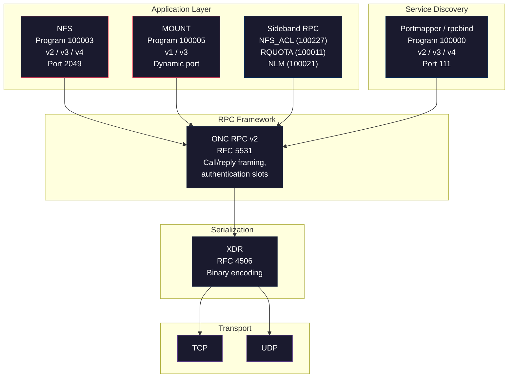
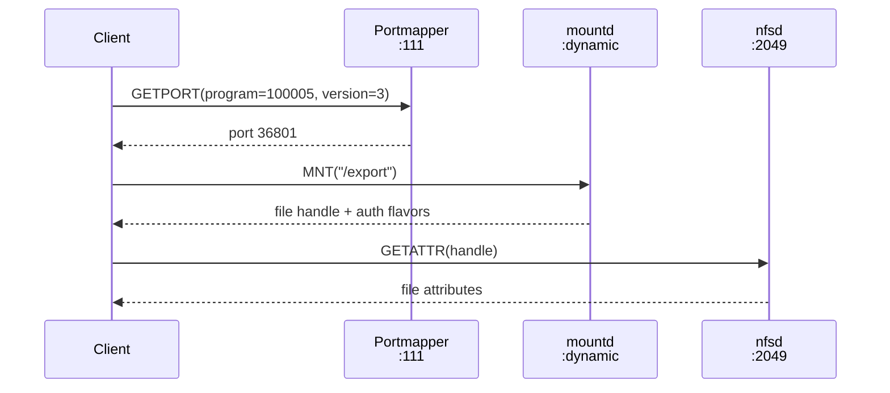
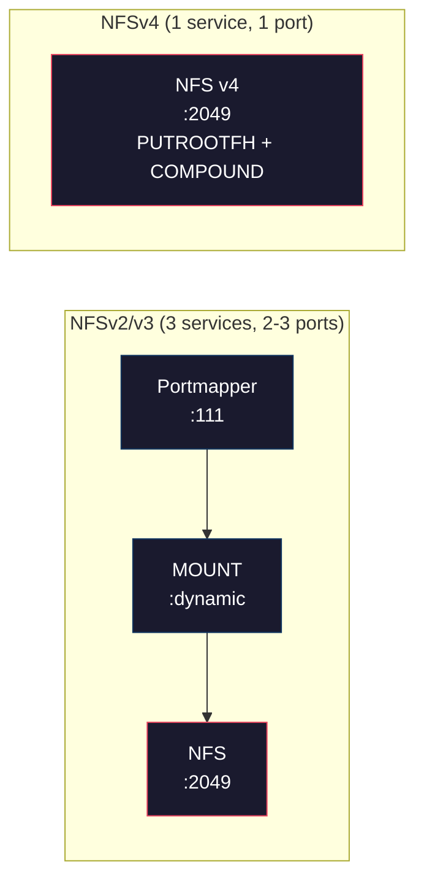

# The NFS Protocol Stack

**NFS is not one protocol. It is a stack of five or more distinct protocols, each with its own RPC program number, wire format, and security properties (or lack thereof).**

Every NFS operation (reading a file, listing a directory, creating a symlink) passes through multiple protocol layers before reaching the wire. Understanding this stack is essential for security work because vulnerabilities exist at every layer, and because the layers interact in ways that undermine each other's security guarantees. A Kerberos-secured NFS session still relies on plaintext portmapper queries. A `root_squash` export still hands out bearer-token file handles to anonymous clients.

This page walks through the stack from the bottom (serialization) to the top (file operations), explains what each layer does and what it fails to protect, and maps every layer to its governing RFC and its role in nfswolf's attack chain.

## The full stack

## Layer-by-layer breakdown

### Layer 1: XDR -- External Data Representation

XDR (RFC 4506) is the serialization format used by every protocol in the stack. It encodes integers, strings, arrays, discriminated unions, and opaque byte sequences into a platform-independent binary format. All multi-byte values are big-endian. All values are padded to 4-byte boundaries.

XDR is a pure encoding layer: it has no concept of security, authentication, or integrity. It faithfully serializes whatever the caller provides, including forged credentials, crafted file handles, and malformed data. The serialization layer is not where attacks happen, but it is worth understanding because every field in every protocol above is XDR-encoded.

!!! info "nfswolf implementation"
    The `onc-xdr` crate implements XDR encoding and decoding with the `Pack` and `Unpack` traits. The `onc-xdr-derive` crate provides `#[derive(XdrCodec)]` for automatic code generation from Rust structs. See [ONC XDR](../protocols/xdr.md) for the full protocol reference.

**Security properties:** None. XDR is a data format, not a security mechanism.

### Layer 2: ONC RPC -- Open Network Computing Remote Procedure Call

ONC RPC v2 (RFC 5531, originally RFC 1831) provides the call/reply framing that every service in the NFS stack uses. Each RPC message contains:

- A **program number** identifying the service (e.g., 100003 for NFS, 100005 for MOUNT)
- A **version number** (e.g., 2, 3, or 4 for NFS)
- A **procedure number** (e.g., 6 for READ in NFSv3)
- A **credential** and **verifier** pair for authentication
- The **procedure arguments** or **reply data**

The RPC layer carries authentication but does not enforce it. The credential and verifier are opaque byte sequences that the RPC layer passes through to the service implementation. The service decides whether to trust them.

!!! warning "AUTH_SYS: the default authentication flavor"
    The dominant credential type is AUTH_SYS (flavor 1), which carries plaintext UID/GID integers with no cryptographic verification. The server trusts whatever the client sends. See [Authentication Model](authentication.md) for the full AUTH_SYS and RPCSEC_GSS breakdown, XDR structures, and attack implications.

**Security properties:** ONC RPC defines authentication slots but provides no built-in security. AUTH_SYS is plaintext and trivially forged; RPCSEC_GSS (RFC 2203) adds Kerberos but is optional and can be downgraded ([F-1.7](../findings/identity/index.md)).

!!! info "nfswolf implementation"
    The `onc-rpc-client` crate implements the RPC call/reply framing, `AuthSys` credential construction, and the `RpcTransport` trait that separates wire I/O from protocol logic. See [ONC RPC](../protocols/rpc.md) for the full protocol reference.

### Layer 3: Portmapper / rpcbind -- service discovery

Portmapper (RFC 1057 Appendix A) and its successor rpcbind (RFC 1833) run on port 111 and map RPC program numbers to network ports. When an NFS client starts, it queries portmapper to learn where the MOUNT daemon is listening. Without portmapper, the client must know the MOUNT port in advance.

The service discovery flow for NFSv2/v3 looks like this:

Portmapper is itself an RPC service (program 100000) with no authentication. Any host that can reach port 111 can query the full list of registered services, including their program numbers, versions, protocols, and ports. This is finding [F-5.4](../findings/info-disclosure/F-5.4-rpc-service-enumeration.md): the portmapper acts as a free reconnaissance oracle.

!!! danger "Portmapper has no authentication"
    Any host that can reach port 111 can enumerate all registered RPC services, including over UDP where source IPs can be spoofed. See [Portmapper](../protocols/portmapper.md) for details.

**Security properties:** None. Portmapper is unauthenticated, unencrypted, and reveals the full RPC service map to any querier.

!!! info "nfswolf implementation"
    The `onc-rpcbind` crate implements both portmapper v2 (`GETPORT`, `DUMP`) and rpcbind v3/v4 (`GETTIME`, `GETSTAT`). The scanner uses portmapper as the first phase of service discovery. See [Portmapper and rpcbind](../protocols/portmapper.md) for the full protocol reference.

### Layer 4: MOUNT -- export access

The MOUNT protocol (v1: RFC 1094 Appendix A; v3: RFC 1813 Appendix I) converts a filesystem path (e.g., `/export/data`) into an opaque file handle. This handle is the key to everything -- every subsequent NFS operation takes a file handle as input. MOUNT is the only place in the v2/v3 protocol stack where human-readable path names appear.

MOUNT runs as a separate daemon (`rpc.mountd`) on a dynamic port, registered with portmapper. It provides:

- **MNT** -- Convert an export path to a root file handle
- **EXPORT** -- List all exported paths and their allowed hosts
- **DUMP** -- List all active mount entries (which clients hold which exports)
- **UMNT / UMNTALL** -- Bookkeeping for unmounting (advisory only, not enforced)

!!! warning "MOUNT grants bearer tokens"
    The file handle returned by MNT is a bearer token -- it works for any client, with any credentials, indefinitely ([F-2.1](../findings/access-control/index.md)). See [File Handles](file-handles.md#handles-are-bearer-tokens) for the full bearer-token analysis and [MOUNT protocol](../protocols/mount.md) for the wire-level reference.

MOUNT v3 returns an additional piece of information that v1 does not: the list of authentication flavors the export accepts. This is how nfswolf's analyzer determines whether an export requires Kerberos or accepts AUTH_SYS without attempting any file operations.

**Security properties:** MOUNT can enforce IP-based access control on MNT requests, but the resulting handles have no access control of their own. The EXPORT procedure reveals all export paths and ACLs to any querier. MOUNT v1 has no auth-flavor negotiation.

!!! info "nfswolf implementation"
    The `nfs-mount` crate implements MOUNT v1 and v3. The escape pipeline gathers seed handles from both MOUNT versions. See [MOUNT](../protocols/mount.md) for the full protocol reference.

### Layer 5: NFS -- file operations

The NFS protocol itself is the top of the stack. It provides the file operations: read, write, create, remove, rename, symlink, readdir, getattr, setattr, and more. Every operation takes a file handle as its primary input and returns data, attributes, or a new file handle.

=== "NFSv2 (RFC 1094)"
    18 procedures, fixed 32-byte handles, 2 GB file size limit, synchronous writes only, no auth-flavor negotiation. The simplest version and the one most likely to have weaker security enforcement due to its age and lack of security negotiation (RFC 2623 Section 2.7).

=== "NFSv3 (RFC 1813)"
    22 procedures, variable-length handles (up to 64 bytes), 64-bit file sizes, async writes, READDIRPLUS (handles + attrs in one call), ACCESS (permission probing), and the STALE/BADHANDLE oracle that makes handle brute-forcing efficient.

=== "NFSv4 (RFC 7530)"
    A fundamentally different architecture: single port (2049), no MOUNT, no portmapper, COMPOUND batching of operations, stateful sessions (SETCLIENTID, OPEN/CLOSE, LOCK), pseudo-filesystem for namespace traversal, in-band SECINFO for per-path security negotiation, and LOOKUPP for parent directory traversal (enabling export escape without handle manipulation).

The NFS layer enforces access control based on the AUTH_SYS credentials in the RPC header. On Linux knfsd, the server maps the client-supplied UID/GID to a local identity and checks standard Unix permission bits. This is the only access control in the entire stack, and it relies entirely on trusting the client's self-reported identity.

**Security properties:** Access control is enforced here, but depends on [AUTH_SYS credentials](authentication.md) that are trivially forged. [File handles](file-handles.md) are bearer tokens that bypass path-based export boundaries.

!!! info "nfswolf implementation"
    The `nfs-v2`, `nfs-v3`, and `nfs-v4` crates implement the full wire protocol for each version. See [NFSv2](../protocols/nfsv2.md), [NFSv3](../protocols/nfsv3.md), and [NFSv4](../protocols/nfsv4/index.md) for the full protocol references.

## Sideband RPC services

Beyond the core NFS/MOUNT/portmapper stack, several auxiliary RPC services extend NFS functionality. These run as separate daemons on dynamic ports and are discoverable through portmapper:

| Service | Program | Purpose | Security relevance |
|---------|---------|---------|-------------------|
| NFS_ACL | 100227 | POSIX ACL retrieval | Reveals fine-grained access control entries that may grant unexpected access |
| RQUOTA | 100011 | Disk quota queries | UID existence oracle (valid UIDs return quota data, invalid return errors) and filesystem block-size fingerprinting |
| NLM | 100021 | Network Lock Manager | Lock-based denial of service (out of scope in nfswolf) |
| NSM | 100024 | Network Status Monitor | Crash recovery notifications for NLM |
| NFSSTAT | 100249 | Server statistics | Information disclosure (operation counts, error rates) |

!!! info "nfswolf implementation"
    nfswolf implements NFS_ACL and RQUOTA clients for POSIX ACL enumeration and UID oracle attacks. NLM and NSM were removed in v0.2.0. See [NFS_ACL](../protocols/nfs-acl.md) and [RQUOTA](../protocols/rquota.md) for details.

## Protocol-to-RFC mapping

| Layer | Protocol | RFC | Port | Auth | nfswolf crate |
|-------|----------|-----|------|------|--------------|
| Serialization | XDR | [RFC 4506](../reference/rfcs.md) | -- | None | `onc-xdr` |
| RPC framework | ONC RPC v2 | [RFC 5531](../reference/rfcs.md) | -- | AUTH_SYS / RPCSEC_GSS | `onc-rpc-client` |
| Service discovery | Portmapper v2 | [RFC 1057 App. A](../reference/rfcs.md) | 111 | None | `onc-rpcbind` |
| Service discovery | rpcbind v3/v4 | [RFC 1833](../reference/rfcs.md) | 111 | None | `onc-rpcbind` |
| Export access | MOUNT v1 | [RFC 1094 App. A](../reference/rfcs.md) | Dynamic | IP-based ACL | `nfs-mount` |
| Export access | MOUNT v3 | [RFC 1813 App. I](../reference/rfcs.md) | Dynamic | IP-based ACL | `nfs-mount` |
| File operations | NFSv2 | [RFC 1094](../reference/rfcs.md) | 2049 | AUTH_SYS | `nfs-v2` |
| File operations | NFSv3 | [RFC 1813](../reference/rfcs.md) | 2049 | AUTH_SYS / RPCSEC_GSS | `nfs-v3` |
| File operations | NFSv4.0 | [RFC 7530](../reference/rfcs.md) | 2049 | AUTH_SYS / RPCSEC_GSS | `nfs-v4` |
| POSIX ACLs | NFS_ACL | Linux-specific | Dynamic | AUTH_SYS | `src/proto/nfs_acl.rs` |
| Quotas | RQUOTA | Sun RPC | Dynamic | AUTH_SYS | `src/proto/rquota.rs` |

## How the layers fail together

The most important thing about the NFS protocol stack from a security perspective is that the layers do not compose securely. Each layer has its own security model (or lack thereof), and weaknesses at one layer undermine protections at another.

??? danger "Cross-layer security failures"

    - **Portmapper reveals what MOUNT tries to hide.** DUMP exposes the full service map to any querier, even when MNT enforces IP ACLs.
    - **MOUNT grants what NFS cannot revoke.** MNT returns [bearer-token handles](file-handles.md#handles-are-bearer-tokens) that work forever, regardless of subsequent ACL changes.
    - **NFS trusts what RPC cannot verify.** Access control depends entirely on [AUTH_SYS credentials](authentication.md) that any network client can forge.
    - **File handles bypass what export paths enforce.** A crafted handle resolves to any inode on the filesystem; see [export escape](file-handles.md#export-escape-via-handle-construction).
    - **NFSv4 eliminates MOUNT but inherits AUTH_SYS.** Fewer services to probe, but AUTH_SYS is still accepted by default.

## NFSv4: a different architecture

NFSv4 deserves special mention because it restructures the stack. Instead of three separate services on multiple ports, NFSv4 collapses everything into a single TCP connection on port 2049:

NFSv4 replaces MOUNT with `PUTROOTFH` (get the root handle directly), replaces portmapper with a fixed port, replaces EXPORT listing with pseudo-filesystem traversal, and adds in-band security negotiation via `SECINFO`. This reduces the attack surface in some ways (fewer services to probe, no unauthenticated portmapper) but retains the fundamental AUTH_SYS weakness.

For the full NFSv4 protocol reference, see [NFSv4](../protocols/nfsv4/index.md).

## nfswolf's relationship to the stack

nfswolf implements every layer of the NFS protocol stack in pure Rust, with no C dependencies and no kernel NFS client. This gives it complete control over every field in every protocol message, including the fields that legitimate NFS clients never let users touch: AUTH_SYS credentials, file handle bytes, and RPC stamps.

The implementation is split into 8 workspace crates, one per protocol layer, plus the `nfswolf` binary that wires them together with connection pooling, circuit breaking, stealth pacing, and credential escalation. The crate boundary enforces a strict separation: protocol crates encode and decode wire formats; the binary adds security-testing policy.

For details on how nfswolf uses each protocol layer offensively, see the [Usage](../usage/index.md) tab and the [Findings](../findings/index.md) tab.
