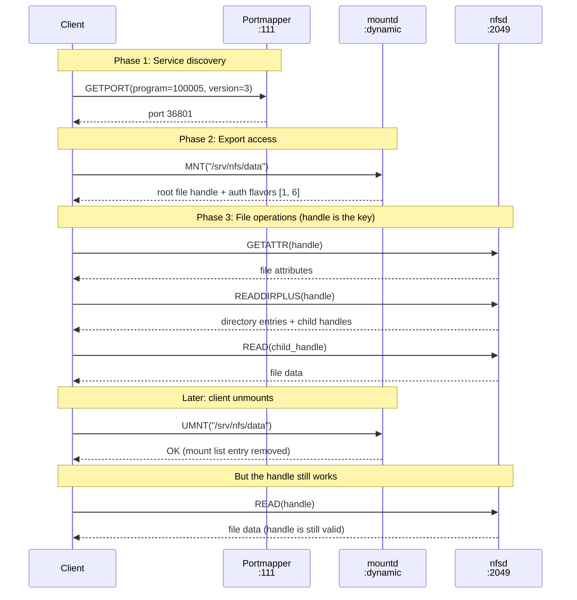

# MOUNT Protocol

The MOUNT protocol converts an export path into a file handle. It is the gateway to NFS. Before a client can read a file, list a directory, or do anything over NFSv2 or NFSv3, it must first call the MOUNT daemon to obtain a root file handle for the target export. That handle is the key to everything that follows.

MOUNT is a separate RPC program (100005) from NFS (100003). It runs as its own daemon (`rpc.mountd`) on a dynamic port, registered with portmapper. This separation exists because MOUNT was designed to handle the authentication and authorization question ("is this client allowed to access this export?") while NFS was designed to handle file operations without re-asking that question on every call. The result is a one-time gate: MOUNT checks your credentials once, hands you a handle, and NFS trusts whoever holds the handle from that point forward.

## Why MOUNT is separate from NFS

RFC 1094 Appendix A.1 explains the rationale:

> The mount protocol is kept separate from the NFS protocol to make it easy to plug in new access checking and validation methods without changing the NFS server protocol.

The intent was modularity. MOUNT would evolve its access control independently, without touching NFS wire formats. In practice, this separation created a security gap that has never been closed: MOUNT authorizes export access at mount time, but NFS never re-checks that authorization. The two protocols share a file handle and nothing else. There is no callback, no session token, no lease that ties them together.

This architectural split means:

- **MOUNT is stateful** (it tracks which clients are mounted) but its state is advisory and unenforceable
- **NFS is stateless** (in v2/v3) and treats every request independently, using only the file handle and AUTH_SYS credentials
- **Revoking access requires restarting nfsd**, because there is no mechanism to invalidate handles already issued

!!! warning "NFSv4 eliminates MOUNT"
    NFSv4 (RFC 7530) merges MOUNT's functionality into the NFS protocol itself, using PUTROOTFH to obtain root handles and SECINFO for per-path security negotiation. But any server that also exposes v2 or v3 still runs a MOUNT daemon, and the handles it issues work across all versions.

## The MOUNT-to-NFS flow

A typical NFSv3 session requires three protocols cooperating. The client queries portmapper for the MOUNT daemon's port, calls MOUNT to get a root handle, then uses that handle for all NFS operations:



The final exchange is the critical security observation. After UMNT, the client is "unmounted" according to MOUNT's bookkeeping, but the NFS daemon has no knowledge of this. The handle continues to work indefinitely.

## MOUNT v3 procedures

MOUNT v3 (RFC 1813 Appendix I) defines six procedures on RPC program 100005, version 3:

| # | Procedure | Input | Output | Auth required |
|---|-----------|-------|--------|---------------|
| 0 | `NULL` | void | void | None |
| 1 | `MNT` | dirpath | fhandle3 + auth_flavors | AUTH_UNIX or better |
| 2 | `DUMP` | void | mountlist | None |
| 3 | `UMNT` | dirpath | void | AUTH_UNIX or better |
| 4 | `UMNTALL` | void | void | AUTH_UNIX or better |
| 5 | `EXPORT` | void | exports | None |

### Procedure 0: NULL -- Do nothing

Standard RPC liveness check. Takes no arguments, returns nothing. Useful for confirming the MOUNT daemon is responding without triggering any access control. The spec states that NULL "should never require any authentication" (RFC 1813 Appendix I, Section 5.2.0), though implementations may diverge.

### Procedure 1: MNT -- Get root handle

MNT is the central procedure. It takes an export path (e.g., `/srv/nfs/data`) and returns the root file handle for that directory plus a list of authentication flavors the export accepts.

```text
Input:  dirpath  -- the export path (string, max 1024 bytes)

Output: mountres3 -- discriminated union:
          MNT3_OK:
            fhandle3      -- variable-length handle (up to 64 bytes)
            auth_flavors  -- array of integers (1=AUTH_SYS, 6=RPCSEC_GSS, etc.)
          Error:
            mountstat3    -- error code (PERM, NOENT, ACCES, etc.)
```

The auth_flavors list is a security indicator. nfswolf's analyzer uses it to detect:

- **AUTH_SYS (1) only** -- the export has no cryptographic protection ([F-1.1](../../security/identity/F-1.1-uid-gid-spoofing.md))
- **AUTH_SYS alongside RPCSEC_GSS** -- Kerberos is available but optional, enabling flavor downgrade ([F-1.7](../../security/identity/F-1.7-rpcsec-gss-flavor-downgrade.md))
- **RPCSEC_GSS only** -- the export requires Kerberos; AUTH_SYS attempts will get AUTH_TOOWEAK ([F-1.8](../../security/identity/F-1.8-auth-tooweak-kerberos-enforced.md))
- **AUTH_DH (3)** -- the export accepts the cryptographically broken DES-based authentication ([F-3.7](../../security/network/F-3.7-auth-dh-obsolete.md))
- **AUTH_NONE (0)** -- the export accepts completely unauthenticated requests ([F-5.8](../../security/info-disclosure/F-5.8-auth-none-metadata-leak.md))

!!! danger "MNT returns a bearer token"
    The file handle returned by MNT is a bearer token (RFC 2623 Section 2.6). Once issued, it works for any client, with any credentials, from any IP address, indefinitely. The server never checks whether the presenter was the original recipient. If the export ACL is changed to remove the client's IP after MNT succeeds, the handle remains valid until the server restarts or the underlying inode is deleted. This is finding [F-2.1](../../security/access-control/F-2.1-export-escape.md).

### Procedure 2: DUMP -- List active mounts

DUMP returns all currently mounted clients with their export paths. Each entry contains a hostname (or IP) and the directory path they mounted.

```text
Output: mountlist -- linked list of:
          ml_hostname   -- client name (string, max 255 bytes)
          ml_directory  -- mounted export path (string, max 1024 bytes)
```

RFC 1094 Appendix A describes the mount list as "intended for advisory use only." No authentication is required to call DUMP.

!!! warning "Information leak"
    DUMP reveals which machines are actively using NFS: hostnames, IP addresses, and the specific exports they have mounted. This identifies potential targets for credential theft or lateral movement. A client mounting `/home` is a higher-value target than one mounting `/usr/share/docs`. nfswolf retrieves DUMP output from both MOUNT v3 and v1 via `dump_clients` and `dump_clients_v1` in `src/proto/mount.rs`.

### Procedure 3: UMNT -- Remove mount entry

UMNT removes a single entry from the server's mount list for the calling client.

```text
Input:  dirpath -- the previously mounted export path
```

UMNT modifies only MOUNT's internal bookkeeping. It does **not** invalidate the file handle. It does **not** notify the NFS daemon. It does **not** revoke access. The handle obtained from MNT continues to work after UMNT completes. RFC 1094 Appendix A.1 is explicit: "The mount list information is not critical for the correct functioning of either the client or the server." See finding [F-2.5](../../security/access-control/F-2.5-stale-handle-persistence.md).

### Procedure 4: UMNTALL -- Remove all mount entries

UMNTALL removes all mount list entries for the calling client in one call, across all exports. Designed for client crash recovery: the client broadcasts UMNTALL to all known servers on startup to clean up stale mount entries.

Like UMNT, this is purely cosmetic. No handles are invalidated.

### Procedure 5: EXPORT -- List all exports

EXPORT returns every exported filesystem on the server along with the hosts or networks allowed to mount each one.

```text
Output: exports -- linked list of:
          ex_dir     -- export path (string)
          ex_groups  -- linked list of allowed host/network names
```

No authentication is required. Any host that can reach the MOUNT daemon gets the complete export topology. This is the primary reconnaissance procedure for NFS attacks ([F-5.1](../../security/info-disclosure/F-5.1-export-list-enumeration.md)).

=== "What EXPORT reveals"

    - Every exported path (e.g., `/`, `/home`, `/srv/nfs/data`)
    - The allowed hosts or networks for each export (e.g., `*.example.com`, `10.0.0.0/24`, `*`)
    - Wildcard exports accessible from any IP ([F-7.1](../../security/config/F-7.1-wildcard-export-policy.md))
    - Subdirectory exports on the same filesystem, vulnerable to lateral access ([F-2.8](../../security/access-control/F-2.8-sibling-export-lateral-access.md))
    - The overall NFS topology of the target

=== "What EXPORT does not reveal"

    - Export options (`ro`, `root_squash`, `no_subtree_check`, `sec=`)
    - Whether the export is on a separate filesystem or a bind mount
    - The filesystem type (ext4, XFS, BTRFS, etc.)

## MOUNT v1 vs v3 differences

MOUNT v1 (RFC 1094 Appendix A) was designed alongside NFSv2. MOUNT v3 (RFC 1813 Appendix I) was introduced with NFSv3. The wire format differences have direct security implications:

| Feature | MOUNT v1 | MOUNT v3 |
|---------|----------|----------|
| Handle format | Fixed 32 bytes (`fhandle`) | Variable, up to 64 bytes (`fhandle3`) |
| Handle return type | `fhstatus` (handle or error) | `mountres3` (handle + auth_flavors, or error) |
| Auth flavor list | Not returned | Returned with every MNT |
| Error codes | UNIX errno values | Dedicated `mountstat3` enum |
| EXPORT wire format | Identical | Identical |
| DUMP wire format | Identical | Identical |
| RPC program / port | 100005 / dynamic | 100005 / dynamic |
| Paired NFS version | NFSv2 | NFSv3 |

### Why the differences matter for attacks

**Handle size constrains escape.** MOUNT v1's 32-byte handles fit fewer fsid bytes, so the kernel uses compact fsid_types (0, 3, 4) instead of the full-UUID types (6, 7). Escape handles must also fit in 32 bytes, limiting which fileid_types are usable. See [File Handles](../file-handles.md) for the complete layout.

**No auth flavor list enables blind downgrade.** MOUNT v1 MNT returns only a handle and a status code, with no indication of what authentication the export requires. A client that mounts via v1 has no way to discover that the export expects Kerberos. On Linux knfsd, MOUNT v1 issues the handle even on `sec=krb5` exports; subsequent NFSv2 operations fail with AUTH_TOOWEAK, but the handle has already been leaked ([F-1.6](../../security/identity/F-1.6-nfsv2-downgrade.md)).

**Error code granularity.** MOUNT v1 returns raw UNIX errno values (e.g., 13 for EACCES). MOUNT v3 defines a dedicated `mountstat3` enum with NFS-specific error codes (MNT3ERR_ACCES, MNT3ERR_NOTSUPP, MNT3ERR_SERVERFAULT). The v3 errors are more precise for automated tooling.

!!! tip "nfswolf's escape pipeline uses both versions"
    The escape pipeline gathers seed handles from MOUNT v3, MOUNT v1, and NFSv4 LOOKUP. The v1 path is especially valuable against krb5-protected exports where v1 leaks the handle without enforcing the auth flavor requirement.

## Security implications

### The MOUNT-NFS disconnect

The fundamental weakness of the MOUNT protocol is that it authorizes export access exactly once, and then NFS operates without any reference to that authorization. There is no session, no lease, no token; just an opaque byte sequence that the NFS daemon trusts at face value.

This disconnect manifests in several concrete ways:

1. **MOUNT checks the client's IP against the export ACL.** NFS never checks it again. If the ACL changes after MNT, the handle remains valid.
2. **MOUNT records the mount in its list.** NFS has no access to this list and never queries it.
3. **UMNT removes the list entry.** NFS is not notified and the handle keeps working.
4. **MOUNT can require AUTH_UNIX or better.** NFS enforces AUTH_SYS on a per-call basis but does not verify that a valid MOUNT preceded the NFS call.

??? danger "Concrete attack: access after ACL removal"
    1. Attacker mounts `/srv/nfs/data` from 10.0.0.50 via MOUNT MNT. Gets handle `0x010007...`.
    2. Administrator removes 10.0.0.50 from the export ACL and runs `exportfs -r` to reload.
    3. New MOUNT MNT attempts from 10.0.0.50 are denied (MNT3ERR_ACCES).
    4. Attacker continues using the existing handle for NFS READ/WRITE operations. The NFS daemon accepts every request because it has no concept of export ACL changes.
    5. The handle remains valid until the server is fully restarted or the underlying filesystem is unmounted.

### Export ACLs are IP-based

MOUNT's access control for MNT is based on the client's source IP address, matched against the export's allowed-hosts list. This has two weaknesses:

- **IP spoofing.** On L2-adjacent networks, source IP can be spoofed. MOUNT's UDP listener is particularly vulnerable because UDP has no handshake. TCP-based spoofing is harder but not impossible in certain network positions.
- **IP is not identity.** On shared infrastructure, multiple users or containers share an IP. The export ACL cannot distinguish between them. Any process on an allowed IP can mount any export that IP is authorized for.

The export ACL is enforced only at MNT time. The handle returned by MNT carries no record of which IP obtained it and works from any address.

### MOUNT leaks the full export topology

Both EXPORT and DUMP require no authentication. Any client that can reach the MOUNT daemon's port gets:

- **From EXPORT:** every exported path and its allowed networks (the complete NFS topology)
- **From DUMP:** every currently connected client hostname and the export they mounted

This is the primary reconnaissance step in an NFS attack. The export list identifies wildcard exports, root-exported filesystems, subdirectory exports on shared partitions, and the general security posture of the server. The DUMP list identifies active NFS clients worth targeting for credential theft or impersonation.

### Auth flavor enumeration reveals security posture

MOUNT v3 MNT returns the list of authentication flavors each export accepts. This is not sensitive by itself, but it tells the attacker exactly what security mechanisms are in play before a single NFS call is made.

| Flavor list | What it means |
|-------------|---------------|
| `[1]` (AUTH_SYS only) | No cryptographic protection. Full UID/GID spoofing possible. |
| `[1, 6]` (AUTH_SYS + RPCSEC_GSS) | Kerberos available but optional. Downgrade to AUTH_SYS trivial. |
| `[6]` (RPCSEC_GSS only) | Kerberos enforced. AUTH_SYS rejected with AUTH_TOOWEAK. |
| `[1, 3]` (AUTH_SYS + AUTH_DH) | DES-based auth available. Cryptographically broken. |
| `[0, 1]` (AUTH_NONE + AUTH_SYS) | Accepts completely unauthenticated requests. |

### UMNT does not revoke access

RFC 1094 Appendix A.1 is unambiguous:

> The mount list information is not critical for the correct functioning of either the client or the server. It is intended for advisory use only.

UMNT and UMNTALL modify this advisory list and nothing else. An administrator who removes a client from the mount list (via `umount` on the client, `exportfs -u` on the server, or UMNT/UMNTALL calls) has not revoked that client's access. The file handle continues to work until the NFS server process is restarted or the underlying filesystem is unmounted. This is a common operational misconception and a reliable attack persistence mechanism ([F-2.5](../../security/access-control/F-2.5-stale-handle-persistence.md)).

## nfswolf implementation

The `nfs-mount` crate implements MOUNT v1 and v3 as standalone protocol clients, separated from nfswolf's policy layer.

| Component | What it does |
|-----------|-------------|
| `crates/nfs-mount/src/` | Wire types and `MountClient` (v3) / `MountV1Client` (v1): NULL, MNT, UMNT, DUMP, UMNTALL, EXPORT |
| `src/proto/mount.rs` | `NfsMountClient`: policy layer wrapping `nfs-mount`, with `dump_clients`, `dump_clients_v1`, `unmount_v1`, auth-flavor extraction |
| `src/cli/escape.rs` | Escape pipeline Phase 1 gathers seed handles from MOUNT v3 MNT, MOUNT v1 MNT, and NFSv4 LOOKUP |
| `src/engine/scanner.rs` | Scanner calls MOUNT EXPORT and DUMP during Phase 3 (data collection) |
| `src/engine/analyzer.rs` | Analyzer checks auth flavors returned by MNT for security findings |

```rust
use nfs_mount::MountV1Client;

// MOUNT v1: get a 32-byte NFSv2 handle
let mut mount = MountV1Client::new(transport);
let fhstatus = mount.mnt("/export").await?;

// MOUNT v3: get a variable handle + auth flavors
use nfs_v3::MountClient;
let mount = MountClient::new(transport);
let res = mount.mnt(dirpath(Opaque::borrowed(b"/export"))).await?;
// res.fhandle  -> root handle (up to 64 bytes)
// res.auth_flavors -> vec of accepted auth mechanisms
```

For the complete list of MOUNT-related security findings, see [MOUNT Findings](../../security/by-protocol/mount.md).
