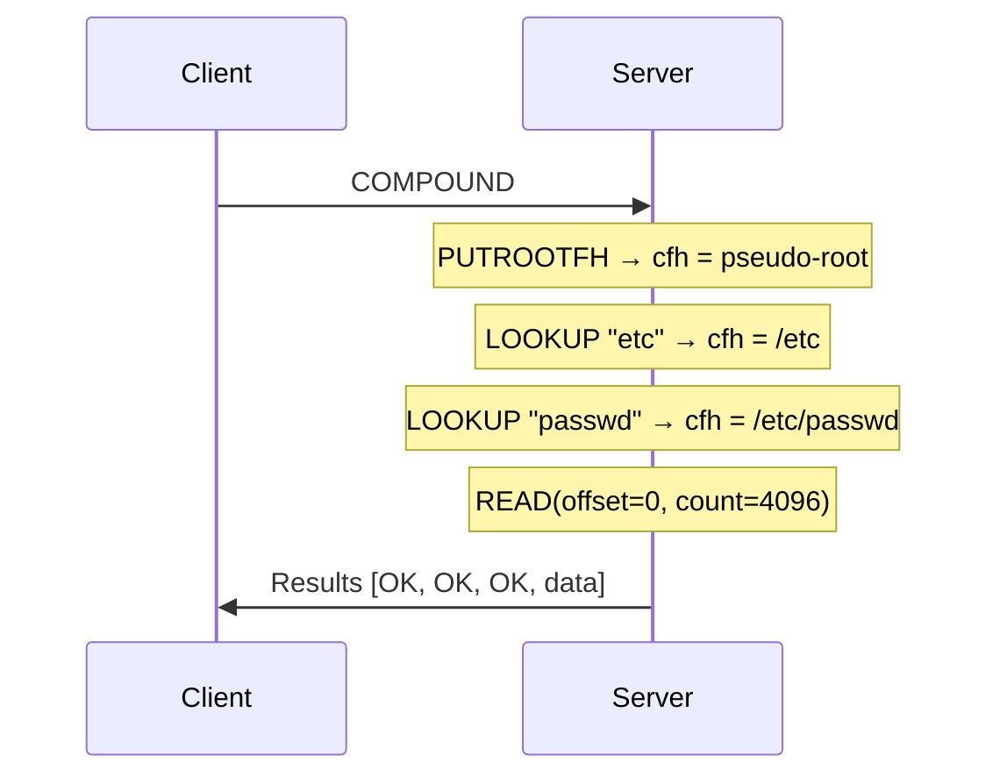

# COMPOUND Operations

NFSv4 collapses 22 separate RPC procedures into a single COMPOUND mechanism. The server has exactly two RPC procedures: NULL (proc 0) for probing, and COMPOUND (proc 1) for everything else. All file operations are expressed as **operations** batched inside COMPOUND (RFC 7530 sec. 14.1).

## How COMPOUND works

A COMPOUND request contains an ordered array of operations. The server evaluates them sequentially, passing context between operations via a **current filehandle** and a **saved filehandle**. If any operation fails, evaluation stops and the results of all operations evaluated so far are returned.

```text
COMPOUND4args {
    tag: utf8str_cs,       -- client-assigned label (opaque to server)
    minorversion: uint32,  -- 0 for NFSv4.0
    argarray: nfs_argop4[] -- ordered list of operations
}

COMPOUND4res {
    status: nfs4_status,   -- status of last evaluated operation
    tag: utf8str_cs,       -- echoed from request
    resarray: nfs_resop4[] -- results for each evaluated operation
}
```

The `resarray` in the response contains one result per evaluated operation. If the fifth operation fails, `resarray` has five entries: four successes and one failure. Operations after the failure are not evaluated and do not appear in the response.

## Current and saved filehandles

COMPOUND maintains two filehandle slots that operations read from and write to:

- **Current filehandle (cfh)**: the implicit target for most operations. LOOKUP, GETATTR, READ, WRITE, READDIR, and others all operate on the current filehandle.
- **Saved filehandle (sfh)**: temporary storage for operations that need two handles, like RENAME (source directory in saved, target directory in current) and LINK.



### Filehandle operations

| Operation | Effect on cfh | Effect on sfh |
|-----------|---------------|---------------|
| PUTFH(fh) | Set to `fh` | Unchanged |
| PUTROOTFH | Set to pseudo-root | Unchanged |
| PUTPUBFH | Set to public (WebNFS) handle | Unchanged |
| GETFH | Unchanged (returns cfh value) | Unchanged |
| LOOKUP(name) | Set to child entry | Unchanged |
| LOOKUPP | Set to parent directory | Unchanged |
| SAVEFH | Unchanged | Set to cfh |
| RESTOREFH | Set to sfh | Unchanged |

### Example: RENAME operation

RENAME needs both a source and target directory handle. The saved filehandle provides the second operand:

```
COMPOUND([
    PUTFH(src_dir_fh),      -- cfh = source directory
    SAVEFH,                 -- sfh = source directory
    PUTFH(dst_dir_fh),      -- cfh = target directory
    RENAME("old.txt", "new.txt")  -- rename from sfh to cfh
])
```

## Error handling

COMPOUND evaluation follows a strict sequential model (RFC 7530 sec. 14.2):

1. Operations are evaluated left to right, in order
2. The first operation that returns a non-OK status stops evaluation
3. The response contains results for all evaluated operations, including the failed one
4. Subsequent operations are not evaluated and produce no results

!!! warning "No transactions"
    COMPOUND is not a transaction. Operations that succeed before a failure are not rolled back. If a COMPOUND contains `[PUTFH, REMOVE("a"), REMOVE("b")]` and the second REMOVE succeeds but the third fails, file "a" is still deleted.

This sequential-with-early-exit model allows an attacker to probe paths by observing which operation in a chain fails. For example:

```
COMPOUND([PUTROOTFH, LOOKUP("srv"), LOOKUP("nfs"), LOOKUP("secret"), GETFH])
```

If the response contains three OKs and a failure on the fourth LOOKUP, the attacker knows `/srv/nfs` exists but `secret` does not (or is not accessible). The position of the failure reveals how deep the valid path extends.

## All 37 operations

NFSv4.0 defines operations numbered 3 through 39, plus ILLEGAL (10044) as an error sentinel. Operations 0-2 are reserved. Every operation below is fully typed with argument encoding and response decoding in the `nfs-v4` crate.

### File access

| Op | Name | Description |
|----|------|-------------|
| 3 | ACCESS | Check access rights against current credentials (RFC 7530 sec. 16.1) |
| 9 | GETATTR | Get file attributes via bitmap request (RFC 7530 sec. 16.7) |
| 25 | READ | Read file data using stateid (RFC 7530 sec. 16.23) |
| 38 | WRITE | Write file data using stateid (RFC 7530 sec. 16.36) |
| 5 | COMMIT | Flush async writes to stable storage (RFC 7530 sec. 16.3) |

### Namespace navigation

| Op | Name | Description |
|----|------|-------------|
| 15 | LOOKUP | Resolve one path component, sets cfh to result (RFC 7530 sec. 16.13) |
| 16 | LOOKUPP | Look up parent directory, sets cfh (RFC 7530 sec. 16.14) |
| 26 | READDIR | List directory entries with inline attributes (RFC 7530 sec. 16.24) |
| 27 | READLINK | Read symbolic link target (RFC 7530 sec. 16.25) |

### Filehandle management

| Op | Name | Description |
|----|------|-------------|
| 10 | GETFH | Return current filehandle value (RFC 7530 sec. 16.8) |
| 22 | PUTFH | Set cfh to a known handle (RFC 7530 sec. 16.20) |
| 23 | PUTPUBFH | Set cfh to public (WebNFS) handle (RFC 7530 sec. 16.21) |
| 24 | PUTROOTFH | Set cfh to pseudo-root (RFC 7530 sec. 16.22) |
| 31 | RESTOREFH | Copy saved slot to cfh (RFC 7530 sec. 16.29) |
| 32 | SAVEFH | Copy cfh to saved slot (RFC 7530 sec. 16.30) |

### File and directory modification

| Op | Name | Description |
|----|------|-------------|
| 6 | CREATE | Create non-regular file (directory, symlink, device) (RFC 7530 sec. 16.4) |
| 11 | LINK | Create hard link (RFC 7530 sec. 16.9) |
| 28 | REMOVE | Remove file or directory (RFC 7530 sec. 16.26) |
| 29 | RENAME | Rename entry (uses saved FH as source dir) (RFC 7530 sec. 16.27) |
| 34 | SETATTR | Modify file attributes (RFC 7530 sec. 16.32) |

### Stateful operations

| Op | Name | Description |
|----|------|-------------|
| 18 | OPEN | Open regular file, returns stateid (RFC 7530 sec. 16.16) |
| 20 | OPEN_CONFIRM | Confirm open (used during session setup) (RFC 7530 sec. 16.18) |
| 21 | OPEN_DOWNGRADE | Reduce open mode without closing (RFC 7530 sec. 16.19) |
| 4 | CLOSE | Release open state (RFC 7530 sec. 16.2) |
| 12 | LOCK | Create byte-range lock (RFC 7530 sec. 16.10) |
| 13 | LOCKT | Test for conflicting lock (RFC 7530 sec. 16.11) |
| 14 | LOCKU | Release byte-range lock (RFC 7530 sec. 16.12) |
| 39 | RELEASE_LOCKOWNER | Release lock-owner state (RFC 7530 sec. 16.37) |

### Client and lease management

| Op | Name | Description |
|----|------|-------------|
| 35 | SETCLIENTID | Negotiate client identity with server (RFC 7530 sec. 16.33) |
| 36 | SETCLIENTID_CONFIRM | Confirm client identity (RFC 7530 sec. 16.34) |
| 30 | RENEW | Renew client lease (RFC 7530 sec. 16.28) |

### Delegation

| Op | Name | Description |
|----|------|-------------|
| 7 | DELEGPURGE | Purge delegations awaiting recovery (RFC 7530 sec. 16.5) |
| 8 | DELEGRETURN | Return a delegation to the server (RFC 7530 sec. 16.6) |

### Conditional and security

| Op | Name | Description |
|----|------|-------------|
| 17 | NVERIFY | Proceed only if attributes differ from supplied values (RFC 7530 sec. 16.15) |
| 37 | VERIFY | Proceed only if attributes match supplied values (RFC 7530 sec. 16.35) |
| 33 | SECINFO | Query security flavors for a path (RFC 7530 sec. 16.31) |
| 19 | OPENATTR | Access named attribute directory (RFC 7530 sec. 16.17) |

### Error sentinel

| Op | Name | Description |
|----|------|-------------|
| 10044 | ILLEGAL | Server returns this for unrecognized operation numbers (RFC 7530 sec. 16.38) |

## Common COMPOUND patterns

These are the COMPOUND sequences nfswolf uses most frequently:

=== "Get root handle"

    ```
    COMPOUND([PUTROOTFH, GETFH])
    → pseudo-root file handle
    ```

=== "Navigate to file"

    ```
    COMPOUND([PUTROOTFH, LOOKUP("srv"), LOOKUP("nfs"), LOOKUP("public"), GETFH])
    → handle for /srv/nfs/public
    ```

=== "Read file contents"

    ```
    COMPOUND([PUTFH(file_fh), READ(offset=0, count=65536)])
    → file data (using anonymous stateid for world-readable files)
    ```

=== "Probe security"

    ```
    COMPOUND([PUTROOTFH, SECINFO("export_name")])
    → list of supported auth flavors for the export
    ```

=== "Discover sibling exports"

    ```
    COMPOUND([PUTFH(export_fh), LOOKUPP, GETFH])
    → parent directory handle above the export root

    COMPOUND([PUTFH(parent_fh), READDIR])
    → sibling export names
    ```

## Status codes

Every operation returns an `nfs4_status` value. The `nfs-v4` crate encodes 66 named status codes in `Nfs4Status`, with classification predicates for common patterns:

| Predicate | Matches | Use |
|-----------|---------|-----|
| `is_permission_denied()` | `NFS4ERR_ACCESS`, `NFS4ERR_PERM`, `NFS4ERR_WRONGSEC` | Credential escalation decisions |
| `is_stale()` | `NFS4ERR_STALE` | Handle invalidation |
| `is_not_found()` | `NFS4ERR_NOENT` | Path probing |

Unknown status values are captured by `Nfs4Status::Unknown(u32)` to handle server extensions gracefully.
