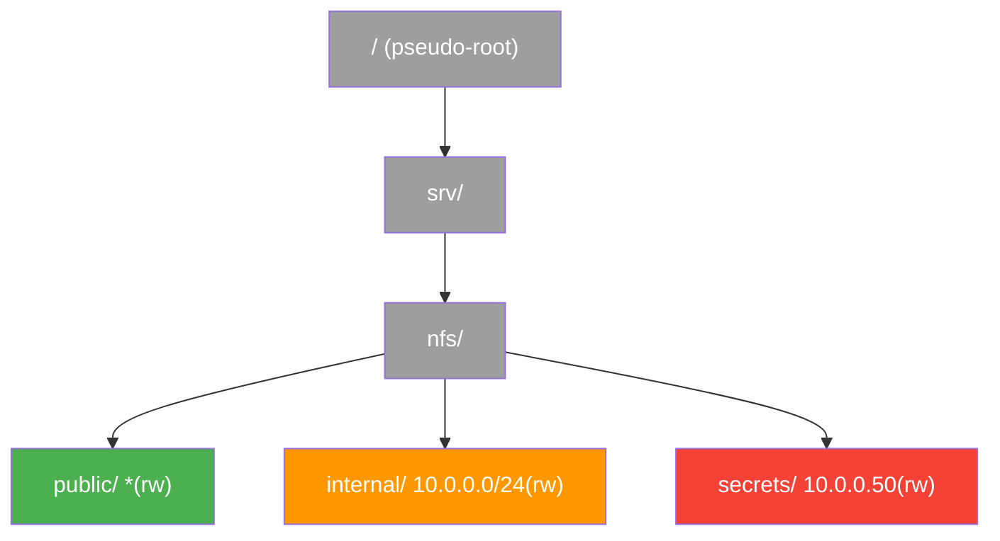

# Pseudo-Filesystem

NFSv4 replaces the MOUNT EXPORT mechanism with a **pseudo-filesystem**: a server-constructed virtual namespace that bridges all exports into a single tree rooted at a well-known handle (RFC 7530 sec. 7.3). Clients navigate from the pseudo-root into any export using standard LOOKUP operations, with no separate discovery protocol.

## How the pseudo-FS works

On v3, exports were isolated islands. Each had to be discovered via MOUNT EXPORT and individually mounted via MOUNT MNT. There was no structural relationship between exports; the server presented them as independent paths.

NFSv4 changes this by constructing a synthetic directory tree that connects all exports. The server creates intermediate directories (pseudo-FS entries) to bridge any gaps in the pathname hierarchy between exports.

### Example

Given these server exports:

```
/srv/nfs/public     *(rw,no_root_squash)
/srv/nfs/internal   10.0.0.0/24(rw)
/data/backups       10.0.0.50(rw)
```

The server constructs this pseudo-FS tree:

```
/ (pseudo-root)
├── srv/                 ← pseudo-FS directory
│   └── nfs/             ← pseudo-FS directory
│       ├── public/      ← junction → real filesystem
│       └── internal/    ← junction → real filesystem
└── data/                ← pseudo-FS directory
    └── backups/         ← junction → real filesystem
```

The directories `/`, `/srv`, `/srv/nfs`, and `/data` are synthetic pseudo-FS entries. They exist only to provide a traversable path from the pseudo-root to each export. The actual exports (`public`, `internal`, `backups`) are junction points where the pseudo-FS crosses into real exported filesystems.

## Accessing the pseudo-root

The PUTROOTFH operation (op 24, RFC 7530 sec. 16.22) sets the current filehandle to the pseudo-root. No authentication check, no export path, no prior state required. Every v4 server must support it.

```
COMPOUND([PUTROOTFH, GETFH])
→ pseudo-root file handle
```

This is the v4 equivalent of MOUNT MNT, except there is no access control at this stage. The handle points to the virtual namespace root, not to any real filesystem.

### Identifying the pseudo-root

Linux knfsd uses a well-known fsid for the pseudo-root: `39c6b5c1-3f24-4f4e-977c-7fe6546b8a25`. nfswolf detects the pseudo-root by checking the fsid from GETATTR against this UUID. When the fsid matches, the current directory is the pseudo-root, not a real export.

Other NFS server implementations use different pseudo-root identifiers, but the general principle is the same: the pseudo-root has a unique fsid that differs from all real filesystems.

## Browsing exports

From the pseudo-root, READDIR lists the top-level directories, and successive LOOKUPs navigate down to export junction points:

```
COMPOUND([PUTROOTFH, READDIR])
→ ["srv", "data"]  (top-level pseudo-FS entries)

COMPOUND([PUTROOTFH, LOOKUP("srv"), LOOKUP("nfs"), READDIR])
→ ["public", "internal"]  (exports under /srv/nfs)
```

This replaces the MOUNT EXPORT procedure entirely. On v3, the client had to call MOUNT EXPORT to get a list of paths, then MOUNT MNT for each one. On v4, one READDIR chain discovers everything.

!!! warning "Pseudo-FS leaks export names (F-5.5)"
    The pseudo-FS exposes the names and directory structure of all exports to any client that can reach port 2049, even if the client lacks access to the exports themselves. The server returns directory entries for the pseudo-FS tree without checking whether the client is authorized to access the underlying exports. This is finding F-5.5.

## Export boundaries and fsid

The client detects export boundaries by monitoring the `fsid` attribute during LOOKUP traversal (RFC 7530 sec. 7.7). When the fsid returned by GETATTR changes between a parent directory and a child entry, the client has crossed from the pseudo-FS (or one export) into a different export.

```
COMPOUND([PUTROOTFH, GETATTR(fsid)])
→ fsid = A  (pseudo-FS)

COMPOUND([PUTROOTFH, LOOKUP("srv"), LOOKUP("nfs"), LOOKUP("public"), GETATTR(fsid)])
→ fsid = B  (real filesystem -- different from A)
```

The fsid change from A to B indicates that `/srv/nfs/public` is a mount point crossing into a real filesystem. The `mounted_on_fileid` attribute provides the fileid of the junction directory in the parent filesystem, allowing the client to distinguish the junction entry from the real filesystem root.

### Multiple pseudo-FS segments

When exports are separated by non-exported directories, the server may create multiple pseudo-FS segments, each with a unique fsid (RFC 7530 sec. 7.3):

```
/a         pseudo-FS  (fsid = P1)
/a/b       real FS    (fsid = R1)
/a/b/c     pseudo-FS  (fsid = P2)  -- gap between exports
/a/b/c/d   real FS    (fsid = R2)
```

Each pseudo-FS segment is a separate entity. The path `/a/b/c` is a pseudo-FS bridge that exists only because `/a/b/c/d` is exported and `/a/b/c` itself is not. The fsid changes at each boundary.

## LOOKUPP traversal

LOOKUPP (op 16, RFC 7530 sec. 16.14) resolves the parent directory of the current filehandle. Unlike NFSv3's LOOKUP(".."), which depends on server interpretation, LOOKUPP is a protocol-defined operation with guaranteed semantics.

### Upward traversal from export to pseudo-root

LOOKUPP can traverse upward from an export's root directory into the pseudo-FS:

```
COMPOUND([PUTFH(export_root_fh), LOOKUPP, GETFH])
→ parent directory handle in the pseudo-FS

COMPOUND([PUTFH(parent_fh), LOOKUPP, GETFH])
→ grandparent handle (climbing toward pseudo-root)
```

This traversal continues until reaching the pseudo-root, where LOOKUPP returns `NFS4ERR_NOENT` (no parent above the root).

### Cross-export lateral movement (F-2.12)

LOOKUPP enables a critical attack path: a client with access to any one export can traverse up to the pseudo-root junction, then LOOKUP down into sibling exports, even those with different IP-based access restrictions.



An attacker with access to `public` (open to everyone) can:

1. LOOKUPP from `public` to reach `/srv/nfs` in the pseudo-FS
2. LOOKUP from `/srv/nfs` to `internal` or `secrets`
3. Access files in the restricted exports

The server does not enforce per-export access controls on LOOKUPP/LOOKUP traversal through the pseudo-FS tree. This is fundamentally different from F-2.8 (sibling export lateral access via handle reuse) because no handle construction or filesystem escape is required; the client uses standard NFSv4 directory operations.

nfswolf's `exports` shell command uses this technique to discover sibling exports from any v4 session.

## Filehandle volatility

Pseudo-FS entries may have volatile filehandles (RFC 7530 sec. 7.5). Unlike real filesystem handles, which are typically persistent (surviving server restarts), pseudo-FS handles are dynamically generated and may change when the server restarts or its export configuration changes.

The `fh_expire_type` attribute indicates whether a handle is persistent or volatile. When a volatile handle expires, the server returns `NFS4ERR_FHEXPIRED`, and the client must re-resolve the path using LOOKUP from a known handle.

!!! info "Volatile handles and brute-forcing"
    The potential for volatile pseudo-FS handles is one reason handle brute-forcing is less effective on NFSv4. A handle that was valid during one probing session may become invalid on the next server restart, and the server's error response may not provide the clean STALE/BADHANDLE oracle that makes v3 brute-forcing efficient.

## nfswolf implementation

nfswolf interacts with the pseudo-FS in several contexts:

| Component | How it uses the pseudo-FS |
|-----------|--------------------------|
| Scanner (`probe_nfs4()`) | `COMPOUND([PUTROOTFH])` to detect v4 support |
| Scanner (data collection) | READDIR on pseudo-root to enumerate exports |
| Shell (`V4Ops`) | PUTROOTFH + LOOKUP chain for path resolution |
| Shell (`exports` command) | LOOKUPP traversal for sibling export discovery (F-2.12) |
| Escape engine (`Nfs4EscapeProbe`) | PUTROOTFH + LOOKUP to acquire seed handles |
| Analyzer | SECINFO per export path for auth flavor probing |
| Pseudo-root detection | fsid check against `39c6b5c1-3f24-4f4e-977c-7fe6546b8a25` |
