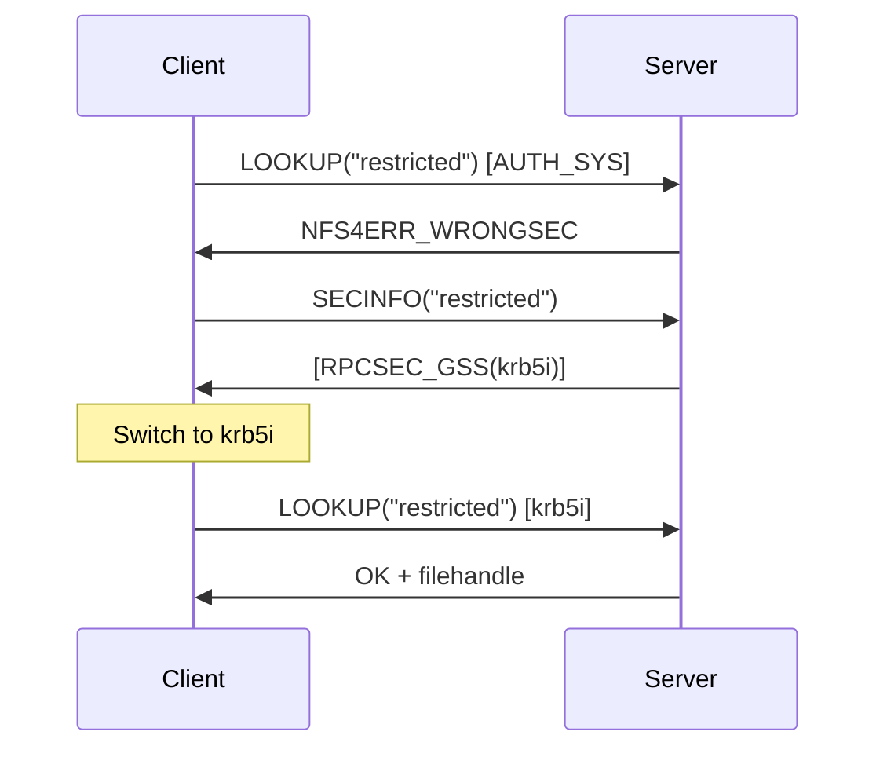

# Security Negotiation

NFSv4 introduces in-band security negotiation through the SECINFO operation (op 33, RFC 7530 sec. 3.3). Unlike NFSv3, where supported authentication flavors were disclosed once at MOUNT time and applied globally to the export, NFSv4 allows the server to enforce different security policies per directory within the namespace. Clients can query the required security mechanisms for any path without triggering access denials.

## SECINFO operation

SECINFO (op 33, RFC 7530 sec. 16.31) takes a filename component and returns an array of security triples that the server will accept for accessing that path. Each triple specifies either a simple RPC auth flavor or an RPCSEC_GSS mechanism with its OID, QOP, and service level.

```text
SECINFO4resok = secinfo4[]

struct secinfo4 {
    uint32_t flavor;           -- AUTH_NONE(0), AUTH_SYS(1), RPCSEC_GSS(6), etc.
    /* If flavor == RPCSEC_GSS: */
    rpcsec_gss_info {
        sec_oid4 oid;          -- GSS mechanism OID (e.g., Kerberos V5)
        uint32_t qop;          -- quality of protection (0 = default)
        rpc_gss_svc_t service; -- none(1), integrity(2), privacy(3)
    }
}
```

### Query examples

```
COMPOUND([PUTROOTFH, SECINFO("public")])
→ [AUTH_SYS(1)]
   -- accepts AUTH_SYS: credential spoofing works

COMPOUND([PUTROOTFH, LOOKUP("srv"), SECINFO("restricted")])
→ [RPCSEC_GSS(6, oid=1.2.840.113554.1.2.2, svc=integrity)]
   -- requires krb5i: credential spoofing blocked

COMPOUND([PUTROOTFH, LOOKUP("srv"), SECINFO("mixed")])
→ [AUTH_SYS(1), RPCSEC_GSS(6, oid=1.2.840.113554.1.2.2, svc=none)]
   -- accepts both AUTH_SYS and krb5: AUTH_SYS is the weak link
```

!!! note "SECINFO does not require access"
    SECINFO returns the supported flavors for a path without requiring the client to have access to the path itself. The server does not check whether the client's current credentials are authorized -- it simply reports what credentials would be accepted. This is by design (RFC 7530 sec. 3.3.1) and is the basis for nfswolf's security posture probing.

## Kerberos pseudo-flavors

RFC 7530 Section 3.2.1.1 defines three Kerberos V5 pseudo-flavors that map to different RPCSEC_GSS service levels:

| Pseudo-flavor | Value | GSS OID | RPCSEC_GSS Service | Protection |
|---------------|-------|---------|-------------------|------------|
| krb5 | 390003 | 1.2.840.113554.1.2.2 | rpc_gss_svc_none | Authentication only |
| krb5i | 390004 | 1.2.840.113554.1.2.2 | rpc_gss_svc_integrity | Authentication + integrity |
| krb5p | 390005 | 1.2.840.113554.1.2.2 | rpc_gss_svc_privacy | Authentication + integrity + encryption |

These are called "pseudo-flavors" because they are not distinct RPC authentication flavors. They all use RPCSEC_GSS (flavor 6) with the Kerberos V5 GSS mechanism, differing only in the service level. The pseudo-flavor numbers are used in Linux NFS export configuration (`sec=krb5,krb5i,krb5p`) for convenience.

### What each level protects

=== "krb5 (authentication only)"

    The client presents a Kerberos ticket to prove its identity. The server verifies the ticket and maps the Kerberos principal to a local UID. RPC arguments and data are sent in cleartext. An attacker cannot spoof credentials, but can observe all file data on the wire.

=== "krb5i (integrity)"

    Same as krb5, plus every RPC message includes a cryptographic checksum. The server rejects any message whose checksum does not verify. An attacker cannot modify data in transit, but can still observe it.

=== "krb5p (privacy)"

    Same as krb5i, plus all RPC arguments and data are encrypted. An attacker can see that NFS traffic is occurring but cannot read file contents or metadata.

## NFS4ERR_WRONGSEC

When a client attempts an operation using a security flavor that does not match the server's policy for the target path, the server returns `NFS4ERR_WRONGSEC` (RFC 7530 sec. 3.3.2). This error does not indicate an authentication failure; it indicates a policy mismatch.

The expected client behavior on receiving `NFS4ERR_WRONGSEC`:

1. Issue SECINFO for the path to discover accepted flavors
2. Select an appropriate flavor from the response
3. Retry the operation with the selected flavor



## AUTH_TOOWEAK

A related error, `NFS4ERR_AUTH_TOOWEAK`, is returned when the client's authentication is accepted but is not strong enough for the requested operation. This can occur when the server's policy requires a higher security level than the client provided. For example, the client authenticates with krb5 (authentication only) but the export requires krb5i (integrity).

!!! info "AUTH_TOOWEAK as an oracle (F-1.8)"
    The distinction between `NFS4ERR_WRONGSEC` and `NFS4ERR_AUTH_TOOWEAK` reveals information about the server's security configuration. `WRONGSEC` means the flavor is completely rejected; `AUTH_TOOWEAK` means the flavor family is accepted but the service level is insufficient. An attacker can use these different errors to map out the exact security requirements per path.

## The intended model vs reality

### What RFC 7530 intended

RFC 7530 Section 3.2.1 states that RPCSEC_GSS with Kerberos V5 is **mandatory to implement** for both clients and servers. The intended deployment model is:

1. Server announces Kerberos requirements via SECINFO
2. Client negotiates to the strongest mutually-supported mechanism
3. All operations use RPCSEC_GSS with authentication, integrity, or privacy
4. AUTH_SYS is a legacy fallback, not the default

### What most deployments actually do

The spec says Kerberos is mandatory to **implement**, not mandatory to **use**. RFC 7530 Section 3.2 explicitly states that other flavors "MAY be implemented as well." In practice:

| Environment | Typical configuration | AUTH_SYS available? |
|-------------|----------------------|---------------------|
| Linux knfsd (default) | `sec=sys` on all exports | Yes -- spoofable |
| Linux knfsd (hardened) | `sec=krb5` or `sec=krb5p` | No -- requires Kerberos |
| Linux knfsd (mixed) | `sec=krb5:sys` on some exports | Yes -- on exports with `sys` |
| Windows NFS | Kerberos via Active Directory | Depends on AD integration |
| NetApp / EMC | Varies by administrator policy | Often yes on v4, no on hardened |
| FreeBSD | `sec=sys` by default | Yes -- spoofable |

The majority of NFSv4 deployments still accept AUTH_SYS because deploying Kerberos infrastructure (KDC, keytabs, principal management) is operationally expensive and many administrators do not bother. This means the fundamental credential-spoofing attack surface is unchanged from v3.

## How nfswolf uses SECINFO

nfswolf probes SECINFO in several contexts to assess the server's security posture:

### Scanner SECINFO probing

The scanner's v4 data collection phase issues SECINFO for each discovered export path. The response is included in the scan results and passed to the analyzer for security assessment.

```
COMPOUND([PUTROOTFH, SECINFO("export_name")])
→ flavor list per export
```

### Analyzer security checks

The analyzer examines SECINFO responses against several findings:

| Finding | What the analyzer checks |
|---------|------------------------|
| F-1.1 (UID/GID spoofing) | AUTH_SYS (flavor 1) in SECINFO response |
| F-1.7 (RPCSEC_GSS downgrade) | Both AUTH_SYS and RPCSEC_GSS present -- attacker can choose the weaker one |
| F-1.8 (AUTH_TOOWEAK) | Export requires Kerberos, blocks AUTH_SYS |
| F-5.5 (pseudo-FS leakage) | Export names visible via pseudo-FS even without access |

### Shell SECINFO command

The `secinfo` operation is available in the v4 shell for interactive probing:

```
nfs> secinfo /srv/nfs/public
  AUTH_SYS (1) -- credential spoofing possible

nfs> secinfo /srv/nfs/restricted
  RPCSEC_GSS (6) -- Kerberos V5 (krb5i)
```

### Credential escalation decision

When the shell encounters `NFS4ERR_WRONGSEC` or `NFS4ERR_PERM`, it consults the SECINFO response for the current path. If AUTH_SYS is accepted, the credential ladder is walked. If only RPCSEC_GSS is accepted, credential escalation is skipped for that path and the user is informed that Kerberos is enforced.

## Downgrade attacks

When a server accepts both AUTH_SYS and RPCSEC_GSS (the `sec=krb5:sys` configuration on Linux), an attacker can simply choose AUTH_SYS. The server advertises both in the SECINFO response, and the client is free to pick either one. There is no enforcement of "use the strongest available."

This is finding F-1.7: the presence of AUTH_SYS in a SECINFO response alongside RPCSEC_GSS means the stronger mechanism provides no security benefit. The attacker will always choose AUTH_SYS.

!!! danger "Mixed security is no security"
    If any flavor in the SECINFO response is AUTH_SYS, the export is effectively unprotected. It does not matter that krb5p is also available. The attacker will not use it. The only secure configuration is to exclude AUTH_SYS entirely: `sec=krb5` (or `krb5i` or `krb5p`) with no `sys` fallback.

## Cross-version downgrade

When a server supports both NFSv3 and NFSv4, security policies may differ between versions. An export configured with `sec=krb5` on NFSv4 may still be accessible via AUTH_SYS on NFSv3 if the v3 MOUNT configuration does not enforce the same policy.

nfswolf's auto-version detection probes v3 before v4. If v3 is available and accepts AUTH_SYS for an export that requires Kerberos on v4, the tool will use v3 by default, effectively bypassing the v4 security policy. This is the v4-to-v3 downgrade path documented in F-1.6.

The only defense is consistent security policy across all supported NFS versions, or disabling v2/v3 entirely on the server.
