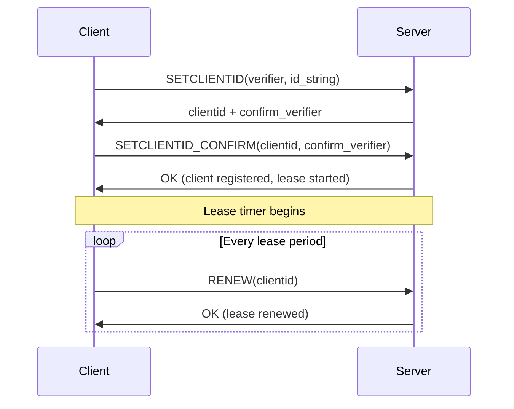
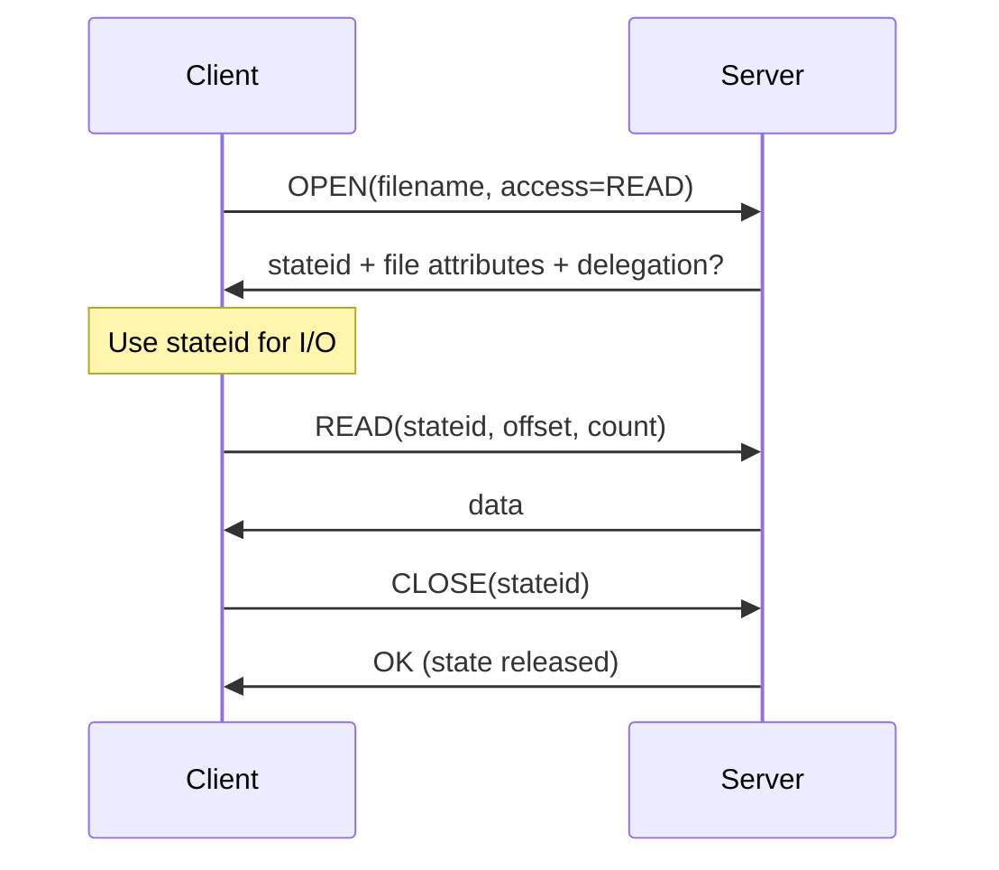

# Stateful Model

NFSv4 replaces the stateless model of v2/v3 with a server-managed state system. The server tracks client identities, open files, and byte-range locks using lease-based state management. Every piece of state is represented by a 128-bit **stateid** token that authorizes specific operations. This is defined in RFC 7530 Section 9.

## Stateless vs stateful

NFSv3 was deliberately stateless. Every READ, WRITE, and LOOKUP was an independent operation. The server maintained no per-client state and could crash and recover without needing to reconstruct anything. File locking was outsourced to the separate Network Lock Manager (NLM) protocol, which had its own (fragile) state recovery mechanisms.

NFSv4 integrates state into the protocol itself:

| Aspect | NFSv3 | NFSv4 |
|--------|-------|-------|
| Client identity | None -- each RPC is independent | SETCLIENTID establishes persistent identity |
| File opens | No concept -- READ/WRITE use handles directly | OPEN returns stateid, CLOSE releases it |
| File locking | Separate NLM protocol (program 100021) | LOCK/LOCKT/LOCKU integrated into NFS |
| Lease management | None | Server defines lease period; client must renew |
| Crash recovery | Stateless -- no recovery needed | Grace period for state reclaim after server restart |
| State tokens | File handles only | Stateids (128-bit tokens) for opens and locks |

## Client registration

Before any stateful operation, the client must register with the server using a two-step handshake (RFC 7530 sec. 9.1.1):



### SETCLIENTID (op 35)

The client sends a **verifier** (8-byte value, typically derived from boot time) and an **id_string** (opaque client identifier, typically "hostname/client-id"). The server returns a **clientid** (64-bit) and a **confirm_verifier** that must be echoed back.

The verifier serves crash detection: if a client reconnects with the same id_string but a different verifier, the server knows the client rebooted and releases all state from the previous incarnation.

### SETCLIENTID_CONFIRM (op 36)

Confirms the client identity. The server activates the client's lease and begins tracking state. Until confirmation, no stateful operations are permitted.

!!! warning "State destruction via SETCLIENTID"
    A new SETCLIENTID with a matching id_string but different verifier destroys all state held by the previous client incarnation. An attacker who can guess or observe another client's id_string can issue SETCLIENTID to destroy that client's open files, locks, and delegations. This is finding F-6.3.

### nfswolf implementation

`Nfs4Session` in `crates/nfs-v4/src/session.rs` manages the SETCLIENTID lifecycle. Session establishment is automatic when `V4Ops` connects. Lease renewal runs in the background. The verifier is derived from the process start time and the id_string uses a randomized component to prevent collision with legitimate clients.

## Stateids

A stateid is a 128-bit token that the server issues to authorize specific operations (RFC 7530 sec. 9.1.4):

```text
struct stateid4 {
    uint32_t seqid;   -- sequence number (increments with each state change)
    opaque other[12]; -- server-assigned opaque identifier
}
```

The **seqid** field starts at 1 and increments each time the associated state changes (OPEN upgrade, LOCK, CLOSE). The server uses it to detect replayed requests and enforce operation ordering. The **other** field is an opaque server-assigned value that identifies the state.

### Stateid types

| Type | How obtained | Authorizes | Lifetime |
|------|-------------|-----------|----------|
| Open stateid | OPEN response | READ, WRITE, SETATTR | Until CLOSE |
| Lock stateid | LOCK response | READ, WRITE within locked range | Until LOCKU |
| Delegation stateid | OPEN response (with delegation) | Cached operations | Until DELEGRETURN or recall |

### Special stateids (RFC 7530 sec. 9.1.4.3)

Two special stateids have fixed values and do not require OPEN:

| Name | seqid | other | Meaning |
|------|-------|-------|---------|
| Anonymous | 0 | all zeros | "No special state" -- for world-readable READs |
| READ bypass | 0xFFFFFFFF | all ones | "Ignore locks" -- server-dependent behavior |

nfswolf uses the anonymous stateid for initial file reads before establishing a session. This avoids the overhead of SETCLIENTID + OPEN for files that are readable without credentials.

### Security implications of stateids

Stateids are bearer tokens, similar to file handles. They are not bound to a specific credential or IP address. In theory, a stateid obtained by one client could be used by another if the opaque bytes were known. In practice, the 96-bit `other` field provides sufficient entropy to make guessing infeasible, unlike file handles where the structure is predictable.

## OPEN/CLOSE lifecycle

OPEN (op 18) is the NFSv4 equivalent of the combined LOOKUP + ACCESS pattern from v3, but it also establishes server-side state (RFC 7530 sec. 16.16):



### Open-owner sequencing

Every OPEN is associated with an **open-owner** (RFC 7530 sec. 9.1.3), typically identified by the clientid plus an owner string. The open-owner maintains a **seqid** counter that must increment with each OPEN, OPEN_CONFIRM, OPEN_DOWNGRADE, or CLOSE. If the client sends a seqid that does not match the server's expected value, the operation fails with `NFS4ERR_BAD_SEQID`.

Getting seqid sequencing right is the trickiest part of NFSv4 state management. `OpenState` in `crates/nfs-v4/src/state.rs` tracks the seqid per open-owner and ensures correct sequencing across OPEN/CLOSE cycles.

### OPEN_CONFIRM (op 20)

On the first OPEN for a given open-owner, the server requires an OPEN_CONFIRM to verify that the client received the stateid (RFC 7530 sec. 9.1.11). This prevents replay attacks where a retransmitted OPEN could create unintended state. After the first confirmed OPEN, subsequent OPENs from the same open-owner do not require confirmation.

## Byte-range locking

NFSv4 integrates file locking directly into the protocol, eliminating the need for the separate NLM/NSM services that v2/v3 used:

| Operation | Purpose |
|-----------|---------|
| LOCK (op 12) | Acquire a byte-range lock (read or write) |
| LOCKT (op 13) | Test whether a conflicting lock exists (without acquiring) |
| LOCKU (op 14) | Release a previously held lock |
| RELEASE_LOCKOWNER (op 39) | Release all state for a lock-owner |

Locks are identified by a **lock-owner** (RFC 7530 sec. 9.1.5), which is separate from the open-owner. A LOCK request must reference an existing open stateid, and a successful LOCK returns a new lock stateid. The lock stateid must be used for subsequent LOCKU operations.

`LockState` in `crates/nfs-v4/src/state.rs` manages lock-owner tracking and byte-range lock state.

!!! info "Lock range"
    Lock ranges are specified as (offset, length) pairs where length=0xFFFFFFFFFFFFFFFF means "to end of file" (RFC 7530 sec. 9.2). Locks can be read (shared) or write (exclusive).

## Lease management

All client state is governed by a single lease (RFC 7530 sec. 9.5). The server defines a lease period (discoverable via the `lease_time` attribute). The client must renew the lease before it expires, or the server may release all associated state -- open files, locks, and delegations.

Lease renewal happens in two ways:

1. **Explicit** -- the RENEW operation (op 30) sends just the clientid
2. **Implicit** -- any operation that uses a stateid or clientid renews the lease (READ, WRITE, OPEN, LOCK, etc.)

If the lease expires, the server enters a grace period during which the client can attempt to reclaim its state. After the grace period, all state is released.

## Crash recovery

NFSv4 defines recovery procedures for both client and server failures (RFC 7530 sec. 9.6):

=== "Client crash"

    When a client reboots, it issues SETCLIENTID with the same id_string but a new verifier. The server detects the verifier change and releases all state from the previous incarnation. The client then re-establishes any needed state from scratch.

=== "Server crash"

    When a server reboots, it enters a **grace period** during which only reclaim operations are accepted (RFC 7530 sec. 9.6.2). Clients must re-establish their client IDs and reclaim their locks using OPEN with `CLAIM_PREVIOUS` and LOCK with `reclaim=TRUE`. New opens and locks are rejected during the grace period.

    The grace period length is server-configurable. After it expires, any unclaimed state is released and normal operations resume.

=== "Network partition"

    If a network partition causes the client to lose contact with the server, the lease may expire. When connectivity is restored, the client must re-establish its client ID and reclaim state if the server is still within its grace period, or start fresh if the grace period has passed.

!!! danger "Grace period DoS (F-6.2)"
    An attacker can exploit the grace period by forcing the server to restart (or simulating a restart via SETCLIENTID state destruction), then issuing conflicting lock reclaims during the grace period to block legitimate clients from recovering their state.

`OpenState` and `LockState` in the `nfs-v4` crate support reclaim operations, allowing nfswolf to recover state after server restarts when operating in persistent session mode.
