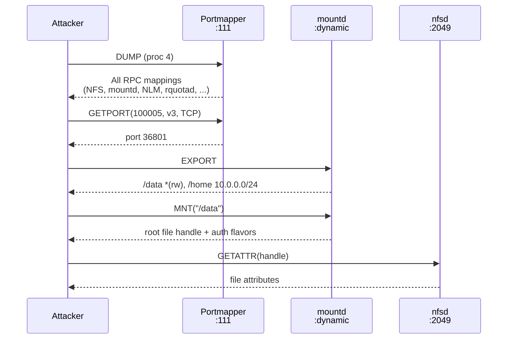

# Portmapper and rpcbind

**The portmapper is the first target in any NFS engagement. It runs on port 111, accepts no authentication, and hands any querier a complete inventory of every RPC service on the host: their program numbers, versions, protocols, and ports.**

Portmapper v2 (RFC 1057 Appendix A) and its successor rpcbind v3/v4 (RFC 1833) provide service discovery for the ONC RPC ecosystem. Every RPC server registers itself with the local portmapper when it starts, creating a mapping from `(program, version, protocol)` to a port number. Clients query the portmapper to learn where services live. Without it, clients must know service ports in advance.

The portmapper is program 100000, version 2, fixed at port 111 on both TCP and UDP. rpcbind extends this with versions 3 and 4, adding universal address resolution, server clock retrieval, and operational statistics.

## NFS discovery flow

The standard NFSv2/v3 connection sequence always begins with portmapper. Even when an attacker knows NFS listens on 2049, they still need to find the MOUNT daemon to obtain a root file handle:



NFSv4 bypasses this entirely by using a fixed port (2049) and replacing MOUNT with `PUTROOTFH`. This is one of NFSv4's genuine security improvements, but only if the server does not also expose the portmapper.

## Portmapper v2 procedures

Portmapper v2 defines six procedures. All accept AUTH_NONE credentials.

| Proc | Name | Args | Returns | Description |
|------|------|------|---------|-------------|
| 0 | `PMAPPROC_NULL` | void | void | No-op connectivity check. By convention, procedure 0 of every RPC program takes no arguments and returns nothing. Used to verify the portmapper is alive. |
| 1 | `PMAPPROC_SET` | mapping | bool | Register a `(program, version, protocol) -> port` mapping. Returns `TRUE` on success, `FALSE` if a mapping already exists for the tuple. Requires local-host origin on most implementations. |
| 2 | `PMAPPROC_UNSET` | mapping | bool | Remove a mapping. The protocol and port fields are ignored. Also restricted to local calls in practice. |
| 3 | `PMAPPROC_GETPORT` | mapping | unsigned int | Resolve a specific `(program, version, protocol)` to its port. Returns 0 if no matching registration exists. The port field in the request is ignored. |
| 4 | `PMAPPROC_DUMP` | void | pmaplist | Return every registered mapping. No arguments required. The response is a linked list of `(program, version, protocol, port)` tuples covering every RPC service on the host. |
| 5 | `PMAPPROC_CALLIT` | call_args | call_result | Indirect call: forward an RPC call to a local program via the portmapper. The portmapper calls `(program, version, procedure)` with the supplied arguments and returns the result plus the program's port. UDP-only in the original spec. |

### XDR wire types

The mapping structure encodes one service registration:

```text
struct mapping {
    unsigned int prog;    /* RPC program number (e.g., 100003 for NFS) */
    unsigned int vers;    /* program version (e.g., 3 for NFSv3) */
    unsigned int prot;    /* IPPROTO_TCP (6) or IPPROTO_UDP (17) */
    unsigned int port;    /* TCP/UDP port number */
};
```

The CALLIT arguments and result:

```text
struct call_args {
    unsigned int prog;    /* target program number */
    unsigned int vers;    /* target version */
    unsigned int proc;    /* target procedure number */
    opaque args<>;        /* XDR-encoded procedure arguments */
};

struct call_result {
    unsigned int port;    /* port the target program listens on */
    opaque res<>;         /* XDR-encoded procedure result */
};
```

## DUMP: the reconnaissance oracle

`PMAPPROC_DUMP` is the single most useful portmapper procedure for an attacker. One unauthenticated call returns the complete RPC service map of the host.

!!! danger "DUMP requires no authentication"
    Any host that can reach port 111 (TCP or UDP) can call DUMP with AUTH_NONE credentials and receive the full list of registered services. There is no access control, no logging requirement, and no rate limiting.

A typical DUMP response on a Linux NFS server reveals:

```text
Program   Version  Protocol  Port    Service
100000    2        TCP       111     portmapper
100000    2        UDP       111     portmapper
100003    2        UDP       2049    NFS (v2)
100003    3        TCP       2049    NFS (v3)
100003    3        UDP       2049    NFS (v3)
100003    4        TCP       2049    NFS (v4)
100005    1        UDP       36801   mountd (v1)
100005    3        TCP       36801   mountd (v3)
100021    4        TCP       39127   NLM (lockd)
100024    1        TCP       41231   NSM (statd)
100011    1        TCP       875     rquotad
100227    3        TCP       2049    NFS_ACL
100004    2        TCP       832     ypserv (NIS)
```

This tells the attacker:

- **Which NFS versions are available**, enabling version downgrade attacks ([F-1.6](../../security/identity/F-1.6-nfsv2-downgrade.md))
- **The mountd port**, required to call MNT and obtain file handles
- **Whether NIS is running**, enabling NIS credential extraction ([F-5.3](../../security/info-disclosure/F-5.3-nis-credential-extraction.md))
- **Which sideband services exist**: NFS_ACL for POSIX ACL enumeration, RQUOTA for UID oracle attacks
- **The presence and version of NLM/NSM**: lockd and statd are historically vulnerable

nfswolf's scanner calls DUMP as the first phase of its 3-phase pipeline. The `onc-rpcbind` crate resolves program numbers against a built-in table of 1,251 IANA-registered RPC programs, so every entry in the DUMP output gets a human-readable name.

## GETPORT: targeted port resolution

`PMAPPROC_GETPORT` resolves a single `(program, version, protocol)` to its port. nfswolf uses GETPORT to find specific services when DUMP is unavailable or when only a specific mapping is needed:

```rust
// Find the mountd v3 TCP port
let port = pm.getport(100_005, 3, IPPROTO_TCP).await?;
```

A return value of 0 means the program is not registered. nfswolf uses this to detect which NFS versions are actually running. A GETPORT for program 100003 version 3 that returns 0 confirms NFSv3 is not available.

## CALLIT: indirect calls and amplification

`PMAPPROC_CALLIT` tells the portmapper to forward an RPC call to a local service and relay the response. The original spec restricts this to UDP, and the portmapper acts as a proxy.

!!! warning "CALLIT attack surface"
    **Amplification**: A small CALLIT request can trigger a large response from the target program, amplified through the portmapper. Combined with UDP source-address spoofing, this enables DDoS reflection attacks with factors of 7x-28x ([F-3.2](../../security/network/F-3.2-portmapper-amplification.md)).

    **Firewall bypass**: CALLIT can reach programs on non-standard ports that are not directly accessible to the attacker. The portmapper forwards the call to `localhost`, bypassing firewall rules that only block external access to the target port ([F-3.5](../../security/network/F-3.5-portmapper-tunnel-bypass.md)).

Modern rpcbind implementations restrict CALLIT to prevent these attacks, but legacy systems and misconfigured firewalls still expose it.

## rpcbind v3/v4: extended service discovery

rpcbind (RFC 1833) extends the portmapper with versioned protocol bindings, universal address resolution, and operational metadata. It still runs on port 111 as program 100000, but at versions 3 and 4.

### GETTIME (proc 6, rpcbind v3)

Returns the server's local time as seconds since the Unix epoch. Requires no authentication.

```rust
let epoch_secs: u32 = rb.gettime().await?;
```

!!! danger "GETTIME leaks the server clock"
    AUTH_DH (RFC 2695) uses DES encryption with timestamps to authenticate clients. The server rejects calls whose timestamps deviate too far from its own clock. GETTIME hands the attacker the server's exact clock value, making AUTH_DH timestamp attacks trivial. Even without AUTH_DH, the server clock reveals timezone, uptime patterns, and whether NTP is in use.

### GETSTAT (proc 12, rpcbind v4)

Returns per-version operational statistics: procedure call counts, SET/UNSET totals, and per-address/per-remote-call breakdowns for rpcbind versions 2, 3, and 4.

```rust
let stats: RpcbStatByvers = rb.getstat().await?;
for entry in &stats.0 {
    println!("rpcbind v{}: {} total calls", entry.rpcb_version, entry.info.iter().sum::<i32>());
}
```

The call counts reveal which procedures are being used, how actively the server registers/unregisters services, and whether remote CALLIT/INDIRECT calls are being made. This is operational intelligence with no authentication cost.

### GETADDR (proc 3, rpcbind v3)

The IPv6-aware replacement for GETPORT. Instead of returning a port number, it returns a universal address string in the format `host.port_hi.port_lo` (e.g., `0.0.0.0.8.1` for port 2049). The query includes a network identifier (`tcp`, `udp`, `tcp6`, `udp6`) for transport selection.

### Full rpcbind procedure table

| Proc | Name | Version | Description |
|------|------|---------|-------------|
| 0 | NULL | v3/v4 | No-op probe |
| 1 | SET | v3/v4 | Register a binding |
| 2 | UNSET | v3/v4 | Remove a binding |
| 3 | GETADDR | v3/v4 | Universal address lookup (replaces GETPORT) |
| 4 | DUMP | v3/v4 | List all bindings (extended format with netid and owner) |
| 5 | CALLIT / BCAST | v3/v4 | Indirect/broadcast call |
| 6 | GETTIME | v3/v4 | Server clock (epoch seconds) |
| 7 | UADDR2TADDR | v3/v4 | Convert universal address to transport address |
| 8 | TADDR2UADDR | v3/v4 | Convert transport address to universal address |
| 9 | GETVERSADDR | v4 | Version-strict address lookup |
| 10 | INDIRECT | v4 | Indirect call with error reporting |
| 11 | GETADDRLIST | v4 | All addresses for a service across transports |
| 12 | GETSTAT | v4 | Operational statistics per rpcbind version |

## Security implications

### No authentication on any query

Every portmapper and rpcbind query procedure accepts AUTH_NONE. There is no option to require credentials for DUMP, GETPORT, GETTIME, or GETSTAT. The portmapper was designed in an era when service discovery was considered a network utility, not a security-sensitive operation.

### DUMP is a complete service inventory

A single DUMP call reveals every RPC service on the host, including services the administrator may believe are hidden behind firewall rules. If the portmapper is reachable, the full service map is public.

### CALLIT is a proxy and amplifier

CALLIT enables two distinct attacks: DDoS amplification via UDP source spoofing ([F-3.2](../../security/network/F-3.2-portmapper-amplification.md)), and firewall bypass by proxying calls through localhost ([F-3.5](../../security/network/F-3.5-portmapper-tunnel-bypass.md)).

### GETTIME undermines AUTH_DH

AUTH_DH's timestamp-based authentication collapses when the attacker can query the server's exact clock ([F-3.7](../../security/network/F-3.7-auth-dh-obsolete.md)). GETTIME is the enabler.

### UDP doubles the exposure

Portmapper listens on both TCP and UDP by default. The UDP listener enables source-address spoofing (no TCP handshake to verify the sender), making amplification attacks and reconnaissance from spoofed IPs possible.

## Firewalling portmapper

Blocking port 111 is the most common mitigation, and it does eliminate the DUMP/GETPORT/CALLIT/GETTIME attack surface. But it is not sufficient on its own.

!!! warning "Blocking port 111 is necessary but incomplete"
    NFS almost always listens on port 2049, which is a well-known default. An attacker who cannot reach the portmapper can still:

    - Connect directly to port 2049 and issue NFS operations (NFSv4 needs no portmapper)
    - Probe port 2049 with NULL calls to detect NFS versions
    - Try common mountd ports (e.g., 20048) or scan the ephemeral range
    - Use NFSv4 PUTROOTFH to obtain root handles without MOUNT
    - Enumerate exports via NFSv4 pseudo-filesystem traversal

    A complete defense also firewalls port 2049 and the mountd port to trusted source addresses. See the [Firewall Configuration](../../security/defense/configure/firewall.md) guide.

nfswolf handles this gracefully: the scanner's `--skip-rpc` flag skips portmapper entirely and probes port 2049 directly. The `--rpc-port` flag overrides the portmapper port for non-standard deployments.

## nfswolf implementation

The portmapper and rpcbind clients live in the `onc-rpcbind` workspace crate:

- **`PortmapperClient`** -- portmapper v2: `null()`, `set()`, `unset()`, `getport()`, `dump()`, `callit()`
- **`RpcbindClient`** -- rpcbind v3/v4: `gettime()`, `getstat()`, `getaddr()`, `dump()`, `callit()`, `bcast()`, `getversaddr()`, `indirect()`, `getaddrlist()`, `uaddr2taddr()`, `taddr2uaddr()`

Both clients are generic over `RpcTransport` and accept AUTH_NONE, matching the portmapper's own convention. The scanner wraps these in `src/proto/portmap.rs` with NIS detection, amplification measurement, and program-number resolution against the 1,251-entry IANA registry.

!!! info "Related findings"
    - [F-5.4: RPC Service Enumeration](../../security/info-disclosure/F-5.4-rpc-service-enumeration.md) -- DUMP leaks the full service map
    - [F-3.2: Portmapper UDP Amplification](../../security/network/F-3.2-portmapper-amplification.md) -- CALLIT/DUMP for DDoS reflection
    - [F-3.5: Portmapper Tunnel Bypass](../../security/network/F-3.5-portmapper-tunnel-bypass.md) -- CALLIT as a firewall bypass proxy
    - [F-3.7: AUTH_DH Obsolete](../../security/network/F-3.7-auth-dh-obsolete.md) -- GETTIME enables clock-based attacks
    - [F-5.3: NIS Credential Extraction](../../security/info-disclosure/F-5.3-nis-credential-extraction.md) -- DUMP reveals NIS presence
