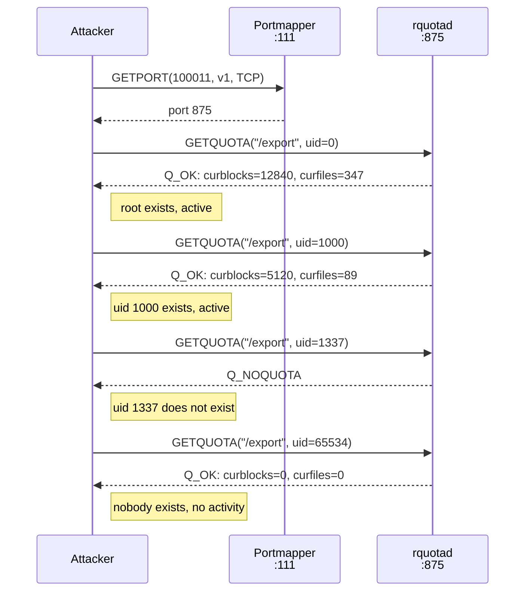

# RQUOTA Protocol

**RQUOTA turns disk quota queries into a UID existence oracle. By asking "does this UID have a quota?" for every UID from 0 to 65535, an attacker can map which users exist on the server -- without touching NFS, without needing a file handle, and without triggering any NFS-level logging.**

RQUOTA (Remote Quota) is RPC program 100011. It allows clients to query disk quota information for users on an NFS server. There is no formal RFC. The protocol is a de facto standard originating from Sun's `rquota.x` IDL, implemented by Linux, Solaris, FreeBSD, and most NFS servers. It runs as a standalone daemon (`rpc.rquotad`) on a dynamic port registered via portmapper.

## Protocol details

RQUOTA version 1 defines two procedures on program 100011:

| # | Procedure | Input | Output | Description |
|---|-----------|-------|--------|-------------|
| 0 | `NULL` | void | void | Standard RPC liveness probe |
| 1 | `GETQUOTA` | path + UID | quota data or error | Returns disk quota and usage for the specified UID on the specified export |

RQUOTA version 2 adds an extended GETQUOTA that accepts a quota type parameter (0 = user quota, 1 = group quota), enabling group quota queries. nfswolf currently uses version 1 only.

### GETQUOTA request

| Field | Type | Description |
|-------|------|-------------|
| `path` | `string` | Export path (e.g., `/srv/nfs/data`). XDR-encoded as an opaque byte array. |
| `uid` | `uint32` | The user ID to query quota for |

### GETQUOTA response

The response begins with a status code:

| Status | Name | Meaning |
|--------|------|---------|
| 1 | `Q_OK` | Quota data follows |
| 2 | `Q_NOQUOTA` | No quota record for this UID |
| 3 | `Q_EPERM` | Permission denied |

On `Q_OK`, the response includes a quota data structure (10 fields, 40 bytes):

| Field | Type | Description |
|-------|------|-------------|
| `bsize` | `uint32` | Filesystem block size in bytes |
| `active` | `bool` | Whether quota enforcement is active |
| `bhardlimit` | `uint32` | Hard limit on disk blocks |
| `bsoftlimit` | `uint32` | Soft limit on disk blocks |
| `curblocks` | `uint32` | Current block usage |
| `fhardlimit` | `uint32` | Hard limit on file count (inodes) |
| `fsoftlimit` | `uint32` | Soft limit on file count |
| `curfiles` | `uint32` | Current file count |
| `btimeleft` | `uint32` | Seconds until soft block limit enforcement |
| `ftimeleft` | `uint32` | Seconds until soft file limit enforcement |

### Port discovery

rquotad registers with the portmapper on startup. nfswolf discovers it by calling GETPORT for program 100011, version 1, TCP:

```text
GETPORT(program=100011, version=1, protocol=TCP) -> port 875
```

A portmapper DUMP typically shows:

```text
100011    1    TCP    875     rquotad
100011    1    UDP    875     rquotad
```

If portmapper is firewalled, rquotad is unreachable; it does not use a well-known port.

## The UID existence oracle (F-5.15)

GETQUOTA's response discriminates between UIDs that have quota records and UIDs that do not. On a system with quotas enabled, every UID that owns files has a quota record (even if no explicit quota limit is set). The `curblocks` and `curfiles` fields reveal whether the UID has any disk activity.

This turns RQUOTA into a binary oracle: "does this UID exist and have disk activity on this server?"



!!! danger "No authentication required"
    rquotad accepts AUTH_SYS credentials without verification -- the same trust model as NFS itself. An attacker can query quotas for any UID with forged credentials. Most deployments apply no host-based access control to rquotad, meaning any host on the network can enumerate UIDs.

### What RQUOTA reveals vs what NFS reveals

| Information | NFS (GETATTR/READDIRPLUS) | RQUOTA (GETQUOTA) |
|-------------|---------------------------|-------------------|
| UID existence | Only for UIDs that own files in accessible directories | Any UID with a quota record, across the entire filesystem |
| Requires file handle | Yes -- must MOUNT or obtain a handle first | No -- only needs the export path string |
| Requires directory access | Yes -- must be able to read the directory | No -- queries are per-UID, not per-file |
| Disk usage | Per-file (size attribute) | Aggregate (total blocks and files for the UID) |
| Filesystem type | Indirectly via FSSTAT/FSINFO | Directly via `bsize` field |
| Block size | Not available (FSSTAT reports in bytes) | Exact block size in the `bsize` field |
| Coverage | Only files in directories the attacker can list | All files owned by the UID, including those in directories the attacker cannot access |

The key advantage of RQUOTA for an attacker is that it does not require a file handle. NFS-based UID discovery requires mounting an export, traversing directories, and collecting owner UIDs from file attributes. RQUOTA bypasses all of that. It queries the quota subsystem directly, which tracks UIDs at the filesystem level regardless of directory permissions.

## Filesystem fingerprinting

The `bsize` field in the quota response leaks the filesystem's block size, which varies by filesystem type:

| Filesystem | Typical `bsize` | Notes |
|------------|-----------------|-------|
| ext4 | 4096 | Default `mkfs.ext4` block size |
| XFS | 512 | XFS reports in 512-byte basic blocks |
| ZFS | 1024 | ZFS on Linux uses 1024-byte quota blocks |
| BTRFS | 4096 | Same as ext4 |

!!! tip "Block size narrows escape strategy"
    The filesystem type determines which file handle structures the server uses, and therefore which escape construction applies. RQUOTA provides this fingerprint before any NFS operation -- a single GETQUOTA for `uid=0` reveals the block size even when the attacker has no NFS file access.

## Security implications

RQUOTA enables UID enumeration on any server running rquotad, even if the attacker cannot mount any export (e.g., IP-restricted exports). The attacker needs only network access to the rquotad port, which is often not firewalled because administrators focus on ports 111 and 2049. nfswolf's credential ladder (`src/engine/credential.rs`) prioritizes RQUOTA-confirmed UIDs over blind spraying, reducing RPC call count and detection risk.

RQUOTA is one of three UID discovery channels in nfswolf, each covering a different blind spot:

1. **READDIRPLUS** ([F-5.2](../../security/info-disclosure/F-5.2-readdirplus-handle-harvesting.md)) -- harvests owner UIDs from file attributes in accessible directories
2. **NFS_ACL** ([F-5.14](../../security/info-disclosure/index.md#f-514-posix-acl-entries-expose-access-beyond-mode-bits)) -- reveals named USER/GROUP ACL entries invisible to mode bits
3. **RQUOTA** (F-5.15) -- confirms UID existence via quota queries without NFS access

## nfswolf implementation

The RQUOTA client lives in `src/proto/rquota.rs`. It provides a single function:

```rust
pub(crate) async fn getquota(
    addr: SocketAddr,
    export_path: &str,
    uid: u32,
    proxy: Option<&str>,
    stealth: &StealthConfig,
) -> anyhow::Result<GetquotaResult>
```

The function opens a direct TCP connection to the rquotad port, sends a GETQUOTA v1 request, and manually decodes the XDR response. It uses the shared sideband connection helper (`src/proto/sideband.rs`) for SOCKS5 proxy support and stealth pacing.

The analyzer (`src/engine/analyzer.rs`) calls `check_rquota()` per export, resolving the rquotad port via portmapper GETPORT and probing UIDs 0, 1000, and 65534. If any probe returns quota data with non-zero block or file counts, or a non-zero `bsize`, a finding is emitted.

!!! info "Related findings"
    - [F-5.15: rquotad Exposes UID Activity](../../security/info-disclosure/index.md#f-515-rquotad-exposes-uid-activity-via-quota-queries) -- the primary finding for RQUOTA-based user enumeration
    - [F-1.1: UID/GID Spoofing](../../security/identity/F-1.1-uid-gid-spoofing.md) -- RQUOTA-discovered UIDs are direct spoofing targets
    - [F-5.4: RPC Service Enumeration](../../security/info-disclosure/F-5.4-rpc-service-enumeration.md) -- portmapper DUMP reveals whether rquotad is running
