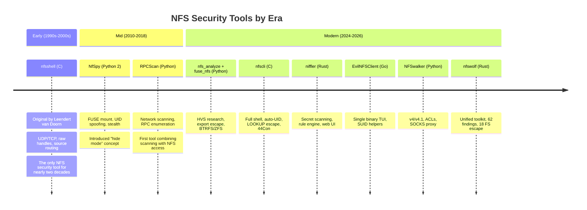

# Related Tools

NFS security tooling is fragmented across dozens of projects in multiple languages, each covering a narrow slice of the attack surface. This page catalogs the landscape (offensive tools, client libraries, and standard utilities) that informed nfswolf's design.

## Why nfswolf exists

A security researcher assessing NFS infrastructure today needs to install, configure, and context-switch between 10+ tools written in 5 different languages to cover the full attack path from reconnaissance through exploitation. The typical workflow looks like this:

1. Run `nmap` or `RPCScan` to find NFS services on the network.
2. Use `showmount` or `rpcinfo` to enumerate exports and RPC services.
3. Run `nfs_analyze` (Python, requires pynfs + libfuse3-dev) to check for misconfigurations and attempt export escape.
4. If escape succeeds, pass the handle to `fuse_nfs` (Python) to mount it, or to `nfscli` (C) for an interactive shell.
5. Use `niffler` (Rust, requires libnfs-dev) to scan accessible files for credentials.
6. Switch to `nfsshell` (C) if you need raw handle injection or UDP access.
7. Use `NFSwalker` (Python) if you need NFSv4 ACL extraction or SOCKS proxy.

No single tool prior to nfswolf combined network scanning, security analysis, export escape, interactive shell access, FUSE mounting, and structured reporting in one binary. Each tool has its own installation requirements, CLI conventions, and output formats. The problem compounds in practice: nfs_analyze requires Python with libfuse3-dev and pynfs; niffler requires libnfs (a C library that must be installed system-wide); nfsshell must be compiled from C source; NFSwalker requires Python with specific library versions. On a minimal jump box or container, installing even one of these tools can be a multi-step process.

Beyond the installation burden, the tools use different handle formats, credential specifications, and output conventions. Passing an escape handle from nfs_analyze to fuse_nfs requires understanding both tools' handle encoding. Correlating results from nfs_analyze's JSON output with niffler's SQLite database requires manual effort. nfswolf eliminates this friction by implementing the entire attack path in a single binary with consistent CLI conventions and output formats.

## Offensive and security tools

These tools are specifically designed for NFS security testing, penetration testing, or exploit-oriented access.

### Analysis and reconnaissance

| Tool | Language | Status | Description |
|------|----------|--------|-------------|
| [nfs_analyze](https://github.com/hvs-consulting/nfs-security-tooling) | Python | Active (2026) | The best standalone NFS security analyzer before nfswolf. Detects NFS misconfigurations including export escape (ext4/XFS/BTRFS/ZFS handle construction), OS fingerprinting from handle structure, squash configuration probing, NFSv4 SECINFO enumeration, and auth flavor analysis. Part of the HVS Consulting nfs-security-tooling repository, released alongside their comprehensive NFS security blog post and wiki. Requires libfuse3-dev and the pynfs NFSv4 library. No network scanning, no interactive shell, no FUSE mount, no exploitation capabilities. |
| [RPCScan](https://github.com/hegusung/RPCScan) | Python | Abandoned (2018) | Network-wide RPC scanner that communicates with portmapper to enumerate services, list NFS mountpoints, perform recursive directory listing of NFS shares, and download files. The first tool to combine network scanning with NFS file access in a single workflow. No longer maintained; no NFSv4, no security analysis, no shell, no escape construction. |

### Interactive access

| Tool | Language | Status | Description |
|------|----------|--------|-------------|
| [nfscli](https://github.com/claesmnyberg/nfscli) | C | Active (2026) | NFS v2/v3 client by Claes M Nyberg and John Cartwright (Signedness.org), presented at 44Con London 2024 ([video](https://www.youtube.com/watch?v=NuxCUMIH5M8)). Two interaction modes: a raw handle shell (40+ commands exposing every NFSv3 procedure directly) and a `browse` sub-shell with path-based navigation, shell piping/redirection, grep, strings, head/tail, wc, xxd, and glob expansion. Three-phase export escape: LOOKUP `..` + READDIRPLUS parent leak, covering export probe, and cross-export pivot. IPv4 source IP spoofing via PF_PACKET raw sockets with background ARP responder and BPF-filtered receiver. Auto-UID cycling with remote passwd/group parsing. Write-at-offset for in-place binary patching. UDP only, no TCP. Discovered an OpenBSD NFS server READDIRPLUS remote kernel crash. Companion tool: [brutefh](https://github.com/claesmnyberg/brutefh). No security analysis, no FUSE mount, no NFSv4. |
| [brutefh](https://github.com/claesmnyberg/brutefh) | C | Active (2025) | NFS file handle brute forcer by Claes M Nyberg. Uses UDP GETATTR as an oracle with a nibble-mask approach: mark unknown hex nibbles with `?` and the tool enumerates all combinations. Counter mode for up to 16 nibbles (64 bits), random mode for larger spaces, flood mode for fire-and-forget probing. Separate sender/receiver threads with XID-based backlog tracking. Includes OpenBSD handle structure analysis documenting the 32-bit random field from `fsirand(8)` (~75 hours to cover on gigabit). Helper programs `getfh-linux.c` and `getfh-openbsd.c` for local handle inspection via `getfh(2)`. |
| [nfsshell](https://github.com/Supermathie/nfsshell) | C | Active (2025) | The original NFS security tool, first written by Leendert van Doorn in the early 1990s. Provides user-level interactive access to NFS servers over UDP or TCP, with source routing, raw handle injection, `mknod` for device node creation, and privileged port binding. Maintained by Supermathie (formerly NetDirect). No security analysis, no auto-UID escalation, no export escape construction, no NFSv4. |
| [NfSpy](https://github.com/bonsaiviking/NfSpy) | Python 2 | Abandoned (2014) | NFS ID-spoofing tool that exploits AUTH_SYS trust by falsifying UID/GID credentials. Provides two interfaces: `nfspy` (FUSE mount client with UID spoofing) and `nfspysh` (FTP-like interactive shell). Introduced the "hide mode" concept -- immediate UMNT after handle acquisition to remove the client from the server's mount list. Also supports `mknod` for device node creation. Dead project; requires Python 2, no NFSv4, no analysis, no escape construction. |
| [EvilNFSClient](https://github.com/AnvithLobo/EvilNFSClient) | Go | Active (2025) | Go-based pentester-friendly NFS client with a TUI interface. Operates on remote NFS exports without mounting them, providing upload, download, SUID/SGID binary manipulation, and cross-platform support. Designed for speed and full control on red team engagements. Single binary deployment. No security analysis, no export escape, no auxiliary GID injection, no NFSv4. |
| [NFSwalker](https://github.com/NULLhere/NFSwalker) | Python | Active (2025) | User-space NFS client supporting NFSv3, v4, and v4.1 with SOCKS proxy support, UID/GID/hostname spoofing, NFSv4 ACL extraction, and file read/write without kernel mounting. Created as a modern Python alternative to NfSpy. No security analysis, no export escape, no FUSE mount, no network scanning. No license (all rights reserved). |
| [NetExec](https://github.com/Pennyw0rth/NetExec) | Python | Active (2026) | The CrackMapExec successor (5800+ stars) with protocol modules for SMB, LDAP, WinRM, SSH, and NFS. The NFS module provides export enumeration, file upload/download, and UID/GID credential specification. Primarily an Active Directory and network attack framework; NFS is one protocol among many. No export escape, no handle construction, no security analysis. |

### Credential and secret scanning

| Tool | Language | Status | Description |
|------|----------|--------|-------------|
| [niffler](https://github.com/dejisec/niffler) | Rust | Active (2026) | NFS-specific credential and secret scanner, described by its author as "Snaffler for NFS." Automates export discovery, directory tree walking with automatic UID spoofing, and content pattern-matching against credential signatures (SSH keys, password files, config files, tokens). Features a rule engine, SQLite results database, and web dashboard. Three scanning modes: recon (export enumeration), enum (directory listing with UID cycling), and full (content scanning). Depends on libnfs (C FFI). No export escape, no shell, no handle construction. Designed as a post-access companion tool -- nfswolf finds the attack path, niffler scans the accessible files. |

### FUSE mounting

| Tool | Language | Status | Description |
|------|----------|--------|-------------|
| [fuse_nfs](https://github.com/hvs-consulting/nfs-security-tooling) | Python | Active (2026) | FUSE mount client from HVS Consulting's nfs-security-tooling repository. Provides NFS mounting with automatic UID credential cycling per file access and escape handle passthrough (accepts a hex handle from nfs_analyze to mount an escaped filesystem). Uses the anfs async Python library for NFSv3 protocol operations. No analysis, no scanning, no shell; single-purpose mounting tool. |

### Diagnostic and benchmarking

| Tool | Language | Status | Description |
|------|----------|--------|-------------|
| [NFStash](https://github.com/mprovost/NFStash) | C | Active (2026) | Suite of composable command-line NFS client utilities: nfsping (latency probe), nfsmount (mount/unmount), nfsdf (filesystem stats), nfsls (directory listing), nfscat (file read), nfslock (lock testing), nfsup (availability monitoring), and clear_locks (lock cleanup). Built from Sun RPC spec files with no OS NFS client dependency. Outputs JSON for scripting integration. Not security-focused -- no UID spoofing, no escape, no analysis -- but useful for NFS infrastructure profiling and debugging. |

??? note "Tool selection criteria"
    The tools listed above were selected based on: (1) they implement NFS protocol operations directly (not via the kernel client), and (2) they support at least one security-relevant capability (UID spoofing, export enumeration, file access without mounting) or are commonly used alongside security tools. Generic NFS clients that only wrap the kernel `mount` command are excluded. Maintenance status reflects the most recent commit in each repository as of the time this page was written. "Abandoned" means no commits in 3+ years and the project uses deprecated dependencies (Python 2, unmaintained libraries).

## Client libraries

These are NFS protocol implementations used as building blocks by other tools or applications. They are not security tools themselves but are relevant because offensive tools depend on them and they serve as protocol references.

| Library | Language | NFS Versions | Notes |
|---------|----------|-------------|-------|
| [libnfs](https://github.com/sahlberg/libnfs) | C | v2, v3, v4 | The dominant userspace NFS library. Provides three API tiers: raw async RPC, high-level async VFS, and synchronous POSIX-like operations, with zero-copy reads and writes. Used by niffler (via FFI) and fuse_nfs (via anfs). Not used by nfswolf because the C dependency breaks the static binary goal. |
| [anfs](https://github.com/skelsec/anfs) | Python | v3 | Asynchronous NFSv3 client from the OctoPwn ecosystem. Provides a command-line application (`anfsclient`) for browsing, downloading, deleting, and creating files over NFS3 with privileged-port support and dynamic UID impersonation per directory. Powers fuse_nfs. |
| [pynfs](https://github.com/hvs-consulting/pynfs) | Python | v4.0, v4.1 | NFSv4 test framework from linux-nfs.org. The HVS Consulting fork adds NFS enumeration modifications and powers nfs_analyze's v4 checks including SECINFO queries and pseudo-filesystem mapping. |
| [nfs3-rs](https://github.com/Vaiz/nfs3) | Rust | v3 | Modular multi-crate workspace providing both an async NFSv3 server (with pluggable virtual filesystem traits) and an async client. **Absorbed into nfswolf v0.6.0** -- the XDR, RPC, MOUNT, and NFSv3 code lives in `crates/`. Its `nfs3_server` crate remains a dev-dependency for integration testing. |
| [go-nfs](https://github.com/willscott/go-nfs) | Go | v3 | Pure Go NFSv3 server implementation with read-write support. Mutations are stored in memory rather than written back to disk (overlay filesystem model). Pluggable VFS layer. |
| [go-nfs-client](https://github.com/vmware/go-nfs-client) | Go | v4 | Pure Go NFSv4 client designed primarily for AWS EFS. Deliberately minimal: fully synchronous with context-based cancellation, no locking, no reconnection, no ACLs, no auth methods beyond AUTH_SYS. |
| [nfs4](https://github.com/bobbobbio/nfs4) | Rust | v4.1 | NFSv4.1 client library and CLI binary. Used as a type reference for NFSv4.1 COMPOUND ops during nfswolf's v4 crate development. Uses serde-xdr (incompatible codec), so nfswolf adapted the types rather than importing. NetAppLabs maintains [a fork](https://github.com/NetAppLabs/nfs4p1-rs). |
| [nfs-rs](https://github.com/NetAppLabs/nfs-rs) | Rust | v3, v4.1 | Pure Rust NFSv3+v4.1 client designed to eliminate the C dependency on libnfs for cross-compilation portability. Synchronous API. Not used by nfswolf (no async support). |
| [ShenanigaNFS](https://github.com/JordanMilne/ShenanigaNFS) | Python | v2, v3 | Malicious NFS **server** builder with per-mount filesystem state and a FUSE-like VFS API. Includes a SunRPC IDL stub generator. Designed for testing and reverse engineering rather than production use -- useful for TOCTOU research, client fuzzing, and testing how clients handle malformed responses. |
| [pynfsclient](https://github.com/CharmingYang0/NfsClient) | Python | v3 | Python NFS client toolkit for simulating NFSv3 operations via raw RPC. Allows construction of custom test scenarios against NFS servers per RFC 1813. Supports Python 2.7 and 3. XDR encoding used by anfs. |
| [nfsclient](https://github.com/mubix/nfsclient) | Go | v3 | Go NFS client by mubix (Rob Fuller) with ls, upload, download, rm, mkdir, and rmdir capabilities. Designed for red team use from Windows hosts where mounting NFS shares requires special privileges. Allows specifying UID/GID credentials on the command line. |
| [nfs-client-java](https://github.com/EMCECS/nfs-client-java) | Java | v3 | EMC's Java NFSv3 client library implementing RFC 1813 with generic interfaces for future version extensibility, plus `java.io.File`-equivalent NFS abstractions for enterprise integration. Distributed via Maven. |
| [NFSKit](https://github.com/alexiscn/NFSKit) | Swift | v3 | Swift wrapper around libnfs for Apple platforms. Thread-safe NFS client API modeled after AMSMB2, installed via Swift Package Manager. |
| [nfusr](https://github.com/facebookarchive/nfusr) | C++ | v3 | Facebook's userspace FUSE NFS client (archived). Supports direct `nfs://` URI mounting and automount integration. NFSv4 explicitly not supported. |
| [davecheney/nfs](https://github.com/davecheney/nfs) | Go | v3 | Abandoned Go NFS client library (2017). Author explicitly requests no patches or issues. |
| [ms-nfs41-client](https://github.com/kofemann/ms-nfs41-client) | C | v4.1, v4.2 | Windows NFSv4.2 filesystem client driver providing native NFS mount support on Windows via Cygwin, including WSL integration, user/group mapping, and Windows Service mode. Reference for [F-2.3 handle signing](../security/access-control/F-2.3-windows-handle-signing.md). |

## Standard utilities

These ship with most Linux/Unix systems and are the baseline for NFS enumeration.

| Tool | What It Does | Security Value |
|------|-------------|----------------|
| `showmount -e` | Lists exports via MOUNT EXPORT | Export discovery ([F-5.1](../security/info-disclosure/F-5.1-export-list-enumeration.md)), but no auth flavor info |
| `showmount -a` | Lists connected clients via MOUNT DUMP | Client enumeration, but list is unreliable (not cleaned on crash/v4) |
| `rpcinfo -p` | Dumps portmapper service registrations | Service discovery ([F-5.4](../security/info-disclosure/F-5.4-rpc-service-enumeration.md)) -- reveals NIS, NLM, all NFS versions |
| `rpcdump` (impacket) | Same as rpcinfo but over MS-RPC | Useful for Windows NFS servers |
| `mount -t nfs` | Kernel NFS mount | Requires root, uses real kernel client, no credential spoofing |

### Impacket

Impacket's `rpcdump.py` can enumerate RPC services on Windows NFS servers where the standard `rpcinfo` may not work. It queries the MS-RPC endpoint mapper rather than the Sun portmapper. This is useful when assessing Windows Server's built-in NFS implementation, which runs all services on port 2049 and does not use a traditional portmapper.

### Nmap NSE scripts

Nmap includes several NFS-specific NSE scripts that provide basic reconnaissance:

| Script | Purpose | Limitations |
|--------|---------|-------------|
| `nfs-ls` | Lists files in NFS exports | No UID spoofing, no recursive scan, shallow |
| `nfs-showmount` | Enumerates exports (like `showmount -e`) | No auth flavor extraction, no MNT probing |
| `nfs-statfs` | Reports filesystem statistics | Informational only |
| `rpcinfo` | Enumerates RPC services | Same as `rpcinfo -p` but scriptable |
| `rpc-grind` | Brute-forces RPC program numbers | Noisy, slow |

!!! tip "When to use nmap vs. nfswolf"
    Nmap scripts are useful for initial port discovery during a broad network scan. Once NFS services are identified, nfswolf's `scan` subcommand provides deeper enumeration: portmapper amplification measurement, NIS detection, NFSv4 pseudo-FS mapping, version probing with PROG_MISMATCH extraction, and RDMA detection -- none of which the NSE scripts cover.

## Capability comparison

This table compares the offensive tools across the major capability categories. Libraries and non-security tools are excluded.

| Capability | nfswolf | nfs_analyze | nfscli | niffler | NfSpy | nfsshell | EvilNFSClient | NFSwalker | RPCScan |
|------------|---------|-------------|--------|---------|-------|----------|---------------|-----------|---------|
| Network scan | :material-check: | :material-check: | -- | :material-check: | -- | -- | -- | -- | :material-check: |
| Export enumeration | :material-check: | :material-check: | :material-check: | :material-check: | -- | :material-check: | :material-check: | -- | :material-check: |
| Security analysis | :material-check: | :material-check: | -- | Partial | -- | -- | -- | -- | -- |
| Export escape | :material-check: | :material-check: | Via `..` | -- | Via handle | Via handle | -- | -- | -- |
| BTRFS subvol escape | :material-check: | :material-check: | -- | -- | -- | -- | -- | -- | -- |
| Interactive shell | :material-check: | -- | :material-check: | -- | :material-check: | :material-check: | :material-check: | -- | -- |
| FUSE mount | :material-check: | -- | -- | -- | :material-check: | -- | -- | -- | -- |
| Auto-UID escalation | :material-check: | -- | :material-check: | :material-check: | :material-check: | -- | -- | -- | -- |
| NFSv2 | :material-check: | -- | :material-check: | -- | -- | -- | -- | -- | -- |
| NFSv3 | :material-check: | :material-check: | :material-check: | :material-check: | :material-check: | :material-check: | :material-check: | :material-check: | :material-check: |
| NFSv4 | :material-check: | :material-check: | -- | :material-check: | -- | -- | -- | Partial | -- |
| SOCKS proxy | :material-check: | -- | -- | :material-check: | -- | -- | -- | :material-check: | -- |
| Structured reporting | :material-check: | :material-check: | -- | :material-check: | -- | -- | -- | -- | -- |
| Single static binary | :material-check: | -- | :material-check: | :material-check: | -- | :material-check: | :material-check: | -- | -- |
| Handle decode/analysis | :material-check: | :material-check: | -- | -- | -- | -- | -- | -- | -- |
| Credential caching | :material-check: | -- | :material-check: | -- | -- | -- | -- | -- | -- |
| Stealth/delay mode | :material-check: | -- | -- | -- | :material-check: | -- | -- | -- | -- |

Reading the table vertically reveals the fragmentation problem: no tool before nfswolf had check marks in more than 6 of the 17 capability rows. nfs_analyze covers analysis and escape but has no shell or mount. nfscli covers shell and escape but has no analysis or reporting. niffler covers scanning and secrets but has no escape or shell. A complete assessment required at least three of these tools working together.

## Gaps filled by nfswolf

No single tool before nfswolf covered the complete NFS attack path in one binary. Each prior tool addressed one or two phases of an assessment, forcing researchers to install, configure, and switch between multiple tools written in different languages with different CLI conventions. nfswolf consolidates the attack path from reconnaissance through reporting into a single statically-linked binary with no runtime dependencies.

| Attack Phase | Best Prior Tool | What Was Missing |
|-------------|-----------------|------------------|
| Reconnaissance | nmap + RPCScan | Unified scan with portmap amplification, NIS detection, version probing (v2/v3/v4 with PROG_MISMATCH extraction), RDMA detection, TLS/STRIPTLS detection |
| Analysis | nfs_analyze | Portmap amplification measurement, AUTH_TLS detection, AUTH_NONE metadata leak, AUTH_SHORT replay detection, AUTH_TOOWEAK oracle, PATHCONF analysis, full 62-finding catalog with RFC citations |
| Export Escape | nfs_analyze (handle construction) + nfscli (LOOKUP `..`) | Single `escape` subcommand covering 18/19 filesystem types (vs. 4 in nfs_analyze), NFSv4 escape path when MOUNT is firewalled, multi-source seed gathering (MOUNT v3, MOUNT v1, NFSv4 LOOKUP, upward traversal), scoring/annotation, `--fast` mode for integration with scan |
| Interactive Shell | nfscli | Auxiliary GID injection, handle construction escape from within the shell (`escape-root` command), NFSv4 support, sibling export discovery via LOOKUPP, credential escalation caching, tab completion, recursive get/put with progress bars, secrets scan, SUID scan, world-writable scan |
| FUSE Mount | fuse_nfs | Auto-UID + escape handle + SOCKS proxy + stealth unmount + NFSv2/v3/v4 in one binary, auto-version detection |
| Secret Harvesting | niffler | Complementary -- nfswolf finds the attack path, niffler scans the accessible files |
| Reporting | niffler (SQLite/Web), nfs_analyze (JSON) | Six output formats (HTML + JSON + TXT + CSV + Markdown + console) with Finding IDs traceable to RFC sections, risk scoring, remediation guidance |

Capabilities unique to nfswolf that no prior tool implemented:

- **18-filesystem escape coverage**: export escape across ext2/3/4, XFS, BTRFS, ZFS, f2fs, JFS, NILFS2, ReiserFS, VFAT, NTFS3, UDF, bcachefs, SquashFS, EROFS, and ISO9660. Prior tools covered at most 4 filesystem types (ext4, XFS, BTRFS, ZFS).
- **Evidence-driven credential ladder**: automatic UID/GID escalation based on file ownership, mode bits, and READDIRPLUS-harvested identity ranking, with mode-bit pruning to skip unnecessary attempts. Prior tools either used fixed UID lists or required manual specification.
- **Multi-version escape probing**: the escape pipeline gathers seeds from MOUNT v3, MOUNT v1, and NFSv4 LOOKUP, then probes constructed handles across all three NFS versions. This covers scenarios where one version is firewalled or returns different results.
- **Offline handle decoder**: the `decode` subcommand dissects NFS file handles without any network access, printing every field (header, fsid, fileid) with OS/filesystem fingerprinting and security assessment. No prior tool offered offline handle analysis.
- **Single static binary**: nfswolf compiles to a single musl-static binary with no runtime dependencies, deployable on jump boxes, containers, and embedded NAS appliances without installing language runtimes or development libraries.

??? info "nfswolf + niffler workflow"
    nfswolf and niffler are designed as companions, each covering the phase where the other stops. Use nfswolf to discover NFS infrastructure (`scan`), identify misconfigurations (`analyze`), break out of exports (`escape`), and gain interactive access (`shell` or `mount`). Then point niffler at the accessible shares for deep credential and secret scanning with its pattern-matching rule engine, SQLite results database, and web dashboard. nfswolf's `secrets-scan` shell command provides quick checks within the shell, but niffler's dedicated scanning engine with its signature database is the right tool for thorough credential harvesting across large filesystems. The two tools together cover the complete NFS attack surface from reconnaissance through credential extraction.

## Maintenance and project health

Many NFS security tools have been abandoned. Several tools that were important contributions when released are now unmaintained, leaving users with security tools that depend on deprecated runtimes or libraries.

| Status | Tools | Implications |
|--------|-------|-------------|
| **Actively maintained** (commits in 2025-2026) | nfswolf, nfs_analyze/fuse_nfs, nfscli, niffler, NFStash, nfsshell, EvilNFSClient, NFSwalker | Safe to deploy; bugs get fixed, new features added |
| **Maintenance mode** (functional but infrequent updates) | libnfs, go-nfs, go-nfs-client, pynfs, ms-nfs41-client | Stable for existing use cases but unlikely to add new capabilities |
| **Abandoned** (no updates in 3+ years) | NfSpy (2014, Python 2), RPCScan (2018), davecheney/nfs (2017) | Should not be used in new assessments; NfSpy requires Python 2 which reached end-of-life in 2020 |

The three most actively developed security tools (nfswolf, niffler, nfscli) all compile to single binaries with no runtime dependencies. Security tools need to run on minimal jump boxes where installing a Python or Go runtime is not an option.

## Tools by language

The NFS security tool ecosystem spans five languages, each with trade-offs:

| Language | Tools | Strengths | Weaknesses |
|----------|-------|-----------|------------|
| **C** | nfsshell, nfscli, NFStash | Fast, no runtime dependency, privileged port binding, direct system call access | Manual memory management, no async, hard to extend, buffer overflow risk in network parsing code |
| **Python** | nfs_analyze, fuse_nfs, NfSpy, NFSwalker, RPCScan, anfs, ShenanigaNFS, pynfs | Rapid prototyping, large library ecosystem, easy to modify for one-off tests | Slow (10-100x vs. compiled), runtime dependency, GIL limits concurrency, Python 2 projects are dead |
| **Go** | EvilNFSClient, go-nfs, go-nfs-client, nfsclient | Single binary, cross-platform, goroutine concurrency, fast compilation | GC pauses during high-throughput scanning, limited NFS library ecosystem, no generics until Go 1.18 |
| **Rust** | nfswolf, niffler, nfs3-rs, nfs4-rs, nfs-rs | Native speed, memory safety without GC, single static binary (musl), async/await, strong type system for protocol implementation | Steeper learning curve, longer compilation times, smaller community |
| **Java** | nfs-client-java | Enterprise ecosystem, Maven distribution, mature concurrency | JVM overhead (100+ MB baseline), startup latency, not suited for security tooling deployment |
| **Swift** | NFSKit | Native Apple platform integration, thread-safe concurrency | Apple-only, wraps libnfs (C dependency), no Linux/Windows support |

Newer tools (nfswolf, niffler, EvilNFSClient) all ship as single static binaries -- you drop one file on a target, no runtime to install.

The language choice also affects protocol implementation depth. Python tools tend to use existing libraries (libnfs via FFI, anfs, pynfs) and focus on application logic, while Rust and C tools implement the protocol stack directly. nfswolf owns its entire protocol stack across eight workspace crates, which means protocol-level attacks (handle construction, COMPOUND batching, stateid manipulation) can be implemented without library constraints. This architectural difference explains why nfswolf supports 18 filesystem types for escape while nfs_analyze supports 4 -- nfswolf can construct arbitrary handle formats because it controls the XDR encoding layer.

## Historical timeline

The NFS security tool ecosystem has evolved through three distinct eras, each driven by different needs and constraints.



The early era (1990s-2000s) produced only one significant NFS security tool -- nfsshell. For nearly twenty years, it was the only option for interactive NFS security testing. The mid era (2010-2018) saw Python-based tools emerge, driven by the ease of prototyping network clients in Python. Both NfSpy and RPCScan made meaningful contributions but were abandoned before reaching maturity. The modern era (2024-2026) saw six new tools appear in roughly two years, driven by the HVS Consulting research and mature NFS client libraries becoming available in multiple languages. Three of the six (nfswolf, niffler, EvilNFSClient) ship as standalone executables.

## Tool dependency graph

Understanding which tools depend on which libraries clarifies why the NFS security tool ecosystem is fragile -- a single abandoned library can break multiple downstream tools.

```
libnfs (C)
  |-- niffler (via Rust FFI bindings)
  |-- nfusr (FUSE client)
  |-- NFSKit (Swift wrapper)

anfs (Python, async NFSv3)
  |-- fuse_nfs (FUSE mount)
  |-- uses pynfsclient's XDR encoding

pynfs (Python, NFSv4 test framework)
  |-- nfs_analyze (v4 SECINFO checks)

nfswolf (Rust, owns entire protocol stack)
  |-- no external NFS library dependencies
  |-- absorbed nfs3-rs codebase in v0.6.0
  |-- adapted nfs4-rs types for v4 crate

nfsshell, nfscli, EvilNFSClient, NFSwalker
  |-- each implements its own protocol handling
  |-- no shared library dependencies
```

nfswolf's decision to own its protocol stack rather than depend on libnfs or anfs was driven by three requirements: (1) the static binary goal rules out C FFI dependencies, (2) protocol-level attacks require control over XDR encoding that wrapper libraries do not expose, and (3) independence from upstream library maintenance schedules ensures nfswolf is not affected when upstream projects stall.

## Choosing the right tool

For practitioners deciding which tool to use for a specific task:

| If you need to... | Use | Why |
|-------------------|-----|-----|
| Scan a network range for NFS services | nfswolf `scan` | Deepest enumeration (portmap amplification, NIS, RDMA, version probing, v4 pseudo-FS) |
| Audit a single server for misconfigurations | nfswolf `analyze` or nfs_analyze | nfswolf has broader finding coverage (62 vs. ~15); nfs_analyze is lighter-weight for quick checks |
| Break out of an NFS export | nfswolf `escape` | Covers 18 filesystem types vs. 4 in nfs_analyze; multi-version probing; NFSv4 escape path |
| Get an interactive shell on an NFS share | nfswolf `shell` or nfscli | nfswolf has NFSv4, credential caching, built-in escape; nfscli has IPv4 source spoofing |
| Mount an NFS share with auto-UID | nfswolf `mount` or fuse_nfs | nfswolf has v2/v3/v4, escape handle, SOCKS proxy; fuse_nfs is Python-only, v3-only |
| Scan for credentials and secrets on NFS | niffler | Purpose-built for credential scanning with rule engine and web dashboard |
| Test NFS client behavior | ShenanigaNFS | Malicious server builder for TOCTOU research and client fuzzing |
| Profile NFS server performance | NFStash | JSON-output diagnostic suite (nfsping, nfsdf, nfsls, nfscat) |

## Further reading

- [Previous Research](research.md) -- the publications and RFCs that document NFS security weaknesses
- [Why NFS Is Insecure](../security/insecurity.md) -- how the protocol design creates the attack surface these tools exploit
