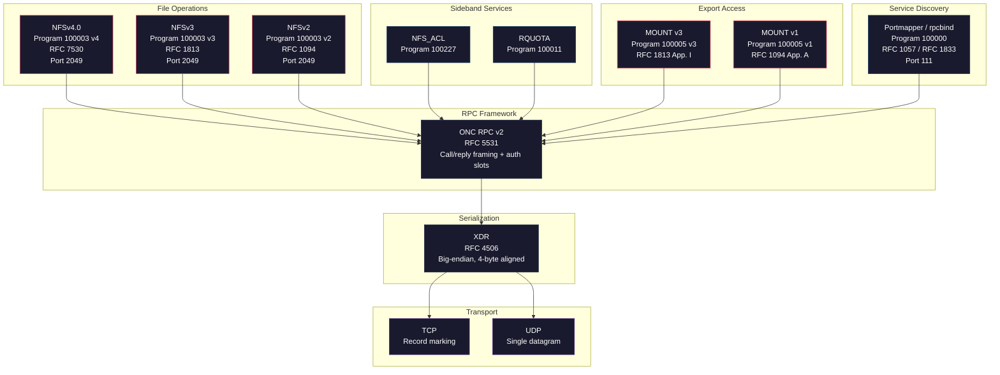

# Protocols

NFS is not a single protocol. It is a stack of five or more distinct RPC (Remote Procedure Call) services layered on a common serialization format and transport, each with its own program number, wire contract, and security posture. An attacker who understands only "NFS" as a monolith misses the seams between layers, and those seams are where most of the interesting vulnerabilities live.

This section documents every protocol in the stack at the wire level: data types, procedure signatures, status codes, and security-relevant behavior. Each page corresponds to one nfswolf crate and one or more RFCs.

## Stack diagram



## Protocol overview

| Layer | Protocol | RFC | Port | Auth | nfswolf crate | Page |
|-------|----------|-----|------|------|---------------|------|
| Serialization | XDR | RFC 4506 | -- | None | `onc-xdr` | [ONC XDR](xdr.md) |
| RPC framework | ONC RPC v2 | RFC 5531 | -- | AUTH_SYS / RPCSEC_GSS | `onc-rpc-client` | [ONC RPC](rpc.md) |
| Service discovery | Portmapper v2 / rpcbind v3-v4 | RFC 1057 / RFC 1833 | 111 | None | `onc-rpcbind` | [Portmapper](portmapper.md) |
| Export access | MOUNT v1 / v3 | RFC 1094 App. A / RFC 1813 App. I | Dynamic | IP-based ACL | `nfs-mount` | [MOUNT](mount.md) |
| File operations | NFSv2 | RFC 1094 | 2049 | AUTH_SYS | `nfs-v2` | [NFSv2](nfsv2.md) |
| File operations | NFSv3 | RFC 1813 | 2049 | AUTH_SYS / RPCSEC_GSS (Kerberos) | `nfs-v3` | [NFSv3](nfsv3.md) |
| File operations | NFSv4.0 | RFC 7530 | 2049 | AUTH_SYS / RPCSEC_GSS (Kerberos) | `nfs-v4` | [NFSv4](nfsv4/index.md) |
| POSIX ACLs | NFS_ACL | Linux-specific | Dynamic | AUTH_SYS | in-tree | [NFS_ACL](nfs-acl.md) |
| Quotas | RQUOTA | Sun RPC | Dynamic | AUTH_SYS | in-tree | [RQUOTA](rquota.md) |

## Reading order

The protocols build on each other from the bottom up. If you are new to the stack, read them in this order:

1. **[ONC XDR](xdr.md)**: the serialization format underneath everything. Every byte on the wire is XDR-encoded. Understanding XDR encoding rules (big-endian integers, 4-byte alignment, length-prefixed variable data) makes the rest of the stack readable.

2. **[ONC RPC](rpc.md)**: the call/reply framing that carries every NFS message. RPC defines how programs, versions, and procedures are addressed, how credentials ride alongside procedure arguments, and why AUTH_SYS makes the whole thing exploitable.

3. **[Portmapper and rpcbind](portmapper.md)**: the service discovery layer. Portmapper maps RPC program numbers to network ports, and it does so with no authentication at all. This is the first thing nfswolf queries when scanning a target.

4. **[MOUNT](mount.md)**: the gatekeeper that converts export paths (an export is a directory the server shares over the network) to file handles. MOUNT is the only place in NFSv2/v3 where human-readable paths appear, and the handles it returns are bearer tokens with no revocation mechanism.

5. **[NFSv2](nfsv2.md)**, **[NFSv3](nfsv3.md)**, **[NFSv4](nfsv4/index.md)**: the file operation protocols themselves. Each version adds capabilities and changes the security model, but all three accept AUTH_SYS by default.

6. **[NFS_ACL](nfs-acl.md)** and **[RQUOTA](rquota.md)**: sideband services that extend NFS with POSIX ACL retrieval and quota queries. Both are useful as information disclosure and identity oracle vectors.

## How the layers interact

The critical thing about this stack is that security does not compose across layers. Kerberos (RPCSEC_GSS) on the NFS layer does not protect the portmapper queries that precede it. Export ACLs in MOUNT do not constrain the file handles that NFS accepts. AUTH_SYS credentials pass through RPC without verification. Each layer trusts the one below it, and the bottom layer trusts the network.

For a detailed walkthrough of how these failures chain together, see [The NFS Protocol Stack](../nfs/protocol-stack.md) in the NFS background section.

## nfswolf's crate architecture

nfswolf implements the full stack in pure Rust with no C dependencies. The protocol crates (`crates/`) own the wire format and nothing else: no retries, no pooling, no credential escalation. All security-testing policy lives in `src/proto/` and reaches the protocol crates through a single seam: the `RpcTransport` trait in `onc-rpc-client`. This boundary is enforced by the workspace structure and is not negotiable.

```text
nfswolf (binary)
  src/proto/    -- pooling, circuit breaking, stealth, credential escalation
    |
    v
  RpcTransport  -- the seam (one trait, one method: call)
    |
    v
  crates/       -- pure wire encoding/decoding, no policy
    onc-xdr          XDR codec
    onc-xdr-derive   #[derive(XdrCodec)] proc macro
    onc-rpc-client   RPC framing + AUTH_SYS
    onc-rpcbind      Portmapper + rpcbind
    nfs-mount        MOUNT v1/v3
    nfs-v2           NFSv2
    nfs-v3           NFSv3
    nfs-v4           NFSv4.0
```
