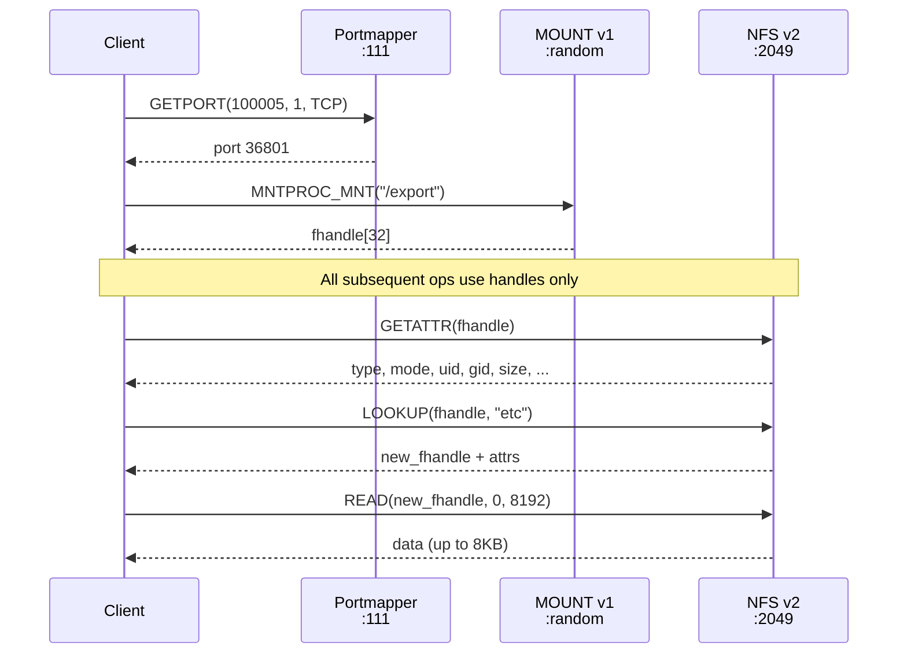

# NFSv2

The first public NFS specification. [RFC 1094](https://www.rfc-editor.org/rfc/rfc1094) was published in March 1989, formalizing the protocol Sun Microsystems had been shipping since 1985. NFSv2 operates as RPC program **100003 version 2** on the conventional port 2049. Its stateless design and minimal complexity made it wildly successful, and permanently insecure.

NFSv2 remains relevant today not because anyone deploys it intentionally, but because servers that still advertise it provide a downgrade path that bypasses every security improvement made since 1989.

---

## Design properties

NFSv2 was designed for a cluster of Sun workstations on a trusted LAN. Every design choice reflects that assumption.

| Property | NFSv2 (RFC 1094) | NFSv3 (RFC 1813) | NFSv4 (RFC 7530) |
|----------|------------------|-------------------|-------------------|
| File handles | Fixed 32 bytes | Variable, up to 64 bytes | Variable, up to 128 bytes |
| Transport | UDP (TCP unofficial) | UDP and TCP | TCP only |
| Max read/write | 8 KB (`MAXDATA = 8192`) | Server-negotiated (typically 1 MB) | Server-negotiated |
| File size limit | 32-bit (4 GB) | 64-bit | 64-bit |
| Write semantics | Synchronous only | Async + COMMIT | Async + COMMIT |
| Permission check | GETATTR + mode bits | ACCESS procedure (advisory) | ACCESS + ACLs |
| Security negotiation | None | MOUNT auth_flavors list | SECINFO operation |
| Auth mechanism | AUTH_SYS only | AUTH_SYS (Kerberos optional) | AUTH_SYS (Kerberos mandatory to implement) |
| MOUNT protocol | Version 1 (no auth flavors) | Version 3 (returns auth flavors) | Not used (PUTROOTFH) |
| Procedures | 18 | 22 | 2 (NULL + COMPOUND with 37 ops) |

!!! info "Stateless by design"
    RFC 1094 Section 1.3: "A server should not need to maintain any protocol state information about any of its clients in order to function correctly." This means no sessions, no access revocation, no replay detection. If the server crashes, clients simply retry. If an attacker replays a captured RPC call, the server processes it again.

### Fixed 32-byte file handles

Every NFSv2 file handle is exactly 32 bytes (`typedef opaque fhandle[FHSIZE]` where `FHSIZE = 32`, RFC 1094 Section 2.3.3). The handle encodes enough information for the server to locate a file on disk, but the client treats it as an opaque blob. On Linux knfsd, the typical layout for ext4 is:

```
[4B header] [4B export_inode] [4B export_gen] [4B inode] [4B gen] [12B zero-pad]
 fixed       known from seed   known           variable   variable  zeros
```

Once you have one handle from the same export, 24 of the 32 bytes are known (header + export context + zero padding). The remaining 8 bytes (inode + generation) are often predictable: root inodes are always low numbers (2 for ext4, 128 for XFS), and generation numbers for root directories are typically 0.

### 8 KB transfer limit

RFC 1094 Section 3.5 defines `MAXDATA = 8192`. Each READ or WRITE carries at most 8,192 bytes of file data. Some older implementations restrict this further to 4 KB. nfswolf's `read_file()` helper reads entire files in 8 KB chunks with a 256 MiB hard cap.

### Synchronous writes

RFC 1094 Section 2.2: "When a procedure returns to the client, the client can assume that the operation has completed and any data associated with the request is now on stable storage." Every WRITE must be flushed to disk before the server replies. NFSv3 introduced async writes with a COMMIT procedure to solve the performance bottleneck this creates.

---

## Procedures

NFSv2 defines 18 procedures. Two are vestigial (ROOT and WRITECACHE), but the remaining 16 form a complete filesystem interface.

| # | Procedure | Args | Returns | Description |
|---|-----------|------|---------|-------------|
| 0 | `NULL` | `void` | `void` | No-op. Server connectivity test. |
| 1 | `GETATTR` | `fhandle` | `attrstat` | Returns file type, mode, uid, gid, size, timestamps for the file identified by the handle. |
| 2 | `SETATTR` | `sattrargs` | `attrstat` | Sets mode, uid, gid, size, atime, mtime. Fields set to `-1` (`0xFFFFFFFF`) are left unchanged. |
| 3 | `ROOT` | `void` | `void` | **Obsolete.** RFC 1094 Section 2.2.4: "This procedure is no longer used." Replaced by MOUNT MNT. nfswolf sends it as a MOUNT-bypass probe: if a server responds with a handle, export ACLs are worthless. |
| 4 | `LOOKUP` | `diropargs` | `diropres` | Resolves one filename component in a directory to a new file handle + attributes. Path traversal chains repeated LOOKUPs. |
| 5 | `READLINK` | `fhandle` | `readlinkres` | Reads the target path of a symbolic link. The path is not interpreted by the server (RFC 1094 Section 2.2.6). |
| 6 | `READ` | `readargs` | `readres` | Reads up to `count` bytes starting at `offset`. The `totalcount` field is unused and removed in v3. |
| 7 | `WRITECACHE` | `void` | `void` | **Reserved no-op.** RFC 1094 Section 2.2.8: "To be used in the next protocol revision." Never implemented by any known server. |
| 8 | `WRITE` | `writeargs` | `attrstat` | Writes data at `offset`. Atomic: data from one WRITE is never mixed with another client's WRITE. The `beginoffset` and `totalcount` fields are ignored. |
| 9 | `CREATE` | `createargs` | `diropres` | Creates a file with initial attributes. Returns the new file handle. |
| 10 | `REMOVE` | `diropargs` | `stat` | Deletes a file. Non-idempotent: retrying after timeout may return `NFSERR_NOENT`. |
| 11 | `RENAME` | `renameargs` | `stat` | Renames or moves a file. Atomic on the server (RFC 1094 Section 2.2.12). |
| 12 | `LINK` | `linkargs` | `stat` | Creates a hard link to an existing file. |
| 13 | `SYMLINK` | `symlinkargs` | `stat` | Creates a symbolic link. On UNIX servers, symlinks always have mode 0777 (RFC 1094 Section 2.2.14). |
| 14 | `MKDIR` | `createargs` | `diropres` | Creates a directory. Returns the new directory handle. |
| 15 | `RMDIR` | `diropargs` | `stat` | Removes an empty directory. Non-idempotent. |
| 16 | `READDIR` | `readdirargs` | `readdirres` | Lists directory entries (fileid + name + cookie). Cookie-based pagination; cookie zero starts from the beginning. EOF flag signals the last page. |
| 17 | `STATFS` | `fhandle` | `statfsres` | Returns filesystem statistics: optimal transfer size (`tsize`), block size (`bsize`), total/free/available blocks. |

??? note "Error codes (RFC 1094 Section 2.3.1)"
    NFSv2 defines 17 error codes. Notable for what is missing: there is no `BADHANDLE` error. Only `NFSERR_STALE` (70) signals an invalid handle, with no way to distinguish "right format, wrong inode" from "wrong format entirely." This collapses the handle oracle that NFSv3 provides via separate STALE/BADHANDLE codes.

    | Code | Name | Meaning |
    |------|------|---------|
    | 0 | `NFS_OK` | Success |
    | 1 | `NFSERR_PERM` | Not owner |
    | 2 | `NFSERR_NOENT` | No such file or directory |
    | 5 | `NFSERR_IO` | I/O error |
    | 6 | `NFSERR_NXIO` | No such device or address |
    | 13 | `NFSERR_ACCES` | Permission denied |
    | 17 | `NFSERR_EXIST` | File exists |
    | 19 | `NFSERR_NODEV` | No such device |
    | 20 | `NFSERR_NOTDIR` | Not a directory |
    | 21 | `NFSERR_ISDIR` | Is a directory |
    | 27 | `NFSERR_FBIG` | File too large |
    | 28 | `NFSERR_NOSPC` | No space left on device |
    | 30 | `NFSERR_ROFS` | Read-only filesystem |
    | 63 | `NFSERR_NAMETOOLONG` | File name too long |
    | 66 | `NFSERR_NOTEMPTY` | Directory not empty |
    | 69 | `NFSERR_DQUOT` | Disk quota exceeded |
    | 70 | `NFSERR_STALE` | Invalid file handle |

---

## Connection flow

An NFSv2 session requires three cooperating RPC programs. The portmapper locates mountd, mountd converts a path to a 32-byte file handle, and nfsd uses that handle for all subsequent file operations.



=== "All services reachable"
    The standard path: portmapper resolves the mountd port, MOUNT v1 MNT converts the export path to a 32-byte file handle, and NFS operations proceed on port 2049. Only the nfsd port is strictly required; the other two are discovery mechanisms with well-documented bypasses.

=== "Portmapper blocked"
    Portmapper only resolves the mountd port. Bypass with `--mount-port PORT` if known, or let nfswolf auto-probe well-known ports (2049 for Windows NFS, 20048 for RHEL/Fedora). Alternatively, skip mountd entirely with `--handle HEX`.

=== "Mountd blocked"
    MOUNT's sole purpose is converting a path to a handle. If you already have a handle from a prior session, escape output, brute-force run, or network capture, use `--handle HEX` to connect directly to nfsd.

=== "Only port 2049"
    The minimum case. You need exactly one thing: a valid 32-byte file handle. Every NFSv2 procedure takes a handle as input. With a valid handle you can GETATTR, LOOKUP, READDIR, and READ without ever touching portmapper or mountd.

---

## Security properties

NFSv2 is the weakest version from a security perspective. Every limitation listed here is a direct consequence of the protocol's age and its design for trusted LANs.

### No authentication verification

AUTH_SYS is the only practical authentication mechanism. The client sends its UID, GID, and supplemental groups in every RPC call. The server accepts these values without any cryptographic verification (RFC 1094 Section 3.3, RFC 2623 Section 2.1). The client simply asserts "I am UID 0" and the server believes it.

### No security negotiation

RFC 2623 Section 2.7: "NFS Version 2 had no support for security flavor negotiation." There is no mechanism for the server to tell the client "you must use Kerberos." NFSv3 added auth flavors in the MOUNT v3 response. NFSv4 added the SECINFO operation. NFSv2 has nothing.

### No ACCESS procedure

NFSv2 has no way to check permissions before attempting an operation. The client tries READ/WRITE/LOOKUP and handles the error. By contrast, NFSv3 added the ACCESS procedure (though it is advisory only per RFC 1813 Section 3.3.4).

### Handles are bearer tokens

RFC 2623 Section 2.6: a file handle works regardless of who presents it. Handles obtained by one credential work with any other credential. There is no binding between handles and clients, no expiration, no revocation. This is true across all NFS versions, but v2's fixed 32-byte format makes handles easier to capture, construct, and replay.

### No encryption

All data and credentials travel in plaintext. File contents, UID/GID assertions, and file handles are visible to any network observer. RFC 9289 (RPC-over-TLS) does not apply to v2.

### No STALE/BADHANDLE distinction

NFSv2 only has `NFSERR_STALE` (error 70) for invalid handles. There is no `BADHANDLE` error code, so the handle oracle that works on NFSv3, which distinguishes "right format, wrong inode" (STALE) from "wrong format entirely" (BADHANDLE), is not available. Handle brute-forcing on v2 is blind.

---

## Attack surface

### UID/GID spoofing

Identical to v3 and v4 with `sec=sys`. The attacker forges AUTH_SYS credentials with any UID/GID. Because v2 has no security flavor negotiation, there is not even a mechanism to offer an alternative. See [F-1.1](../findings/identity/F-1.1-uid-gid-spoofing.md).

### Export escape

Fixed 32-byte handles are simpler to construct than v3's variable-length handles. Given one handle from an export, the filesystem UUID and export context are known, so the attacker only needs to guess the inode and generation number. Root inodes are predictable (inode 2 for ext4, generation 0 at mkfs time), making the escape deterministic for many filesystem types. The `Nfs2EscapeProbe` implementation handles v2-specific escape across 18 filesystem types. See [F-2.1](../findings/access-control/F-2.1-export-escape.md).

### Handle brute-force

The fixed 32-byte format with a smaller search space makes brute-forcing more practical on v2 than on v3. Root directory handles are often constructible from a single sample: the header, fsid, and export context are constant, and the inode is known. See [F-2.2](../findings/access-control/F-2.2-file-handle-guessing.md).

### Version downgrade

The defining v2 attack. A server that advertises NFSv2 alongside v3 or v4 provides a downgrade path. Even when an export is configured with `sec=krb5`, the v2 protocol has no mechanism to enforce it. More critically, MOUNT v1 leaks the root file handle without requiring Kerberos credentials. The handle, once obtained, is a bearer token usable from any client. See [F-1.6](../findings/identity/F-1.6-nfsv2-downgrade.md).

!!! danger "MOUNT v1 handle leak"
    Linux knfsd enforces `sec=krb5` on v2 NFS operations (tested on kernels 2.6.32+), so READ/WRITE calls are rejected without Kerberos. But MOUNT v1 MNT still returns the root file handle without Kerberos auth. The handle is then usable via NFSv3 or v4 AUTH_SYS calls, bypassing the Kerberos requirement entirely. Mixed `sec=krb5:sys` exports are fully accessible via AUTH_SYS on both versions.

---

## Modern relevance

NFSv2 is not a historical curiosity. It appears in production environments for three reasons:

1. **Default server configurations.** Linux knfsd still supports NFSv2 unless explicitly disabled with `vers2=n` in `/etc/nfs.conf` or `RPCNFSDARGS="-N 2"` in the init config. Many servers inherited v2 support when they were first provisioned and never turned it off.

2. **Embedded and legacy systems.** Older Solaris installations, HP-UX servers, embedded NAS devices, and industrial control systems may run NFSv2 as their only protocol version. The `scan` subcommand checks for program 100003 version 2 in portmapper DUMP output and flags it as a downgrade risk.

3. **Mixed-version environments.** When a server advertises v2 alongside v3 or v4, any client can explicitly downgrade to v2 and bypass the security improvements of later versions. The server administrator may not realize v2 is enabled.

??? example "Disabling NFSv2 on Linux"
    ```ini
    # /etc/nfs.conf
    [nfsd]
    vers2 = n
    vers3 = y
    vers4 = y
    ```

    Or via the legacy init script variable:
    ```bash
    # /etc/sysconfig/nfs or /etc/default/nfs-kernel-server
    RPCNFSDARGS="-N 2"
    ```

    After changing the configuration, restart `nfs-server.service` and verify with `rpcinfo -p localhost`: program 100003 version 2 should no longer appear.

---

## nfswolf support

nfswolf provides full NFSv2 support across the entire attack path.

### Shell

`--nfs-version 2` enters an NFSv2 shell with all 52 commands via `NfsShell<V2Ops>`. The shell connects through MOUNT v1 MNT to obtain the root handle, then operates over NFSv2 on port 2049. `--handle HEX` bypasses MOUNT entirely for direct handle-based access.

Identity changes (`uid`, `gid`, `hostname`, `impersonate`, `su`) work differently in v2 than in v3/v4: because v2 connections carry a single credential bound at connect time, changing identity requires tearing down the TCP session and reconnecting with new AUTH_SYS credentials + re-MOUNT. `V2Ops` handles this transparently.

### Escape

The escape algorithm supports NFSv2 through `Nfs2EscapeProbe`, covering 18 of 19 filesystem types. The `escape` subcommand gathers seed handles from MOUNT v1 and probes candidate escape handles against NFSv2 GETATTR. `--fast` mode also works over v2 when v3 is unavailable.

### Auto-detection

When `--nfs-version` is omitted, nfswolf probes v3 first, then v2, then v4. If a server only speaks v2, the shell and escape automatically fall back to NFSv2 without additional flags.

### Credential escalation

Credential escalation via `try_with_escalation()` is shared across v2, v3, and v4. On v2, escalation is implemented by reconnecting: new TCP socket, new AUTH_SYS credentials, re-MOUNT. The credential ladder (`credential_ladder()` / `credential_ladder_with()`) applies the same evidence-driven strategy regardless of version.

---

## Further reading

- [NFSv2 Findings](../findings/by-protocol/nfsv2.md) -- all findings applicable to NFSv2, with v2-specific exploitation notes
- [F-1.6: NFSv2 Downgrade](../findings/identity/F-1.6-nfsv2-downgrade.md) -- the defining v2 vulnerability
- [F-2.1: Export Escape](../findings/access-control/F-2.1-export-escape.md) -- handle construction for filesystem breakout
- [File Handles](../nfs/file-handles.md) -- bearer-token semantics, format analysis, and escape construction
- [History of NFS](../nfs/history.md) -- how NFSv2 fits into 40 years of NFS evolution
- [RFC 1094](https://www.rfc-editor.org/rfc/rfc1094) -- NFSv2 specification
- [RFC 2623](https://www.rfc-editor.org/rfc/rfc2623) -- NFS security analysis (Section 2.7 on v2's lack of security negotiation)
