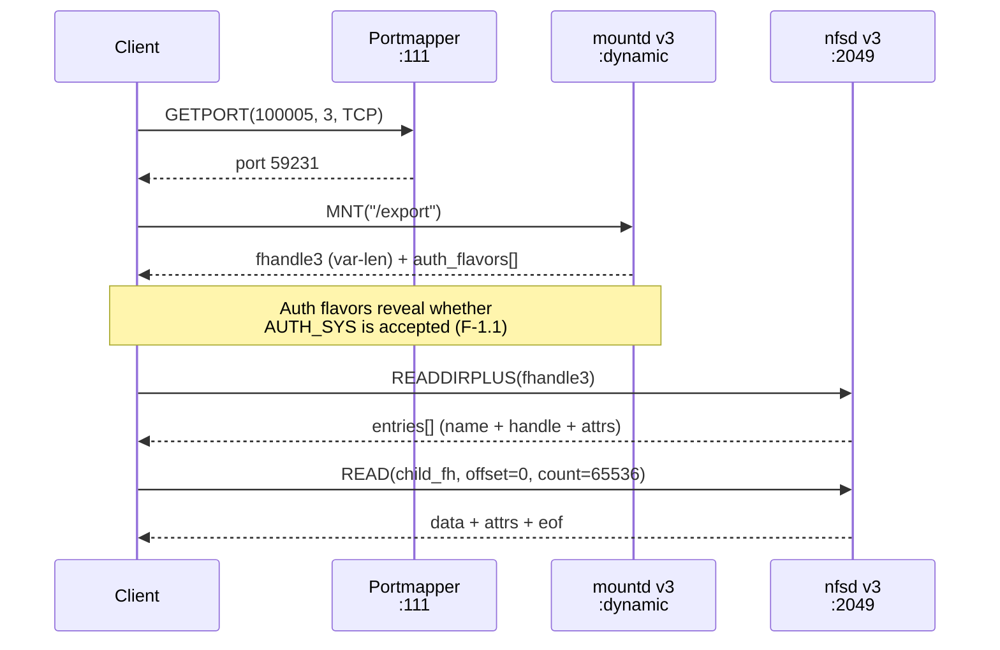

# NFSv3

**RFC 1813 (June 1995). Program 100003, version 3. Port 2049. The most widely deployed NFS version and the best version for attackers.**

NFSv3 is the evolutionary successor to NFSv2, retaining the same stateless, AUTH_SYS-based trust model while adding variable-length handles, 64-bit file sizes, asynchronous writes, and several new procedures that are directly useful for security research. It remains the dominant version on Linux, Solaris, FreeBSD, and enterprise NAS appliances. Most "NFS" deployments in the wild are NFSv3 with AUTH_SYS: fully spoofable credentials, bearer-token handles, and zero encryption.

---

## What changed from NFSv2

NFSv3 does not fix any of NFSv2's security flaws. The trust model is identical: AUTH_SYS credentials are unsigned assertions, file handles are bearer tokens reusable by any client, and there is no wire encryption. What v3 changes is operational: larger handles, bigger files, better performance primitives, and several new procedures that happen to be extremely useful to an attacker.

### Changes that matter for security work

| Change | NFSv2 | NFSv3 | Impact |
|--------|-------|-------|--------|
| File handle size | Fixed 32 bytes | Variable, up to 64 bytes | Larger brute-force search space, but the STALE/BADHANDLE oracle compensates |
| File offsets and sizes | 32-bit (2 GB max) | 64-bit (no practical limit) | No size cap on exfiltration |
| Write mode | Synchronous only (FILE_SYNC) | UNSTABLE + COMMIT | Async writes are 5-10x faster for bulk write attacks |
| ACCESS procedure | None | Advisory permission bitmask | Silent permission probing without triggering writes |
| READDIRPLUS | None | Filenames + handles + full attrs in one call | Map an entire directory in a single RPC |
| MKNOD | None | Create sockets, FIFOs, block/char devices | Device file creation for privilege escalation on writable exports |
| FSINFO / PATHCONF | None | Filesystem capabilities and POSIX config | OS/FS fingerprinting (case sensitivity reveals Windows/macOS) |
| Auth flavor discovery | None | MOUNT v3 returns accepted auth flavors | Reveals whether Kerberos is required before wasting time on AUTH_SYS |
| Error discrimination | STALE for all handle errors | STALE vs BADHANDLE | Format-correct handles identified immediately, narrowing brute-force to inode/gen sweep |
| wcc_data | None | Pre/post attributes on mutating ops | Confirms modifications succeeded without a follow-up GETATTR |
| CREATE modes | Overwrite only | UNCHECKED / GUARDED / EXCLUSIVE | EXCLUSIVE provides atomic create with verifier |

### Removed procedures

NFSv2's ROOT (procedure 3) and WRITECACHE (procedure 7) were removed. MKNOD replaced the overloaded CREATE that some v2 implementations used for special files.

### Auth model: unchanged

Despite all the new features, the core security model is identical to NFSv2. AUTH_SYS credentials are not signed or verified (RFC 2623 Section 2.1). File handles are bearer tokens (RFC 2623 Section 2.6). Any client on the network can claim any UID/GID. The `secure` export option (requiring source port < 1024) is the only transport-level defense, and it is trivially bypassed on any system with root access.

NFSv3 adds the ability to *detect* whether Kerberos is required (via MOUNT v3 auth flavor lists), but it does not add any mechanism to *enforce* stronger auth at the NFS protocol level itself. AUTH_SYS remains the path of least resistance.

---

## Connection flow

NFSv3 requires three RPC services to establish a session: portmapper for service discovery, MOUNT v3 for handle acquisition, and NFS v3 for file operations.



Key differences from the NFSv2 flow: GETPORT queries program 100005 version **3** (not version 1). MOUNT v3 returns variable-length handles and a list of supported auth flavors. NFS v3 uses READDIRPLUS (not READDIR + per-entry LOOKUP) to map directories in a single call.

!!! tip "Bypassing the chain"
    - **Portmapper blocked**: Use `--mount-port` to specify mountd directly, or `--handle` to skip both portmapper and mountd.
    - **mountd blocked**: Use `--handle HEX` with a handle from a prior session, escape output, brute-force, or network capture.
    - **Only port 2049**: A valid file handle is the sole requirement. Once you have one, READDIRPLUS and LOOKUP provide full directory traversal.

---

## All 22 procedures

RFC 1813 Section 3.3 defines 22 procedures for program 100003 version 3. nfswolf implements all 22 via the in-tree `nfs-v3` crate.

| # | Procedure | New in v3 | Description |
|---|-----------|-----------|-------------|
| 0 | `NULL` | | No-op. Connectivity probe. |
| 1 | `GETATTR` | | Return file attributes: type, mode, nlink, uid, gid, size (64-bit), used, rdev, fsid, fileid, atime/mtime/ctime. |
| 2 | `SETATTR` | | Set file attributes with optional ctime guard for atomic modification. |
| 3 | `LOOKUP` | | Resolve one filename component within a directory. Returns child handle + attributes. |
| 4 | `ACCESS` | :material-new-box: | Advisory permission check. Returns bitmask of allowed operations. **See below.** |
| 5 | `READLINK` | | Read symbolic link target path. |
| 6 | `READ` | | Read file data. 64-bit offset. Returns data + post-op attrs + EOF flag. |
| 7 | `WRITE` | | Write file data. Supports three stability levels: `UNSTABLE`, `DATA_SYNC`, `FILE_SYNC`. Returns bytes written + write verifier. |
| 8 | `CREATE` | | Create regular file. Modes: UNCHECKED (overwrite OK), GUARDED (fail if exists), EXCLUSIVE (atomic with verifier). |
| 9 | `MKDIR` | | Create directory. Returns handle + attrs + wcc_data. |
| 10 | `SYMLINK` | | Create symbolic link. Returns handle + attrs (v2 returned only status). |
| 11 | `MKNOD` | :material-new-box: | Create special files: sockets, FIFOs, block devices, character devices. |
| 12 | `REMOVE` | | Delete file. Returns wcc_data. |
| 13 | `RMDIR` | | Remove directory. Returns wcc_data. |
| 14 | `RENAME` | | Rename/move file. Returns wcc_data for both source and destination directories. |
| 15 | `LINK` | | Create hard link. Returns post-op attrs + wcc_data. |
| 16 | `READDIR` | | List directory entries: fileid + name + cookie. 64-bit cookies with 8-byte cookieverf. |
| 17 | `READDIRPLUS` | :material-new-box: | Extended directory listing: name + handle + full attributes per entry. **See below.** |
| 18 | `FSSTAT` | :material-new-box: | Dynamic filesystem stats: total/free/available bytes and file slots. 64-bit counters. |
| 19 | `FSINFO` | :material-new-box: | Static filesystem info: max read/write/readdir sizes, time granularity, link/symlink support, homogeneous flag. |
| 20 | `PATHCONF` | :material-new-box: | POSIX pathconf values: max name length, `no_trunc`, `chown_restricted`, `case_insensitive`, `case_preserving`. |
| 21 | `COMMIT` | :material-new-box: | Flush unstable writes to stable storage. Returns write verifier for crash detection. |

!!! note "wcc_data"
    Weak cache consistency data (`wcc_data`) is returned by every mutating procedure (SETATTR, WRITE, CREATE, MKDIR, SYMLINK, MKNOD, REMOVE, RMDIR, RENAME, LINK). It contains the directory's pre-operation attributes (size, mtime, ctime) and post-operation attributes, letting the client detect concurrent modifications without a separate GETATTR round trip.

---

## The ACCESS procedure

RFC 1813 Section 3.3.4. Procedure 4. New in NFSv3.

ACCESS lets a client ask the server whether a given set of operations would be permitted for the credentials in the request. The client sends a file handle and a bitmask of requested permissions; the server returns a bitmask of granted permissions.

### Access bits

| Bit | Value | Meaning |
|-----|-------|---------|
| `ACCESS3_READ` | `0x0001` | Read data from file or read a directory |
| `ACCESS3_LOOKUP` | `0x0002` | Look up a name in a directory |
| `ACCESS3_MODIFY` | `0x0004` | Rewrite existing file data or modify directory entries |
| `ACCESS3_EXTEND` | `0x0008` | Write new data or add directory entries |
| `ACCESS3_DELETE` | `0x0010` | Delete an existing directory entry |
| `ACCESS3_EXECUTE` | `0x0020` | Execute file (no meaning for directories) |

### Why ACCESS is advisory-only

!!! danger "ACCESS results are not binding"
    RFC 1813 Section 3.3.4 states explicitly:

    > *"The results of this procedure are necessarily advisory in nature. That is, a return status of NFS3_OK and the appropriate bit set in the bit mask does not imply that such access will be allowed to the file system object in the future, as access rights can be revoked by the server at any time."*

    This cuts both ways. The server may report "denied" but still allow the operation when attempted. Or it may report "allowed" and then deny the actual READ or WRITE. Always confirm with the real operation.

This advisory nature is a design flaw from the attacker's perspective and a false-confidence generator for defenders:

- **For attackers**: ACCESS is a silent permission oracle. The UID sprayer uses ACCESS to test thousands of credentials without triggering actual reads or writes. A credential that gets `ACCESS3_READ` is worth trying, but the only definitive test is a real READ call.
- **For defenders**: ACCESS results give false confidence. A monitoring system that checks ACCESS and sees "denied" may conclude an export is locked down, while a direct READ with the same credentials succeeds. The server's ACCESS response depends on its own internal mapping, which may differ from the actual enforcement path.

nfswolf treats ACCESS as a hint for prioritizing credential candidates, never as a final answer. Every positive ACCESS result is confirmed by attempting the actual operation (per RFC 1813 Section 3.3.4 implementation guidance).

---

## READDIRPLUS

RFC 1813 Section 3.3.17. Procedure 17. New in NFSv3.

READDIRPLUS is the single most useful procedure for NFS security research. One call returns the filename, file handle, and complete `fattr3` attributes for every entry in a directory. On NFSv2, the same information requires READDIR (names and fileids only) followed by a LOOKUP + GETATTR for each entry: N+1 round trips for N files.

### What it returns per entry

```text
struct entryplus3 {
    fileid3      fileid;          // inode number
    filename3    name;            // filename
    cookie3      cookie;          // pagination cursor
    post_op_attr name_attributes; // full fattr3: uid, gid, mode, size, times...
    post_op_fh3  name_handle;     // usable file handle for this entry
    entryplus3   *nextentry;
};
```

### Why this matters

A single READDIRPLUS on a directory with 100 files replaces 201 RPCs (1 READDIR + 100 LOOKUP + 100 GETATTR) with 1 RPC. Beyond the performance gain, the returned data is a goldmine:

- **UID/GID harvesting** -- every file's owner UID and group GID are exposed. nfswolf's credential ladder (`credential_ladder_with()`) feeds READDIRPLUS results into `observed_identities()` to rank real UIDs by frequency, then uses those identities for targeted escalation instead of blind spraying.
- **Permission mapping** -- mode bits for every file reveal which entries are world-readable, which have SUID/SGID set, and which are writable by specific groups.
- **Handle collection** -- file handles for every entry are returned without individual LOOKUP calls. These handles can be reused across credentials (bearer token property) and persisted for future sessions.
- **Size and timestamp analysis** -- file sizes reveal large databases and backups worth exfiltrating. Recent modification times indicate active files.

!!! warning "Some servers restrict READDIRPLUS"
    Certain NFS servers (notably some NetApp firmware versions) return `NFS3ERR_NOTSUPP` for READDIRPLUS. Fall back to READDIR + individual LOOKUPs when this happens. nfswolf handles this transparently.

---

## Security properties

### Authentication

NFSv3 uses the same RPC authentication model as NFSv2. Every call carries AUTH_SYS credentials (a UID, GID, auxiliary group list, and machine name) that the server trusts without cryptographic verification (RFC 5531 Appendix A). The only new element is that MOUNT v3 returns a list of supported auth flavors alongside the root handle, so the client knows immediately whether the export accepts AUTH_SYS or requires RPCSEC_GSS.

### File handles

Handles grew from fixed 32 bytes to variable-length up to 64 bytes (RFC 1813 Section 2.4, `NFS3_FHSIZE = 64`). They remain opaque bearer tokens with no session binding, no IP binding, and no credential binding. A handle obtained by one client works when presented by any other client with any credentials (RFC 2623 Section 2.6).

The internal structure on Linux knfsd is documented in the [file handles](../nfs/file-handles.md) page. Typical Linux ext4 v3 handles are 28-44 bytes:

```text
[4B header] [4B export_inode] [4B export_gen] [16B UUID] [4B inode] [4B gen]
 fixed       known from seed   known           known      GUESS      GUESS
```

### The STALE/BADHANDLE oracle

NFSv3 introduced `NFS3ERR_BADHANDLE` (10001) alongside the existing `NFS3ERR_STALE` (70), creating a two-signal oracle for handle brute-forcing (RFC 1813 Section 2.6):

| Error | Code | Meaning | Implication |
|-------|------|---------|-------------|
| `NFS3ERR_STALE` | 70 | Handle format recognized, but the specific inode/generation is invalid | The handle layout is correct. Narrow search to inode/gen values. |
| `NFS3ERR_BADHANDLE` | 10001 | Handle failed internal consistency checks | Wrong format entirely. Adjust the header/structure. |

On NFSv2, both cases return `NFSERR_STALE`, so brute-forcing is blind. On NFSv3, the oracle immediately tells you when the format is correct, reducing the search to an inode/generation sweep. For root directory handles (inode 2, generation 0 on ext4), the search is instant.

### Error codes

RFC 1813 Section 2.6 defines 22 error codes. The security-relevant ones:

| Code | Name | Security relevance |
|------|------|--------------------|
| 1 | `NFS3ERR_PERM` | Not owner. Expected during credential escalation; does NOT trip nfswolf's circuit breaker. |
| 13 | `NFS3ERR_ACCES` | Permission denied. Expected during UID spraying; does NOT trip the circuit breaker. |
| 30 | `NFS3ERR_ROFS` | Read-only filesystem. The export is read-only at the filesystem level, not just via export options. |
| 70 | `NFS3ERR_STALE` | Invalid handle content. Oracle signal: format is correct. |
| 10001 | `NFS3ERR_BADHANDLE` | Invalid handle format. Oracle signal: wrong structure. |
| 10006 | `NFS3ERR_SERVERFAULT` | Server error. Transient; trips the circuit breaker. |
| 10008 | `NFS3ERR_JUKEBOX` | Retry later. Transient; trips the circuit breaker. |

---

## Why v3 is better for attackers

v3 is better for the attacker in every way except one.

### v3 advantages

- **Handle oracle** -- v3 distinguishes STALE (right format, wrong inode) from BADHANDLE (wrong format). v2 returns STALE for both. Handle brute-forcing on v3 tells you immediately when your handle structure is correct, reducing the search to an inode/gen sweep. On v2, brute-forcing is blind.
- **READDIRPLUS** -- one call returns every filename, file handle, and full attributes for an entire directory. Mapping a 100-file directory: v3 = 1 RPC, v2 = 201 RPCs.
- **ACCESS** -- silent permission probing. Check READ/WRITE/EXECUTE permissions for any UID/GID without attempting the operation. The UID sprayer uses this to test thousands of credentials quietly. On v2, you blind-try READ/WRITE and catch the error.
- **64-bit file sizes** -- v2 caps at 2 GB. v3 has no practical limit. Exfiltrating a 10 GB database dump is impossible on v2.
- **Async writes** -- WRITE with `stable=UNSTABLE` lets the server buffer writes in memory. Bulk write attacks are 5-10x faster than v2's mandatory synchronous flush. Call COMMIT once at the end.
- **Auth flavor discovery** -- MOUNT v3 returns which auth methods the export supports. You learn immediately if Kerberos is required (don't waste time) or if AUTH_SYS is accepted (game on). v2 has no such signal.
- **MKNOD** -- create device files on writable exports. Combined with no_root_squash, this enables device-based privilege escalation paths (F-4.3).
- **PATHCONF** -- `case_insensitive` and `case_preserving` fields fingerprint the server OS. Case-insensitive filesystems indicate Windows or macOS NFS servers.

### The one v2 advantage

!!! info "v2 downgrade can bypass Kerberos"
    Some servers that enforce `sec=krb5` on v3 exports skip enforcement on v2 because NFSv2 has no `sec=` negotiation mechanism (RFC 2623 Section 2.7). If a server supports both versions, try v2 first, since auth requirements may be weaker or absent. Pass `--nfs-version 2` to attempt the downgrade. The credential ladder does not auto-downgrade across versions.

    This was live-tested against Linux knfsd (kernels 2.6.32 through 4.15). Linux knfsd 2.6.32+ enforces `sec=krb5` on v2 NFS operations, but MOUNT v1 leaks handles without krb5 auth. Mixed `sec=krb5:sys` exports are fully accessible via AUTH_SYS on both versions.

### Bottom line

If the server supports v3, use v3. The only reason to touch v2 is when v3 enforces Kerberos but v2 doesn't.

---

## nfswolf implementation

nfswolf implements all 22 NFSv3 procedures via the in-tree `nfs-v3` crate, which owns the XDR wire types and raw client. The `PooledTransport` in `src/proto/transport.rs` handles connection pooling, circuit breaking, stealth delays, and credential injection transparently via the `RpcTransport` seam; individual client methods contain zero policy.

### Circuit breaker behavior

Permission errors (`NFS3ERR_ACCES`, `NFS3ERR_PERM`) are expected during UID spraying and credential escalation. They do **not** trip the circuit breaker. Only transient errors (`NFS3ERR_IO`, `NFS3ERR_JUKEBOX`, `NFS3ERR_SERVERFAULT`) trip the breaker and poison the connection.

### Related pages

- [File Handles](../nfs/file-handles.md) -- handle structure, per-filesystem encodings, escape construction
- [Authentication Model](../nfs/authentication.md) -- AUTH_SYS, RPCSEC_GSS, flavor comparison
- [The NFS Protocol Stack](../nfs/protocol-stack.md) -- how NFSv3 fits in the full RPC stack
- [F-1.1: UID/GID Spoofing](../findings/identity/F-1.1-uid-gid-spoofing.md) -- the foundational AUTH_SYS finding
- [F-2.1: Export Escape](../findings/access-control/F-2.1-export-escape.md) -- handle manipulation to escape exports
- [F-5.2: READDIRPLUS Handle Harvesting](../findings/info-disclosure/F-5.2-readdirplus-handle-harvesting.md) -- identity and handle leakage
