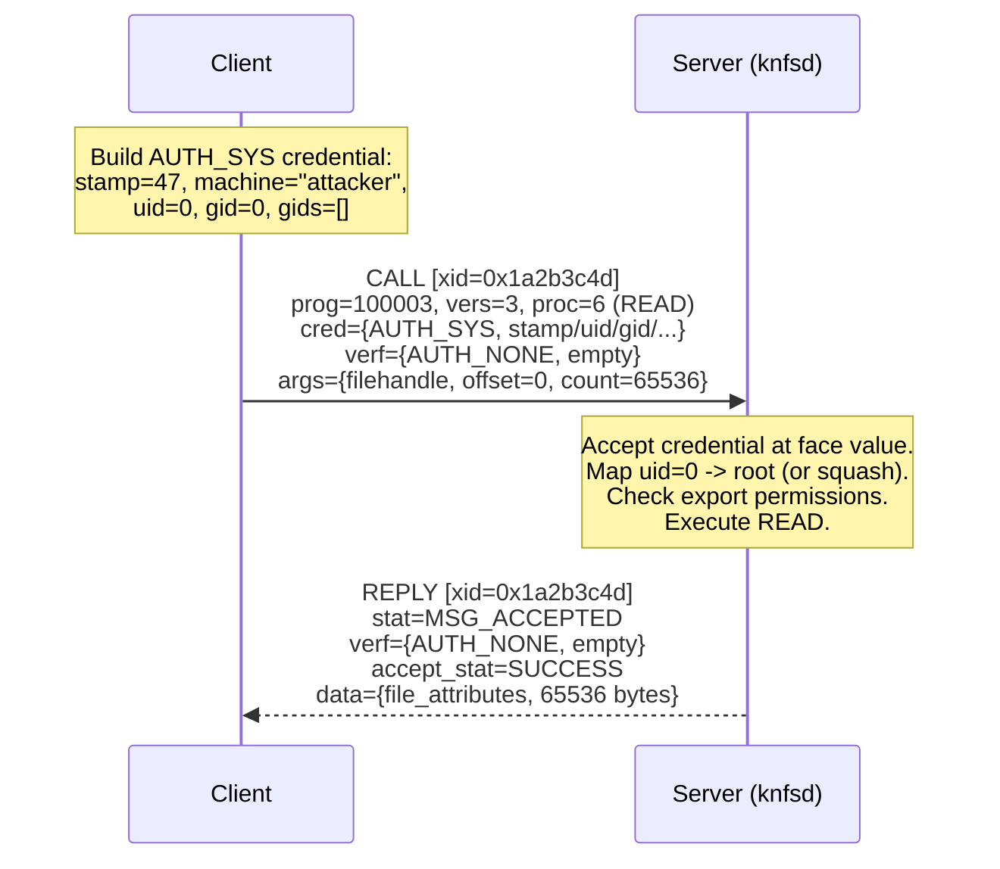

# ONC RPC

**ONC RPC version 2 is the call/reply framework that carries every protocol in the NFS stack.** NFS itself, MOUNT, portmapper, NLM, RQUOTA, and NFS_ACL are all RPC programs. Each call specifies a program number, a version number, and a procedure number; the server dispatches accordingly and returns a reply. The protocol is defined in RFC 5531 (which obsoletes RFC 1831 without wire changes) and encoded with XDR (RFC 4506).

From a security perspective, ONC RPC has no built-in encryption, no per-connection state, and an authentication model where the dominant flavor -- AUTH_SYS -- trusts the caller's self-asserted identity without any verification. Every security property that NFS relies on (access control, credential checking, replay suppression) is layered on top of a framework that was not designed to enforce any of them.

---

## The RPC model

Every interaction is a single call message paired with a single reply message. The client constructs a call, sends it, and blocks until the reply arrives (though implementations may operate asynchronously). The server receives the call, dispatches to the appropriate procedure, and sends back the result.

A procedure is uniquely identified by three integers:

| Identifier | Purpose | Example |
|------------|---------|---------|
| **Program number** | Which service | `100003` = NFS |
| **Version number** | Which protocol revision | `3` = NFSv3 |
| **Procedure number** | Which operation | `6` = READ |

This triple is analogous to a function pointer: `NFS.v3.READ(args) -> result`. The RPC layer routes the call; it does not interpret the arguments or results, which are blocks of data whose meaning is defined by each program's protocol specification.

!!! info "Procedure 0 is always NULL"
    By convention (RFC 5531 Section 12.1), procedure 0 of every RPC program accepts no arguments and returns no results. It exists purely for liveness probing and round-trip measurement. NULL must not require authentication, making it useful for port discovery and version fingerprinting.

---

## Message format

### Call message

Every RPC message begins with a 4-byte transaction identifier (XID), followed by a tagged union on message type. A call message (type 0) contains:

```text
struct rpc_msg {
    unsigned int xid;             /* transaction identifier */
    union switch (msg_type mtype) {
    case CALL:
        call_body cbody;
    } body;
};

struct call_body {
    unsigned int rpcvers;         /* must be 2 */
    unsigned int prog;            /* program number */
    unsigned int vers;            /* program version */
    unsigned int proc;            /* procedure number */
    opaque_auth  cred;            /* caller credentials */
    opaque_auth  verf;            /* caller verifier */
    /* procedure-specific arguments follow */
};
```

In plain English: every call starts with a transaction ID, then specifies which service (program), which version, and which operation (procedure) to invoke. The caller's identity (credential) and a verifier ride alongside, followed by the operation's arguments.

### Field reference

| Field | XDR Type | Size | Purpose |
|-------|----------|------|---------|
| `xid` | `unsigned int` | 4 bytes | Transaction ID. The client generates it; the server echoes it in the reply so the client can match responses to outstanding calls. |
| `mtype` | `enum msg_type` | 4 bytes | `CALL` (0) or `REPLY` (1). |
| `rpcvers` | `unsigned int` | 4 bytes | Always `2` for ONC RPC v2. |
| `prog` | `unsigned int` | 4 bytes | IANA-assigned program number (e.g., 100003). |
| `vers` | `unsigned int` | 4 bytes | Program version (must be non-zero; RFC 5531 Section 8.1). |
| `proc` | `unsigned int` | 4 bytes | Procedure number within the program. |
| `cred` | `opaque_auth` | 4 + 4 + body | Authentication credential: flavor enum + up to 400 bytes of flavor-specific data. |
| `verf` | `opaque_auth` | 4 + 4 + body | Authentication verifier: validates the credential. For AUTH_SYS, this is AUTH_NONE (empty). |

After the verifier, the procedure-specific XDR-encoded arguments follow directly with no additional framing.

### Reply message

A reply message (type 1) uses a two-level tagged union:

```text
union reply_body switch (reply_stat stat) {
case MSG_ACCEPTED:
    accepted_reply areply;
case MSG_DENIED:
    rejected_reply rreply;
};
```

In plain English: the reply is either "accepted" (the server processed the call) or "denied" (rejected before processing). An accepted reply carries a server verifier (so the client can authenticate the server in flavors that support mutual authentication) followed by a status code. A denied reply indicates either an RPC version mismatch or an authentication failure. The full reply taxonomy is covered in [Reply types](#reply-types) below.

---

## Record marking (TCP framing)

RPC is transport-independent, but needs a way to delimit messages on stream transports. TCP uses **record marking** (RM), defined in RFC 5531 Section 11.

Each record is composed of one or more **fragments**. Each fragment begins with a 4-byte header:

```text
 0                   1                   2                   3
 0 1 2 3 4 5 6 7 8 9 0 1 2 3 4 5 6 7 8 9 0 1 2 3 4 5 6 7 8 9 0 1
+-+-+-+-+-+-+-+-+-+-+-+-+-+-+-+-+-+-+-+-+-+-+-+-+-+-+-+-+-+-+-+-+
|L|                    Fragment Length (31 bits)                 |
+-+-+-+-+-+-+-+-+-+-+-+-+-+-+-+-+-+-+-+-+-+-+-+-+-+-+-+-+-+-+-+-+
|                       Fragment Data ...                        |
```

| Bit | Name | Meaning |
|-----|------|---------|
| 31 (MSB) | Last-fragment flag | `1` = this is the final fragment of the record; `0` = more fragments follow. |
| 30..0 | Length | Number of bytes of fragment data that follow (up to 2^31 - 1). |

In practice, most RPC implementations send each message as a single fragment with the last-fragment bit set. The fragment header is NOT XDR-encoded; it uses raw network byte order (big-endian).

**UDP has no record marking.** Each UDP datagram carries exactly one complete RPC message. The datagram boundaries are the message boundaries.

!!! tip "nfswolf implementation"
    The `onc-rpc-client` crate's TCP transport reads the 4-byte RM header, assembles all fragments into a complete record, then XDR-decodes the RPC message. UDP uses the single-shot `call_rpc_udp()` helper in `src/proto/udp.rs`, which sends and receives one datagram per call with no record marking.

---

## Authentication

Every RPC call carries two `opaque_auth` structures (credential + verifier), and every reply carries one (response verifier). The `opaque_auth` type is:

```text
struct opaque_auth {
    auth_flavor flavor;     /* which authentication protocol */
    opaque body<400>;       /* up to 400 bytes of flavor-specific data */
};
```

In plain English: each credential is a flavor tag (which auth method) plus up to 400 bytes of auth-method-specific data.

The RPC layer does not interpret the body; it passes the raw bytes through to the service. The service (or an underlying authentication module) decides whether to accept or reject the credential. This design means authentication is per-call, not per-connection: each individual RPC message carries its own credentials, and the server re-evaluates them on every call.

### Authentication flavors

| Flavor | Value | Defined In | What It Does |
|--------|-------|------------|--------------|
| `AUTH_NONE` | 0 | RFC 5531 Section 10.1 | No identity. Empty credential and verifier. Used for NULL probes and RPCSEC_GSS context setup. |
| `AUTH_SYS` | 1 | RFC 5531 Appendix A | Client-asserted UNIX identity: `stamp`, `machinename`, `uid`, `gid`, `gids<16>`. Verifier is AUTH_NONE. No cryptographic protection. |
| `AUTH_SHORT` | 2 | RFC 5531 Appendix A | Server-assigned opaque token returned in a reply verifier after an AUTH_SYS call. The client replays this token in subsequent calls to save bandwidth. |
| `AUTH_DH` | 3 | RFC 2695 | Diffie-Hellman key exchange + DES-encrypted timestamps. Deprecated and insecure (56-bit DES, fixed modulus). |
| `RPCSEC_GSS` | 6 | RFC 2203 | GSS-API wrapper supporting Kerberos 5 and other mechanisms. Provides authentication, optional integrity, and optional privacy (encryption). The only flavor with real security. |

### Credential/verifier flow



The key insight: the call verifier for AUTH_SYS is AUTH_NONE, literally empty. There is nothing for the server to verify. The server trusts the credential's `uid` and `gid` fields because there is no mechanism to challenge them. See [Authentication Model](../nfs/authentication.md) for the full treatment of each flavor.

---

## Program numbers

Program numbers are 32-bit unsigned integers administered by IANA (RFC 5531 Section 8.3). The number space is partitioned:

| Range | Assignment |
|-------|------------|
| `0x00000000` | Reserved |
| `0x00000001` -- `0x1FFFFFFF` | IANA-assigned |
| `0x20000000` -- `0x3FFFFFFF` | Local administrator / private use |
| `0x40000000` -- `0x5FFFFFFF` | Transient (dynamically registered) |
| `0x60000000` -- `0xFFFFFFFF` | Reserved |

### Key program numbers in the NFS ecosystem

| Program | Number | Versions | Purpose |
|---------|--------|----------|---------|
| **Portmapper / rpcbind** | 100000 | 2, 3, 4 | Service discovery. Maps (program, version, protocol) to port. Always on port 111. |
| **NFS** | 100003 | 2, 3, 4 | File operations: read, write, lookup, readdir, create, remove, etc. |
| **MOUNT** | 100005 | 1, 3 | Export enumeration and handle acquisition. Client calls MNT to get the root file handle for an export. |
| **NLM** | 100021 | 1, 3, 4 | Network Lock Manager. Advisory and mandatory file locking over NFS. |
| **NSM** | 100024 | 1 | Network Status Monitor. Crash notification for lock recovery. |
| **NFS_ACL** | 100227 | 2, 3 | POSIX ACL operations. Non-standard extension implemented by Linux knfsd and Solaris. |
| **RQUOTA** | 100011 | 1, 2 | Disk quota queries. Reveals UID existence and filesystem block sizes. |

!!! info "nfswolf's IANA registry"
    nfswolf ships the complete IANA RPC program numbers registry (1251 entries) for offline program identification during scanning. The portmapper DUMP output is matched against this registry to identify every registered service.

---

## Reply types

### Accepted replies (`MSG_ACCEPTED`)

When the server accepts the call at the RPC level (regardless of whether the procedure itself succeeds), it returns an `accepted_reply`:

```text
struct accepted_reply {
    opaque_auth verf;                  /* server's verifier */
    union switch (accept_stat stat) {
    case SUCCESS:
        opaque results[0];             /* procedure-specific results */
    case PROG_MISMATCH:
        struct { unsigned int low; unsigned int high; } mismatch_info;
    default:
        void;                          /* PROG_UNAVAIL, PROC_UNAVAIL,
                                          GARBAGE_ARGS, SYSTEM_ERR */
    } reply_data;
};
```

| Status | Value | Meaning |
|--------|-------|---------|
| `SUCCESS` | 0 | Procedure executed. Results follow. |
| `PROG_UNAVAIL` | 1 | Server does not export this program number. |
| `PROG_MISMATCH` | 2 | Program exists but not at the requested version. Returns the supported range. |
| `PROC_UNAVAIL` | 3 | Version exists but does not implement this procedure number. |
| `GARBAGE_ARGS` | 4 | Procedure could not decode the arguments. XDR mismatch. |
| `SYSTEM_ERR` | 5 | Generic server-side failure (e.g., memory allocation). |

!!! note "PROG_MISMATCH as a version oracle"
    When nfswolf sends a NULL call with an unsupported version, the server replies with `PROG_MISMATCH` and includes the `low` and `high` version numbers it actually supports. This is how `resolve_version()` discovers which NFS versions a server implements without any prior knowledge.

### Denied replies (`MSG_DENIED`)

When the server rejects the call before reaching the service:

| Status | Value | Meaning |
|--------|-------|---------|
| `RPC_MISMATCH` | 0 | `rpcvers` in the call was not 2. Returns supported RPC version range. |
| `AUTH_ERROR` | 1 | Authentication rejected. Carries an `auth_stat` code. |

### Authentication status codes (`auth_stat`)

When a call is denied with `AUTH_ERROR`, the reply carries one of these status codes:

| Code | Value | Meaning |
|------|-------|---------|
| `AUTH_OK` | 0 | Authentication succeeded (only in non-error paths). |
| `AUTH_BADCRED` | 1 | Credential is malformed or corrupt. |
| `AUTH_REJECTEDCRED` | 2 | Credential expired. Client must re-authenticate (e.g., re-establish AUTH_SHORT). |
| `AUTH_BADVERF` | 3 | Verifier is malformed or corrupt. |
| `AUTH_REJECTEDVERF` | 4 | Verifier expired or replayed. |
| `AUTH_TOOWEAK` | 5 | Server requires a stronger authentication flavor. |
| `AUTH_INVALIDRESP` | 6 | Server's response verifier was bogus (client-side check). |
| `AUTH_FAILED` | 7 | Authentication failed for an unspecified reason. |
| `AUTH_KERB_GENERIC` | 8 | Kerberos generic error (deprecated; see RFC 2695). |
| `AUTH_TIMEEXPIRE` | 9 | Kerberos credential expired. |
| `AUTH_TKT_FILE` | 10 | Problem with Kerberos ticket file. |
| `AUTH_DECODE` | 11 | Cannot decode Kerberos authenticator. |
| `AUTH_NET_ADDR` | 12 | Wrong network address in Kerberos ticket. |
| `RPCSEC_GSS_CREDPROBLEM` | 13 | No GSS credentials for this user. |
| `RPCSEC_GSS_CTXPROBLEM` | 14 | Problem with GSS security context. |

!!! warning "AUTH_TOOWEAK as an oracle"
    `AUTH_TOOWEAK` (5) tells an attacker that the program and export exist but require stronger authentication (typically Kerberos). This confirms the export path is valid, reveals the security policy, and enables targeted attacks (e.g., attempting NFSv2 downgrade where `sec=krb5` enforcement may be weaker). See [F-1.8](../findings/identity/F-1.8-auth-tooweak-kerberos-enforced.md).

---

## The Duplicate Request Cache (DRC)

NFS servers maintain a **Duplicate Request Cache** (DRC) to achieve approximate at-most-once semantics for non-idempotent operations (CREATE, REMOVE, RENAME, WRITE). When the server receives a call, it checks the DRC for a matching entry. If found, the cached reply is returned without re-executing the procedure.

### How the DRC matches requests

The DRC key typically includes:

- The client's source IP and port
- The XID from the RPC message
- The program, version, and procedure numbers
- Optionally, a hash of the credential and arguments

The XID is the primary discriminator. RFC 5531 Section 5 states that clients may reuse the same XID when retransmitting a call, and servers may use the XID to detect duplicates.

### Why unique stamps matter

The `stamp` field in AUTH_SYS credentials is nominally an "arbitrary ID" (RFC 5531 Appendix A). In practice, servers may incorporate it into their DRC matching. If two distinct calls arrive with the same XID, same source address, and the same credential stamp, the server may incorrectly treat the second as a duplicate and return the cached reply from the first.

This matters during UID spraying: nfswolf sends many rapid calls to the same server with different UIDs but from the same source address. If the stamp is reused, the DRC can suppress legitimate new calls. nfswolf avoids this by incrementing stamps from a global `AtomicU32` counter (`src/proto/auth.rs`), so every call has a unique stamp.

!!! danger "DRC collisions as a stealth risk"
    If an attacker accidentally collides with a legitimate client's XID and stamp, the server may return the cached reply from the legitimate operation, or worse, serve the attacker's cached reply to the legitimate client on a retransmit. The DRC is a correctness mechanism, not a security mechanism, and it can be abused in both directions.

---

## Security implications

ONC RPC was designed in the 1980s for trusted local networks. Its security model reflects that era. Here is what goes wrong when it is deployed on untrusted networks:

### No encryption

RPC messages are plaintext on the wire. Every field (credentials, file handles, file data, metadata) is visible to any network observer. Only RPCSEC_GSS with privacy mode provides encryption, and it is rarely deployed. See [F-3.1](../findings/network/F-3.1-plaintext-wire-protocol.md).

### Authentication is per-call, not per-connection

There is no session establishment, no TLS handshake, no connection-level identity. Each call carries its own credentials independently. A single TCP connection can interleave calls with different UIDs, different flavors, or no authentication at all. This means:

- An attacker who gains access to a TCP connection to an NFS server can immediately issue calls as any UID.
- There is no binding between the transport connection and the authenticated identity.
- Credentials from one call can be replayed on another connection.

### AUTH_SYS is trivially spoofable

AUTH_SYS credentials contain `uid`, `gid`, and `gids` as plaintext integers with an AUTH_NONE verifier. The server has no way to verify that the caller actually has those identities. The `machinename` field is advisory and is not used for access control by Linux knfsd (it checks the TCP source IP for export ACL decisions). Forging a credential is writing different integers into the same fields.

### File handles are bearer tokens

A bearer token is a credential that grants access to whoever holds it, like a physical key. Once a client obtains a file handle through any mechanism (MOUNT MNT, LOOKUP, READDIRPLUS, handle guessing), that handle works with any credential on any connection. There is no binding between the credential that obtained the handle and subsequent uses of it. A handle obtained as UID 1000 works equally well when presented with UID 0. See [F-2.1](../findings/access-control/F-2.1-export-escape.md).

### No mutual authentication by default

With AUTH_SYS and AUTH_NONE, the server does not authenticate itself to the client. The client has no way to verify that it is talking to the real NFS server and not an attacker performing a man-in-the-middle attack. Only RPCSEC_GSS provides mutual authentication through the GSS verifier exchange.

!!! tip "nfswolf implementation"
    The `onc-rpc-client` crate handles all of this: record marking in `transport/`, `AuthSys` construction in `auth/`, XID generation, and the `RpcTransport` trait that nfswolf's policy layer (`src/proto/transport.rs`) wraps with pooling, circuit breaking, stealth delays, and credential management. The library encodes wire formats; the tool implements the attack logic on top.
