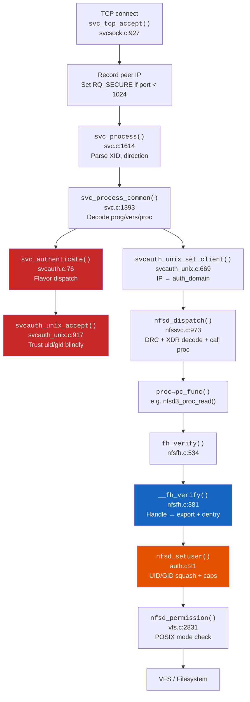

# Kernel source map

A condensed reference to the Linux kernel NFS server (knfsd) code paths that underpin nfswolf's findings. All file paths and line numbers reference **Linux 7.1.8**. The full 3000-line function-level walkthrough lives in `ref/linux-kernel/BREAKDOWN.md` in the nfswolf repository.

---

## Kernel NFS architecture

The kernel NFS subsystem spans five directories totaling roughly 200,000 lines of C across 242 source files:

| Directory | Role | Lines |
|-----------|------|-------|
| `fs/nfsd/` | NFS server (knfsd) -- the attack target | ~52,100 |
| `net/sunrpc/` | ONC RPC framework (auth, transport, dispatch) | ~51,469 |
| `fs/nfs/` | NFS client (irrelevant unless studying LOCALIO) | ~85,062 |
| `fs/lockd/` | NLM lock manager (out of scope for nfswolf) | ~10,716 |
| `fs/nfs_common/` | Shared helpers (error mapping, ACL codec, grace) | ~1,298 |



Every NFS request (v2, v3, or v4) follows this exact path. The RPC layer (`net/sunrpc/`) handles authentication before nfsd ever sees the request. File-level authorization happens inside the procedure handler via `fh_verify()`.

---

## Authentication chain

The path from RPC call to identity resolution has no cryptographic verification when AUTH_SYS is used. The attacker-supplied uid/gid/groups propagate through the entire pipeline unchanged until `nfsd_setuser()` optionally squashes them.

### Step 1: credential parsing -- `svcauth_unix_accept()`

**File:** `net/sunrpc/svcauth_unix.c:917`

This function decodes the AUTH_SYS credential body and copies every field into the kernel cred struct with zero verification. It is the kernel-level proof that AUTH_SYS provides no authentication.

- **Lines 931--938:** Timestamp and machinename are read and discarded. The machinename is never stored, never checked, never used for any access control decision.
- **Lines 949--954:** UID and GID are accepted verbatim from the wire via `make_kuid()` / `make_kgid()`. Any 32-bit value is accepted, including uid 0.
- **Lines 956--970:** Up to 16 supplementary groups (`UNX_NGROUPS`) are copied from the wire without validation.
- **Lines 973--977:** The verifier must be AUTH_NULL with zero length -- a formality carrying no cryptographic proof.

!!! danger "No integrity protection"
    There is no MIC, no MAC, no checksum. Any network observer can forge AUTH_SYS credentials. Combined with the ignored timestamp, there is no protection against replay at the RPC auth layer.

### Step 2: IP-based client mapping -- `svcauth_unix_set_client()`

**File:** `net/sunrpc/svcauth_unix.c:669`

Maps the TCP source IP to an `auth_domain`, which is how knfsd enforces export ACLs. The `machinename` field from AUTH_SYS is never consulted; only the socket-layer source address matters.

- **Line 694:** NULL procedure calls (`rq_proc == 0`) skip client lookup entirely, allowing probes from any source.
- **Lines 698--702:** IP lookup in the `ip_map` cache, populated by userspace `mountd` via `/proc/net/rpc/auth.unix.ip`.
- **Lines 723--734:** Server-side group augmentation via `unix_gid_find()`. On cache miss (common), the client-supplied groups survive intact.

### Step 3: UID/GID squashing -- `nfsd_setuser()`

**File:** `fs/nfsd/auth.c:21`

The single point where the kernel applies credential squashing. Every NFS operation passes through this 88-line function.

| Branch | Lines | Flag | Behavior |
|--------|-------|------|----------|
| **all_squash** | 40--45 | `NFSEXP_ALLSQUASH` | All UIDs forced to `ex_anon_uid`. Groups stripped. If `anonuid=0`, everyone is root. |
| **root_squash** | 46--64 | `NFSEXP_ROOTSQUASH` | Only uid 0 and gid 0 are squashed. All other UIDs pass through unchanged. |
| **no squash** | 65--67 | (neither flag) | Client uid/gid/groups used verbatim. uid=0 gets full `CAP_NFSD_SET`. |

**Capability management** (lines 77--81): When `fsuid == 0` after squashing, the kernel thread gains `CAP_DAC_OVERRIDE`, `CAP_DAC_READ_SEARCH`, `CAP_CHOWN`, `CAP_FOWNER`, `CAP_FSETID`, `CAP_MKNOD`, `CAP_MAC_OVERRIDE`, and `CAP_SYS_RESOURCE`. Non-root drops all of these. This is why `no_root_squash` is devastating: uid=0 via AUTH_SYS gets the same capabilities as a local root process.

---

## File handle architecture

File handles are bearer tokens: any client possessing a valid handle can use it with any credential. The kernel never binds a handle to the client or UID that originally obtained it (RFC 2623 Section 2.6).

### Handle wire format

**File:** `fs/nfsd/nfsfh.h:49`

| Offset | Field | Size | Purpose |
|--------|-------|------|---------|
| `fh_raw[0]` | `fh_version` | 1 | Always 1 (rejected otherwise at nfsfh.c:219) |
| `fh_raw[1]` | `fh_auth_type` | 1 | Always 0 (vestigial, rejected otherwise at nfsfh.c:224) |
| `fh_raw[2]` | `fh_fsid_type` | 1 | Filesystem identifier encoding (see fsid table below) |
| `fh_raw[3]` | `fh_fileid_type` | 1 | Inode encoding type (see fileid table below) |
| `fh_raw[4..]` | `fh_fsid[]` | variable | Filesystem ID (device, UUID, or admin-assigned) |
| after fsid | `fh_fileid[]` | variable | Inode number + generation counter |
| (optional tail) | MAC | 8 | SipHash-2-4 MAC, only when `NFSEXP_SIGN_FH` is set |

Maximum sizes: NFSv2 = 32 bytes, NFSv3 = 64 bytes, NFSv4 = 128 bytes.

The first four bytes are predictable. The variable fields (fsid, fileid) are the only entropy in an unsigned handle. Given the filesystem type and device/UUID, an attacker can construct handles for arbitrary inodes.

### Handle verification -- `fh_verify()` / `__fh_verify()`

**File:** `fs/nfsd/nfsfh.c:381`

Every NFS operation on every file handle passes through this six-check pipeline:

1. **Handle resolution** (`nfsd_set_fh_dentry()`, line 200): Parse version/auth_type/fsid_type, resolve export via `rqst_exp_find()`. With `NFSEXP_NOSUBTREECHECK` (default), the server elevates capabilities and `nfsd_acceptable()` returns 1 unconditionally -- any inode on the filesystem is accepted.
2. **MAC verification** (lines 298--304): Only runs when `NFSEXP_SIGN_FH` is set. Root handles (`FILEID_ROOT`) are exempt: never signed, never verified.
3. **Port check** (`nfsd_originating_port_ok()`, line 91): Bypassed by `NFSEXP_INSECURE_PORT` or GSS auth.
4. **UID squash** (`nfsd_setuser()`, line 424): Applies root_squash / all_squash.
5. **Transport security** (`check_xprtsec_policy()`, line 451): Checks TLS/mTLS requirements. Default allows plaintext.
6. **Security flavor** (`check_security_flavor()`, line 467): Validates auth flavor against `sec=` config. Without explicit `sec=`, AUTH_NULL and AUTH_SYS are accepted.

!!! warning "What is NOT checked"
    - No check that the handle was issued to this client IP
    - No check that the handle was issued to this AUTH_SYS uid/gid
    - No check correlating the handle to a prior MOUNT operation
    - No session or connection binding

### Subtree check -- `nfsd_acceptable()`

**File:** `fs/nfsd/nfsfh.c:29`

```c
if (exp->ex_flags & NFSEXP_NOSUBTREECHECK)
    return 1;   // accept ANY dentry on the filesystem
```

With `no_subtree_check` (the default since kernel 2.6.25), exporting `/srv/nfs` on an ext4 partition gives an attacker who constructs a handle for inode 2 (root directory) access to the entire filesystem, not just `/srv/nfs`.

### Handle signing -- `NFSEXP_SIGN_FH`

**Files:** `fh_append_mac()` at nfsfh.c:147, `fh_verify_mac()` at nfsfh.c:178

Appends an 8-byte SipHash-2-4 MAC keyed by a per-namespace `fh_key`. Verification uses `crypto_memneq()` (constant-time comparison). Root handles are **exempt** from signing (nfsfh.c:294--296). The key must be explicitly configured; without it, handles are silently emitted unsigned.

---

## Export flag security matrix

Every `NFSEXP_*` flag modifies the server's security posture. This table maps the most security-critical flags to their kernel enforcement points.

| Flag | Value | `/etc/exports` | Kernel Function | Source | Effect |
|------|-------|-----------------|-----------------|--------|--------|
| `NFSEXP_READONLY` | `0x0001` | `ro` | `exp_rdonly()` | vfs.c:2585 | Blocks all write/sattr/trunc operations |
| `NFSEXP_INSECURE_PORT` | `0x0002` | `insecure` | `nfsd_originating_port_ok()` | nfsfh.c:91 | Accepts connections from ports >= 1024 |
| `NFSEXP_ROOTSQUASH` | `0x0004` | `root_squash` | `nfsd_setuser()` | auth.c:46 | Maps uid 0 to anonuid. Other UIDs pass through. |
| `NFSEXP_ALLSQUASH` | `0x0008` | `all_squash` | `nfsd_setuser()` | auth.c:40 | Maps ALL UIDs to anonuid. Combined with `anonuid=0`, grants root to everyone. |
| `NFSEXP_NOREADDIRPLUS` | `0x0040` | `nordirplus` | `nfsd3_proc_readdirplus()` | nfs3proc.c:599 (flag check at :619) | Blocks bulk handle/metadata harvesting via READDIRPLUS |
| `NFSEXP_SIGN_FH` | `0x0100` | `sign_fh` | `fh_verify_mac()` | nfsfh.c:178 | Blocks handle construction and brute-force attacks |
| `NFSEXP_NOHIDE` | `0x0200` | `nohide` | `nfsd_cross_mnt()` | vfs.c:164 | Exposes subordinate exports to v2/v3 clients |
| `NFSEXP_NOSUBTREECHECK` | `0x0400` | `no_subtree_check` | `nfsd_acceptable()` | nfsfh.c:36 | Accepts any inode on the filesystem regardless of export path |
| `NFSEXP_NOAUTHNLM` | `0x0800` | `insecure_locks` | `__fh_verify()` | nfsfh.c:442 | NLM requests bypass ALL authentication checks |
| `NFSEXP_CROSSMOUNT` | `0x4000` | `crossmnt` | `nfsd_cross_mnt()` | vfs.c:135 | Automatically exports child mount points |
| `NFSEXP_XPRTSEC_NONE` | `0x0001`* | (default) | `check_xprtsec_policy()` | export.c:1807 | Allows plaintext (non-TLS) connections |

\* Transport security flags use a separate bitmask namespace from export flags.

Per-flavor flag overrides are supported via `nfsexp_flags()` (auth.c:8). An export can be read-write for `krb5p` but read-only for `sys`, or apply root squash only to AUTH_SYS connections.

---

## Key functions reference

The 20 most security-relevant kernel functions, in call-chain order:

| Function | File | Line | What It Does |
|----------|------|------|-------------|
| `svc_tcp_accept()` | svcsock.c | 927 | Accepts TCP connection, records peer IP. No auth at this stage. |
| `svc_process()` | svc.c | 1614 | Top-level RPC entry. Parses XID and direction. |
| `svc_process_common()` | svc.c | 1393 | Decodes prog/vers/proc, dispatches to auth, then to procedure handler. |
| `svc_authenticate()` | svcauth.c | 76 | Dispatches to flavor handler via `authtab[]`. |
| `svcauth_unix_accept()` | svcauth_unix.c | 917 | Parses AUTH_SYS credentials. Trusts uid/gid/groups blindly. |
| `svcauth_unix_set_client()` | svcauth_unix.c | 669 | Maps source IP to auth_domain for export ACLs. Ignores machinename. |
| `nfsd_dispatch()` | nfssvc.c | 973 | DRC lookup, XDR decode, calls `proc->pc_func()`. |
| `nfsd_cache_lookup()` | nfscache.c | 466 | DRC lookup keyed on XID+addr+csum. No credential in the key. |
| `fh_verify()` | nfsfh.c | 534 | Public entry point for handle verification. Thin wrapper around `__fh_verify()`. |
| `__fh_verify()` | nfsfh.c | 381 | Master gate: handle resolution, export check, port check, squash, flavor, perms. |
| `nfsd_set_fh_dentry()` | nfsfh.c | 200 | Decodes handle bytes into a VFS dentry. NOSUBTREECHECK elevates caps. |
| `nfsd_acceptable()` | nfsfh.c | 29 | Subtree check callback. Returns 1 unconditionally with `no_subtree_check`. |
| `fh_verify_mac()` | nfsfh.c | 178 | Verifies SipHash-2-4 MAC on signed handles. Constant-time comparison. |
| `nfsd_setuser()` | auth.c | 21 | Applies root_squash/all_squash. Sets fsuid/fsgid/caps on kernel thread. |
| `nfsexp_flags()` | auth.c | 8 | Per-flavor flag lookup. Returns flavor-specific or export-default flags. |
| `nfsd_permission()` | vfs.c | 2831 | POSIX permission check. Owner override at line 2886. Read-if-exec fallback at 2895. |
| `check_security_flavor()` | export.c | 1840 | Validates auth flavor against `sec=` config. Default accepts AUTH_SYS + AUTH_NULL. |
| `check_xprtsec_policy()` | export.c | 1803 | Transport security (TLS/mTLS). Default `XPRTSEC_NONE` allows plaintext. |
| `fh_compose()` | nfsfh.c | 661 | Builds new handle: selects fsid_type, encodes fsid, delegates fileid to filesystem. |
| `nfsd3_proc_readdirplus()` | nfs3proc.c | 599 | Bulk metadata + handle leak. Returns full attrs and handles for every directory entry. |

---

## Finding-to-kernel mapping

How nfswolf's key findings map to the specific kernel code path that enables them:

| Finding | Title | Kernel Function | Source | What the Kernel Does |
|---------|-------|-----------------|--------|---------------------|
| F-1.1 | UID/GID spoofing | `svcauth_unix_accept()` | svcauth_unix.c:917 | Copies wire uid/gid into kernel cred with zero verification |
| F-1.2 | Root squash bypass | `nfsd_setuser()` | auth.c:46 | Only squashes uid 0. Non-root UIDs pass through unchanged. |
| F-1.4 | Machinename ignored | `svcauth_unix_accept()` | svcauth_unix.c:931 | Machinename field is read and discarded. IP is the only identity. |
| F-1.5 | DRC credential confusion | `nfsd_cache_lookup()` | nfscache.c:466 | Cache key has no credential field. XID collision replays wrong-UID response. |
| F-1.6 | NFSv2 downgrade | `nfsd_version[]` | nfssvc.c:97 | v2 compiled via `CONFIG_NFSD_V2`. No per-export version restriction. |
| F-1.7 | GSS flavor downgrade | `check_security_flavor()` | export.c:1849 | Accepts any flavor in the `sec=` list. `sec=krb5:sys` allows AUTH_SYS. |
| F-2.1 | Export escape | `nfsd_acceptable()` | nfsfh.c:36 | With `no_subtree_check`, returns 1 for any dentry on the filesystem. |
| F-2.3 | Handle signing defense | `fh_verify_mac()` | nfsfh.c:178 | SipHash-2-4 MAC blocks handle forgery. Opt-in, root handles exempt. |
| F-4.1 | no_root_squash | `nfsd_setuser()` | auth.c:65 | No squash branch: uid 0 gets `CAP_DAC_OVERRIDE` and full `CAP_NFSD_SET`. |
| F-5.2 | READDIRPLUS harvesting | `nfsd3_proc_readdirplus()` | nfs3proc.c:599 | Returns file handle + full attrs for every directory entry. |
| F-5.6 | Metadata on denial | `svcxdr_encode_post_op_attr()` | nfs3xdr.c:426 | NFSv3 encodes full attrs on error responses, including access denials. |
| F-5.8 | AUTH_NONE leak | `svcauth_null_accept()` | svcauth_unix.c:755 | Sets uid to INVALID_UID, squashed to anonuid. Reads world-readable files. |
| F-7.2 | Insecure port bypass | `nfsd_originating_port_ok()` | nfsfh.c:91 | `NFSEXP_INSECURE_PORT` skips the port < 1024 check entirely. |
| F-7.5 | Squash misconfiguration | `nfsd_setuser()` | auth.c:40 | `all_squash,anonuid=0` maps every request to root. |

---

## GSS bypass paths

Even on `sec=krb5` exports, several kernel code paths accept AUTH_SYS:

| Bypass | Mechanism | Operations | Scope |
|--------|-----------|------------|-------|
| `NFSD_MAY_BYPASS_GSS_ON_ROOT` | nfsfh.c:463 | GETATTR, STATFS (v2), FSINFO (v3) | Export root dentry only |
| `NFSD_MAY_BYPASS_GSS` | nfsfh.c:456 | PUTFH (v4) | Any dentry (deferred check) |
| `NFSEXP_NOAUTHNLM` | nfsfh.c:442 | All NLM operations | Full bypass -- skips flavor, xprtsec, and permission checks |
| Default `ex_nflavors == 0` | export.c:1854 | All operations | AUTH_NULL and AUTH_SYS accepted when no `sec=` is configured |

The PUTFH bypass combined with SECINFO's `OP_HANDLES_WRONGSEC` flag means `{PUTFH, SECINFO}` compounds succeed with AUTH_SYS on `sec=krb5` exports, revealing all configured security flavors. This is the mechanism behind nfswolf's NFSv4 SECINFO scanner.

---

## Filesystem handle structures

Each filesystem encodes inodes differently in the handle's fileid region. These structures determine escape feasibility.

| Filesystem | `fileid_type` | Layout | Escape Target |
|------------|---------------|--------|---------------|
| ext2/ext3/ext4 | `0x01` (`FILEID_INO32_GEN`) | 32-bit inode + 32-bit generation | Inode 2 = root dir, generation typically 0 |
| XFS (small inums) | `0x01` | 32-bit inode + 32-bit generation | Inode 128 (or 64/96 on older mkfs) |
| XFS (large inums) | `0x81` | 64-bit inode + 32-bit generation | AG-encoded root inode |
| BTRFS | `0x4d` | 64-bit objectid + 64-bit root_objectid + 32-bit gen | objectid=256, root_objectid=5 (default subvol) |

The `exportfs_decode_fh_raw()` call at nfsfh.c:306 delegates to the filesystem's `fh_to_dentry` operation. XFS uses `XFS_IGET_UNTRUSTED` which safely returns ESTALE for invalid inodes, making brute-force enumeration non-destructive.

---

## Further reading

- **Full kernel breakdown:** `ref/linux-kernel/BREAKDOWN.md` in the nfswolf repository (3200 lines, function-level detail for every security-relevant code path)
- **Kernel source files:** `ref/linux-kernel/` contains copied kernel headers (`nfsfh.h`, `nfsfh.c`, `export.c`, `exportfs.h`) for local reference
- **RFC references:** `ref/rfc/` -- RFC 1094 (NFSv2), RFC 1813 (NFSv3), RFC 7530 (NFSv4), RFC 5531 (RPC v2), RFC 2623 (NFS security), RFC 9289 (NFS over TLS)
