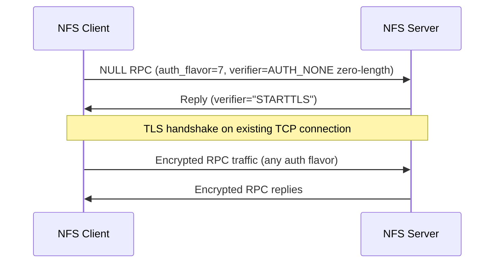

# NFS over TLS

RFC 9289 defines RPC-with-TLS, a mechanism to encrypt NFS traffic at the transport layer. It works like STARTTLS in SMTP: the client sends a special NULL RPC call with AUTH_TLS (flavor 7), the server acknowledges, and both sides upgrade the existing TCP connection to TLS. All subsequent RPC traffic on that connection is encrypted.

TLS protects the wire. It does not authenticate users. AUTH_SYS credentials inside a TLS tunnel are still client-asserted and trivially forgeable. TLS and Kerberos solve different problems and are most effective when deployed together.

## How it works

### The AUTH_TLS handshake

Per RFC 9289 S4.1, the upgrade sequence is:



1. The client sends a NULL RPC call on port 2049 with `auth_flavor = 7` (AUTH_TLS) and an AUTH_NONE verifier of zero length
2. If the server supports TLS, it replies with an AUTH_NONE verifier containing the ASCII string `STARTTLS` (8 bytes), signaling the client to begin the TLS handshake
3. If the server does not support TLS, it replies with AUTH_REJECTED, and the client falls back to plaintext
4. After the TLS handshake completes, all subsequent RPC messages on this connection are encrypted
5. The auth flavor inside the TLS tunnel can be anything: AUTH_SYS, AUTH_NONE, RPCSEC_GSS

!!! warning "The initial probe is cleartext"
    The AUTH_TLS NULL call and its reply travel in plaintext. A network attacker can see that TLS negotiation is happening and can interfere with it. See [F-3.4](../../network/F-3.4-striptls-downgrade.md) for the STRIPTLS downgrade attack.

### Mutual TLS (mTLS)

RFC 9289 recommends but does not require mutual TLS. In mTLS, the client presents an X.509 certificate during the TLS handshake, and the server verifies it. This provides machine-level authentication: the server knows which host is connecting. However, mTLS does not provide user-level authentication: a certificate proves "this is machine X," not "this is user Y with UID 1000."

## Server setup

!!! note "Kernel and distribution support"
    NFS-over-TLS requires kernel TLS (kTLS) support, available in Linux 5.19+. The `nfs-utils` package must be version 2.6.2+ with TLS support compiled in. As of mid-2025, most enterprise distributions ship the required components but do not enable TLS by default.

### 1. Generate TLS certificates

The NFS server needs a TLS certificate. For internal deployments, use a private CA. For testing, self-signed certificates work but require explicit trust configuration on clients.

=== "Private CA (recommended)"

    ```bash
    # Generate CA key and certificate
    openssl genrsa -out /etc/nfs-tls/ca-key.pem 4096
    openssl req -new -x509 -key /etc/nfs-tls/ca-key.pem \
        -out /etc/nfs-tls/ca-cert.pem -days 3650 \
        -subj "/CN=NFS Internal CA"

    # Generate server key and CSR
    openssl genrsa -out /etc/nfs-tls/server-key.pem 4096
    openssl req -new -key /etc/nfs-tls/server-key.pem \
        -out /etc/nfs-tls/server.csr \
        -subj "/CN=nfs-server.example.com"

    # Sign the server certificate
    openssl x509 -req -in /etc/nfs-tls/server.csr \
        -CA /etc/nfs-tls/ca-cert.pem -CAkey /etc/nfs-tls/ca-key.pem \
        -CAcreateserial -out /etc/nfs-tls/server-cert.pem -days 365

    chmod 600 /etc/nfs-tls/server-key.pem
    ```

=== "Self-signed (testing only)"

    ```bash
    openssl req -x509 -newkey rsa:4096 -nodes \
        -keyout /etc/nfs-tls/server-key.pem \
        -out /etc/nfs-tls/server-cert.pem \
        -days 365 -subj "/CN=nfs-server.example.com"

    chmod 600 /etc/nfs-tls/server-key.pem
    ```

### 2. Configure nfsd for TLS

```ini
# /etc/nfs.conf
[nfsd]
tls = 1
tls-required = 1
tls-verify-peer = 0
```

| Option | Effect |
|--------|--------|
| `tls = 1` | Enable TLS support (accept AUTH_TLS probes) |
| `tls-required = 1` | Reject plaintext connections after TLS is available |
| `tls-verify-peer = 0` | Server-only TLS (no client certificate required) |
| `tls-verify-peer = 1` | Mutual TLS (require client certificate) |

!!! danger "tls-required is critical"
    Without `tls-required = 1`, TLS is opt-in. A client (or attacker) can simply skip the AUTH_TLS probe and send plaintext RPC calls. The server accepts them. This is the NFS-over-TLS analog of STRIPTLS ([F-3.4](../../network/F-3.4-striptls-downgrade.md)). Always set `tls-required = 1` in production.

### 3. Configure tlshd

The `tlshd` daemon handles TLS handshakes on behalf of the kernel NFS server. It reads certificates and performs the cryptographic operations in userspace.

```ini
# /etc/tlshd.conf
[server]
x509.certificate = /etc/nfs-tls/server-cert.pem
x509.private_key = /etc/nfs-tls/server-key.pem
x509.trust_store = /etc/nfs-tls/ca-cert.pem
```

```bash
systemctl enable --now tlshd
systemctl restart nfs-server
```

## Client setup

### 1. Install client TLS support

=== "Debian / Ubuntu"

    ```bash
    apt install nfs-common tlshd
    ```

=== "RHEL / Fedora"

    ```bash
    dnf install nfs-utils tlshd
    ```

### 2. Configure client certificates (for mTLS)

If the server requires mutual TLS (`tls-verify-peer = 1`), the client needs its own certificate signed by the same CA:

```bash
openssl genrsa -out /etc/nfs-tls/client-key.pem 4096
openssl req -new -key /etc/nfs-tls/client-key.pem \
    -out /etc/nfs-tls/client.csr \
    -subj "/CN=client.example.com"
openssl x509 -req -in /etc/nfs-tls/client.csr \
    -CA /etc/nfs-tls/ca-cert.pem -CAkey /etc/nfs-tls/ca-key.pem \
    -CAcreateserial -out /etc/nfs-tls/client-cert.pem -days 365
```

Configure the client's `tlshd`:

```ini
# /etc/tlshd.conf (client side)
[client]
x509.certificate = /etc/nfs-tls/client-cert.pem
x509.private_key = /etc/nfs-tls/client-key.pem
x509.trust_store = /etc/nfs-tls/ca-cert.pem
```

### 3. Mount with TLS

```bash
# Server-only TLS
mount -t nfs4 -o xprtsec=tls nfs-server.example.com:/srv/nfs/data /mnt/data

# Mutual TLS
mount -t nfs4 -o xprtsec=mtls nfs-server.example.com:/srv/nfs/data /mnt/data
```

Or in `/etc/fstab`:

```text
nfs-server.example.com:/srv/nfs/data  /mnt/data  nfs4  xprtsec=tls,_netdev  0  0
```

## Protection comparison

| Property | No encryption | TLS only | krb5p only | TLS + krb5p |
|----------|--------------|----------|------------|-------------|
| Wire encryption | None | TLS (AES) | RPCSEC_GSS (AES) | Double encryption (both layers) |
| Passive sniffing of file data | Trivial | Blocked | Blocked | Blocked |
| Passive sniffing of credentials | AUTH_SYS in cleartext | AUTH_SYS encrypted but still forgeable | Kerberos ticket (not forgeable) | Kerberos inside TLS |
| Passive sniffing of file handles | Handles in cleartext | Handles encrypted | Handles encrypted | Handles encrypted |
| UID/GID spoofing | Trivial | **Still trivial** (inside tunnel) | Blocked | Blocked |
| MITM tampering | Trivial | Blocked (TLS integrity) | Blocked (krb5i/krb5p integrity) | Blocked |
| Machine authentication | None | Server cert (or mTLS) | Server via service principal | Both |
| User authentication | None | None | Kerberos principal | Kerberos principal |
| STRIPTLS downgrade | N/A | Possible unless `tls-required=1` | N/A | Possible on the TLS layer |
| Export escape via constructed handle | Trivial | **Still possible** (auth unrelated) | **Still possible** | **Still possible** |

!!! tip "The bottom line"
    TLS encrypts the pipe. Kerberos authenticates the user. Neither prevents export escape. Deploy both, and set `tls-required=1` so TLS is not optional.

## What TLS protects

- **Wire confidentiality**: File contents, directory listings, file handles, and metadata are encrypted. Passive network sniffing no longer reveals data.
- **Server identity** (with valid certificates): The client verifies the server's certificate, preventing connection to a rogue NFS server.
- **Machine identity** (with mTLS): The server verifies the client's certificate, restricting which machines can connect. This is useful as a network-level access control in addition to export IP restrictions.
- **Integrity**: TLS record-layer MACs detect tampering, preventing modification of RPC messages in transit.

## What TLS does NOT protect

!!! danger "TLS does not replace Kerberos"
    TLS proves the identity of machines (via certificates). It does not prove the identity of users. Inside a TLS tunnel, AUTH_SYS credentials are still client-asserted. An attacker on a machine with TLS access can claim any UID/GID.

- **User authentication**: AUTH_SYS inside TLS is still `uid=0, gid=0` with no proof. The server has no way to verify the user's identity. See [F-3.8](../../network/F-3.8-rpc-with-tls.md).
- **Export escape**: File handles are bearer tokens regardless of transport encryption. A handle obtained inside a TLS session works the same way as one obtained in plaintext. See [F-2.1](../../access-control/F-2.1-export-escape.md).
- **Enforcement** (without `tls-required`): By default, TLS is opt-in. An attacker skips the AUTH_TLS probe and communicates in plaintext. The server accepts it.
- **CA infrastructure**: NFS-over-TLS has no standard CA. Each deployment must build and manage its own PKI, including certificate distribution, revocation, and renewal.
- **Legacy clients**: Clients without kTLS support or `tlshd` cannot mount with `xprtsec=tls`. Mixed environments may need to keep plaintext access available, defeating the purpose.

## Current deployment status

As of 2026, NFS-over-TLS is supported by Linux kernel 5.19+ (kTLS) and nfs-utils 2.6.2+, but real-world adoption remains limited. Key constraints:

- **No standard CA**: Unlike HTTPS (where Let's Encrypt provides free certificates), NFS deployments must operate their own PKI
- **No automatic enrollment**: Each client and server must be manually configured with certificates and trust stores
- **Limited non-Linux support**: FreeBSD, Solaris, and Windows NFS clients do not support RFC 9289
- **Performance**: kTLS offloads encryption to the kernel for reduced overhead, but adds latency compared to plaintext
- **Tooling gap**: Standard NFS diagnostic tools (`nfsstat`, `mountstats`) do not report TLS status; verification requires packet captures or `tlshd` logs

## Detection with nfswolf

nfswolf probes for TLS support during scanning:

```bash
nfswolf scan nfs-server.example.com
# Reports: "RPC-with-TLS supported" if the AUTH_TLS probe succeeds
# Reports finding F-3.8 if TLS is supported but AUTH_SYS is still accepted inside the tunnel
```

The scanner sends an AUTH_TLS NULL call and checks for the STARTTLS verifier in the reply. It does not complete the TLS handshake; it only detects whether TLS is available. The F-3.8 finding fires as informational to remind administrators that TLS alone does not prevent UID spoofing.

## Related pages

- [Kerberos authentication](kerberos.md) -- user authentication (complements TLS)
- [F-3.8: RPC-with-TLS](../../network/F-3.8-rpc-with-tls.md) -- AUTH_SYS remains forgeable inside TLS
- [F-3.4: STRIPTLS downgrade](../../network/F-3.4-striptls-downgrade.md) -- downgrade attack against the AUTH_TLS handshake
- [F-3.1: Plaintext wire protocol](../../network/F-3.1-plaintext-wire-protocol.md) -- what TLS fixes
- [Hardening: export-options xprtsec](../configure/export-options.md#xprtsec) -- why `tls-required` matters
- [Hardening checklist](checklist.md) -- TLS in context of the full hardening path
