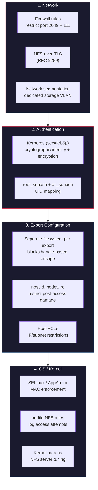

# Defense

**NFS was built for trusted networks. No single option secures it -- you need controls at multiple layers.**

An NFS export is a directory the server shares over the network. NFS exports are easy to exploit and hard to defend. The protocol predates modern authentication, has no native encryption, treats file handles as bearer tokens, and exposes the server filesystem to any client that can manipulate handle bytes. Default configurations on every major Linux distribution leave most of these problems unaddressed.

AUTH_SYS -- the mechanism used by nearly every production NFS deployment -- transmits a 32-bit UID as the sole proof of identity. There is no password, no challenge-response, no cryptographic verification. The server trusts the number because the protocol says to trust the number. `root_squash` mitigates exactly one UID out of 4 billion. Export ACLs check the source IP, which is spoofable on any flat network. File handles, once obtained by any means, work for any credential. GID spoofing works identically. These are not implementation bugs; they are protocol-level design decisions baked into every RFC from 1094 through 7530.

!!! danger "The default is insecure"
    A stock `/etc/exports` entry like `/data *(rw,sync)` exposes the export to every host on the network, allows UID spoofing of any non-root user, transmits all data in plaintext, and may permit export escape to the entire root filesystem depending on the backing storage. Every one of these properties is the intended protocol behavior, not a misconfiguration.

## Defense-in-depth layers

Securing NFS requires controls at four distinct layers. No single layer is sufficient -- an attacker who bypasses one needs to be stopped by the next.

## Threat-to-defense mapping

Every major NFS threat class maps to one or more defensive controls. The table below links each threat to the defense that eliminates or mitigates it and the pages in this section that cover the implementation details.

| Threat | Key findings | Defense | Pages |
|--------|-------------|---------|-------|
| UID/GID spoofing | [F-1.1](../identity/F-1.1-uid-gid-spoofing.md), [F-1.2](../identity/F-1.2-root-squash-bypass.md) | Kerberos (`sec=krb5`) for cryptographic identity; `all_squash` + `anonuid`/`anongid` as a fallback | [Kerberos](hardening/kerberos.md), [Export options](configure/export-options.md) |
| Export escape via handle manipulation | [F-2.1](../access-control/F-2.1-export-escape.md), [F-2.4](../access-control/F-2.4-btrfs-subvolume-escape.md) | Dedicate a separate filesystem (partition, LV, or ZFS dataset) to each export -- the kernel cannot traverse filesystem boundaries via handle bytes | [Hardening checklist](hardening/checklist.md), [Export options](configure/export-options.md) |
| Plaintext wire traffic | [F-3.1](../network/F-3.1-plaintext-wire-protocol.md), [F-3.4](../network/F-3.4-striptls-downgrade.md) | NFS-over-TLS (RFC 9289) or Kerberos with integrity/privacy (`sec=krb5i` / `sec=krb5p`) | [TLS](hardening/tls.md), [Kerberos](hardening/kerberos.md) |
| No root squash | [F-4.1](../privesc/F-4.1-no-root-squash.md), [F-4.2](../privesc/F-4.2-suid-sgid-escalation.md) | `root_squash` (default), `nosuid`, `nodev` on every export | [Export options](configure/export-options.md), [Hardening checklist](hardening/checklist.md) |
| SUID/device escalation | [F-4.2](../privesc/F-4.2-suid-sgid-escalation.md), [F-4.3](../privesc/F-4.3-device-node-creation.md) | `nosuid` and `nodev` export flags; client-side mount options | [Export options](configure/export-options.md) |
| Export list enumeration | [F-5.1](../info-disclosure/F-5.1-export-list-enumeration.md), [F-5.4](../info-disclosure/F-5.4-rpc-service-enumeration.md) | Firewall portmapper (111/tcp, 111/udp); restrict MOUNT service access; use NFSv4-only (no portmapper needed) | [Firewall](configure/firewall.md) |
| Portmapper amplification | [F-3.2](../network/F-3.2-portmapper-amplification.md) | Block UDP/111 at the perimeter; disable rpcbind UDP listener | [Firewall](configure/firewall.md), [Kernel parameters](configure/kernel-params.md) |
| NFSv2 downgrade | [F-1.6](../identity/F-1.6-nfsv2-downgrade.md) | Disable NFSv2 and v3 on the server; run NFSv4-only | [Kernel parameters](configure/kernel-params.md) |
| Wildcard exports | [F-7.1](../config/F-7.1-wildcard-export-policy.md), [F-7.5](../config/F-7.5-squash-misconfiguration.md) | Explicit host/subnet ACLs in `/etc/exports`; never use `*` in production | [Exports syntax](configure/exports-syntax.md) |

## What this section covers

| Page | Contents |
|------|----------|
| **Install** | |
| [Server setup](install/server.md) | Installing and enabling the NFS server (`nfs-kernel-server`, `nfs-utils`) on major distributions |
| [Client setup](install/client.md) | Client-side packages, mount options, and autofs configuration |
| **Configure** | |
| [Exports syntax](configure/exports-syntax.md) | `/etc/exports` format, option precedence, and common pitfalls |
| [Export options](configure/export-options.md) | Every export option with security implications: `ro`, `root_squash`, `all_squash`, `sec=`, `nosuid`, `nodev`, `crossmnt` |
| [Firewall rules](configure/firewall.md) | iptables/nftables rules for portmapper, MOUNT, NFS, and lockd |
| [Kernel parameters](configure/kernel-params.md) | NFS server sysctl and module parameters: version disable, thread count, grace period |
| **Harden** | |
| [Hardening checklist](hardening/checklist.md) | Ordered checklist for locking down an NFS deployment, from quick wins to full Kerberos |
| [Kerberos (RPCSEC_GSS)](hardening/kerberos.md) | KDC setup, keytab distribution, `sec=krb5p` configuration, and verifying it works |
| [NFS-over-TLS](hardening/tls.md) | `ktls-utils` / `tlshd` setup for RFC 9289 transport encryption |
| [Hardened examples](hardening/examples.md) | Complete `/etc/exports` configurations for common deployment patterns |
| **Guides** | |
| [What does not work](what-does-not-work.md) | Controls that sound useful but do not actually prevent attacks: IP ACLs alone, `secure` flag, `subtree_check` |

!!! tip "Use nfswolf to validate your defenses"
    After hardening, run `nfswolf analyze` against your server to verify the changes took effect. The analyzer checks for every misconfiguration listed in the threat table above and reports what remains exposed. See the [analyze subcommand](../../usage/analyze.md) page for details.

??? note "Why not just use NFSv4 with Kerberos?"
    Kerberos with `sec=krb5p` eliminates the identity spoofing and plaintext wire problems entirely -- it is the single most impactful defense. But it does not address export escape (a file handle problem, not an auth problem), does not prevent SUID/device attacks on writable exports, requires a working KDC infrastructure, and breaks many legacy workflows. The defense-in-depth approach documented here assumes Kerberos may not be available everywhere and layers additional controls accordingly.
