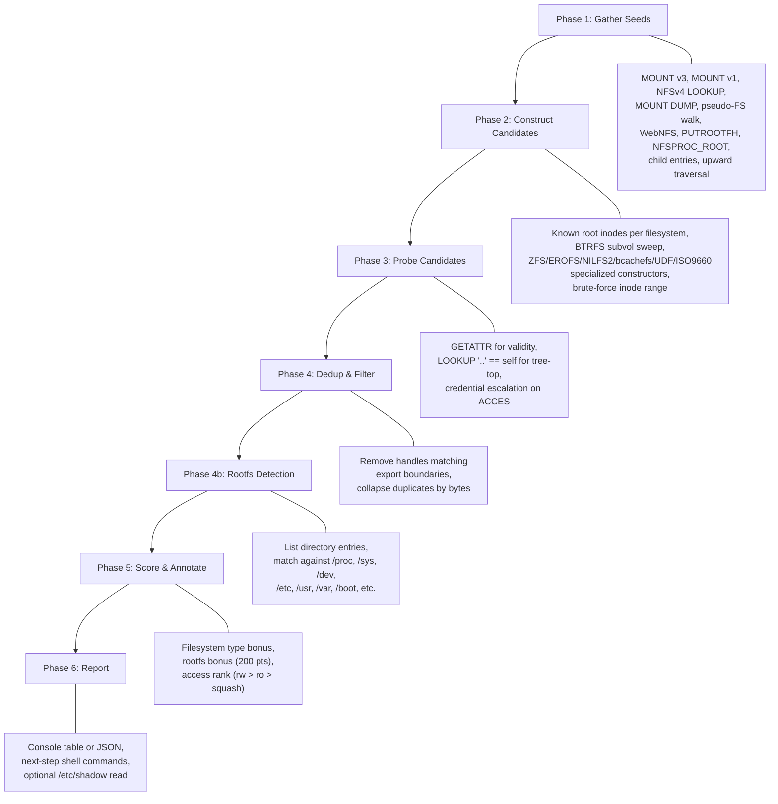

# Escape

The `escape` subcommand attempts to break out of an NFS export directory boundary and reach the underlying filesystem root. It exploits the fact that NFS file handles are bearer tokens (RFC 1094 S2.3.3) and that most Linux NFS servers do not validate whether a handle's inode falls inside the export's subtree when `no_subtree_check` is set.

!!! danger "Authorized targets only"
    Export escape reads (and potentially writes) files outside the intended export directory. Only run this against systems you own or have explicit written authorization to test.

## Usage

```bash
nfswolf escape <TARGET[:/export]> [OPTIONS]
```

The target can be a bare host (all exports discovered and tested) or a specific `host:/export` pair.

### Examples

```bash
# Comprehensive escape against all exports
nfswolf escape 10.0.0.1

# Scope to one export
nfswolf escape 10.0.0.1:/srv/nfs

# Fast mode: single export, 10-80 RPCs, minimal noise
nfswolf escape --fast 10.0.0.1:/srv/nfs

# Machine-readable output
nfswolf escape 10.0.0.1 --json > escape.json

# Read /etc/shadow from the best escape handle
nfswolf escape 10.0.0.1:/srv/nfs --read-shadow

# Show every handle, including duplicates from different exports
nfswolf escape 10.0.0.1 --all-handles
```

## How it works

NFS file handles encode a filesystem identifier and an inode number. The export directory is one inode; the filesystem root is another (inode 2 on ext4, inode 128 on XFS, objectid 256 on BTRFS, and so on). The escape algorithm takes a legitimate handle obtained via MOUNT, extracts the filesystem identifier, and constructs new handles with the root inode number for every supported filesystem type. It then probes each candidate against the server with GETATTR and confirms tree-tops by verifying that LOOKUP ".." resolves back to the same handle (the POSIX definition of a root directory).

The server processes these constructed handles exactly as it would a handle obtained through MOUNT + LOOKUP, because NFS has no concept of handle provenance. A handle is valid if the server can decode it and the referenced inode exists. When `subtree_check` is off (the default on most distributions), the server does not verify that the inode belongs to the exported subtree.

### Supported filesystem types

The escape engine supports 18 of 19 common Linux filesystem types. Each has a different root inode number and handle layout:

| Filesystem | Root inode/object | Handle format | Notes |
|------------|------------------|---------------|-------|
| ext2/3/4 | 2 | INO32_GEN | Most common, generation 0 |
| XFS | 128 | INO64_GEN | 64-bit inode field |
| BTRFS | 256+ (subvolume) | BTRFS_WITHOUT_PARENT (0x4d) | Scans subvolume IDs 5, 256..271 |
| ZFS | 3 | INO32_GEN | ZFS-on-Linux, custom constructor |
| f2fs | 3 | INO32_GEN | Generation 0 |
| JFS | 2 | INO32_GEN | Generation 0 |
| NILFS2 | 2 | NILFS_WITHOUT_PARENT (0x61) | Includes checkpoint number |
| ReiserFS | 2 | INO32_GEN | Generation 1 (not 0) |
| VFAT | 1 | FAT_WITHOUT_PARENT (0x71) | Root inode 1 |
| NTFS3 | 5 | INO32_GEN | Generation 5 |
| UDF | variable | UDF_WITHOUT_PARENT (0x51) | Block-based addressing |
| bcachefs | 4096 | BCACHEFS_WITHOUT_PARENT (0xb1) | Includes subvolume ID |
| SquashFS | 1 | INO32_GEN | Read-only filesystem |
| EROFS | 36+ | INO64_GEN | Read-only, 64-bit inodes |
| ISO9660 | varies | INO32_GEN | Read-only optical media |
| tmpfs | -- | -- | Only type that resists escape (no stable inodes) |

## The seven-phase pipeline

The escape runs as a seven-phase pipeline. In full mode (default), it uses every discovery channel and probes across all protocol versions. In fast mode (`--fast`), it takes shortcuts at each phase to complete in 10-80 RPCs.



### Phase 1: Gather seeds

Seeds are file handles acquired from the target through every available protocol channel. Each seed provides the filesystem identifier (fsid) that is preserved when constructing escape candidates.

In full mode, Phase 1 uses five export discovery channels (MOUNT v3 EXPORT, MOUNT v1 EXPORT, NFSv4 pseudo-FS walk, MOUNT v3 DUMP, MOUNT v1 DUMP) to find every export on the server, then acquires handles from each via MOUNT v3, MOUNT v1, and NFSv4 LOOKUP. It collects child entries from READDIRPLUS (v3) and READDIR+LOOKUP (v2, v4) for additional filesystem coverage, queries protocol-specific sources (PUTROOTFH, PUTPUBFH/WebNFS, NFSPROC_ROOT v2), and finally walks upward from every boundary handle via four traversal chains (LOOKUP ".." on v3, LOOKUP ".." on v2, LOOKUPP on v4, LOOKUP ".." on v4). The traversal chains terminate when a handle resolves back to itself (the POSIX root property) or after 64 steps.

In fast mode, Phase 1 tries only the operator-specified export across v3, v2, and v4 (first success wins), then runs a single upward traversal chain in the active version.

### Phase 2: Construct candidates

Pure computation, no network calls. For each seed, the engine extracts the fsid and constructs handles with root inode numbers for every known filesystem type. The `FileHandleAnalyzer` generates INO32_GEN candidates (inodes 1-5 with generations 0-5), INO64_GEN candidates (for XFS/EROFS), BTRFS subvolume handles (subvol IDs 5 and 256 through 256+N), and filesystem-specific root constructors for ZFS, EROFS, NILFS2, bcachefs, UDF, and ISO9660. In full mode, a brute-force pass scans inodes 6 through `--max-root-scan` (default 200) with generation 0. Candidates are deduplicated by handle bytes before probing.

### Phase 3: Probe candidates

Each candidate is tested against the server with GETATTR (checking that the inode exists and is a directory) followed by LOOKUP ".." (confirming that the parent is the handle itself, the filesystem root property). Probing runs across all available NFS versions in full mode, or only the version that succeeded in Phase 1 when using `--fast`. When GETATTR returns `NFS3ERR_ACCES` (permission denied due to `root_squash`), the handle is still valid -- the engine runs credential escalation through the evidence-driven ladder (file owner, matching GID, root, observed identities, common service accounts) and retries.

### Phase 4: Dedup and filter

Handles that match the export's own boundary handle are removed (they are the export root, not an escape). Remaining handles are deduplicated by raw bytes. In Phase 4b, the engine lists the directory entries of each confirmed tree-top and scores them against two tiers of well-known root-filesystem directory names: Tier 1 (`/proc`, `/sys`, `/dev`, `/run`, unique to the root filesystem, 15 points each) and Tier 2 (`/etc`, `/usr`, `/var`, `/boot`, `/home`, `/bin`, `/sbin`, `/lib`, `/tmp`, `/mnt`, `/media`, `/srv`, `/opt`, `/root`, 5 points each). A tree-top scoring 30 or more points is tagged as an OS-level escape (it reaches the server's root filesystem, not just a data partition).

### Phase 5: Score and annotate

Each tree-top receives a composite score: filesystem-type recognition bonus + rootfs bonus (200 points for OS-escape handles) + access rank (no_root_squash rw is highest, all_squash ro is lowest). Results are sorted by score. When `--all-handles` is off (the default), handles are further collapsed to one per filesystem (by fsid + inode), keeping the highest-scoring handle from each.

### Phase 6: Report

Console mode prints a summary table with filesystem type, inode, access classification, and the handle in hex, plus copy-pasteable `nfswolf shell --handle` commands for immediate use. JSON mode (`--json`) emits a structured object with full pipeline statistics, all exports discovered, and every annotated tree-top.

When `--read-shadow` is set, the engine attempts to read `/etc/shadow` from the best OS-ESCAPE handle as a proof-of-concept, displaying the first few lines.

## Flags reference

| Flag | Default | Description |
|------|---------|-------------|
| `--fast` | off | Single-export quick mode. Requires `host:/export`. Uses one NFS version, no brute-force, no child enumeration. ~10-80 RPCs. |
| `--json` | off | Machine-readable JSON output to stdout. Suppresses console formatting. |
| `--read-shadow` | off | After reporting, attempt to read `/etc/shadow` from the best OS-ESCAPE handle. |
| `--all-handles` | off | Report every handle including cross-export duplicates. Default collapses to one per filesystem. Useful when different exports carry different permissions (ro vs rw, root_squash vs no_root_squash). |
| `--btrfs-subvols N` | 16 | Number of BTRFS subvolume IDs to scan (starting at 256). Increase on servers with many subvolumes. |
| `--max-root-scan N` | 200 | Maximum inode number for the brute-force fallback pass. The root inode is within the first 200 inodes on every Linux filesystem, so the default covers all practical cases. |
| `-e, --export PATH` | -- | Alternative to the `host:/export` positional syntax. |

## Full mode vs fast mode

| Aspect | Full mode (default) | Fast mode (`--fast`) |
|--------|--------------------|--------------------|
| Export discovery | All 5 channels | Operator-specified only |
| Handle sources | MOUNT v3/v1, NFSv4, DUMP, pseudo-FS, WebNFS, PUTROOTFH, NFSPROC_ROOT, children | Single version: v3 or v2 or v4 |
| Traversal chains | 4 per seed (v3/v2/v4 LOOKUPP/v4 LOOKUP) | 1 in active version |
| Brute-force scan | Inodes 1-200 | Skipped |
| Protocol versions probed | v3 + v2 + v4 | Active version only |
| Typical RPCs | 200-2000+ | 10-80 |
| Use case | Comprehensive assessment | Quick check, low noise |

## Integration with other subcommands

The escape pipeline is shared across several entry points:

- **`nfswolf escape`** -- the primary CLI subcommand documented here.
- **`nfswolf scan --auto-escape`** -- runs `escape --fast` automatically for each discovered export during scanning.
- **`nfswolf shell escape-root`** -- runs the same `find_escape_root()` algorithm from within the interactive shell, using the current shell handle as the seed.
- **`nfswolf shell --handle HEX`** -- accepts an escape handle directly to start a shell session at the filesystem root.

## Typical workflow

```bash
# 1. Quick escape to see if the export is vulnerable
nfswolf escape --fast 10.0.0.1:/srv/nfs

# 2. If fast mode finds nothing, run comprehensive
nfswolf escape 10.0.0.1:/srv/nfs

# 3. Use the escape handle in a shell session
nfswolf shell 10.0.0.1 --handle <HANDLE_HEX>

# 4. Or mount the escaped filesystem via FUSE
nfswolf mount 10.0.0.1 --handle <HANDLE_HEX> /mnt/escaped
```

!!! tip "Why escape sometimes fails"
    Export escape fails when the server enforces `subtree_check` (handles are validated against the export subtree), when the filesystem is tmpfs (no stable inodes), or when the server is not Linux knfsd (the handle format is OS-specific). The `decode` subcommand can analyze a handle's format to determine whether escape is possible. See [Decode](decode.md) for details.

## Related pages

- [Brute Handle](brute-handle.md) -- targeted inode/generation sweep when the escape pipeline does not find the root
- [Decode](decode.md) -- offline handle analysis to understand the format before attempting escape
- [Shell](shell.md) -- interactive filesystem access using an escape handle
- [F-2.1 Export Escape](../findings/access-control/F-2.1-export-escape.md) -- the finding that documents this attack class
