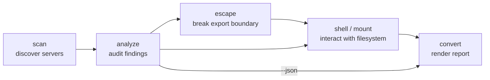

# Usage

NFSWolf consolidates the full NFS attack path into one binary. Every subcommand targets a specific phase of an assessment: discover what is exposed, analyze its weaknesses, break out of export boundaries, interact with the filesystem, and produce a deliverable report.

## Typical workflow

The subcommands are designed to be chained. Each step produces output that feeds the next.



1. **Scan** a network to discover NFS servers, exports, and service metadata.
2. **Analyze** each server for security weaknesses across 62 findings.
3. **Escape** export boundaries via subtree_check bypass to reach the full filesystem.
4. **Shell** into the server for interactive exploration, or **mount** it via FUSE for native tool access.
5. **Convert** the analysis JSON into an HTML, Markdown, CSV, or plain-text report.

## Subcommands

| Subcommand | Category | Description |
|------------|----------|-------------|
| [`scan`](scan.md) | Recon | Discover NFS servers on a network. Probes portmapper and port 2049, enumerates exports, detects NFS versions. |
| [`analyze`](analyze.md) | Recon | Deep security audit of an NFS server. Runs 30+ checks across 62 findings with severity ratings. |
| [`escape`](escape.md) | Exploit | Break out of an NFS export to the filesystem root via subtree_check bypass. Covers 18 filesystem types. |
| [`shell`](shell.md) | Connect | Interactive NFS exploration shell with 52 commands. Works over NFSv2, v3, and v4. |
| [`mount`](mount.md) | Connect | FUSE-mount an NFS export so ordinary tools (`ls`, `find`, `cp`) work without a kernel NFS client. |
| [`brute-handle`](brute-handle.md) | Advanced | Brute-force NFS file handles using the STALE/BADHANDLE oracle to discover valid inodes. |
| [`uid-spray`](uid-spray.md) | Advanced | Last-resort UID/GID brute-force to find which identities can access a path. |
| [`convert`](convert.md) | Utility | Render an `analyze --json` dump into HTML, Markdown, CSV, TXT, or console output. |
| [`decode`](decode.md) | Utility | Offline file handle decoder. Prints every field with OS/FS fingerprinting and security assessment. |
| `completions` | Utility | Generate shell completions for bash, zsh, fish, elvish, or PowerShell. |

## Global options

Every subcommand inherits a set of [global options](global-options.md) that control identity spoofing, network behavior, stealth timing, and output formatting. Read that page before diving into individual subcommands.

## Subcommand categories

**Recon** -- `scan` and `analyze` are non-destructive discovery and audit tools. They read metadata, enumerate exports, and probe for weaknesses without modifying anything on the server (except the analyzer's squash probes, which create and immediately delete a temporary file).

**Exploit** -- `escape` constructs file handles that bypass export boundaries. It reads from the server but never writes. The resulting handles are printed for use with `shell` or `mount`.

**Connect** -- `shell` and `mount` provide interactive and filesystem-level access. Both are read-only by default; write operations require the explicit `--allow-write` flag.

**Advanced** -- `brute-handle` and `uid-spray` are last-resort tools for when the automatic credential ladder and escape pipeline have not produced results. They generate significant RPC traffic and should be used with stealth delays in sensitive environments.

**Utility** -- `convert`, `decode`, and `completions` are offline tools that do not contact any NFS server.

## What to read next

- [Global Options](global-options.md) -- flags shared across every subcommand
- [Shell Commands](shell-commands.md) -- the 52 interactive commands available inside the shell
- [CLI Reference](cli-reference.md) -- full `--help` output for every subcommand
- [Examples](examples.md) -- end-to-end workflow walkthroughs for common scenarios

!!! tip "One-liner assessment"
    For a quick security check against a single server, the shortest useful command is:

    ```bash
    nfswolf analyze 10.0.0.1
    ```

    This runs every check and prints a severity-rated summary to the terminal. Pipe through `--json` and `convert` for a deliverable report.

!!! note "Running as root"
    Most NFS servers export with the `secure` option (default on Linux), which rejects connections from unprivileged source ports. Run nfswolf as root or with `CAP_NET_BIND_SERVICE` and pass `--privileged-port` to bind below port 1024. In practice, security assessments are almost always run as root.
