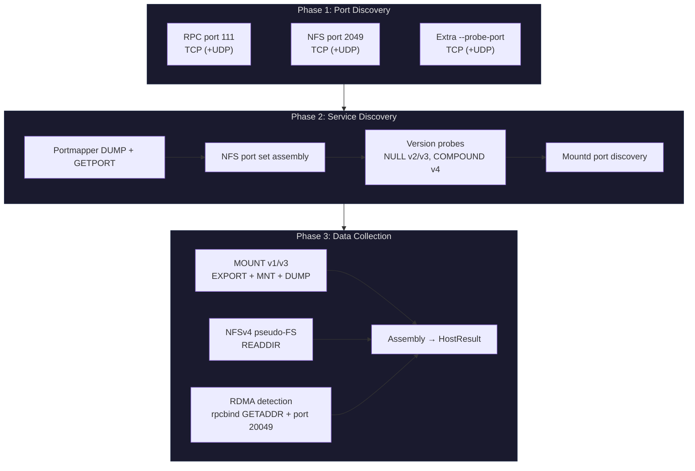

# Scan

The `scan` subcommand performs network reconnaissance against one or more hosts, discovering NFS services, enumerating exports, fingerprinting operating systems, and optionally attempting export escape on every discovered path. It is the typical entry point for any NFS assessment.

```
nfswolf scan <TARGETS...> [OPTIONS]
nfswolf scan -f <FILE> [OPTIONS]
```

## Target formats

Targets can be specified as positional arguments, from a file, or both. The scanner accepts:

| Format | Example | Description |
|--------|---------|-------------|
| Single IP | `192.168.1.10` | One host |
| CIDR range | `10.0.0.0/24` | Every host in the subnet (254 addresses for /24) |
| Hostname | `nfs-server.corp.local` | Resolved via DNS before scanning |
| Multiple targets | `10.0.0.1 10.0.0.2 10.0.0.3` | Space-separated on the command line |
| File (`-f`) | `-f hosts.txt` | One target per line; blank lines and `#` comments are skipped |

Positional targets and `-f` can be combined. The scanner merges both lists and deduplicates.

## Flags

### Target / Source

| Flag | Default | Description |
|------|---------|-------------|
| `<TARGETS...>` | -- | Positional: IPs, CIDRs, hostnames. Required unless `-f` is used. |
| `-f`, `--file <FILE>` | -- | File of targets, one per line. Lines starting with `#` and blank lines are skipped. |

### Behavior

| Flag | Default | Description |
|------|---------|-------------|
| `-c`, `--concurrency <N>` | `256` | Maximum concurrent host scans. Each host runs through the full 3-phase pipeline independently. |
| `--scan-udp` | off | Probe all ports over UDP in addition to TCP. Discovers UDP-accessible NFS and mountd services. Mutually exclusive with `--proxy` (UDP cannot be tunneled through SOCKS5). |
| `--probe-port <PORT,...>` | -- | Additional NFS port(s) to probe, comma-delimited. Added to the set of portmapper-discovered NFS ports (does not replace portmapper discovery or the 2049 fallback). |
| `--auto-escape` | off | After discovery, attempt an export escape ([subtree_check bypass](escape.md)) against every discovered export. On success, prints a ready-to-run `nfswolf shell --handle` command for the escaped filesystem root. |

### Output

| Flag | Default | Description |
|------|---------|-------------|
| `--json <FILE>` | -- | Write JSON results to FILE. Can be used simultaneously with `--csv`. |
| `--csv <FILE>` | -- | Write CSV results to FILE (one row per host). Can be used simultaneously with `--json`. |

### Global flags affecting scan

These are set on the `nfswolf` command itself, before the `scan` subcommand. See [Global Options](global-options.md) for the full list.

| Flag | Effect on scan |
|------|---------------|
| `--rpc-port <PORT>` | Override the portmapper/rpcbind port (default 111). |
| `--skip-rpc` | Skip all portmapper/rpcbind probes. Use when port 111 is firewalled and the NFS port is known. |
| `--skip-mountd` | Skip all MOUNT daemon queries. NFSv4 pseudo-FS discovery still runs. |
| `--nfs-port <PORT>` | Override the NFS port. Also added to the probe set for scan. |
| `--mount-port <PORT>` | Override the mount-daemon port. |
| `--proxy <HOST:PORT>` | Route all TCP connections through a SOCKS5 proxy. |
| `-t`, `--timeout <MS>` | Connection timeout per probe (default 3000ms). |
| `--delay <MS>` / `--jitter <MS>` | Stealth pacing between RPC calls. |
| `-u`, `--uid <UID>` / `-g`, `--gid <GID>` | AUTH_SYS credentials used for version probes and MOUNT. |
| `--privileged-port` | Bind from a source port below 1024 (required by servers with the `secure` export option). |
| `-q`, `--quiet` | Suppress status lines; only emit the results table. |

## How it works

The scanner runs a 3-phase pipeline per host, with all hosts executing concurrently (bounded by `--concurrency`). Phases within each host are sequential; port probes within Phase 1 run in parallel via `tokio::join!`.



### Phase 1 -- port discovery

All port probes run in parallel via `tokio::join!`. The scanner checks:

- **RPC port** (111 by default, or `--rpc-port`) over TCP. With `--scan-udp`, also over UDP. Skipped entirely with `--skip-rpc`.
- **NFS port** (2049) over TCP (+UDP with `--scan-udp`). Always probed regardless of other flags.
- **Extra ports** from `--probe-port` and `--nfs-port`, same TCP/UDP logic.

### Phase 2 -- service discovery

If the RPC port is reachable (and `--skip-rpc` is not set), the scanner runs a portmapper DUMP to enumerate all registered RPC programs and a GETPORT to locate NFS and mountd. It then assembles the full set of NFS ports (portmapper-discovered + 2049 fallback + `--probe-port`) and runs direct version probes on each: NULL calls for v2 and v3, a COMPOUND call for v4.

### Phase 3 -- data collection

With versions and ports confirmed, the scanner collects:

- **Export lists** via MOUNT v1/v3 EXPORT (unless `--skip-mountd`), including ACL entries, auth flavors, and root file handles from MNT.
- **NFSv4 pseudo-FS** via READDIR on the root filehandle (always, when v4 is confirmed).
- **Connected clients** via MOUNT DUMP (who is currently mounted where).
- **RDMA transport** detection via rpcbind GETADDR and a port 20049 probe.
- **OS fingerprint** derived from file handle structure and RPC response patterns.

Only hosts with at least one confirmed NFS version appear in the output.

## Output

The default output is a summary table to stdout plus per-host detail sections. Columns with no data across all hosts are automatically hidden.

### Console output

```
[*] Scanning 3 host(s)...
╭────────────┬───────────────┬──────────────┬──────────┬───────┬──────────┬───────┬──────────┬──────────────┬──────────────────┬────────────────────────────╮
│ Hostname   │ IP            │ RPC Port 111 │ NFS Port │ NFSv3 │ v3 Expts │ NFSv4 │ v4 Expts │ OS           │ Mount Port       │ Clients                    │
├────────────┼───────────────┼──────────────┼──────────┼───────┼──────────┼───────┼──────────┼──────────────┼──────────────────┼────────────────────────────┤
│            │ 10.129.40.115 │ open         │ 2049/tcp │ yes   │ 3        │ yes   │ 3+       │ Linux 5.x    │ 43217/tcp (v1,v3)│ 2                          │
│ nas.local  │ 10.129.40.120 │ open         │ 2049/tcp │ yes   │ 1        │ --    │ --       │ Linux 4.x    │ 38901/tcp (v1,v3)│ 0                          │
│            │ 10.129.40.130 │ open         │ 2049/tcp │ --    │ --       │ yes   │ 2+       │ FreeBSD 13   │ --               │ --                         │
╰────────────┴───────────────┴──────────────┴──────────┴───────┴──────────┴───────┴──────────┴──────────────┴──────────────────┴────────────────────────────╯

10.129.40.115
  RPC services:
    100000  portmapper    v2,4      111/tcp+udp
    100003  nfs           v3,4      2049/tcp
    100005  mountd        v1,3      43217/tcp+udp
    100021  nlockmgr      v1,3,4    33189/tcp+udp  ! Lock manager: lock-DoS and state leaks
    100227  nfs_acl        v3       2049/tcp        ! POSIX ACL enumeration
  Exports (v3, v4):
    /srv/data                           *                       [AUTH_SYS]  fh=01000700030001...
    /srv/backups                        10.129.40.0/24          [AUTH_SYS]  fh=01000700050001...
    /home                               *(sec=krb5:krb5i:krb5p) [RPCSEC_GSS]
  Clients: admin-ws.corp.local:/srv/data, dev-box:/srv/data

nas.local (10.129.40.120)
  RPC services:
    100000  portmapper    v2        111/tcp
    100003  nfs           v3        2049/tcp
    100005  mountd        v1,3      38901/tcp
  Exports (v3):
    /mnt/share                          *                       [AUTH_SYS]  fh=01000100070001...

[*] Done in 1.8s  --  3 host(s) scanned, 3 with NFS
```

### JSON output

With `--json results.json`, the scanner writes a structured JSON document containing all discovered data per host:

??? example "JSON structure"

    ```json
    {
      "hosts": [
        {
          "ip": "10.129.40.115",
          "hostname": null,
          "portmap": { "tcp": true, "udp": false },
          "nfs_ports": [
            { "port": 2049, "tcp": true, "udp": false,
              "versions": { "v2": false, "v3": true, "v4": true } }
          ],
          "mount_ports": [
            { "port": 43217, "tcp": true, "udp": true, "versions": [1, 3] }
          ],
          "rpc_services": [
            { "program": 100003, "program_name": "nfs", "version": 3,
              "protocol": "tcp", "port": 2049, "security_note": null }
          ],
          "exports": {
            "v3": [
              { "path": "/srv/data", "allowed": ["*"],
                "auth_flavors": [1], "handle": "01000700030001..." }
            ],
            "v4": [
              { "path": "/srv/data", "auth_flavors": [1] }
            ]
          },
          "mounts": [
            { "hostname": "admin-ws.corp.local", "directory": "/srv/data" }
          ],
          "rdma_detected": false,
          "os_guess": "Linux 5.x",
          "scan_duration_ms": 423
        }
      ]
    }
    ```

### CSV output

With `--csv results.csv`, the scanner writes one row per host with columns: Hostname, IP, :111, NFS Port, v2, v2x, v3, v3x, v4, v4x, OS, Auth, Hint, Mount Port, Clients, HostInfo. Fields containing attacker-controlled wire data are quoted and formula-injection guarded.

## Auto-escape

When `--auto-escape` is set, the scanner runs a fast escape probe against every discovered export after the discovery phase completes. This is the same algorithm used by `nfswolf escape --fast`. It attempts a [subtree_check bypass](escape.md) to reach the filesystem root from each export.

Escapes run with bounded concurrency (capped at 32) and honour `--proxy`, `--delay`, and `--jitter`. On success, the scanner prints a ready-to-run shell command:

```
[+] 10.129.40.115:/srv/data escaped  --  Ext4 inode 2 (NFSv3)
    Root handle: 0100070003000100020000000000000028ce88680000000000000000
    nfswolf shell 10.129.40.115 --handle 0100070003000100020000000000000028ce88680000000000000000
```

!!! tip "Combine with analyze"
    After a scan with `--auto-escape`, pipe the successful hosts into `analyze` for a full security audit:

    ```bash
    nfswolf scan 10.0.0.0/24 --auto-escape --json scan.json
    nfswolf analyze 10.129.40.115
    ```

## Examples

### Basic subnet scan

```bash
nfswolf scan 192.168.1.0/24
```

### Scan with UDP probes and stealth pacing

```bash
nfswolf scan 10.0.0.0/16 --scan-udp --delay 200 --jitter 100 -c 32
```

### Scan when portmapper is firewalled

```bash
nfswolf scan 10.0.0.1 --skip-rpc --nfs-port 2049
```

### Scan non-standard ports

```bash
nfswolf scan 10.0.0.1 --probe-port 12049,22049 --rpc-port 10111
```

### Scan through a SOCKS5 proxy

```bash
nfswolf scan 10.0.0.0/24 --proxy 127.0.0.1:1080
```

### Full recon pipeline with auto-escape and JSON export

```bash
nfswolf scan 10.0.0.0/24 --auto-escape --json scan.json --csv scan.csv
```

### Scan from a targets file with privileged port binding

```bash
nfswolf scan -f targets.txt --privileged-port -u 0 -g 0
```

## Interrupt handling

Pressing Ctrl+C during a scan prints partial results for hosts already discovered. The console table, per-host details, and any `--json`/`--csv` output are written with the data collected so far. The JSON output includes an `"interrupted": true` field.

## What scan does NOT do

The scanner performs service discovery only. It does not:

- Read or write files on the NFS server (that is `shell` territory)
- Run security checks or generate findings (that is [analyze](analyze.md))
- Attempt file handle brute-force (that is [brute-handle](brute-handle.md))
- Test credential escalation (that is [uid-spray](uid-spray.md))

The one exception is `--auto-escape`, which runs a targeted escape probe but does not perform a full security audit.
